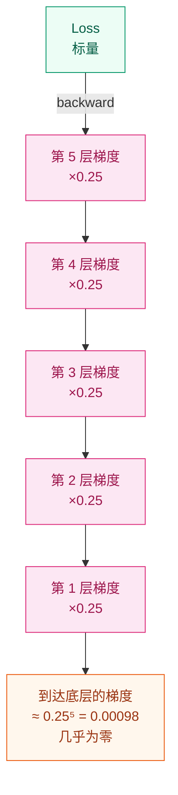
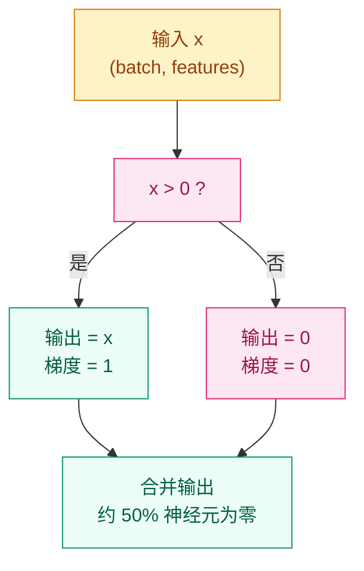

# 为什么 Sigmoid 不够用了？—— ReLU 与激活函数家族

## 这个问题从哪来

> 2010 年，Nair & Hinton 首次提出用 Rectified Linear Unit (ReLU) 替代 Sigmoid 作为隐藏层激活函数。
> 2012 年，AlexNet 在 ImageNet 竞赛中用 ReLU 替换 Sigmoid，训练速度提升约 6 倍——不是因为模型更深，而是因为梯度终于能传到每一层了。
> 这引出了一个核心问题：Sigmoid 的梯度到底出了什么问题？

## 学习目标

完成本章后，你应能回答：

1. 为什么 ReLU 的梯度比 Sigmoid 更适合深层网络？
2. Dying ReLU 是什么，怎么修复？
3. 面对一个新任务，该选哪个激活函数？

---

## 1. 直觉

Sigmoid 像一群"容易疲劳"的工人：每经过一层，传递的消息就被压缩到最多四分之一。传了五六层之后，底层几乎听不到任何信号——梯度消失了。

ReLU 是一道单行门：正数原封不动地通过，负数直接挡住。通过的信号强度丝毫不减（梯度恒为 1），因此消息可以穿过几十层甚至上百层网络。被挡住的那一半神经元恰好提供了天然的稀疏性，相当于自带简单的正则化。

> 你要记住：ReLU 的核心优势不是"简单"，而是正区间梯度恒为 1。

---

## 2. 机制

### 2.1 Sigmoid 的梯度消失问题

$$
\sigma(x) = \frac{1}{1 + e^{-x}}, \quad \sigma'(x) = \sigma(x)(1 - \sigma(x))
$$

Sigmoid 导数的最大值为 $0.25$（在 $x = 0$ 处取到）。经过 $n$ 层链式乘法后，梯度最坏情况衰减为 $0.25^n$。



10 层网络最坏情况：$0.25^{10} \approx 10^{-6}$，底层参数几乎收不到梯度更新。

### 2.2 ReLU：定义、梯度、为什么有效

$$
f(x) = \max(0, x), \quad f'(x) = \begin{cases} 1 & x > 0 \\ 0 & x \leq 0 \end{cases}
$$

正区间梯度恒为 1，不随层数衰减。负区间输出零，约 50% 神经元被"关闭"——这正是稀疏激活，相当于天然的正则化。



### 2.3 Dying ReLU 问题

ReLU 的致命弱点：当一个神经元的输入长期为负时，梯度为零，权重永远无法更新——这个神经元"死了"。

**死因链**：学习率过大 → 权重突变到负区间 → 该神经元对所有输入都输出 0 → 梯度恒为 0 → 永远无法恢复。

**权重初始化耦合**：ReLU 网络必须使用 He 初始化（`kaiming_normal_`），而不是 Xavier。He 初始化的方差考虑了 ReLU 会"丢弃"一半输入的事实，因此 $\text{Var}(w) = 2/n_{\text{in}}$，而 Xavier 用 $\text{Var}(w) = 1/n_{\text{in}}$，会导致前向传播时方差逐层缩小。

> 你要记住：Dying ReLU 是 ReLU 唯一的硬伤，所有变体都是为解决它而生。

### 2.4 激活函数家族速览（演进分支）

| 变体 | 动机 | 公式 | 代码 |
|------|------|------|------|
| Leaky ReLU | 负区间给微小梯度，防止死亡 | $f(x) = \max(\alpha x, x), \alpha=0.01$ | `nn.LeakyReLU(0.01)` |
| PReLU | 让模型自己学 $\alpha$ | $f(x) = \max(\alpha x, x), \alpha \in \mathbb{R}$ | `nn.PReLU()` |
| ELU | 负区间平滑过渡，均值更接近零 | $f(x) = x$ if $x>0$, else $\alpha(e^x - 1)$ | `nn.ELU()` |
| SELU | 自归一化，输出自动趋向零均值单位方差 | 在 ELU 基础上乘以 $\lambda$ | `nn.SELU()` |
| GELU | 概率门控，用高斯 CDF 做软选择 | $x \cdot \Phi(x)$ | `nn.GELU()` |

> 你要记住：GELU 是现代 Transformer 的默认选择，但它的原理（概率门控）不同于 ReLU 家族（分段线性）。

**选择指南**：

```
隐藏层默认      → ReLU
Dying ReLU 严重 → Leaky ReLU 或 GELU
Transformer     → GELU（已验证，不要换）
输出层          → Sigmoid（二分类）或 Softmax（多分类）
```

---

## 3. 渐进式实现

**Step 1 · 最小实现（ReLU 核心逻辑）**

```python
# 纯 Python 实现 ReLU
# 验证正区间梯度为 1，负区间梯度为 0
# 无需任何框架依赖
import torch

torch.manual_seed(42)


def relu(x):
    """ReLU: max(0, x)"""
    return torch.maximum(x, torch.zeros_like(x))


x = torch.tensor(
    [-2.0, -1.0, 0.0, 1.0, 2.0], requires_grad=True
)
y = relu(x)
y.sum().backward()

print(f"输入: {x.data.tolist()}")
print(f"输出: {y.data.tolist()}")
print(f"梯度: {x.grad.tolist()}")
```

**Step 2 · Sigmoid vs ReLU 梯度对比可视化**

```python
# 模拟 20 层梯度衰减
# Sigmoid 每层乘 0.25（最坏情况），ReLU 正区间恒为 1
# 用 log 尺度展示指数级差异
import matplotlib.pyplot as plt
import numpy as np

NUM_LAYERS = 20
layers = np.arange(0, NUM_LAYERS + 1)

sigmoid_grad = 0.25 ** layers
relu_grad = np.ones_like(layers, dtype=float)

plt.figure(figsize=(8, 5))
plt.semilogy(layers, sigmoid_grad, "o-", label="Sigmoid (×0.25/layer)")
plt.semilogy(layers, relu_grad, "s-", label="ReLU (×1/layer)")
plt.xlabel("Layer depth")
plt.ylabel("Gradient magnitude (log scale)")
plt.title("Gradient Decay: Sigmoid vs ReLU over 20 Layers")
plt.legend()
plt.grid(True, alpha=0.3)
plt.tight_layout()
plt.savefig("gradient_comparison.png", dpi=150)
plt.show()

print(f"Sigmoid 20 层后梯度: {sigmoid_grad[-1]:.2e}")
print(f"ReLU 20 层后梯度: {relu_grad[-1]:.2e}")
```

**Step 3 · Dying ReLU 复现实验**

```python
# 用过大的学习率故意触发 Dying ReLU
# 100 个神经元，50 步更新，追踪死亡比例
import torch

torch.manual_seed(42)

NEURONS = 100
STEPS = 50
LR = 10.0  # 故意设大

w = torch.randn(NEURONS, requires_grad=True)
bias = torch.zeros(NEURONS, requires_grad=True)

dead_history = []

for step in range(STEPS):
    x = torch.randn(NEURONS)
    pre_act = w * x + bias
    out = torch.relu(pre_act)

    # 统计死亡神经元：输出为零的比例
    dead_ratio = (out == 0).float().mean().item()
    dead_history.append(dead_ratio)

    loss = out.sum()
    loss.backward()

    with torch.no_grad():
        w -= LR * w.grad
        bias -= LR * bias.grad

    w.grad.zero_()
    bias.grad.zero_()

print(f"初始死亡率: {dead_history[0]:.1%}")
print(f"最终死亡率: {dead_history[-1]:.1%}")
print(f"最高死亡率: {max(dead_history):.1%}")
```

**Step 4 · 全家族性能 benchmark**

```python
# 同一网络结构，不同激活函数
# 合成二分类数据，20 epochs
# 对比最终 loss 和准确率
import torch
import torch.nn as nn

torch.manual_seed(42)

IN_DIM = 20
HIDDEN = 64
EPOCHS = 20
BATCH = 64
SAMPLES = 512

x_data = torch.randn(SAMPLES, IN_DIM)
y_data = (x_data[:, 0] ** 2 + x_data[:, 1] > 0).long()
dataset = torch.utils.data.TensorDataset(x_data, y_data)
loader = torch.utils.data.DataLoader(dataset, batch_size=BATCH, shuffle=True)

activations = {
    "ReLU": nn.ReLU(),
    "LeakyReLU": nn.LeakyReLU(0.01),
    "ELU": nn.ELU(),
    "GELU": nn.GELU(),
}

results = {}

for name, act_fn in activations.items():
    torch.manual_seed(42)

    model = nn.Sequential(
        nn.Linear(IN_DIM, HIDDEN),
        act_fn,
        nn.Linear(HIDDEN, 2),
    )
    opt = torch.optim.Adam(model.parameters(), lr=1e-3)
    loss_fn = nn.CrossEntropyLoss()

    for _ in range(EPOCHS):
        for xb, yb in loader:
            opt.zero_grad()
            loss_fn(model(xb), yb).backward()
            opt.step()

    model.eval()
    with torch.no_grad():
        logits = model(x_data)
        preds = logits.argmax(dim=1)
        acc = (preds == y_data).float().mean().item()
        final_loss = loss_fn(logits, y_data).item()

    results[name] = {"loss": final_loss, "acc": acc}

print(f"{'激活函数':<12} {'最终 Loss':>10} {'准确率':>8}")
print("-" * 32)
for name, r in results.items():
    print(f"{name:<12} {r['loss']:>10.4f} {r['acc']:>7.1%}")
```

---

## 4. 工程陷阱（按严重度排序）

1. **学习率太大 → Dying ReLU**（最常见）
   现象：训练初期 loss 正常下降，随后停滞，大量神经元输出恒为零。
   处置：降低学习率，或改用 Leaky ReLU / GELU。

2. **ReLU 网络用 Xavier 初始化 → 应该用 He 初始化**
   现象：深层网络前向传播时激活值逐层缩小，训练不收敛。
   处置：`nn.init.kaiming_normal_(weight, nonlinearity="relu")`。

3. **输出层用 ReLU → 输出无界**
   现象：模型输出范围 [0, +inf)，loss 不收敛或爆炸。
   处置：输出层用 Sigmoid（二分类）、Softmax（多分类）或不加激活（回归）。

4. **GELU 推理比 ReLU 慢 → 用 approximate="tanh"**
   现象：精确 GELU 涉及指数运算，推理延迟高。
   处置：`nn.GELU(approximate="tanh")`，精度损失极小，速度提升显著。

---

## 演进笔记

> **这一技术的遗产**：ReLU 证明了"简单 + 深"可以打败"复杂 + 浅"。梯度恒为 1 的正区间让几十层甚至上百层的网络变得可训练，直接催生了 ResNet 等超深架构。
>
> Dying ReLU 的问题催生了整个激活函数变体家族，其中 GELU 凭借概率门控的特性成为 Transformer 的标配，至今仍是 BERT、GPT 系列的默认激活函数。
>
> ReLU 的稀疏激活思想也影响了后续的 Mixture of Experts (MoE) 架构——只激活部分神经元/专家，本质上是稀疏性的放大版。

→ 下一章：[正则化与 Dropout — 为什么模型会"死记硬背"？](../regularization/README.md)

---

**上一章**: [残差连接](../residual-connections/README.md) | **下一章**: [正则化与 Dropout](../regularization/README.md)
