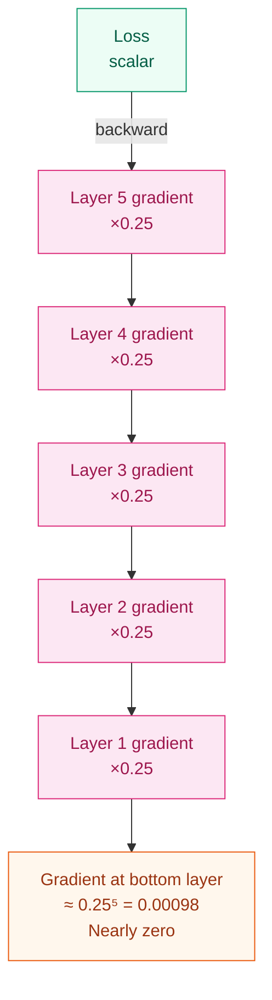
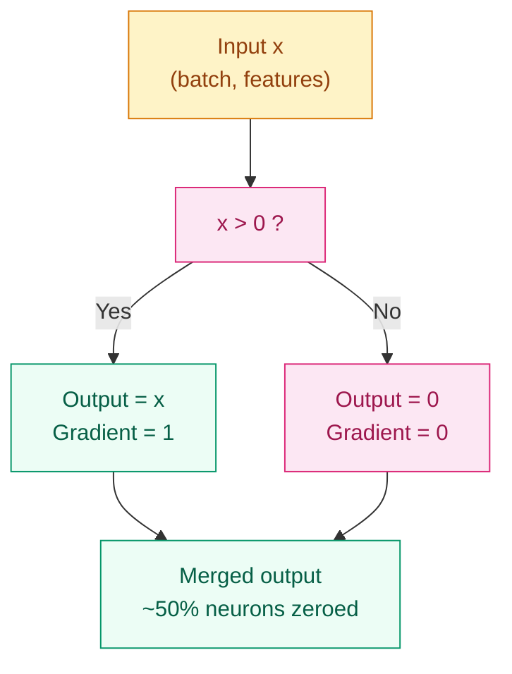

# Why Sigmoid Falls Short — ReLU and the Activation Function Family

## Where This Problem Comes From

> In 2010, Nair & Hinton first proposed replacing Sigmoid with the Rectified Linear Unit (ReLU) as the hidden layer activation function.
> In 2012, AlexNet replaced Sigmoid with ReLU on the ImageNet challenge and achieved roughly a 6x speedup in training — not because the model was deeper, but because gradients could finally reach every layer.
> This raises a core question: what exactly went wrong with Sigmoid's gradients?

## Learning Objectives

After completing this chapter, you should be able to answer:

1. Why are ReLU's gradients better suited for deep networks than Sigmoid's?
2. What is Dying ReLU, and how do you fix it?
3. Given a new task, which activation function should you choose?

---

## 1. Intuition

Sigmoid is like a group of "easily fatigued" workers: at each layer, the message passed along is compressed to at most a quarter of its original size. After five or six layers, the bottom layers can barely hear any signal — the gradient has vanished.

ReLU is a one-way gate: positive values pass through unchanged, negative values are blocked entirely. The signals that pass through retain full strength (gradient is exactly 1), so messages can travel through dozens or even hundreds of layers. The half of neurons that get blocked naturally provide sparsity — essentially a built-in form of regularization.

> Key takeaway: ReLU's core advantage is not "simplicity" — it's the fact that the gradient in the positive region is exactly 1.

---

## 2. Mechanics

### 2.1 Sigmoid's Vanishing Gradient Problem

$$
\sigma(x) = \frac{1}{1 + e^{-x}}, \quad \sigma'(x) = \sigma(x)(1 - \sigma(x))
$$

The maximum value of the Sigmoid derivative is $0.25$ (at $x = 0$). After $n$ layers of chain-rule multiplication, the gradient can decay to as little as $0.25^n$.



Worst case for a 10-layer network: $0.25^{10} \approx 10^{-6}$ — bottom-layer parameters receive virtually no gradient updates.

### 2.2 ReLU: Definition, Gradient, and Why It Works

$$
f(x) = \max(0, x), \quad f'(x) = \begin{cases} 1 & x > 0 \\ 0 & x \leq 0 \end{cases}
$$

The gradient in the positive region is exactly 1, so it does not decay with depth. The negative region outputs zero, turning off roughly 50% of neurons — this is sparse activation, which acts as a natural regularizer.



### 2.3 The Dying ReLU Problem

ReLU's fatal flaw: when a neuron's input stays negative for an extended period, its gradient is zero and its weights can never update — that neuron has "died."

**Cause chain**: learning rate too large → weights jump into the negative range → the neuron outputs zero for all inputs → gradient is always 0 → it can never recover.

**Weight initialization coupling**: ReLU networks must use He initialization (`kaiming_normal_`), not Xavier. He initialization accounts for the fact that ReLU "discards" half of its inputs, so $\text{Var}(w) = 2/n_{\text{in}}$, whereas Xavier uses $\text{Var}(w) = 1/n_{\text{in}}$, which would cause variance to shrink layer by layer during forward propagation.

> Key takeaway: Dying ReLU is ReLU's only hard flaw — every variant was created to solve it.

### 2.4 Activation Function Family Overview (Evolutionary Branches)

| Variant | Motivation | Formula | Code |
|---------|-----------|---------|------|
| Leaky ReLU | Give the negative region a small gradient to prevent dying | $f(x) = \max(\alpha x, x), \alpha=0.01$ | `nn.LeakyReLU(0.01)` |
| PReLU | Let the model learn $\alpha$ itself | $f(x) = \max(\alpha x, x), \alpha \in \mathbb{R}$ | `nn.PReLU()` |
| ELU | Smooth transition in the negative region, mean closer to zero | $f(x) = x$ if $x>0$, else $\alpha(e^x - 1)$ | `nn.ELU()` |
| SELU | Self-normalizing, outputs automatically tend toward zero mean and unit variance | Scales ELU by $\lambda$ | `nn.SELU()` |
| GELU | Probabilistic gating, uses Gaussian CDF for soft selection | $x \cdot \Phi(x)$ | `nn.GELU()` |

> Key takeaway: GELU is the default choice for modern Transformers, but its principle (probabilistic gating) is fundamentally different from the ReLU family (piecewise linear).

**Selection Guide**:

```
Hidden layer default   → ReLU
Severe Dying ReLU      → Leaky ReLU or GELU
Transformer            → GELU (well-validated, don't switch)
Output layer           → Sigmoid (binary classification) or Softmax (multi-class)
```

---

## 3. Progressive Implementation

**Step 1 · Minimal Implementation (ReLU Core Logic)**

```python
# Pure Python implementation of ReLU
# Verify: positive-region gradient is 1, negative-region gradient is 0
# No framework dependencies beyond PyTorch
import torch

torch.manual_seed(42)


def relu(x):
    """ReLU: max(0, x)"""
    return torch.maximum(x, torch.zeros_like(x))


x = torch.tensor(
    [-2.0, -1.0, 0.0, 1.0, 2.0], requires_grad=True
)
y = relu(x)
y.sum().backward()

print(f"Input: {x.data.tolist()}")
print(f"Output: {y.data.tolist()}")
print(f"Gradient: {x.grad.tolist()}")
```

**Step 2 · Sigmoid vs ReLU Gradient Comparison Visualization**

```python
# Simulate 20-layer gradient decay
# Sigmoid multiplies by 0.25 per layer (worst case), ReLU stays at 1 in positive region
# Use log scale to show the exponential difference
import matplotlib.pyplot as plt
import numpy as np

NUM_LAYERS = 20
layers = np.arange(0, NUM_LAYERS + 1)

sigmoid_grad = 0.25 ** layers
relu_grad = np.ones_like(layers, dtype=float)

plt.figure(figsize=(8, 5))
plt.semilogy(layers, sigmoid_grad, "o-", label="Sigmoid (×0.25/layer)")
plt.semilogy(layers, relu_grad, "s-", label="ReLU (×1/layer)")
plt.xlabel("Layer depth")
plt.ylabel("Gradient magnitude (log scale)")
plt.title("Gradient Decay: Sigmoid vs ReLU over 20 Layers")
plt.legend()
plt.grid(True, alpha=0.3)
plt.tight_layout()
plt.savefig("gradient_comparison.png", dpi=150)
plt.show()

print(f"Sigmoid gradient after 20 layers: {sigmoid_grad[-1]:.2e}")
print(f"ReLU gradient after 20 layers: {relu_grad[-1]:.2e}")
```

**Step 3 · Dying ReLU Reproduction Experiment**

```python
# Deliberately trigger Dying ReLU with an oversized learning rate
# 100 neurons, 50 update steps, track the death ratio
import torch

torch.manual_seed(42)

NEURONS = 100
STEPS = 50
LR = 10.0  # Intentionally large

w = torch.randn(NEURONS, requires_grad=True)
bias = torch.zeros(NEURONS, requires_grad=True)

dead_history = []

for step in range(STEPS):
    x = torch.randn(NEURONS)
    pre_act = w * x + bias
    out = torch.relu(pre_act)

    # Count dead neurons: fraction with zero output
    dead_ratio = (out == 0).float().mean().item()
    dead_history.append(dead_ratio)

    loss = out.sum()
    loss.backward()

    with torch.no_grad():
        w -= LR * w.grad
        bias -= LR * bias.grad

    w.grad.zero_()
    bias.grad.zero_()

print(f"Initial death rate: {dead_history[0]:.1%}")
print(f"Final death rate: {dead_history[-1]:.1%}")
print(f"Peak death rate: {max(dead_history):.1%}")
```

**Step 4 · Full Family Performance Benchmark**

```python
# Same network architecture, different activation functions
# Synthetic binary classification data, 20 epochs
# Compare final loss and accuracy
import torch
import torch.nn as nn

torch.manual_seed(42)

IN_DIM = 20
HIDDEN = 64
EPOCHS = 20
BATCH = 64
SAMPLES = 512

x_data = torch.randn(SAMPLES, IN_DIM)
y_data = (x_data[:, 0] ** 2 + x_data[:, 1] > 0).long()
dataset = torch.utils.data.TensorDataset(x_data, y_data)
loader = torch.utils.data.DataLoader(dataset, batch_size=BATCH, shuffle=True)

activations = {
    "ReLU": nn.ReLU(),
    "LeakyReLU": nn.LeakyReLU(0.01),
    "ELU": nn.ELU(),
    "GELU": nn.GELU(),
}

results = {}

for name, act_fn in activations.items():
    torch.manual_seed(42)

    model = nn.Sequential(
        nn.Linear(IN_DIM, HIDDEN),
        act_fn,
        nn.Linear(HIDDEN, 2),
    )
    opt = torch.optim.Adam(model.parameters(), lr=1e-3)
    loss_fn = nn.CrossEntropyLoss()

    for _ in range(EPOCHS):
        for xb, yb in loader:
            opt.zero_grad()
            loss_fn(model(xb), yb).backward()
            opt.step()

    model.eval()
    with torch.no_grad():
        logits = model(x_data)
        preds = logits.argmax(dim=1)
        acc = (preds == y_data).float().mean().item()
        final_loss = loss_fn(logits, y_data).item()

    results[name] = {"loss": final_loss, "acc": acc}

print(f"{'Activation':<12} {'Final Loss':>10} {'Accuracy':>8}")
print("-" * 32)
for name, r in results.items():
    print(f"{name:<12} {r['loss']:>10.4f} {r['acc']:>7.1%}")
```

---

## 4. Engineering Pitfalls (Sorted by Severity)

1. **Learning rate too large → Dying ReLU** (most common)
   Symptom: loss drops normally in early training, then plateaus; a large fraction of neurons output zero consistently.
   Fix: reduce the learning rate, or switch to Leaky ReLU / GELU.

2. **Using Xavier initialization for ReLU networks → Should use He initialization**
   Symptom: activations shrink layer by layer during forward propagation in deep networks; training fails to converge.
   Fix: `nn.init.kaiming_normal_(weight, nonlinearity="relu")`.

3. **Using ReLU on the output layer → Unbounded output**
   Symptom: model outputs range over [0, +inf); loss diverges or explodes.
   Fix: use Sigmoid (binary classification), Softmax (multi-class), or no activation (regression) on the output layer.

4. **GELU inference slower than ReLU → Use approximate="tanh"**
   Symptom: exact GELU involves exponential operations, causing high inference latency.
   Fix: `nn.GELU(approximate="tanh")` — minimal accuracy loss with significant speedup.

---

## Evolution Notes

> **This technique's legacy**: ReLU proved that "simple + deep" can beat "complex + shallow." The constant-1 gradient in the positive region made networks with dozens or even hundreds of layers trainable, directly enabling ultra-deep architectures like ResNet.
>
> The Dying ReLU problem spawned an entire family of activation function variants. Among them, GELU — with its probabilistic gating property — became the standard for Transformers and remains the default activation function in BERT, the GPT series, and beyond.
>
> ReLU's sparse activation idea also influenced later Mixture of Experts (MoE) architectures — activating only a subset of neurons/experts is essentially sparse activation at scale.

→ Next chapter: [Transformer Architecture — How GELU Powers Attention](../../02-Language-Transformers/transformer-architecture/README.md)

---

**Previous**: [Deep Learning Basics](../deep-learning-basics/README_EN.md) | **Next**: [CNN Architectures](../../01-Visual-Intelligence/cnn-architectures/README.md)
