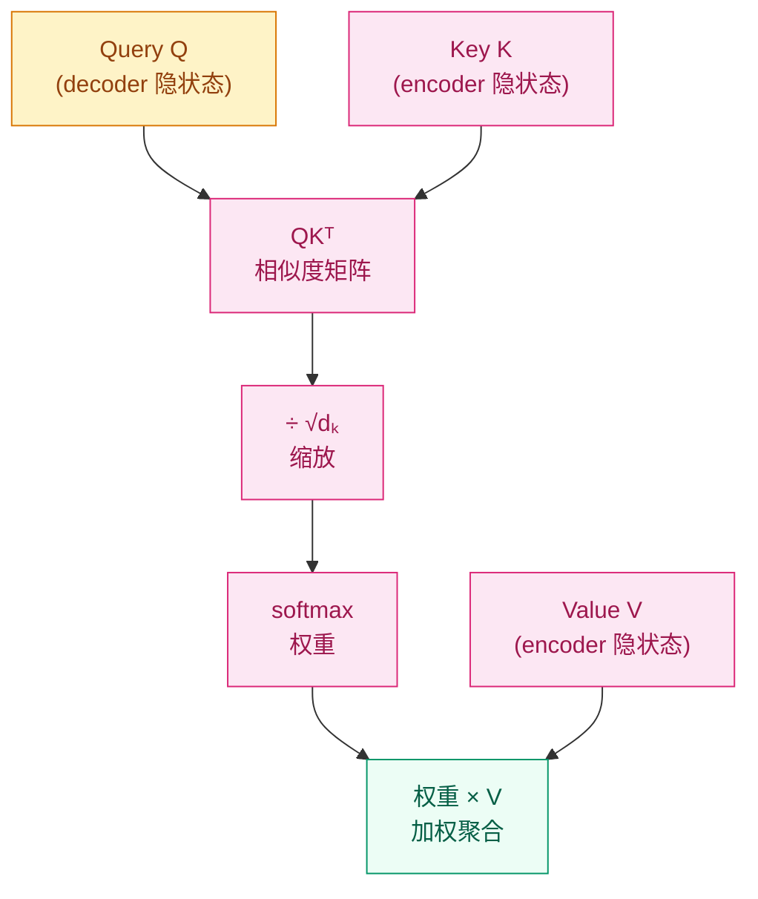

# 为什么模型需要"回头看"？—— 注意力机制动机

## 这个问题从哪来

> 上一章讲到 Seq2Seq 的致命弱点：无论输入句子多长，编码器都必须把它压缩成一个固定长度的向量。翻译 5 个词和翻译 50 个词用的是同一大小的"瓶子"——信息必然溢出。
> 2015 年，Bahdanau 等人在翻译任务上提出了注意力机制：解码每个词时，让模型"回头看"输入序列中所有位置，动态选择最相关的部分。这彻底解决了信息瓶颈问题。
> 注意力后来从"解码器查编码器"演变为"自己查自己"（Self-Attention），成为 Transformer 的核心机制。

## 学习目标

完成本章后，你应能回答：

1. Seq2Seq 的固定长度上下文向量为什么是信息瓶颈？
2. QKV 框架的直觉是什么？Query、Key、Value 各自代表什么角色？
3. 注意力的 $O(n^2)$ 复杂度从哪来？

---

## 1. 直觉

翻译一个长句时，你不会先把整句话"背下来"再翻译，而是翻译到哪个词就回去看原文中对应的部分。

翻译 "I love this beautiful cat" 中的 "beautiful" 时，你会回去看 "beautiful" 这个位置附近，而不是整句话的平均信息。

注意力机制就是让模型拥有这种"回头看"的能力。它不需要把整句话压缩成一个向量，而是维护所有位置的信息，在解码时动态查询。

**QKV 类比**：
- **Query（Q）**：我现在在找什么？（"我要翻译'美丽的'，找找原文中哪里有相关信息"）
- **Key（K）**：每个位置"广告"自己的标签（"我是位置 3，我编码了'beautiful'的信息"）
- **Value（V）**：每个位置的实际内容（"beautiful 的语义向量"）

Q 和 K 的点积衡量"我在找的"和"你提供的"有多匹配，匹配度越高，取回的 V 权重越大。

> 你要记住：注意力本质上是一个"加权查找"——根据查询动态检索信息。

---

## 2. 机制

### 2.1 从 Seq2Seq 瓶颈到注意力

**没有注意力时**：

$$
s_0 = f_\text{enc}(x_1, x_2, \ldots, x_n) \in \mathbb{R}^d
$$

整个输入序列被压缩成一个向量 $s_0$。输入越长，信息损失越大。

**有注意力后**：

解码第 $t$ 个词时：

$$
c_t = \sum_{i=1}^{n} \alpha_{ti} \cdot h_i
$$

其中 $h_i$ 是编码器在位置 $i$ 的隐状态，$\alpha_{ti}$ 是注意力权重：

$$
\alpha_{ti} = \text{softmax}(e_{ti}), \quad e_{ti} = \text{score}(s_{t-1}, h_i)
$$

每个解码步都有自己专属的上下文向量 $c_t$，不再是固定长度。

### 2.2 QKV 框架

将注意力抽象为 Query、Key、Value 三要素：

$$
\text{Attention}(Q, K, V) = \text{softmax}\left(\frac{QK^\top}{\sqrt{d_k}}\right) V
$$

分步拆解：

1. **计算相似度**：$QK^\top \in \mathbb{R}^{n \times m}$，每个 query 和每个 key 的点积
2. **缩放**：除以 $\sqrt{d_k}$ 防止点积过大导致 softmax 饱和
3. **归一化**：softmax 把分数变成概率（权重之和为 1）
4. **加权聚合**：用权重对 value 加权求和



### 2.3 为什么要除以 $\sqrt{d_k}$？

当 $d_k$ 很大时（如 64），两个随机向量的点积的方差为 $d_k$（因为每个维度都贡献一个方差项）。这导致点积的绝对值很大，softmax 输出趋向 one-hot——梯度几乎为零。

除以 $\sqrt{d_k}$ 让方差回到 1，softmax 输出更平滑，梯度更健康。

> 你要记住：$\sqrt{d_k}$ 缩放不是可选的优化，而是注意力机制正常工作的必要条件。

### 2.4 注意力变体演进

| 类型 | 年份 | score 函数 | 特点 |
|------|------|-----------|------|
| Bahdanau | 2015 | $v^\top \tanh(W_1 s + W_2 h)$ | 加性注意力，参数多 |
| Luong (dot) | 2015 | $s^\top h$ | 乘性注意力，无额外参数 |
| Luong (general) | 2015 | $s^\top W h$ | 加了投影矩阵 |
| Scaled Dot-Product | 2017 | $QK^\top / \sqrt{d_k}$ | Transformer 使用 |
| Multi-Head | 2017 | 多组 QKV 并行 | Transformer 核心 |

### 2.5 Self-Attention：从"查别人"到"查自己"

前面的注意力是 cross-attention（Q 来自解码器，K/V 来自编码器）。

**Self-Attention** 是 Q、K、V 都来自同一个序列：

$$
\text{SelfAttention}(X) = \text{softmax}\left(\frac{XX_W^\top \cdot XX_K^\top}{\sqrt{d_k}}\right) XX_V^\top
$$

每个位置都可以直接看到序列中所有其他位置——不再需要 RNN 的逐步传递。这是 Transformer 的核心创新。

### 2.6 复杂度分析

注意力的计算复杂度：

$$
O(n^2 \cdot d)
$$

其中 $n$ 是序列长度，$d$ 是维度。$QK^\top$ 产生 $n \times n$ 矩阵——每个位置和每个位置计算相似度。

这就是 $O(n^2)$ 复杂度的来源。当 $n = 100,000$（长文档）时，注意力矩阵需要 $10^{10}$ 个元素——显存爆炸。

> 这催生了后续大量高效注意力的研究：Flash Attention（硬件优化）、Linear Attention（不显式计算 $n \times n$ 矩阵）、Sparse Attention（只计算部分位置对）。

---

## 3. 渐进式实现

**Step 1 · 手写注意力权重可视化**

```python
import numpy as np

np.random.seed(42)

SEQ_LEN, DIM = 5, 8

# 模拟编码器隐状态和解码器隐状态
encoder_states = np.random.randn(SEQ_LEN, DIM)  # 5 个位置的编码器输出
decoder_state = np.random.randn(DIM)            # 当前解码步的隐状态

# 计算注意力分数（简化版：不缩放）
scores = encoder_states @ decoder_state          # (5,)
print(f"原始分数: {scores}")

# Softmax 归一化
def softmax(x):
    x_shifted = x - np.max(x)
    exp_x = np.exp(x_shifted)
    return exp_x / exp_x.sum()

weights = softmax(scores)
print(f"注意力权重: {[f'{w:.3f}' for w in weights]}")
print(f"权重总和: {weights.sum():.6f}")  # 应为 1.0

# 加权聚合
context = weights @ encoder_states               # (DIM,)
print(f"上下文向量 shape: {context.shape}")
```

**Step 2 · 完整 Scaled Dot-Product Attention**

```python
import torch
import torch.nn.functional as F

torch.manual_seed(42)

BATCH, SEQ, DK, DV = 2, 6, 16, 16

Q = torch.randn(BATCH, SEQ, DK)
K = torch.randn(BATCH, SEQ, DK)
V = torch.randn(BATCH, SEQ, DV)

# Scaled Dot-Product Attention
scores = torch.bmm(Q, K.transpose(1, 2)) / (DK ** 0.5)  # (batch, seq, seq)
weights = F.softmax(scores, dim=-1)                        # (batch, seq, seq)
output = torch.bmm(weights, V)                             # (batch, seq, dv)

print(f"注意力矩阵 shape: {weights.shape}")  # (2, 6, 6)
print(f"每行总和: {weights[0].sum(dim=-1)}")  # 每行应为 1.0
print(f"输出 shape: {output.shape}")          # (2, 6, 16)
```

**Step 3 · 因果 mask（Decoder 使用）**

```python
import torch
import torch.nn.functional as F

torch.manual_seed(42)

SEQ, DK = 6, 16

Q = torch.randn(1, SEQ, DK)
K = torch.randn(1, SEQ, DK)
V = torch.randn(1, SEQ, DK)

scores = Q @ K.transpose(-2, -1) / (DK ** 0.5)

# 因果 mask：上三角设为 -inf
causal_mask = torch.triu(torch.ones(SEQ, SEQ), diagonal=1).bool()
scores_masked = scores.masked_fill(causal_mask, float('-inf'))

weights = F.softmax(scores_masked, dim=-1)
print("因果注意力矩阵（位置 0 只能看到自己）:")
print(weights[0].round(decimals=2))
# 第一行: [1, 0, 0, 0, 0, 0]（位置 0 只看到位置 0）
# 第二行: [x, x, 0, 0, 0, 0]（位置 1 看到位置 0-1）
```

**Step 4 · 可视化注意力热力图**

```python
import torch
import torch.nn.functional as F
import matplotlib.pyplot as plt

torch.manual_seed(42)

SEQ, DK = 8, 16
words = ["The", "cat", "sat", "on", "the", "mat", ".", "<pad>"]

Q = torch.randn(1, SEQ, DK)
K = torch.randn(1, SEQ, DK)
scores = Q @ K.transpose(-2, -1) / (DK ** 0.5)
weights = F.softmax(scores, dim=-1)[0].detach().numpy()

fig, ax = plt.subplots(figsize=(6, 5))
im = ax.imshow(weights, cmap='Blues')
ax.set_xticks(range(SEQ))
ax.set_yticks(range(SEQ))
ax.set_xticklabels(words, rotation=45, ha='right')
ax.set_yticklabels(words)
ax.set_title("Self-Attention Weights")
plt.colorbar(im, ax=ax)
plt.tight_layout()
plt.savefig("attention_heatmap.png", dpi=150)
print("注意力热力图已保存")
```

---

## 4. 工程陷阱（按严重度排序）

1. **忘记缩放因子 $\sqrt{d_k}$**
   现象：$d_k$ 较大时（如 64），softmax 输出趋向 one-hot，梯度几乎为零，训练停滞。
   处置：永远除以 $\sqrt{d_k}$。这不是超参数，是数学必需。

2. **注意力矩阵的显存爆炸**
   现象：序列长度 $n$ 增大时，$n \times n$ 的注意力矩阵占用显存 $O(n^2)$。$n=8192$ 时仅注意力矩阵就需要 256MB（float32）。
   处置：长序列使用 Flash Attention（PyTorch 2.0+ `F.scaled_dot_product_attention`），不显式存储注意力矩阵。

3. **mask 的方向搞反**
   现象：因果 mask 应该遮住**未来**位置（上三角），但误遮了**过去**位置（下三角）。
   处置：`torch.triu(..., diagonal=1)` 遮住严格上三角，对角线及以下保留——即当前位置可以看到自己和过去。

4. **batch 维度上 softmax 的 dim 设错**
   现象：`softmax(scores, dim=1)` 对 batch 维度做 softmax，而不是对 key 维度。
   处置：`softmax(scores, dim=-1)`，沿最后一个维度（key 数量）归一化。

> 你要记住：注意力的数学很简单（三个矩阵乘法 + softmax），工程难点在 mask 和显存管理。

---

## 演进笔记

> **注意力的进化**：Bahdanau 注意力（2015，加性）→ Luong 注意力（2015，乘性）→ Scaled Dot-Product Attention（2017，Transformer）→ Multi-Head Attention（2017）→ Flash Attention（2022，硬件优化）。
>
> 注意力的思想后来超越了 NLP：ViT 把图像切成 patch 后用 self-attention 处理，CLIP 用 cross-attention 对齐图像和文本，扩散模型用 cross-attention 注入文本条件。
>
> **留下的新问题**：注意力让序列中每个位置都能直接交互，但这也意味着模型对输入顺序没有天然感知——"猫吃鱼"和"鱼吃猫"的 attention 权重可能完全一样。这引出了位置编码（Positional Encoding）。

→ 下一章：[归纳偏置 — CNN 和 Transformer "看到"的世界有何不同？](../inductive-bias/README.md)

---

**上一章**：[编码器-解码器范式](../encoder-decoder/README.md) | **下一章**：[归纳偏置](../inductive-bias/README.md)
