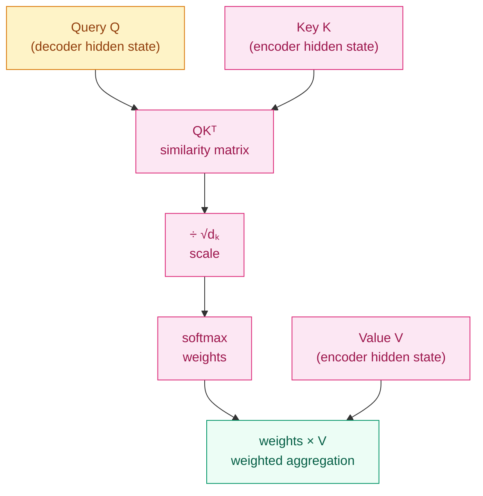

[English](README_EN.md) | [中文](README.md)

# Why Does the Model Need to "Look Back"? — Attention Mechanism Motivation

## Where This Problem Comes From

> The previous chapter discussed Seq2Seq's fatal weakness: no matter how long the input sentence is, the encoder must compress it into a fixed-length vector. Translating 5 words and translating 50 words use the same-sized "bottle" — information inevitably overflows.
> In 2015, Bahdanau et al. proposed attention mechanisms for translation tasks: when decoding each word, let the model "look back" at all positions in the input sequence and dynamically select the most relevant parts. This completely solved the information bottleneck problem.
> Attention later evolved from "the decoder queries the encoder" to "querying itself" (Self-Attention), becoming the core mechanism of Transformer.

## Learning Objectives

After completing this chapter, you should be able to answer:

1. Why is Seq2Seq's fixed-length context vector an information bottleneck?
2. What is the intuition behind the QKV framework? What roles do Query, Key, and Value represent?
3. Where does attention's $O(n^2)$ complexity come from?

---

## 1. Intuition

When translating a long sentence, you don't first memorize the entire sentence before translating; instead, you look back at the corresponding parts of the source text for whichever word you're currently translating.

When translating "beautiful" in "I love this beautiful cat," you look back at the vicinity of "beautiful," not the average information of the entire sentence.

The attention mechanism gives the model this ability to "look back." It doesn't need to compress the whole sentence into a single vector; instead, it maintains information at all positions and queries dynamically during decoding.

**QKV Analogy**:
- **Query (Q)**: What am I looking for right now? ("I'm translating 'beautiful,' let me find relevant information in the source text")
- **Key (K)**: Each position "advertises" its own label ("I'm position 3, I encode information about 'beautiful'")
- **Value (V)**: The actual content at each position ("the semantic vector of beautiful")

The dot product of Q and K measures how well "what I'm looking for" matches "what you provide." The higher the match, the greater the weight of the retrieved V.

> Key takeaway: Attention is essentially a "weighted lookup" — dynamically retrieving information based on a query.

---

## 2. Mechanics

### 2.1 From Seq2Seq Bottleneck to Attention

**Without attention**:

$$
s_0 = f_\text{enc}(x_1, x_2, \ldots, x_n) \in \mathbb{R}^d
$$

The entire input sequence is compressed into a vector $s_0$. The longer the input, the greater the information loss.

**With attention**:

When decoding the $t$-th word:

$$
c_t = \sum_{i=1}^{n} \alpha_{ti} \cdot h_i
$$

Where $h_i$ is the encoder's hidden state at position $i$, and $\alpha_{ti}$ is the attention weight:

$$
\alpha_{ti} = \text{softmax}(e_{ti}), \quad e_{ti} = \text{score}(s_{t-1}, h_i)
$$

Each decoding step has its own dedicated context vector $c_t$, no longer fixed-length.

### 2.2 QKV Framework

Abstract attention into three elements: Query, Key, Value:

$$
\text{Attention}(Q, K, V) = \text{softmax}\left(\frac{QK^\top}{\sqrt{d_k}}\right) V
$$

Step-by-step breakdown:

1. **Compute similarity**: $QK^\top \in \mathbb{R}^{n \times m}$, dot product of each query and each key
2. **Scale**: divide by $\sqrt{d_k}$ to prevent dot products from becoming too large and saturating softmax
3. **Normalize**: softmax turns scores into probabilities (weights sum to 1)
4. **Weighted aggregation**: weighted sum of values using the weights



### 2.3 Why divide by $\sqrt{d_k}$?

When $d_k$ is large (e.g., 64), the variance of the dot product of two random vectors is $d_k$ (because each dimension contributes a variance term). This causes the absolute value of the dot product to be large, and softmax outputs tend toward one-hot — gradients nearly vanish.

Dividing by $\sqrt{d_k}$ brings the variance back to 1, making softmax outputs smoother and gradients healthier.

> Key takeaway: The $\sqrt{d_k}$ scaling is not an optional optimization; it is a necessary condition for attention to work properly.

### 2.4 Evolution of Attention Variants

| Type | Year | Score Function | Characteristics |
|------|------|----------------|-----------------|
| Bahdanau | 2015 | $v^\top \tanh(W_1 s + W_2 h)$ | Additive attention, more parameters |
| Luong (dot) | 2015 | $s^\top h$ | Multiplicative attention, no extra parameters |
| Luong (general) | 2015 | $s^\top W h$ | Adds a projection matrix |
| Scaled Dot-Product | 2017 | $QK^\top / \sqrt{d_k}$ | Used by Transformer |
| Multi-Head | 2017 | Multiple QKV groups in parallel | Core of Transformer |

### 2.5 Self-Attention: From "Querying Others" to "Querying Itself"

The attention above is cross-attention (Q comes from the decoder, K/V come from the encoder).

**Self-Attention** means Q, K, and V all come from the same sequence:

$$
\text{SelfAttention}(X) = \text{softmax}\left(\frac{XX_W^\top \cdot XX_K^\top}{\sqrt{d_k}}\right) XX_V^\top
$$

Every position can directly see all other positions in the sequence — no more step-by-step passing required as in RNN. This is the core innovation of Transformer.

### 2.6 Complexity Analysis

Attention computational complexity:

$$
O(n^2 \cdot d)
$$

Where $n$ is sequence length and $d$ is dimension. $QK^\top$ produces an $n \times n$ matrix — computing similarity between every position and every position.

This is where the $O(n^2)$ complexity comes from. When $n = 100,000$ (long documents), the attention matrix needs $10^{10}$ elements — memory explosion.

> This spawned a large body of subsequent efficient attention research: Flash Attention (hardware optimization), Linear Attention (not explicitly computing the $n \times n$ matrix), Sparse Attention (only computing partial position pairs).

---

## 3. Progressive Implementation

**Step 1 · Hand-written attention weights visualization**

```python
import numpy as np

np.random.seed(42)

SEQ_LEN, DIM = 5, 8

# Simulate encoder hidden states and decoder hidden state
encoder_states = np.random.randn(SEQ_LEN, DIM)  # encoder outputs for 5 positions
decoder_state = np.random.randn(DIM)            # hidden state at current decoding step

# Compute attention scores (simplified: no scaling)
scores = encoder_states @ decoder_state          # (5,)
print(f"Raw scores: {scores}")

# Softmax normalization
def softmax(x):
    x_shifted = x - np.max(x)
    exp_x = np.exp(x_shifted)
    return exp_x / exp_x.sum()

weights = softmax(scores)
print(f"Attention weights: {[f'{w:.3f}' for w in weights]}")
print(f"Weight sum: {weights.sum():.6f}")  # should be 1.0

# Weighted aggregation
context = weights @ encoder_states               # (DIM,)
print(f"Context vector shape: {context.shape}")
```

**Step 2 · Full Scaled Dot-Product Attention**

```python
import torch
import torch.nn.functional as F

torch.manual_seed(42)

BATCH, SEQ, DK, DV = 2, 6, 16, 16

Q = torch.randn(BATCH, SEQ, DK)
K = torch.randn(BATCH, SEQ, DK)
V = torch.randn(BATCH, SEQ, DV)

# Scaled Dot-Product Attention
scores = torch.bmm(Q, K.transpose(1, 2)) / (DK ** 0.5)  # (batch, seq, seq)
weights = F.softmax(scores, dim=-1)                        # (batch, seq, seq)
output = torch.bmm(weights, V)                             # (batch, seq, dv)

print(f"Attention matrix shape: {weights.shape}")  # (2, 6, 6)
print(f"Row sums: {weights[0].sum(dim=-1)}")  # each row should be 1.0
print(f"Output shape: {output.shape}")          # (2, 6, 16)
```

**Step 3 · Causal mask (used in Decoder)**

```python
import torch
import torch.nn.functional as F

torch.manual_seed(42)

SEQ, DK = 6, 16

Q = torch.randn(1, SEQ, DK)
K = torch.randn(1, SEQ, DK)
V = torch.randn(1, SEQ, DK)

scores = Q @ K.transpose(-2, -1) / (DK ** 0.5)

# Causal mask: set upper triangle to -inf
causal_mask = torch.triu(torch.ones(SEQ, SEQ), diagonal=1).bool()
scores_masked = scores.masked_fill(causal_mask, float('-inf'))

weights = F.softmax(scores_masked, dim=-1)
print("Causal attention matrix (position 0 can only see itself):")
print(weights[0].round(decimals=2))
# First row: [1, 0, 0, 0, 0, 0] (position 0 only sees position 0)
# Second row: [x, x, 0, 0, 0, 0] (position 1 sees positions 0-1)
```

**Step 4 · Attention heatmap visualization**

```python
import torch
import torch.nn.functional as F
import matplotlib.pyplot as plt

torch.manual_seed(42)

SEQ, DK = 8, 16
words = ["The", "cat", "sat", "on", "the", "mat", ".", "<pad>"]

Q = torch.randn(1, SEQ, DK)
K = torch.randn(1, SEQ, DK)
scores = Q @ K.transpose(-2, -1) / (DK ** 0.5)
weights = F.softmax(scores, dim=-1)[0].detach().numpy()

fig, ax = plt.subplots(figsize=(6, 5))
im = ax.imshow(weights, cmap='Blues')
ax.set_xticks(range(SEQ))
ax.set_yticks(range(SEQ))
ax.set_xticklabels(words, rotation=45, ha='right')
ax.set_yticklabels(words)
ax.set_title("Self-Attention Weights")
plt.colorbar(im, ax=ax)
plt.tight_layout()
plt.savefig("attention_heatmap.png", dpi=150)
print("Attention heatmap saved")
```

---

## 4. Engineering Pitfalls (Sorted by Severity)

1. **Forgetting the scaling factor $\sqrt{d_k}$**
   Symptom: When $d_k$ is large (e.g., 64), softmax outputs tend toward one-hot, gradients nearly vanish, training stalls.
   Fix: Always divide by $\sqrt{d_k}$. This is not a hyperparameter; it is mathematically necessary.

2. **Attention matrix memory explosion**
   Symptom: As sequence length $n$ increases, the $n \times n$ attention matrix consumes $O(n^2)$ memory. At $n=8192$, the attention matrix alone needs 256MB (float32).
   Fix: Use Flash Attention for long sequences (PyTorch 2.0+ `F.scaled_dot_product_attention`), without explicitly storing the attention matrix.

3. **Mask direction reversed**
   Symptom: The causal mask should block **future** positions (upper triangle), but mistakenly blocks **past** positions (lower triangle).
   Fix: `torch.triu(..., diagonal=1)` masks the strict upper triangle, preserving the diagonal and below — i.e., the current position can see itself and the past.

4. **Softmax dim set incorrectly on batch dimension**
   Symptom: `softmax(scores, dim=1)` applies softmax over the batch dimension instead of the key dimension.
   Fix: `softmax(scores, dim=-1)`, normalize along the last dimension (number of keys).

> Key takeaway: Attention's math is simple (three matrix multiplications + softmax); the engineering difficulties lie in masks and memory management.

---

## Evolution Notes

> **The evolution of attention**: Bahdanau attention (2015, additive) → Luong attention (2015, multiplicative) → Scaled Dot-Product Attention (2017, Transformer) → Multi-Head Attention (2017) → Flash Attention (2022, hardware optimization).
>
> The idea of attention later transcended NLP: ViT processes images with self-attention after cutting them into patches, CLIP aligns images and text with cross-attention, and diffusion models inject text conditions with cross-attention.
>
> **New problems left behind**: Attention allows every position in a sequence to interact directly, but this also means the model has no natural perception of input order — "cat eats fish" and "fish eats cat" might have identical attention weights. Positional Encoding, Multi-Head Attention, and other complete implementation details will be covered systematically in the Transformer Architecture chapter.

→ Next chapter: [Inductive Bias — How Do CNNs and Transformers "See" the World Differently?](../inductive-bias/README_EN.md)

---

**Previous**: [Encoder-Decoder Paradigm](../encoder-decoder/README_EN.md) | **Next**: [Inductive Bias](../inductive-bias/README_EN.md)
