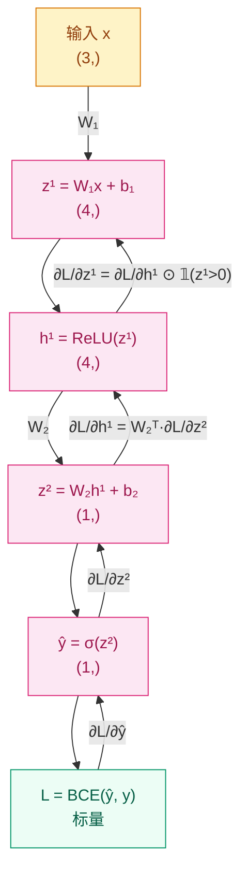

# 为什么模型能从错误中学习？—— 反向传播与优化器

## 这个问题从哪来

> 1986 年，Rumelhart、Hinton、Williams 重新发现反向传播算法，让多层网络的训练成为可能。此前，人们知道链式法则，但不知道如何系统地在多层计算图上高效应用它。深度学习的"学习"，本质上就是反向传播分配误差、优化器调整参数的循环。

## 学习目标

完成本章后，你应能回答：

1. 手算一个两层网络的反向传播，写出每一步的梯度公式
2. 解释梯度消失/爆炸的成因，选择对应的初始化和裁剪策略
3. 对比 SGD、Momentum、Adam 的更新规则，知道什么时候选哪个
4. 写出完整的 `zero_grad → backward → step` 训练循环，并解释每步为什么不能少

---

## 1. 直觉

想象你在管一家工厂。

产品出了质量问题，你不会把所有工人都骂一遍。你会从最后一道工序开始问：这道工序出了多少错？上游交过来的半成品有多少问题？然后逐层往回追责。

**反向传播就是这套"问责制"在神经网络里的实现。** 最终的 loss 是"总误差"，反向传播从 loss 出发，逐层计算"每个参数对这个误差贡献了多少"，然后优化器根据这份责任报告去调整参数。

关键点：每一层只需要知道**紧挨着自己的下一层传回来的误差**，不需要了解全局。这和工厂里每道工序只管自己直接上游是一样的。

---

## 2. 机制

### 2.1 链式法则与计算图

回顾微积分的链式法则：如果 $y = f(g(x))$，那么：

$$
\frac{dy}{dx} = \frac{dy}{dg} \cdot \frac{dg}{dx}
$$

神经网络就是一个嵌套的函数复合。一个两层网络的前向传播：

$$
z^{(1)} = W^{(1)} x + b^{(1)}, \quad h^{(1)} = \text{ReLU}(z^{(1)})
$$
$$
z^{(2)} = W^{(2)} h^{(1)} + b^{(2)}, \quad \hat{y} = \sigma(z^{(2)})
$$
$$
L = -[y \log \hat{y} + (1-y) \log(1 - \hat{y})]
$$

反向传播从 $L$ 出发，逐层往回算梯度：

$$
\frac{\partial L}{\partial W^{(1)}} =
\frac{\partial L}{\partial \hat{y}}
\cdot \frac{\partial \hat{y}}{\partial z^{(2)}}
\cdot \frac{\partial z^{(2)}}{\partial h^{(1)}}
\cdot \frac{\partial h^{(1)}}{\partial z^{(1)}}
\cdot \frac{\partial z^{(1)}}{\partial W^{(1)}}
$$

每一项都是局部计算——这一层的梯度只依赖本层的激活值和下一层传回来的误差。

**计算图（Mermaid）：**



**手算验证：numpy 手写 backward vs PyTorch autograd**

```python
# 验证手算反向传播与 PyTorch autograd 结果一致
# 两层网络: 3 → 4 → 1, ReLU + Sigmoid, BCE loss
import numpy as np
import torch

np.random.seed(42)
torch.manual_seed(42)

# --- 前向传播参数 ---
W1_np = np.random.randn(4, 3).astype(np.float64)
b1_np = np.zeros(4, dtype=np.float64)
W2_np = np.random.randn(1, 4).astype(np.float64)
b2_np = np.zeros(1, dtype=np.float64)
x_np = np.random.randn(3).astype(np.float64)
y_np = np.array([1.0], dtype=np.float64)

# --- numpy 前向 ---
z1 = W1_np @ x_np + b1_np          # (4,)
h1 = np.maximum(z1, 0)             # ReLU, (4,)
z2 = W2_np @ h1 + b2_np            # (1,)
yhat = 1.0 / (1.0 + np.exp(-z2))   # Sigmoid, (1,)
eps = 1e-7
loss = -(y_np * np.log(yhat + eps) + (1 - y_np) * np.log(1 - yhat + eps))

# --- numpy 反向传播 ---
dL_dyhat = -y_np / (yhat + eps) + (1 - y_np) / (1 - yhat + eps)  # (1,)
dyhat_dz2 = yhat * (1 - yhat)                                      # (1,)
dL_dz2 = dL_dyhat * dyhat_dz2                                      # (1,)
dL_dW2 = dL_dz2[:, None] @ h1[None, :]                            # (1,4)
dL_db2 = dL_dz2                                                    # (1,)

dL_dh1 = W2_np.T @ dL_dz2                                         # (4,)
dh1_dz1 = (z1 > 0).astype(np.float64)                              # (4,)
dL_dz1 = dL_dh1 * dh1_dz1                                         # (4,)
dL_dW1 = dL_dz1[:, None] @ x_np[None, :]                          # (4,3)
dL_db1 = dL_dz1                                                    # (4,)

# --- PyTorch 验证 ---
W1_t = torch.tensor(W1_np, requires_grad=True)
b1_t = torch.tensor(b1_np, requires_grad=True)
W2_t = torch.tensor(W2_np, requires_grad=True)
b2_t = torch.tensor(b2_np, requires_grad=True)
x_t = torch.tensor(x_np)
y_t = torch.tensor(y_np)

z1_t = W1_t @ x_t + b1_t
h1_t = torch.relu(z1_t)
z2_t = W2_t @ h1_t + b2_t
yhat_t = torch.sigmoid(z2_t)
loss_t = torch.nn.functional.binary_cross_entropy(yhat_t, y_t)
loss_t.backward()

# --- 对比 ---
print(f"loss: numpy={loss.item():.6f}, torch={loss_t.item():.6f}")
print(f"dL/dW2 max diff: {np.max(np.abs(dL_dW2 - W2_t.grad.numpy())):.2e}")
print(f"dL/db2 max diff: {np.max(np.abs(dL_db2 - b2_t.grad.numpy())):.2e}")
print(f"dL/dW1 max diff: {np.max(np.abs(dL_dW1 - W1_t.grad.numpy())):.2e}")
print(f"dL/db1 max diff: {np.max(np.abs(dL_db1 - b1_t.grad.numpy())):.2e}")
```

运行预期输出：所有 max diff 在 `1e-10` 量级以下，证明手算正确。

> 你要记住：反向传播不是黑科技，是链式法则在计算图上的系统应用。每一步梯度都是局部的——只依赖本层激活值和下一层传回的误差。

### 2.2 梯度问题：消失与爆炸

链式法则的本质是连乘。如果每一层的梯度都小于 1，乘几十次后，梯度趋近于零——**梯度消失**。如果每一层的梯度都大于 1，乘几十次后，梯度趋于无穷——**梯度爆炸**。

**消失的推导（Sigmoid 网络）：**

$$
\sigma'(z) = \sigma(z)(1 - \sigma(z)) \leq 0.25
$$

20 层 sigmoid 网络，梯度经过 20 次连乘后：

$$
\|\frac{\partial L}{\partial W^{(1)}}\| \propto (0.25)^{20} \approx 10^{-12}
$$

第一层的梯度几乎为零，等于没有在学习。

**可视化：不同深度网络的梯度范数**

```python
# 观察：深度增加时，各层梯度 L2 范数的变化
# 对比 Sigmoid vs ReLU 在 5/10/20 层网络中的表现
import torch
import torch.nn as nn
import matplotlib.pyplot as plt

torch.manual_seed(42)


def make_depth_net(depth: int, activation: str, dim: int = 32):
    """构建指定深度的全连接网络"""
    layers = []
    for _ in range(depth):
        layers.append(nn.Linear(dim, dim))
        if activation == "relu":
            layers.append(nn.ReLU())
        else:
            layers.append(nn.Sigmoid())
    layers.append(nn.Linear(dim, 1))
    return nn.Sequential(*layers)


def collect_grad_norms(model: nn.Module, x: torch.Tensor, y: torch.Tensor):
    """收集各层权重的梯度 L2 范数"""
    loss_fn = nn.BCEWithLogitsLoss()
    loss = loss_fn(model(x).squeeze(-1), y)
    loss.backward()

    norms = []
    for name, param in model.named_parameters():
        if "weight" in name and param.grad is not None:
            norms.append(param.grad.norm().item())
    return norms


x = torch.randn(16, 32)
y = torch.randint(0, 2, (16,)).float()

fig, axes = plt.subplots(1, 2, figsize=(12, 4))
for ax, act in zip(axes, ["sigmoid", "relu"]):
    for depth in [5, 10, 20]:
        model = make_depth_net(depth, act)
        norms = collect_grad_norms(model, x, y)
        ax.plot(range(len(norms)), norms, label=f"{depth} layers")
        model.zero_grad()
    ax.set_yscale("log")
    ax.set_xlabel("Layer index (0 = first)")
    ax.set_ylabel("Grad L2 norm (log)")
    ax.set_title(f"Activation: {act}")
    ax.legend()

plt.tight_layout()
plt.savefig("gradient_norms.png", dpi=150)
plt.show()
```

运行预期：
- Sigmoid 图：20 层网络的第一层梯度比最后一层低 10+ 个数量级
- ReLU 图：各层梯度范数保持在同一量级

**对策（按优先级）：**

| 优先级 | 问题 | 对策 | 原理 |
|--------|------|------|------|
| 1 | Sigmoid 梯度消失 | 换 ReLU | 正半轴梯度恒为 1，不衰减 |
| 2 | 初始化不当导致梯度不稳定 | He 初始化（ReLU）/ Xavier（Tanh） | 让各层激活值和梯度的方差保持稳定 |
| 3 | 梯度爆炸 | 梯度裁剪 `clip_grad_norm_` | 硬性限制梯度范数，通常阈值 1.0 |

He 初始化的原理：

$$
W \sim \mathcal{N}(0, \frac{2}{n_{in}})
$$

其中 $n_{in}$ 是输入维度。系数 2 抵消了 ReLU 将一半激活值置零的影响，让前向传播和反向传播中信号的方差都保持稳定。

### 2.3 优化器：从 SGD 到 Adam

有了梯度，还需要决定**怎么用梯度更新参数**。不同的更新策略，收敛速度和稳定性差异很大。

**SGD（随机梯度下降）**

$$
\theta_{t+1} = \theta_t - \eta \cdot g_t
$$

$\eta$ 是学习率。问题是：loss 曲面可能像一条狭长的山谷，SGD 会在两侧来回震荡，沿着谷底方向前进很慢。

**Momentum（动量）**

$$
v_t = \beta v_{t-1} + g_t, \quad \theta_{t+1} = \theta_t - \eta \cdot v_t
$$

物理类比：小球在坡上滚。惯性让它在一致的方向上加速，在震荡的方向上抵消。$\beta$ 通常取 0.9。

**Adam（Adaptive Moment Estimation）**

$$
m_t = \beta_1 m_{t-1} + (1 - \beta_1) g_t
$$
$$
v_t = \beta_2 v_{t-1} + (1 - \beta_2) g_t^2
$$
$$
\hat{m}_t = \frac{m_t}{1 - \beta_1^t}, \quad \hat{v}_t = \frac{v_t}{1 - \beta_2^t}
$$
$$
\theta_{t+1} = \theta_t - \eta \frac{\hat{m}_t}{\sqrt{\hat{v}_t} + \epsilon}
$$

Adam 同时维护一阶矩（梯度的指数移动平均）和二阶矩（梯度平方的指数移动平均），相当于为每个参数自适应地调节学习率。偏置校正（$\hat{m}_t, \hat{v}_t$）确保训练初期估计无偏。

**经验法则：** Adam 是默认首选（几乎不用调参就能收敛）。SGD + Momentum 在某些 CV 任务上最终泛化更好，但需要仔细调学习率。

**三种优化器收敛对比：**

```python
# 同一二分类任务，对比 SGD / SGD+Momentum / Adam 的 loss 曲线
import torch
import torch.nn as nn
import matplotlib.pyplot as plt

torch.manual_seed(42)

IN_DIM, HIDDEN, NUM_SAMPLES = 20, 64, 500


class MLP(nn.Module):
    """MLP · 00-Prerequisites/backpropagation · 两层分类器 · 依赖: torch"""

    def __init__(self, in_dim: int, hidden: int):
        super().__init__()
        self.net = nn.Sequential(
            nn.Linear(in_dim, hidden),
            nn.ReLU(),
            nn.Linear(hidden, 1),
        )
        for m in self.modules():
            if isinstance(m, nn.Linear):
                nn.init.kaiming_normal_(m.weight, nonlinearity="relu")
                nn.init.zeros_(m.bias)

    def forward(self, x: torch.Tensor) -> torch.Tensor:
        """
        Args:
            x: (batch, in_dim)
        Returns:
            logits: (batch,)
        """
        return self.net(x).squeeze(-1)


# 构造数据
X = torch.randn(NUM_SAMPLES, IN_DIM)
Y = (X[:, 0] ** 2 + X[:, 1] ** 2 < 1.0).float()  # 圆内分类
loss_fn = nn.BCEWithLogitsLoss()

optimizers = {
    "SGD": lambda p: torch.optim.SGD(p, lr=0.1),
    "SGD+Momentum": lambda p: torch.optim.SGD(p, lr=0.1, momentum=0.9),
    "Adam": lambda p: torch.optim.Adam(p, lr=1e-3),
}

EPOCHS = 50
histories = {}

for name, opt_fn in optimizers.items():
    torch.manual_seed(42)
    model = MLP(IN_DIM, HIDDEN)
    optimizer = opt_fn(model.parameters())
    losses = []
    for _ in range(EPOCHS):
        logits = model(X)
        loss = loss_fn(logits, Y)
        optimizer.zero_grad()
        loss.backward()
        optimizer.step()
        losses.append(loss.item())
    histories[name] = losses

plt.figure(figsize=(8, 4))
for name, losses in histories.items():
    plt.plot(losses, label=name)
plt.xlabel("Epoch")
plt.ylabel("Loss")
plt.title("Optimizer Comparison")
plt.legend()
plt.tight_layout()
plt.savefig("optimizer_comparison.png", dpi=150)
plt.show()
```

运行预期：Adam 最快收敛，SGD+Momentum 次之，纯 SGD 最慢且震荡明显。

### 2.4 训练循环骨架

把前面的所有零件组装起来，就是一个完整的训练循环：

```python
# 完整训练循环：zero_grad → forward → loss → backward → clip → step
# 含 CosineAnnealing lr scheduler 和 train/eval 模式切换
import torch
import torch.nn as nn
from torch.utils.data import DataLoader, TensorDataset

torch.manual_seed(42)

BATCH, IN_DIM, HIDDEN = 32, 20, 64
MAX_GRAD_NORM = 1.0
NUM_EPOCHS = 20


class MLP(nn.Module):
    """MLP · 00-Prerequisites/backpropagation · 两层分类器 · 依赖: torch"""

    def __init__(self, in_dim: int, hidden: int, dropout: float = 0.1):
        super().__init__()
        self.net = nn.Sequential(
            nn.Linear(in_dim, hidden),
            nn.BatchNorm1d(hidden),
            nn.ReLU(),
            nn.Dropout(dropout),
            nn.Linear(hidden, 1),
        )
        for m in self.modules():
            if isinstance(m, nn.Linear):
                nn.init.kaiming_normal_(m.weight, nonlinearity="relu")
                nn.init.zeros_(m.bias)

    def forward(self, x: torch.Tensor) -> torch.Tensor:
        """
        Args:
            x: (batch, in_dim)
        Returns:
            logits: (batch,)
        """
        return self.net(x).squeeze(-1)


# 构造数据
X = torch.randn(500, IN_DIM)
Y = (X[:, 0] ** 2 + X[:, 1] ** 2 < 1.0).float()
train_ds = TensorDataset(X[:400], Y[:400])
val_ds = TensorDataset(X[400:], Y[400:])
train_loader = DataLoader(train_ds, batch_size=BATCH, shuffle=True)
val_loader = DataLoader(val_ds, batch_size=BATCH)

model = MLP(IN_DIM, HIDDEN)
optimizer = torch.optim.AdamW(model.parameters(), lr=1e-3, weight_decay=1e-2)
scheduler = torch.optim.lr_scheduler.CosineAnnealingLR(optimizer, T_max=NUM_EPOCHS)
loss_fn = nn.BCEWithLogitsLoss()

for epoch in range(NUM_EPOCHS):
    # --- 训练 ---
    model.train()
    for x_batch, y_batch in train_loader:
        logits = model(x_batch)
        loss = loss_fn(logits, y_batch)

        optimizer.zero_grad()          # 1. 清零旧梯度
        loss.backward()                # 2. 反向传播计算新梯度
        nn.utils.clip_grad_norm_(      # 3. 梯度裁剪防爆炸
            model.parameters(), MAX_GRAD_NORM
        )
        optimizer.step()               # 4. 更新参数

    scheduler.step()

    # --- 验证 ---
    model.eval()
    val_loss = 0.0
    correct = 0
    total = 0
    with torch.no_grad():
        for x_batch, y_batch in val_loader:
            logits = model(x_batch)
            val_loss += loss_fn(logits, y_batch).item()
            preds = (logits > 0).float()
            correct += (preds == y_batch).sum().item()
            total += y_batch.size(0)

    acc = correct / total
    lr = optimizer.param_groups[0]["lr"]
    if (epoch + 1) % 5 == 0:
        print(f"epoch {epoch+1:2d}/{NUM_EPOCHS}  "
              f"val_loss: {val_loss/len(val_loader):.4f}  "
              f"acc: {acc:.3f}  lr: {lr:.6f}")
```

**每步为什么不能少、不能颠倒：**

| 步骤 | 作用 | 省略或颠倒的后果 |
|------|------|----------------|
| `zero_grad()` | 清除上一步的梯度 | 梯度累积，等效学习率越来越大 |
| `forward` | 计算预测值 | 没有预测值就无法算 loss |
| `loss` | 量化误差 | 没有误差信号就没有学习目标 |
| `backward()` | 沿计算图反向计算梯度 | 没有梯度就不知道往哪更新 |
| `clip_grad_norm_` | 限制梯度范数 | 可能梯度爆炸导致参数变 NaN |
| `step()` | 用梯度更新参数 | 没有这一步，模型永远不会变 |

> 你要记住：`zero_grad → backward → step` 是训练循环的骨架，顺序不能颠倒。中间可以插入裁剪、schedule 等操作，但这三步的相对位置固定。

---

## 3. 工程陷阱

优先级从高到低：

1. **忘记 `zero_grad()`** → 梯度累积，等效学习率越来越大
   处置：每次 `backward()` 前必须调用，PyTorch 不会自动清零

2. **学习率设错** → loss 不降（过小）或 loss 爆炸（过大）
   处置：先试 `1e-3`，观察前 10 个 batch 的 loss 走势

3. **初始化不当** → 深层网络激活全零或全饱和，梯度传不动
   处置：ReLU 用 He 初始化（`kaiming_normal_`），Tanh 用 Xavier（`xavier_uniform_`）

4. **Adam 的 weight_decay 陷阱** → Adam + L2 正则化 ≠ AdamW
   处置：需要权重衰减时用 `AdamW`，不要在 loss 里手动加 L2

> 你要记住：训练崩掉时，先查学习率和初始化，再查网络结构。80% 的问题在这两处。

---

## 演进笔记

> **这一技术的遗产**：反向传播让多层网络可训练，优化器让训练收敛可控。但 MLP 对数据结构没有任何假设——图像的局部性和序列的时序性都被忽略。这两个盲区分别催生了卷积网络（利用空间局部性）和循环网络（利用时序依赖）。
>
> → 下一章：[CNN 架构 — 为什么全连接网络处理图像太浪费了？](../../01-Visual-Intelligence/cnn-architectures/README.md)

---

**上一章**：[神经网络基础](../deep-learning-basics/README.md) | **下一章**：[CNN 架构](../../01-Visual-Intelligence/cnn-architectures/README.md)
