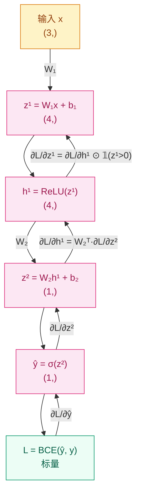

# 为什么模型能从错误中学习？—— 反向传播与优化器

## 这个问题从哪来

> 1986 年，Rumelhart、Hinton、Williams 重新发现反向传播算法，让多层网络的训练成为可能。此前，人们知道链式法则，但不知道如何系统地在多层计算图上高效应用它。深度学习的"学习"，本质上就是反向传播分配误差、优化器调整参数的循环。

## 学习目标

完成本章后，你应能回答：

1. 手算一个两层网络的反向传播，写出每一步的梯度公式
2. 解释梯度消失/爆炸的成因，选择对应的初始化和裁剪策略
3. 对比 SGD、Momentum、Adam 的更新规则，知道什么时候选哪个
4. 写出完整的 `zero_grad → backward → step` 训练循环，并解释每步为什么不能少

---

## 1. 直觉

想象你在管一家工厂。

产品出了质量问题，你不会把所有工人都骂一遍。你会从最后一道工序开始问：这道工序出了多少错？上游交过来的半成品有多少问题？然后逐层往回追责。

**反向传播就是这套"问责制"在神经网络里的实现。** 最终的 loss 是"总误差"，反向传播从 loss 出发，逐层计算"每个参数对这个误差贡献了多少"，然后优化器根据这份责任报告去调整参数。

关键点：每一层只需要知道**紧挨着自己的下一层传回来的误差**，不需要了解全局。这和工厂里每道工序只管自己直接上游是一样的。

---

## 2. 机制

### 2.1 链式法则与计算图

回顾微积分的链式法则：如果 $y = f(g(x))$，那么：

$$
\frac{dy}{dx} = \frac{dy}{dg} \cdot \frac{dg}{dx}
$$

神经网络就是一个嵌套的函数复合。一个两层网络的前向传播：

$$
z^{(1)} = W^{(1)} x + b^{(1)}, \quad h^{(1)} = \text{ReLU}(z^{(1)})
$$
$$
z^{(2)} = W^{(2)} h^{(1)} + b^{(2)}, \quad \hat{y} = \sigma(z^{(2)})
$$
$$
L = -[y \log \hat{y} + (1-y) \log(1 - \hat{y})]
$$

反向传播从 $L$ 出发，逐层往回算梯度：

$$
\frac{\partial L}{\partial W^{(1)}} =
\frac{\partial L}{\partial \hat{y}}
\cdot \frac{\partial \hat{y}}{\partial z^{(2)}}
\cdot \frac{\partial z^{(2)}}{\partial h^{(1)}}
\cdot \frac{\partial h^{(1)}}{\partial z^{(1)}}
\cdot \frac{\partial z^{(1)}}{\partial W^{(1)}}
$$

每一项都是局部计算——这一层的梯度只依赖本层的激活值和下一层传回来的误差。

**计算图（Mermaid）：**



**手算验证：numpy 手写 backward vs PyTorch autograd**

```python
# 验证手算反向传播与 PyTorch autograd 结果一致
# 两层网络: 3 → 4 → 1, ReLU + Sigmoid, BCE loss
import numpy as np
import torch

np.random.seed(42)
torch.manual_seed(42)

# --- 前向传播参数 ---
W1_np = np.random.randn(4, 3).astype(np.float64)
b1_np = np.zeros(4, dtype=np.float64)
W2_np = np.random.randn(1, 4).astype(np.float64)
b2_np = np.zeros(1, dtype=np.float64)
x_np = np.random.randn(3).astype(np.float64)
y_np = np.array([1.0], dtype=np.float64)

# --- numpy 前向 ---
z1 = W1_np @ x_np + b1_np          # (4,)
h1 = np.maximum(z1, 0)             # ReLU, (4,)
z2 = W2_np @ h1 + b2_np            # (1,)
yhat = 1.0 / (1.0 + np.exp(-z2))   # Sigmoid, (1,)
eps = 1e-7
loss = -(y_np * np.log(yhat + eps) + (1 - y_np) * np.log(1 - yhat + eps))

# --- numpy 反向传播 ---
dL_dyhat = -y_np / (yhat + eps) + (1 - y_np) / (1 - yhat + eps)  # (1,)
dyhat_dz2 = yhat * (1 - yhat)                                      # (1,)
dL_dz2 = dL_dyhat * dyhat_dz2                                      # (1,)
dL_dW2 = dL_dz2[:, None] @ h1[None, :]                            # (1,4)
dL_db2 = dL_dz2                                                    # (1,)

dL_dh1 = W2_np.T @ dL_dz2                                         # (4,)
dh1_dz1 = (z1 > 0).astype(np.float64)                              # (4,)
dL_dz1 = dL_dh1 * dh1_dz1                                         # (4,)
dL_dW1 = dL_dz1[:, None] @ x_np[None, :]                          # (4,3)
dL_db1 = dL_dz1                                                    # (4,)

# --- PyTorch 验证 ---
W1_t = torch.tensor(W1_np, requires_grad=True)
b1_t = torch.tensor(b1_np, requires_grad=True)
W2_t = torch.tensor(W2_np, requires_grad=True)
b2_t = torch.tensor(b2_np, requires_grad=True)
x_t = torch.tensor(x_np)
y_t = torch.tensor(y_np)

z1_t = W1_t @ x_t + b1_t
h1_t = torch.relu(z1_t)
z2_t = W2_t @ h1_t + b2_t
yhat_t = torch.sigmoid(z2_t)
loss_t = torch.nn.functional.binary_cross_entropy(yhat_t, y_t)
loss_t.backward()

# --- 对比 ---
print(f"loss: numpy={loss.item():.6f}, torch={loss_t.item():.6f}")
print(f"dL/dW2 max diff: {np.max(np.abs(dL_dW2 - W2_t.grad.numpy())):.2e}")
print(f"dL/db2 max diff: {np.max(np.abs(dL_db2 - b2_t.grad.numpy())):.2e}")
print(f"dL/dW1 max diff: {np.max(np.abs(dL_dW1 - W1_t.grad.numpy())):.2e}")
print(f"dL/db1 max diff: {np.max(np.abs(dL_db1 - b1_t.grad.numpy())):.2e}")
```

运行预期输出：所有 max diff 在 `1e-10` 量级以下，证明手算正确。

> 你要记住：反向传播不是黑科技，是链式法则在计算图上的系统应用。每一步梯度都是局部的——只依赖本层激活值和下一层传回的误差。
