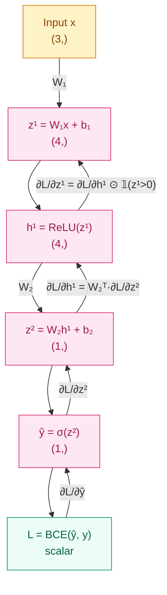

[English](README_EN.md) | [中文](README.md)

# Why Models Can Learn from Errors — Backpropagation and Optimizers

## Where This Problem Comes From

> In 1986, Rumelhart, Hinton, and Williams rediscovered the backpropagation algorithm, making multi-layer network training possible. Before this, people knew the chain rule but didn't know how to apply it systematically and efficiently on multi-layer computation graphs. The "learning" in deep learning is essentially the loop of backpropagation distributing errors and optimizers adjusting parameters.

## Learning Objectives

After completing this chapter, you should be able to answer:

1. Manually compute backpropagation for a two-layer network and write out the gradient formula for each step.
2. Explain the causes of vanishing/exploding gradients and choose the corresponding initialization and clipping strategies.
3. Compare the update rules of SGD, Momentum, and Adam, and know when to choose which.
4. Write the complete `zero_grad → backward → step` training loop and explain why none of these steps can be skipped.

---

## 1. Intuition

Imagine you're managing a factory.

When a product has quality issues, you don't scold every worker. You start from the last process and ask: how much did this step get wrong? How many problems were in the semi-finished product from upstream? Then you trace back layer by layer.

**Backpropagation is this "accountability system" implemented in neural networks.** The final loss is the "total error"; backpropagation starts from the loss and computes layer by layer "how much each parameter contributed to this error," and then the optimizer adjusts parameters based on this responsibility report.

Key point: each layer only needs to know **the error passed back from the layer immediately next to it**, without needing to understand the global picture. This is the same as each process in a factory only managing its direct upstream.

---

## 2. Mechanics

### 2.1 Chain Rule and Computation Graph

Reviewing the chain rule from calculus: if $y = f(g(x))$, then:

$$
\frac{dy}{dx} = \frac{dy}{dg} \cdot \frac{dg}{dx}
$$

A neural network is a nested function composition. Forward pass of a two-layer network:

$$
z^{(1)} = W^{(1)} x + b^{(1)}, \quad h^{(1)} = \text{ReLU}(z^{(1)})
$$
$$
z^{(2)} = W^{(2)} h^{(1)} + b^{(2)}, \quad \hat{y} = \sigma(z^{(2)})
$$
$$
L = -[y \log \hat{y} + (1-y) \log(1 - \hat{y})]
$$

Backpropagation starts from $L$ and computes gradients layer by layer:

$$
\frac{\partial L}{\partial W^{(1)}} =
\frac{\partial L}{\partial \hat{y}}
\cdot \frac{\partial \hat{y}}{\partial z^{(2)}}
\cdot \frac{\partial z^{(2)}}{\partial h^{(1)}}
\cdot \frac{\partial h^{(1)}}{\partial z^{(1)}}
\cdot \frac{\partial z^{(1)}}{\partial W^{(1)}}
$$

Each term is a local computation — the gradient of this layer only depends on this layer's activation values and the error passed back from the next layer.

**Computation Graph (Mermaid):**



**Hand-calculation verification: numpy handwritten backward vs PyTorch autograd**

```python
# Verify that handwritten backpropagation matches PyTorch autograd results
# Two-layer network: 3 → 4 → 1, ReLU + Sigmoid, BCE loss
import numpy as np
import torch

np.random.seed(42)
torch.manual_seed(42)

# --- Forward pass parameters ---
W1_np = np.random.randn(4, 3).astype(np.float64)
b1_np = np.zeros(4, dtype=np.float64)
W2_np = np.random.randn(1, 4).astype(np.float64)
b2_np = np.zeros(1, dtype=np.float64)
x_np = np.random.randn(3).astype(np.float64)
y_np = np.array([1.0], dtype=np.float64)

# --- NumPy forward ---
z1 = W1_np @ x_np + b1_np          # (4,)
h1 = np.maximum(z1, 0)             # ReLU, (4,)
z2 = W2_np @ h1 + b2_np            # (1,)
yhat = 1.0 / (1.0 + np.exp(-z2))   # Sigmoid, (1,)
eps = 1e-7
loss = -(y_np * np.log(yhat + eps) + (1 - y_np) * np.log(1 - yhat + eps))

# --- NumPy backpropagation ---
dL_dyhat = -y_np / (yhat + eps) + (1 - y_np) / (1 - yhat + eps)  # (1,)
dyhat_dz2 = yhat * (1 - yhat)                                      # (1,)
dL_dz2 = dL_dyhat * dyhat_dz2                                      # (1,)
dL_dW2 = dL_dz2[:, None] @ h1[None, :]                            # (1,4)
dL_db2 = dL_dz2                                                    # (1,)

dL_dh1 = W2_np.T @ dL_dz2                                         # (4,)
dh1_dz1 = (z1 > 0).astype(np.float64)                              # (4,)
dL_dz1 = dL_dh1 * dh1_dz1                                         # (4,)
dL_dW1 = dL_dz1[:, None] @ x_np[None, :]                          # (4,3)
dL_db1 = dL_dz1                                                    # (4,)

# --- PyTorch verification ---
W1_t = torch.tensor(W1_np, requires_grad=True)
b1_t = torch.tensor(b1_np, requires_grad=True)
W2_t = torch.tensor(W2_np, requires_grad=True)
b2_t = torch.tensor(b2_np, requires_grad=True)
x_t = torch.tensor(x_np)
y_t = torch.tensor(y_np)

z1_t = W1_t @ x_t + b1_t
h1_t = torch.relu(z1_t)
z2_t = W2_t @ h1_t + b2_t
yhat_t = torch.sigmoid(z2_t)
loss_t = torch.nn.functional.binary_cross_entropy(yhat_t, y_t)
loss_t.backward()

# --- Comparison ---
print(f"loss: numpy={loss.item():.6f}, torch={loss_t.item():.6f}")
print(f"dL/dW2 max diff: {np.max(np.abs(dL_dW2 - W2_t.grad.numpy())):.2e}")
print(f"dL/db2 max diff: {np.max(np.abs(dL_db2 - b2_t.grad.numpy())):.2e}")
print(f"dL/dW1 max diff: {np.max(np.abs(dL_dW1 - W1_t.grad.numpy())):.2e}")
print(f"dL/db1 max diff: {np.max(np.abs(dL_db1 - b1_t.grad.numpy())):.2e}")
```

Expected output: all max diff below `1e-10`, proving the hand calculation is correct.

> Key takeaway: backpropagation is not black magic; it is the systematic application of the chain rule on computation graphs. Every gradient is local — it only depends on this layer's activation values and the error passed back from the next layer.

### 2.2 Gradient Problems: Vanishing and Exploding

The essence of the chain rule is multiplication. If every layer's gradient is less than 1, after dozens of multiplications the gradient approaches zero — **vanishing gradients**. If every layer's gradient is greater than 1, after dozens of multiplications the gradient tends to infinity — **exploding gradients**.

**Derivation of vanishing (Sigmoid network):**

$$
\sigma'(z) = \sigma(z)(1 - \sigma(z)) \leq 0.25
$$

After 20 layers of a sigmoid network, the gradient has been multiplied 20 times:

$$
\|\frac{\partial L}{\partial W^{(1)}}\| \propto (0.25)^{20} \approx 10^{-12}
$$

The first layer's gradient is almost zero, meaning it's not learning at all.

**Visualization: gradient norms across different depths**

```python
# Observation: how layer gradient L2 norms change as depth increases
# Compare Sigmoid vs ReLU in 5/10/20-layer networks
import torch
import torch.nn as nn
import matplotlib.pyplot as plt

torch.manual_seed(42)


def make_depth_net(depth: int, activation: str, dim: int = 32):
    """Build a fully connected network of specified depth"""
    layers = []
    for _ in range(depth):
        layers.append(nn.Linear(dim, dim))
        if activation == "relu":
            layers.append(nn.ReLU())
        else:
            layers.append(nn.Sigmoid())
    layers.append(nn.Linear(dim, 1))
    return nn.Sequential(*layers)


def collect_grad_norms(model: nn.Module, x: torch.Tensor, y: torch.Tensor):
    """Collect L2 norms of gradients for each layer's weights"""
    loss_fn = nn.BCEWithLogitsLoss()
    loss = loss_fn(model(x).squeeze(-1), y)
    loss.backward()

    norms = []
    for name, param in model.named_parameters():
        if "weight" in name and param.grad is not None:
            norms.append(param.grad.norm().item())
    return norms


x = torch.randn(16, 32)
y = torch.randint(0, 2, (16,)).float()

fig, axes = plt.subplots(1, 2, figsize=(12, 4))
for ax, act in zip(axes, ["sigmoid", "relu"]):
    for depth in [5, 10, 20]:
        model = make_depth_net(depth, act)
        norms = collect_grad_norms(model, x, y)
        ax.plot(range(len(norms)), norms, label=f"{depth} layers")
        model.zero_grad()
    ax.set_yscale("log")
    ax.set_xlabel("Layer index (0 = first)")
    ax.set_ylabel("Grad L2 norm (log)")
    ax.set_title(f"Activation: {act}")
    ax.legend()

plt.tight_layout()
plt.savefig("gradient_norms.png", dpi=150)
plt.show()
```

Expected results:
- Sigmoid plot: first-layer gradient of 20-layer network is 10+ orders of magnitude lower than the last layer
- ReLU plot: gradient norms of all layers stay in the same order of magnitude

**Countermeasures (by priority):**

| Priority | Problem | Countermeasure | Principle |
|----------|---------|----------------|-----------|
| 1 | Sigmoid vanishing gradient | Switch to ReLU | Positive half-axis gradient is constantly 1, no decay |
| 2 | Improper initialization causing gradient instability | He init (ReLU) / Xavier (Tanh) | Keep activation and gradient variance stable across layers |
| 3 | Gradient explosion | Gradient clipping `clip_grad_norm_` | Hard limit on gradient norm, usually threshold 1.0 |

Principle of He initialization:

$$
W \sim \mathcal{N}(0, \frac{2}{n_{in}})
$$

Where $n_{in}$ is the input dimension. The factor 2 offsets the effect of ReLU zeroing out half of the activations, keeping the variance of signals stable in both forward and backward propagation.

### 2.3 Optimizers: From SGD to Adam

Having gradients, we still need to decide **how to use them to update parameters**. Different update strategies lead to large differences in convergence speed and stability.

**SGD (Stochastic Gradient Descent)**

$$
\theta_{t+1} = \theta_t - \eta \cdot g_t
$$

$\eta$ is the learning rate. The problem: the loss surface can be like a long, narrow valley; SGD will bounce back and forth across the sides and move very slowly along the valley floor.

**Momentum**

$$
v_t = \beta v_{t-1} + g_t, \quad \theta_{t+1} = \theta_t - \eta \cdot v_t
$$

Physics analogy: a ball rolling down a hill. Inertia accelerates it in consistent directions and cancels out oscillations in inconsistent directions. $\beta$ is usually 0.9.

**Adam (Adaptive Moment Estimation)**

$$
m_t = \beta_1 m_{t-1} + (1 - \beta_1) g_t
$$
$$
v_t = \beta_2 v_{t-1} + (1 - \beta_2) g_t^2
$$
$$
\hat{m}_t = \frac{m_t}{1 - \beta_1^t}, \quad \hat{v}_t = \frac{v_t}{1 - \beta_2^t}
$$
$$
\theta_{t+1} = \theta_t - \eta \frac{\hat{m}_t}{\sqrt{\hat{v}_t} + \epsilon}
$$

Adam maintains both first-order moment (exponential moving average of gradients) and second-order moment (exponential moving average of squared gradients), which is equivalent to adaptively adjusting the learning rate for each parameter. Bias correction ($\hat{m}_t, \hat{v}_t$) ensures unbiased estimates in early training.

**Rule of thumb:** Adam is the default first choice (converges with almost no tuning). SGD + Momentum sometimes achieves better final generalization on certain CV tasks, but requires careful learning rate tuning.

**Convergence comparison of three optimizers:**

```python
# Same binary classification task, compare loss curves of SGD / SGD+Momentum / Adam
import torch
import torch.nn as nn
import matplotlib.pyplot as plt

torch.manual_seed(42)

IN_DIM, HIDDEN, NUM_SAMPLES = 20, 64, 500


class MLP(nn.Module):
    """MLP · 00-Prerequisites/backpropagation · Two-layer classifier · Depends: torch"""

    def __init__(self, in_dim: int, hidden: int):
        super().__init__()
        self.net = nn.Sequential(
            nn.Linear(in_dim, hidden),
            nn.ReLU(),
            nn.Linear(hidden, 1),
        )
        for m in self.modules():
            if isinstance(m, nn.Linear):
                nn.init.kaiming_normal_(m.weight, nonlinearity="relu")
                nn.init.zeros_(m.bias)

    def forward(self, x: torch.Tensor) -> torch.Tensor:
        """
        Args:
            x: (batch, in_dim)
        Returns:
            logits: (batch,)
        """
        return self.net(x).squeeze(-1)


# Create data
X = torch.randn(NUM_SAMPLES, IN_DIM)
Y = (X[:, 0] ** 2 + X[:, 1] ** 2 < 1.0).float()  # Circle classification
loss_fn = nn.BCEWithLogitsLoss()

optimizers = {
    "SGD": lambda p: torch.optim.SGD(p, lr=0.1),
    "SGD+Momentum": lambda p: torch.optim.SGD(p, lr=0.1, momentum=0.9),
    "Adam": lambda p: torch.optim.Adam(p, lr=1e-3),
}

EPOCHS = 50
histories = {}

for name, opt_fn in optimizers.items():
    torch.manual_seed(42)
    model = MLP(IN_DIM, HIDDEN)
    optimizer = opt_fn(model.parameters())
    losses = []
    for _ in range(EPOCHS):
        logits = model(X)
        loss = loss_fn(logits, Y)
        optimizer.zero_grad()
        loss.backward()
        optimizer.step()
        losses.append(loss.item())
    histories[name] = losses

plt.figure(figsize=(8, 4))
for name, losses in histories.items():
    plt.plot(losses, label=name)
plt.xlabel("Epoch")
plt.ylabel("Loss")
plt.title("Optimizer Comparison")
plt.legend()
plt.tight_layout()
plt.savefig("optimizer_comparison.png", dpi=150)
plt.show()
```

Expected results: Adam converges fastest, SGD+Momentum second, pure SGD slowest with obvious oscillation.

### 2.4 Training Loop Skeleton

Putting all the pieces together gives a complete training loop:

```python
# Complete training loop: zero_grad → forward → loss → backward → clip → step
# Includes CosineAnnealing LR scheduler and train/eval mode switching
import torch
import torch.nn as nn
from torch.utils.data import DataLoader, TensorDataset

torch.manual_seed(42)

BATCH, IN_DIM, HIDDEN = 32, 20, 64
MAX_GRAD_NORM = 1.0
NUM_EPOCHS = 20


class MLP(nn.Module):
    """MLP · 00-Prerequisites/backpropagation · Two-layer classifier · Depends: torch"""

    def __init__(self, in_dim: int, hidden: int, dropout: float = 0.1):
        super().__init__()
        self.net = nn.Sequential(
            nn.Linear(in_dim, hidden),
            nn.BatchNorm1d(hidden),
            nn.ReLU(),
            nn.Dropout(dropout),
            nn.Linear(hidden, 1),
        )
        for m in self.modules():
            if isinstance(m, nn.Linear):
                nn.init.kaiming_normal_(m.weight, nonlinearity="relu")
                nn.init.zeros_(m.bias)

    def forward(self, x: torch.Tensor) -> torch.Tensor:
        """
        Args:
            x: (batch, in_dim)
        Returns:
            logits: (batch,)
        """
        return self.net(x).squeeze(-1)


# Create data
X = torch.randn(500, IN_DIM)
Y = (X[:, 0] ** 2 + X[:, 1] ** 2 < 1.0).float()
train_ds = TensorDataset(X[:400], Y[:400])
val_ds = TensorDataset(X[400:], Y[400:])
train_loader = DataLoader(train_ds, batch_size=BATCH, shuffle=True)
val_loader = DataLoader(val_ds, batch_size=BATCH)

model = MLP(IN_DIM, HIDDEN)
optimizer = torch.optim.AdamW(model.parameters(), lr=1e-3, weight_decay=1e-2)
scheduler = torch.optim.lr_scheduler.CosineAnnealingLR(optimizer, T_max=NUM_EPOCHS)
loss_fn = nn.BCEWithLogitsLoss()

for epoch in range(NUM_EPOCHS):
    # --- Training ---
    model.train()
    for x_batch, y_batch in train_loader:
        logits = model(x_batch)
        loss = loss_fn(logits, y_batch)

        optimizer.zero_grad()          # 1. Clear old gradients
        loss.backward()                # 2. Backpropagate to compute new gradients
        nn.utils.clip_grad_norm_(      # 3. Clip gradients to prevent explosion
            model.parameters(), MAX_GRAD_NORM
        )
        optimizer.step()               # 4. Update parameters

    scheduler.step()

    # --- Validation ---
    model.eval()
    val_loss = 0.0
    correct = 0
    total = 0
    with torch.no_grad():
        for x_batch, y_batch in val_loader:
            logits = model(x_batch)
            val_loss += loss_fn(logits, y_batch).item()
            preds = (logits > 0).float()
            correct += (preds == y_batch).sum().item()
            total += y_batch.size(0)

    acc = correct / total
    lr = optimizer.param_groups[0]["lr"]
    if (epoch + 1) % 5 == 0:
        print(f"epoch {epoch+1:2d}/{NUM_EPOCHS}  "
              f"val_loss: {val_loss/len(val_loader):.4f}  "
              f"acc: {acc:.3f}  lr: {lr:.6f}")
```

**Why each step cannot be skipped or reordered:**

| Step | Purpose | Consequence of skipping or reversing |
|------|---------|--------------------------------------|
| `zero_grad()` | Clear previous gradients | Gradient accumulation, equivalent learning rate keeps increasing |
| `forward` | Compute predictions | No predictions means no loss can be computed |
| `loss` | Quantify error | No error signal means no learning objective |
| `backward()` | Compute gradients along computation graph | No gradients means no direction for updates |
| `clip_grad_norm_` | Limit gradient norm | Potential gradient explosion causing NaN parameters |
| `step()` | Update parameters with gradients | Without this step, the model never changes |

> Key takeaway: `zero_grad → backward → step` is the skeleton of the training loop; the order cannot be reversed. You can insert clipping, scheduling, and other operations in between, but the relative positions of these three steps are fixed.

---

## 3. Engineering Pitfalls (Sorted by Severity)

1. **Forgetting `zero_grad()`** → gradient accumulation, equivalent learning rate keeps increasing  
   Fix: must call before every `backward()`; PyTorch does not auto-clear.

2. **Wrong learning rate** → loss doesn't drop (too small) or loss explodes (too large)  
   Fix: start with `1e-3`, observe the loss trend for the first 10 batches.

3. **Improper initialization** → deep network activations all zero or all saturated, gradients can't flow  
   Fix: use He init (`kaiming_normal_`) for ReLU, Xavier (`xavier_uniform_`) for Tanh.

4. **Adam's weight_decay trap** → Adam + L2 regularization ≠ AdamW  
   Fix: use `AdamW` when you need weight decay; don't manually add L2 in the loss.

> Key takeaway: when training breaks, check learning rate and initialization first, then network structure. 80% of problems are in these two places.

---

## Evolution Notes

> **This technique's legacy**: backpropagation made multi-layer networks trainable, and optimizers made that training controllably convergent. But MLPs make no assumptions about data structure — the spatial locality of images and the temporal dependencies of sequences are both ignored. These two blind spots respectively gave rise to convolutional networks (exploiting spatial locality) and recurrent networks (exploiting temporal dependencies).
>
> → Next chapter: [Learning-Rate Scheduling — How Should Learning Rates Evolve?](../optimization-scheduling/README.md)

---

**Previous**: [Loss Functions](../loss-functions/README_EN.md) | **Next**: [Learning-Rate Scheduling & Gradient Control](../optimization-scheduling/README_EN.md)
