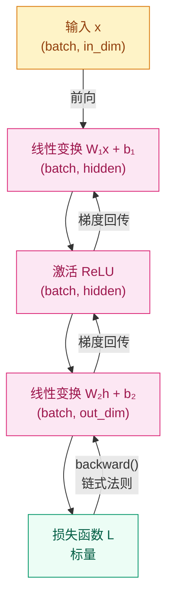

# 为什么线性模型不够用了？—— 神经网络基础

## 这个问题从哪来

> 2012 年，Krizhevsky 等人用深度神经网络在 ImageNet 上把 Top-5 错误率从 26% 压到 15%——靠的不是更好的特征，而是让模型自己学特征。
> 这一刻标志着手工特征工程时代的终结，也提出了一个新问题：这种"自动学特征"的东西，到底是怎么工作的？

## 学习目标

完成本章后，你应能回答：

1. 为什么"多层 + 非线性"能表达比线性模型更复杂的关系？
2. 反向传播到底在计算什么，它和训练循环是什么关系？
3. 当训练不稳定、loss 不下降时，优先该查哪些环节？

---

## 1. 直觉

想象你在辨别一张照片里有没有猫。

你不会先算"像素 17 的亮度减去像素 342 的亮度"，然后用一条直线判断。你会先识别出边缘，再识别出圆形轮廓，再识别出耳朵和胡须。这是**分层提取特征**的直觉。

线性模型的问题在于，它只能画一条直线（或超平面）来分割空间。两个类别如果不能用直线分开——比如异或问题——线性模型就无能为力。

神经网络解决了这个问题：每一层先做线性变换，再用激活函数扭一下空间，多层叠加后，原本线性不可分的问题就变得可分了。

> 你要记住：神经网络的力量来自"逐层重写表示"，而不只是"参数更多"。

---

## 2. 机制

### 2.1 一个神经元

$$
a = \phi(w^\top x + b)
$$

缺了 $\phi$（激活函数），多层叠加等于一层线性变换，表达能力不会真正提升。

### 2.2 前向传播计算流



### 2.3 反向传播

反向传播不是黑科技，而是链式法则在计算图上的系统应用：

$$
\frac{\partial L}{\partial W^{(1)}} =
\frac{\partial L}{\partial z^{(2)}}
\cdot \frac{\partial z^{(2)}}{\partial h^{(1)}}
\cdot \frac{\partial h^{(1)}}{\partial z^{(1)}}
\cdot \frac{\partial z^{(1)}}{\partial W^{(1)}}
$$

直觉：先看最终误差有多大，再把这份误差一层层分配回每个参数，问"是谁导致了这次错误"。

> 你要记住：`zero_grad → backward → step` 是训练循环的骨架，顺序不能颠倒。

→ 详细推导与代码验证见 [反向传播与优化器](../backpropagation/README.md)

### 2.4 渐进式实现

**Step 1 · 最小实现（核心逻辑，可独立运行）**

```python
# 验证前向传播和一步反向传播
# MLP: in_dim → hidden → 1
# 无任何工程包装，只看数据流
import torch
import torch.nn as nn

torch.manual_seed(42)

x = torch.randn(32, 16)       # (batch, in_dim)
y = torch.randint(0, 2, (32,)).float()

net = nn.Sequential(nn.Linear(16, 32), nn.ReLU(), nn.Linear(32, 1))
loss_fn = nn.BCEWithLogitsLoss()

logits = net(x).squeeze(-1)
loss = loss_fn(logits, y)
loss.backward()

print(f"loss: {loss.item():.4f}")
```

**Step 2 · 边界处理（shape 安全）**

```python
# 加入 shape 断言，防止常见的广播 bug
# squeeze(-1) 在 batch=1 时行为需要确认
# 验证 MLP 前向与反向传播的 shape 安全
import torch
import torch.nn as nn

torch.manual_seed(42)

BATCH, IN_DIM, HIDDEN = 32, 16, 64


class MLP(nn.Module):
    def __init__(self, in_dim: int, hidden: int):
        super().__init__()
        self.net = nn.Sequential(
            nn.Linear(in_dim, hidden),
            nn.ReLU(),
            nn.Linear(hidden, 1),
        )

    def forward(self, x: torch.Tensor) -> torch.Tensor:
        # x: (batch, in_dim) → (batch,)
        assert x.ndim == 2, f"期望 2D 输入，得到 {x.shape}"
        return self.net(x).squeeze(-1)


x = torch.randn(BATCH, IN_DIM)
y = torch.randint(0, 2, (BATCH,)).float()

model = MLP(IN_DIM, HIDDEN)
logits = model(x)
assert logits.shape == (BATCH,), f"输出 shape 错误: {logits.shape}"

loss = nn.BCEWithLogitsLoss()(logits, y)
loss.backward()
print(f"loss: {loss.item():.4f}")
```

**Step 3 · 工程完善（BatchNorm + Dropout + 权重初始化）**

> 下方代码使用了 `nn.Dropout()`，详细原理和变体见 [正则化与 Dropout](../regularization/README.md)。

```python
# BatchNorm 稳定训练；Dropout 防过拟合；He 初始化匹配 ReLU
# 工程完善：加入权重初始化与正则化
# 验证训练一步的完整流程
import torch
import torch.nn as nn

torch.manual_seed(42)

BATCH, IN_DIM, HIDDEN = 32, 16, 64


class MLP(nn.Module):
    """MLP · 00-Prerequisites/deep-learning-basics · 两层分类器 · 依赖: torch"""

    def __init__(self, in_dim: int, hidden: int, dropout: float = 0.2):
        super().__init__()
        self.net = nn.Sequential(
            nn.Linear(in_dim, hidden),
            nn.BatchNorm1d(hidden),
            nn.ReLU(),
            nn.Dropout(dropout),
            nn.Linear(hidden, 1),
        )
        self._init_weights()

    def _init_weights(self):
        for m in self.modules():
            if isinstance(m, nn.Linear):
                nn.init.kaiming_normal_(m.weight, nonlinearity="relu")
                nn.init.zeros_(m.bias)

    def forward(self, x: torch.Tensor) -> torch.Tensor:
        """
        Args:
            x: (batch, in_dim)
        Returns:
            logits: (batch,)
        """
        return self.net(x).squeeze(-1)


model = MLP(IN_DIM, HIDDEN)
optimizer = torch.optim.AdamW(model.parameters(), lr=1e-3, weight_decay=1e-2)
loss_fn = nn.BCEWithLogitsLoss()

x = torch.randn(BATCH, IN_DIM)
y = torch.randint(0, 2, (BATCH,)).float()

model.train()
logits = model(x)
loss = loss_fn(logits, y)

optimizer.zero_grad()
loss.backward()
optimizer.step()

print(f"loss: {loss.item():.4f}")
```

**Step 4 · 生产级（梯度裁剪 + 完整训练循环 + 验证）**

```python
# 梯度裁剪防止爆炸；train/eval 模式切换影响 BatchNorm 和 Dropout
# 完整的 epoch 循环包含验证集评估
# Dropout 原理与变体详见 → 00-Prerequisites/regularization
import torch
import torch.nn as nn
from torch.utils.data import DataLoader, TensorDataset

torch.manual_seed(42)

BATCH, IN_DIM, HIDDEN = 32, 16, 64
MAX_GRAD_NORM = 1.0
NUM_EPOCHS = 5


class MLP(nn.Module):
    """MLP · 00-Prerequisites/deep-learning-basics · 两层分类器 · 依赖: torch"""

    def __init__(self, in_dim: int, hidden: int, dropout: float = 0.2):
        super().__init__()
        self.net = nn.Sequential(
            nn.Linear(in_dim, hidden),
            nn.BatchNorm1d(hidden),
            nn.ReLU(),
            nn.Dropout(dropout),
            nn.Linear(hidden, 1),
        )
        for m in self.modules():
            if isinstance(m, nn.Linear):
                nn.init.kaiming_normal_(m.weight, nonlinearity="relu")
                nn.init.zeros_(m.bias)

    def forward(self, x: torch.Tensor) -> torch.Tensor:
        """
        Args:
            x: (batch, in_dim)
        Returns:
            logits: (batch,)
        """
        return self.net(x).squeeze(-1)


# 构造数据
x_all = torch.randn(200, IN_DIM)
y_all = torch.randint(0, 2, (200,)).float()
train_loader = DataLoader(TensorDataset(x_all[:160], y_all[:160]), batch_size=BATCH, shuffle=True)
val_loader   = DataLoader(TensorDataset(x_all[160:], y_all[160:]), batch_size=BATCH)

model = MLP(IN_DIM, HIDDEN)
optimizer = torch.optim.AdamW(model.parameters(), lr=1e-3, weight_decay=1e-2)
loss_fn = nn.BCEWithLogitsLoss()

for epoch in range(NUM_EPOCHS):
    # --- 训练 ---
    model.train()
    for x_batch, y_batch in train_loader:
        logits = model(x_batch)
        loss = loss_fn(logits, y_batch)
        optimizer.zero_grad()
        loss.backward()
        nn.utils.clip_grad_norm_(model.parameters(), MAX_GRAD_NORM)
        optimizer.step()

    # --- 验证 ---
    model.eval()
    val_loss = 0.0
    with torch.no_grad():
        for x_batch, y_batch in val_loader:
            val_loss += loss_fn(model(x_batch), y_batch).item()

    print(f"epoch {epoch+1}/{NUM_EPOCHS}  val_loss: {val_loss / len(val_loader):.4f}")
```

### 2.5 激活函数速查

| 函数 | 常见用途 | 梯度风险 |
|------|---------|---------|
| ReLU | 隐藏层默认首选 | 负半轴神经元死亡 |
| Leaky ReLU | ReLU 的替代 | 极小 |
| Sigmoid | 二分类输出层 | 饱和区梯度趋零 |
| Softmax | 多分类输出层 | 需注意数值稳定性 |

---

## 3. 工程陷阱

优先级从高到低：

1. **学习率设错** → loss 不降（过小）或 loss 爆炸（过大）
   处置：先试 `1e-3`，观察前 10 个 batch 的 loss 走势

2. **忘记 `zero_grad()`** → 梯度累积，等效学习率越来越大
   处置：每次 `backward()` 前必须调用

3. **train/eval 模式未切换** → Dropout 在推理时仍生效，BatchNorm 使用 batch 统计而非运行统计
   处置：推理前调用 `model.eval()`，训练时调用 `model.train()`

4. **初始化不当** → 深层网络激活全零或全饱和，梯度传不动
   处置：ReLU 用 He 初始化（`kaiming_normal_`），Tanh 用 Xavier（`xavier_uniform_`）

5. **输入未归一化** → 特征尺度差异导致梯度不平衡，训练极不稳定
   处置：`(x - mean) / std` 先做好再喂给模型

> 你要记住：训练崩掉时，先查学习率和输入尺度，再查网络结构。80% 的问题在这两处。

---

## 演进笔记

> **这一技术的遗产**：MLP 证明了"让模型自己学特征"是可行的，但它对数据结构没有任何假设——图像的每个像素地位平等，序列的前后顺序被忽略。这两个缺陷各自催生了下一代架构。
>
> 图像需要平移不变性和局部感受野 → CNN（Phase 01）
> 序列需要捕捉长程依赖 → RNN → Attention → Transformer（Phase 02）

> 激活函数为什么选 ReLU 而不是 Sigmoid？Dying ReLU 是什么？→ 详见 [激活函数家族](../activation-functions/README.md)

→ 下一章：[线性代数基础 — 为什么深度学习离不开矩阵乘法？](../linear-algebra/README.md)

---

**上一章**：[概率与信息论基础](../probability-information-theory/README.md) | **下一章**：[线性代数基础](../linear-algebra/README.md)
