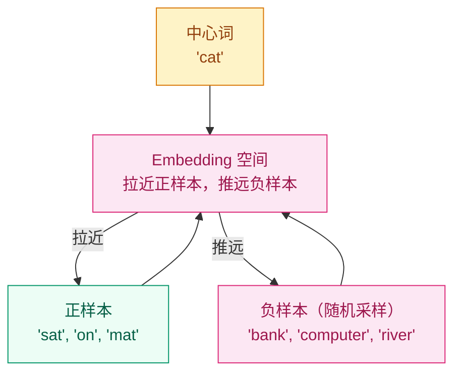

# 为什么"苹果"和"橘子"在向量空间里是邻居？—— Embedding 向量

## 这个问题从哪来

> 神经网络处理的是数字，不是符号。"苹果"这个词对模型来说只是一个字符串，无法做加减乘除。Embedding 就是给每个离散符号（词、子词、物品 ID）分配一个连续向量，让语义相近的符号在向量空间中也相近。
> 2013 年，Mikolov 等人发表 Word2Vec，展示了 embedding 空间中一个惊人的性质：`vec("国王") - vec("男人") + vec("女人") ≈ vec("女王")`。这证明 embedding 不只是编码了"谁和谁一起出现"，还编码了语义关系。

## 学习目标

完成本章后，你应能回答：

1. one-hot 向量到 embedding 的映射过程是怎样的？
2. Word2Vec 的 Skip-gram 模型是怎么训练的？
3. 静态 embedding（Word2Vec）和上下文 embedding（BERT）有什么本质区别？

---

## 1. 直觉

Embedding 是给每个 token 发一张"语义身份证"。

一张身份证上有多个字段（embedding 维度），每个字段描述一个语义特征。比如某个维度可能编码"是否是食物"，另一个维度编码"是否有生命"，再一个编码"颜色是红色还是绿色"。这些字段不是人工设计的，而是模型从数据中自动学到的。

one-hot 编码的问题：假设词表有 50,000 个词，每个词是一个 50,000 维的向量，只有一个位置是 1，其余全是 0。两个词之间没有任何相似性信息——"苹果"和"橘子"的距离等于"苹果"和"汽车"的距离。

Embedding 把 50,000 维的稀疏 one-hot 压缩成 300 维的稠密向量，同时保留了语义结构。

> 你要记住：Embedding 的核心是把离散符号映射到连续空间，让"语义相似"变成"向量距离近"。

---

## 2. 机制

### 2.1 One-hot → Embedding Lookup

词表大小 $V$，embedding 维度 $d$。Embedding 矩阵 $E \in \mathbb{R}^{V \times d}$。

$$
\text{embed}(i) = E[i, :] \in \mathbb{R}^d
$$

本质上就是从矩阵 $E$ 中取出第 $i$ 行。one-hot 向量 $e_i \in \mathbb{R}^V$ 乘以 $E$ 等价于 lookup：

$$
e_i^\top E = E[i, :]
$$

PyTorch 中 `nn.Embedding(V, d)` 就是这个矩阵，但不会显式做 one-hot 乘法——直接用整数索引 lookup，效率高得多。

### 2.2 Word2Vec：Skip-gram

**核心思想**：用一个词预测它的上下文。出现在相似上下文中的词，embedding 应该相近。

给定中心词 $w_t$，最大化它周围窗口内上下文词的概率：

$$
\max \sum_{t=1}^{T} \sum_{-c \leq j \leq c, j \neq 0} \log P(w_{t+j} | w_t)
$$

其中概率用 softmax 定义：

$$
P(w_O | w_I) = \frac{\exp(v_{w_O}^\top v_{w_I})}{\sum_{w=1}^{V} \exp(v_w^\top v_{w_I})}
$$

$v_{w_I}$ 是中心词 embedding，$v_{w_O}$ 是上下文词 embedding。

**问题**：分母要遍历整个词表 $V$（可能几十万），计算量太大。

**解决方案 — 负采样（Negative Sampling）**：

不做完整的 softmax，而是把多分类变成多个二分类。对每个正样本（真实的上下文词），随机采样 $K$ 个负样本（非上下文词）：

$$
L = -\log \sigma(v_{w_O}^\top v_{w_I}) - \sum_{k=1}^{K} \mathbb{E}_{w_k \sim P_n(w)}[\log \sigma(-v_{w_k}^\top v_{w_I})]
$$

$\sigma$ 是 sigmoid 函数，$P_n(w)$ 是噪声分布（通常用词频的 3/4 次方）。$K$ 通常取 5-20。



### 2.3 GloVe：全局共现矩阵

Word2Vec 用局部上下文窗口，GloVe（Pennington et al., 2014）利用全局词-词共现统计：

$$
L = \sum_{i,j=1}^{V} f(X_{ij}) (w_i^\top \tilde{w}_j + b_i + \tilde{b}_j - \log X_{ij})^2
$$

$X_{ij}$ 是词 $i$ 和词 $j$ 在语料中共同出现的次数，$f$ 是加权函数（低频共现降权）。

直觉：如果两个词经常一起出现，它们的 embedding 应该接近。

### 2.4 静态 vs 上下文 Embedding

| 维度 | Word2Vec / GloVe | ELMo / BERT |
|------|-----------------|-------------|
| 类型 | 静态（每个词一个固定向量） | 上下文（同一词在不同语境有不同向量） |
| "bank" 的含义 | 河岸和银行共用一个向量 | 根据上下文区分"河岸"和"银行" |
| 训练方式 | 自监督（预测上下文/共现） | 自监督（MLM/NSG）+ Transformer |
| 输出 | 查表（lookup） | 经过编码器后的隐状态 |
| 分水岭 | 2013-2017 | 2018 起 |

> 你要记住：静态 embedding 的根本局限是**一词一义**——无法区分多义词。上下文 embedding 通过"让模型看完整句话再决定词义"解决了这个问题。

### 2.5 `nn.Embedding` 的本质

```python
import torch.nn as nn

# nn.Embedding 就是一个可学习的查找表
embed = nn.Embedding(num_embeddings=10000, embedding_dim=300)
# 内部是一个 (10000, 300) 的矩阵
print(f"权重 shape: {embed.weight.shape}")

# 用整数索引查找
indices = torch.tensor([42, 100, 9999])
vectors = embed(indices)  # (3, 300)
```

与 `nn.Linear` 的区别：`nn.Linear` 做矩阵乘法 $xW^\top + b$，`nn.Embedding` 做索引查找 $E[i]$。当输入是 one-hot 时两者等价，但 lookup 不需要显式构造 one-hot 向量。

---

## 3. 渐进式实现

**Step 1 · 手写简化版 Skip-gram**

```python
# 手写简化版 Skip-gram 负采样
# 使用中心词与上下文词 embedding 矩阵
# 验证负采样 loss 的计算流程
import torch
import torch.nn as nn

torch.manual_seed(42)

VOCAB = 100
EMBED_DIM = 16
NEG_SAMPLES = 5

# 中心词和上下文词的 embedding 矩阵
center_emb = nn.Embedding(VOCAB, EMBED_DIM)
context_emb = nn.Embedding(VOCAB, EMBED_DIM)

center_idx = torch.tensor([42])      # 中心词
pos_idx = torch.tensor([38, 45])     # 正样本（真实上下文）
neg_idx = torch.randint(0, VOCAB, (NEG_SAMPLES,))  # 负样本

# 前向计算
center = center_emb(center_idx)      # (1, EMBED_DIM)
pos = context_emb(pos_idx)            # (2, EMBED_DIM)
neg = context_emb(neg_idx)            # (NEG_SAMPLES, EMBED_DIM)

# 正样本：sigmoid(dot product) 最大化 → loss 最小化
pos_score = torch.sigmoid(torch.matmul(pos, center.squeeze().T))
pos_loss = -torch.log(pos_score + 1e-8).mean()

# 负样本：sigmoid(-dot product) 最大化 → loss 最小化
neg_score = torch.sigmoid(-torch.matmul(neg, center.squeeze().T))
neg_loss = -torch.log(neg_score + 1e-8).mean()

loss = pos_loss + neg_loss
print(f"Skip-gram 负采样 loss: {loss.item():.4f}")
```

**Step 2 · PyTorch `nn.Embedding` 基本用法**

```python
# 演示 PyTorch nn.Embedding 的基本用法
# 单个词与 batch 句子的 lookup 操作
# 验证输出 shape
import torch
import torch.nn as nn

torch.manual_seed(42)

VOCAB, EMBED_DIM = 1000, 64
embed = nn.Embedding(VOCAB, EMBED_DIM)

# 单个词
idx = torch.tensor([42])
vec = embed(idx)
print(f"单个词向量 shape: {vec.shape}")  # (1, 64)

# 一个 batch 的句子（变长已 pad）
sentences = torch.tensor([
    [1, 42, 7, 0, 0],   # 3 个词 + 2 pad
    [3, 15, 8, 99, 7],  # 5 个词
])
embedded = embed(sentences)
print(f"Batch embedding shape: {embedded.shape}")  # (2, 5, 64)
```

**Step 3 · Embedding 相似度可视化**

```python
# 计算并可视化 embedding 相似度
# 使用余弦相似度找最近邻
# 验证语义空间中的邻居关系
import torch
import torch.nn.functional as F

torch.manual_seed(42)

VOCAB, DIM = 50, 32
embed = nn.Embedding(VOCAB, DIM)

# 假设词表: 0=猫, 1=狗, 2=汽车, 3=苹果, 4=橘子
# 训练后语义相近的词 embedding 会接近
vecs = embed.weight  # (VOCAB, DIM)
vecs_norm = F.normalize(vecs, dim=1)
sim = torch.mm(vecs_norm, vecs_norm.T)

# 找每个词最相似的 3 个词
for word_id in range(5):
    topk = sim[word_id].topk(4)  # 包含自己
    neighbors = topk.indices[1:4].tolist()  # 排除自己
    scores = topk.values[1:4].tolist()
    print(f"词 {word_id} 的近邻: {neighbors} (相似度: {[f'{s:.3f}' for s in scores]})")
```

**Step 4 · Embedding + 线性层组成完整模型**

```python
# 用 Embedding + 线性层搭建文本分类器
# 平均池化后映射到类别 logits
# 验证端到端前向 shape
import torch
import torch.nn as nn

torch.manual_seed(42)

VOCAB, EMBED_DIM, HIDDEN, NUM_CLASSES = 5000, 64, 32, 2

class TextClassifier(nn.Module):
    def __init__(self):
        super().__init__()
        self.embedding = nn.Embedding(VOCAB, EMBED_DIM)
        self.fc = nn.Linear(EMBED_DIM, NUM_CLASSES)

    def forward(self, x):
        # x: (batch, seq_len) 整数 token IDs
        emb = self.embedding(x)       # (batch, seq_len, embed_dim)
        pooled = emb.mean(dim=1)      # (batch, embed_dim) 平均池化
        logits = self.fc(pooled)      # (batch, num_classes)
        return logits

model = TextClassifier()
x = torch.randint(0, VOCAB, (4, 20))  # 4 条句子，每条 20 tokens
logits = model(x)
print(f"输入: {x.shape} → 输出: {logits.shape}")  # (4, 2)
```

---

## 4. 工程陷阱（按严重度排序）

1. **Embedding 维度选择不当**
   现象：维度太小（如 8）→ 语义信息不够；太大（如 2048）→ 参数爆炸、过拟合。
   处置：小词表用 64-128，中等词表用 256-512，大词表（BERT 级别）用 768-1024。

2. **OOV（词表外）词处理**
   现象：推理时遇到训练词表中没有的词，查不到 embedding。
   处置：用子词分词（BPE/WordPiece）大幅减少 OOV；实在无法避免时用 `<unk>` token 的 embedding 或随机初始化。

3. **Embedding 层的梯度稀疏**
   现象：每个 batch 只有少量词被用到，大部分 embedding 行不会收到梯度更新。
   处置：这是正常行为，PyTorch 的 `nn.Embedding` 默认 sparse 梯度。如果用 `Adagrad/Adam` 可以设 `sparse=True` 节省内存。

4. **padding token 的 embedding 参与计算**
   现象：平均池化时 pad 位置的 embedding（通常是零向量）拉低了均值。
   处置：用 `attention_mask` 排除 pad 位置，只对有效 token 做平均。

> 你要记住：Embedding 是 NLP 模型的第一步——词表质量和 embedding 维度直接决定模型上限。

---

## 演进笔记

> **静态→上下文的转折**：Word2Vec/GloVe 的 embedding 在 2013-2017 年间是 NLP 的基石，但"一词一义"的局限催生了 ELMo（2018，用 LSTM 生成上下文 embedding）和 BERT（2018，用 Transformer 生成上下文 embedding）。
>
> 大模型时代，embedding 层仍然是入口，但语义理解的任务交给了后面的 Transformer 层。Embedding 本身变得更简单（可学习的 lookup table），复杂度转移到了上下文编码器。
>
> **留下的新问题**：Embedding 需要先把文本变成整数 ID——这个"分词"过程本身就是一门学问。

→ 下一章：[分词器 — 模型怎么"读"文字？](../tokenization/README.md)

---

**上一章**：[正则化与 Dropout](../regularization/README.md) | **下一章**：[分词器](../tokenization/README.md)
