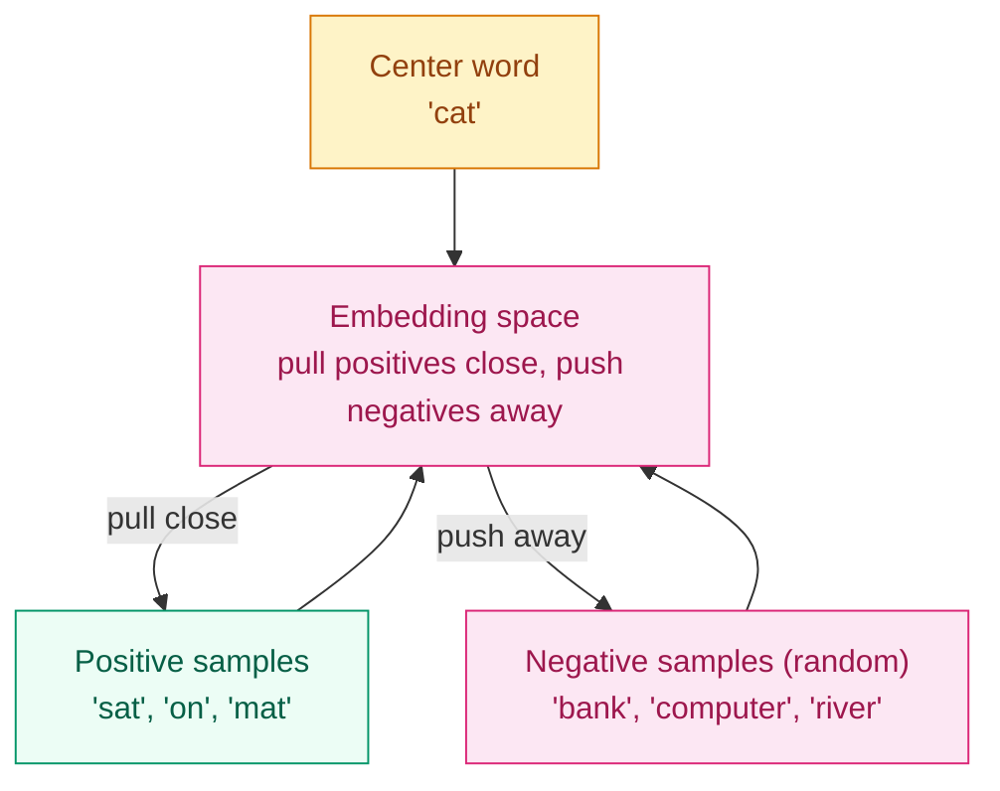

[English](README_EN.md) | [中文](README.md)

# Why Are "Apple" and "Orange" Neighbors in Vector Space? — Embeddings

## Where This Problem Comes From

> Neural networks process numbers, not symbols. To a model, the word "apple" is just a string — it cannot be added, subtracted, or multiplied. Embedding assigns a continuous vector to every discrete symbol (word, subword, item ID), so that semantically similar symbols end up close in vector space.
> In 2013, Mikolov et al. published Word2Vec and demonstrated a surprising property of the embedding space: `vec("king") - vec("man") + vec("woman") ≈ vec("queen")`. This proved that embeddings encode not just co-occurrence, but semantic relationships.

## Learning Objectives

After completing this chapter, you should be able to answer:

1. What is the mapping process from one-hot vectors to embeddings?
2. How is the Word2Vec Skip-gram model trained?
3. What is the fundamental difference between static embeddings (Word2Vec) and contextual embeddings (BERT)?

---

## 1. Intuition

Embedding is handing every token a "semantic ID card."

An ID card has multiple fields (embedding dimensions), each describing a semantic feature. One dimension might encode "is it food?", another "is it alive?", another "is it red or green?". These fields are not hand-designed — the model learns them automatically from data.

The problem with one-hot encoding: suppose the vocabulary has 50,000 words. Each word is a 50,000-dimensional vector with a single 1 and the rest 0s. There is no similarity information between any two words — the distance between "apple" and "orange" equals the distance between "apple" and "car".

Embedding compresses the 50,000-dimensional sparse one-hot vector into a 300-dimensional dense vector while preserving semantic structure.

> Key takeaway: the core of embedding is mapping discrete symbols into continuous space so that "semantic similarity" becomes "closeness in vector distance."

---

## 2. Mechanics

### 2.1 One-hot → Embedding Lookup

Vocabulary size $V$, embedding dimension $d$. Embedding matrix $E \in \mathbb{R}^{V \times d}$.

$$
\text{embed}(i) = E[i, :] \in \mathbb{R}^d
$$

This is essentially looking up the $i$-th row of matrix $E$. Multiplying the one-hot vector $e_i \in \mathbb{R}^V$ by $E$ is equivalent to a lookup:

$$
e_i^\top E = E[i, :]
$$

In PyTorch, `nn.Embedding(V, d)` is exactly this matrix, but it does not explicitly perform one-hot multiplication — it uses integer indices for lookup, which is far more efficient.

### 2.2 Word2Vec: Skip-gram

**Core idea**: predict the context of a word using the word itself. Words that appear in similar contexts should have similar embeddings.

Given a center word $w_t$, maximize the probability of context words within a surrounding window:

$$
\max \sum_{t=1}^{T} \sum_{-c \leq j \leq c, j \neq 0} \log P(w_{t+j} | w_t)
$$

where the probability is defined with softmax:

$$
P(w_O | w_I) = \frac{\exp(v_{w_O}^\top v_{w_I})}{\sum_{w=1}^{V} \exp(v_w^\top v_{w_I})}
$$

$v_{w_I}$ is the center-word embedding, $v_{w_O}$ is the context-word embedding.

**Problem**: the denominator must iterate over the entire vocabulary $V$ (possibly hundreds of thousands), which is computationally prohibitive.

**Solution — Negative Sampling**:

Instead of full softmax, turn multi-class classification into multiple binary classifications. For each positive sample (real context word), randomly sample $K$ negative samples (non-context words):

$$
L = -\log \sigma(v_{w_O}^\top v_{w_I}) - \sum_{k=1}^{K} \mathbb{E}_{w_k \sim P_n(w)}[\log \sigma(-v_{w_k}^\top v_{w_I})]
$$

$\sigma$ is the sigmoid function, $P_n(w)$ is the noise distribution (usually word frequency raised to the 3/4 power). $K$ is typically 5–20.



### 2.3 GloVe: Global Co-occurrence Matrix

Word2Vec uses local context windows; GloVe (Pennington et al., 2014) leverages global word-word co-occurrence statistics:

$$
L = \sum_{i,j=1}^{V} f(X_{ij}) (w_i^\top \tilde{w}_j + b_i + \tilde{b}_j - \log X_{ij})^2
$$

$X_{ij}$ is the number of times word $i$ and word $j$ co-occur in the corpus, and $f$ is a weighting function (down-weighting rare co-occurrences).

Intuition: if two words frequently appear together, their embeddings should be close.

### 2.4 Static vs Contextual Embeddings

| Dimension | Word2Vec / GloVe | ELMo / BERT |
|-----------|-----------------|-------------|
| Type | Static (one fixed vector per word) | Contextual (same word has different vectors in different contexts) |
| Meaning of "bank" | River bank and financial bank share one vector | Context distinguishes "river bank" from "financial bank" |
| Training | Self-supervised (predict context / co-occurrence) | Self-supervised (MLM/NSP) + Transformer |
| Output | Lookup table | Hidden states from the encoder |
| Watershed | 2013–2017 | 2018 onward |

> Key takeaway: the fundamental limitation of static embeddings is **one word, one meaning** — they cannot distinguish polysemous words. Contextual embeddings solve this by "letting the model read the whole sentence before deciding meaning."

### 2.5 The Essence of `nn.Embedding`

```python
import torch.nn as nn

# nn.Embedding is a learnable lookup table
embed = nn.Embedding(num_embeddings=10000, embedding_dim=300)
# internally a (10000, 300) matrix
print(f"Weight shape: {embed.weight.shape}")

# lookup by integer indices
indices = torch.tensor([42, 100, 9999])
vectors = embed(indices)  # (3, 300)
```

Difference from `nn.Linear`: `nn.Linear` performs matrix multiplication $xW^\top + b$, while `nn.Embedding` performs index lookup $E[i]$. When the input is one-hot the two are equivalent, but lookup avoids explicitly constructing the one-hot vector.

---

## 3. Progressive Implementation

**Step 1 · Hand-written simplified Skip-gram**

```python
import torch
import torch.nn as nn

torch.manual_seed(42)

VOCAB = 100
EMBED_DIM = 16
NEG_SAMPLES = 5

# center-word and context-word embedding matrices
center_emb = nn.Embedding(VOCAB, EMBED_DIM)
context_emb = nn.Embedding(VOCAB, EMBED_DIM)

center_idx = torch.tensor([42])      # center word
pos_idx = torch.tensor([38, 45])     # positive samples (real context)
neg_idx = torch.randint(0, VOCAB, (NEG_SAMPLES,))  # negative samples

# forward
center = center_emb(center_idx)      # (1, EMBED_DIM)
pos = context_emb(pos_idx)            # (2, EMBED_DIM)
neg = context_emb(neg_idx)            # (NEG_SAMPLES, EMBED_DIM)

# positive: maximize sigmoid(dot) → minimize loss
pos_score = torch.sigmoid(torch.matmul(pos, center.squeeze().T))
pos_loss = -torch.log(pos_score + 1e-8).mean()

# negative: maximize sigmoid(-dot) → minimize loss
neg_score = torch.sigmoid(-torch.matmul(neg, center.squeeze().T))
neg_loss = -torch.log(neg_score + 1e-8).mean()

loss = pos_loss + neg_loss
print(f"Skip-gram negative-sampling loss: {loss.item():.4f}")
```

**Step 2 · Basic usage of PyTorch `nn.Embedding`**

```python
import torch
import torch.nn as nn

torch.manual_seed(42)

VOCAB, EMBED_DIM = 1000, 64
embed = nn.Embedding(VOCAB, EMBED_DIM)

# single word
idx = torch.tensor([42])
vec = embed(idx)
print(f"Single word vector shape: {vec.shape}")  # (1, 64)

# a batch of sentences (already padded to same length)
sentences = torch.tensor([
    [1, 42, 7, 0, 0],   # 3 words + 2 pads
    [3, 15, 8, 99, 7],  # 5 words
])
embedded = embed(sentences)
print(f"Batch embedding shape: {embedded.shape}")  # (2, 5, 64)
```

**Step 3 · Embedding similarity visualization**

```python
import torch
import torch.nn.functional as F

torch.manual_seed(42)

VOCAB, DIM = 50, 32
embed = nn.Embedding(VOCAB, DIM)

# assume vocab: 0=cat, 1=dog, 2=car, 3=apple, 4=orange
# after training, semantically similar words will be close
vecs = embed.weight  # (VOCAB, DIM)
vecs_norm = F.normalize(vecs, dim=1)
sim = torch.mm(vecs_norm, vecs_norm.T)

# find top-3 most similar words for each word
for word_id in range(5):
    topk = sim[word_id].topk(4)  # includes self
    neighbors = topk.indices[1:4].tolist()  # exclude self
    scores = topk.values[1:4].tolist()
    print(f"Word {word_id} neighbors: {neighbors} (similarity: {[f'{s:.3f}' for s in scores]})")
```

**Step 4 · Embedding + linear layer forming a complete model**

```python
import torch
import torch.nn as nn

torch.manual_seed(42)

VOCAB, EMBED_DIM, HIDDEN, NUM_CLASSES = 5000, 64, 32, 2

class TextClassifier(nn.Module):
    def __init__(self):
        super().__init__()
        self.embedding = nn.Embedding(VOCAB, EMBED_DIM)
        self.fc = nn.Linear(EMBED_DIM, NUM_CLASSES)

    def forward(self, x):
        # x: (batch, seq_len) integer token IDs
        emb = self.embedding(x)       # (batch, seq_len, embed_dim)
        pooled = emb.mean(dim=1)      # (batch, embed_dim) mean pooling
        logits = self.fc(pooled)      # (batch, num_classes)
        return logits

model = TextClassifier()
x = torch.randint(0, VOCAB, (4, 20))  # 4 sentences, 20 tokens each
logits = model(x)
print(f"Input: {x.shape} → Output: {logits.shape}")  # (4, 2)
```

---

## 4. Engineering Pitfalls (Sorted by Severity)

1. **Poor embedding dimension choice**
   Symptom: too small (e.g. 8) → insufficient semantic information; too large (e.g. 2048) → parameter explosion and overfitting.
   Fix: 64–128 for small vocabularies, 256–512 for medium vocabularies, 768–1024 for BERT-scale vocabularies.

2. **OOV (out-of-vocabulary) words**
   Symptom: at inference, words absent from the training vocabulary have no embedding to look up.
   Fix: use subword tokenization (BPE/WordPiece) to drastically reduce OOV; fall back to `<unk>` token embedding or random initialization only when unavoidable.

3. **Sparse gradients in the embedding layer**
   Symptom: only a few words are used in each batch, so most rows of the embedding matrix receive no gradient update.
   Fix: this is normal behavior. PyTorch `nn.Embedding` supports sparse gradients by default. You can set `sparse=True` with `Adagrad/Adam` to save memory.

4. **Padding token embeddings participating in computation**
   Symptom: during mean pooling, pad positions (usually zero vectors) drag down the average.
   Fix: use `attention_mask` to exclude pad positions, averaging only over valid tokens.

> Key takeaway: embedding is the first step of any NLP model — vocabulary quality and embedding dimension directly determine the model’s ceiling.

---

## Evolution Notes

> **Static → Contextual turning point**: Word2Vec/GloVe embeddings were the cornerstone of NLP from 2013–2017, but the "one word, one meaning" limitation spawned ELMo (2018, LSTM-based contextual embeddings) and BERT (2018, Transformer-based contextual embeddings).
>
> In the large-model era, the embedding layer is still the entrance, but semantic understanding is handed off to the subsequent Transformer layers. The embedding itself has become simpler (a learnable lookup table), while complexity has shifted to the context encoder.
>
> **New question left behind**: embeddings require text to be turned into integer IDs first — and that tokenization process is a field of study in itself.

→ Next chapter: [Tokenization — How Do Models "Read" Text?](../tokenization/README_EN.md)

---

**Previous**: [Regularization & Dropout](../regularization/README_EN.md) | **Next**: [Tokenization](../tokenization/README_EN.md)
