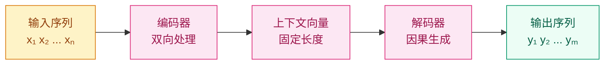

# 为什么要把"理解"和"生成"分开？—— 编码器-解码器范式

## 这个问题从哪来

> 2014 年，Sutskever 等人提出了 Seq2Seq（Sequence-to-Sequence）模型：一个 LSTM 编码器把输入序列压缩成固定长度的向量，另一个 LSTM 解码器从中展开输出序列。这个架构让机器翻译性能飞跃。
> 但它有一个致命弱点：无论输入多长，都必须压缩成同一个固定长度的向量——信息瓶颈。这直接催生了注意力机制（2015）和 Transformer（2017）。
> 今天 Transformer 有三种范式：encoder-only（BERT）、decoder-only（GPT）、encoder-decoder（T5）。理解它们的分工是理解现代 NLP 的基础。

## 学习目标

完成本章后，你应能回答：

1. 编码器和解码器各自负责什么？为什么不能只用一个？
2. 三种 Transformer 范式各适合什么任务？
3. Decoder-only 模型为什么在生成任务上成为主流？

---

## 1. 直觉

翻译不是边听边说——先听完理解意思，再组织语言表达。

**编码器**是"听和理解"：读完整句话，理解每个词的含义和词间关系，输出一组"理解向量"。

**解码器**是"组织和表达"：根据理解向量，逐词生成目标序列，每一步都参考之前已经生成的内容。

为什么不能只用一个？因为理解和生成的最优策略不同：
- 理解需要**双向上下文**（"bank" 旁边的词决定它是银行还是河岸）
- 生成需要**因果性**（不能偷看后面的词，否则就是在抄答案）

> 你要记住：编码器的核心能力是"双向理解"，解码器的核心能力是"因果生成"。两者的注意力 mask 不同。

---

## 2. 机制

### 2.1 Seq2Seq 范式



原始 Seq2Seq 的问题：上下文向量是固定长度的，输入越长信息损失越大。注意力机制解决了这个问题——解码时动态查询输入序列中相关的部分。

### 2.2 三种 Transformer 范式

**Encoder-only（BERT 风格）**

```
输入: [CLS] 猫 坐 在 垫 子 上 [SEP]
      ↓ ↓ ↓ ↓ ↓ ↓ ↓ ↓  (双向 self-attention)
输出: 每个位置的上下文表示
```

- **注意力 mask**：全连接（每个 token 可以看到所有其他 token）
- **训练目标**：Masked Language Model（随机遮住 15% 的 token，预测被遮的内容）
- **擅长**：理解任务——分类、命名实体识别、问答（抽取式）、语义相似度
- **不擅长**：生成任务（没有因果生成机制）
- **代表**：BERT, RoBERTa, DeBERTa, SimCSE

**Decoder-only（GPT 风格）**

```
输入: 猫 坐 在 垫 子 上
      ↓ ↓ ↓ ↓ ↓ ↓  (因果 self-attention)
输出: 每个位置的下一个 token 预测
```

- **注意力 mask**：下三角矩阵（每个 token 只能看到自己和之前的 token）
- **训练目标**：Next Token Prediction（预测下一个 token）
- **擅长**：生成任务——对话、写作、代码、推理
- **也能做**：理解任务（通过 prompt 设计，但效率不如 encoder-only）
- **代表**：GPT 系列, LLaMA, Mistral, Qwen, DeepSeek

**Encoder-Decoder（T5 风格）**

```
编码器输入: 猫 坐 在 垫 子 上
      ↓ (双向 self-attention)
编码器输出: 理解向量

解码器输入: <s> The cat
      ↓ (因果 self-attention + cross-attention)
解码器输出: sat on the mat
```

- **注意力 mask**：编码器双向 + 解码器因果 + 解码器到编码器的 cross-attention
- **训练目标**：Span Corruption（随机遮住连续片段，生成被遮内容）
- **擅长**：条件生成——翻译、摘要、问答（生成式）
- **代表**：T5, BART, mBART, Flan-T5

### 2.3 三范式对比

| 维度 | Encoder-only | Decoder-only | Encoder-Decoder |
|------|-------------|-------------|-----------------|
| 注意力 | 双向 | 因果（单向） | 编码器双向 + 解码器因果 |
| 训练信号 | MLM（遮住预测） | NTP（下一个 token） | Span corruption |
| 典型任务 | 分类、NER、抽取式 QA | 生成、对话、推理 | 翻译、摘要 |
| 参数效率 | 高（双向信息） | 中 | 中 |
| 生成能力 | 无 | 强 | 强 |
| 代表模型 | BERT | GPT-4, LLaMA | T5 |

> 你要记住：Decoder-only 成为主流不是因为它是理论上最优的，而是因为"简单 + 规模"赢了——统一架构、统一训练目标（next token prediction），用规模补偿架构劣势。

### 2.4 为什么 Decoder-only 赢了？

三个原因：

1. **训练效率**：NTP（next token prediction）的训练信号密度为 100%——每个 token 都贡献一个训练信号。MLM 只有 15% 的 token 被预测，信号稀疏。

2. **任务统一性**：所有任务（理解、生成、推理）都可以统一为"预测下一个 token"。不需要为不同任务设计不同的训练目标。

3. **Scaling Law**：Chinchilla 论文（2022）证明，给定计算预算，decoder-only 模型在数据量足够时性能最优。规模大到一定程度后，架构差异被规模效应淹没。

---

## 3. 渐进式实现

**Step 1 · 最简 Seq2Seq（概念验证）**

```python
import torch
import torch.nn as nn

torch.manual_seed(42)

INPUT_DIM = 20   # 输入词表大小
OUTPUT_DIM = 15  # 输出词表大小
EMB_DIM = 32
HIDDEN = 64

# 编码器：输入序列 → 最终隐状态
encoder_emb = nn.Embedding(INPUT_DIM, EMB_DIM)
encoder_rnn = nn.LSTM(EMB_DIM, HIDDEN, batch_first=True)

# 解码器：用编码器的隐状态初始化，逐 token 生成
decoder_emb = nn.Embedding(OUTPUT_DIM, EMB_DIM)
decoder_rnn = nn.LSTM(EMB_DIM, HIDDEN, batch_first=True)
decoder_fc = nn.Linear(HIDDEN, OUTPUT_DIM)

# 模拟输入
src = torch.randint(0, INPUT_DIM, (2, 5))  # (batch, src_len)
trg = torch.randint(0, OUTPUT_DIM, (2, 4)) # (batch, trg_len)

# 编码
enc_emb = encoder_emb(src)
_, (hidden, cell) = encoder_rnn(enc_emb)

# 解码（teacher forcing：用真实目标作为输入）
dec_emb = decoder_emb(trg)
dec_out, _ = decoder_rnn(dec_emb, (hidden, cell))
logits = decoder_fc(dec_out)

print(f"编码器输出隐状态 shape: {hidden.shape}")  # (1, batch, hidden)
print(f"解码器 logits shape: {logits.shape}")      # (batch, trg_len, output_dim)
```

**Step 2 · 注意力 mask 对比**

```python
import torch

SEQ_LEN = 5

# 双向 mask（encoder）：所有位置互相可见
enc_mask = torch.ones(SEQ_LEN, SEQ_LEN)
print("Encoder mask (双向):")
print(enc_mask.int())

# 因果 mask（decoder）：只能看到自己和之前的位置
causal_mask = torch.tril(torch.ones(SEQ_LEN, SEQ_LEN))
print("\nDecoder mask (因果):")
print(causal_mask.int())
# [[1, 0, 0, 0, 0],
#  [1, 1, 0, 0, 0],
#  [1, 1, 1, 0, 0],
#  [1, 1, 1, 1, 0],
#  [1, 1, 1, 1, 1]]

# 将 mask 应用到 attention scores
scores = torch.randn(SEQ_LEN, SEQ_LEN)
print("\nEncoder attention (双向):")
print((scores.masked_fill(enc_mask == 0, float('-inf'))).softmax(dim=-1).round(decimals=2))

print("\nDecoder attention (因果):")
print((scores.masked_fill(causal_mask == 0, float('-inf'))).softmax(dim=-1).round(decimals=2))
# 下三角以外的位置为 -inf → softmax 后为 0
```

**Step 3 · Encoder vs Decoder 的输出行为**

```python
import torch
import torch.nn as nn

torch.manual_seed(42)

DIM, HEADS, DEPTH = 64, 4, 2

# 简化版 Transformer block
class SimpleBlock(nn.Module):
    def __init__(self, dim, heads, causal=False):
        super().__init__()
        self.attn = nn.MultiheadAttention(dim, heads, batch_first=True)
        self.causal = causal
        self.dim = dim

    def forward(self, x):
        seq_len = x.size(1)
        mask = None
        if self.causal:
            mask = torch.triu(torch.ones(seq_len, seq_len), diagonal=1).bool()
        out, _ = self.attn(x, x, x, attn_mask=mask)
        return out

# 同样的输入，不同 mask
x = torch.randn(1, 5, DIM)

encoder_block = SimpleBlock(DIM, HEADS, causal=False)
decoder_block = SimpleBlock(DIM, HEADS, causal=True)

enc_out = encoder_block(x)
dec_out = decoder_block(x)

print(f"Encoder 输出 shape: {enc_out.shape}")  # (1, 5, 64)
print(f"Decoder 输出 shape: {dec_out.shape}")  # (1, 5, 64)

# Encoder: 位置 0 的输出依赖位置 0-4（双向）
# Decoder: 位置 0 的输出只依赖位置 0（因果）
```

---

## 4. 工程陷阱（按严重度排序）

1. **混淆 encoder 和 decoder 的 mask**
   现象：给 encoder 加了因果 mask（变成单向理解），或给 decoder 忘了加因果 mask（训练时可以偷看答案）。
   处置：encoder 用双向 mask（全 1 矩阵），decoder 用因果 mask（下三角矩阵）。

2. **Encoder-decoder 的 cross-attention 维度不匹配**
   现象：解码器的 cross-attention 中 Q 来自 decoder，K/V 来自 encoder，维度不一致时报错。
   处置：确保编码器输出维度和解码器隐层维度一致（或加投影层）。

3. **用 encoder-only 模型做生成**
   现象：BERT 的输出不是自回归的，不能逐 token 生成。
   处置：生成任务用 decoder-only 或 encoder-decoder。BERT 只做理解任务。

> 你要记住：选模型范式要看任务——理解用 encoder-only，生成用 decoder-only，条件生成用 encoder-decoder。

---

## 演进笔记

> **范式的演变**：Seq2Seq（2014）→ Attention-enhanced Seq2Seq（2015）→ Transformer encoder-decoder（2017）→ BERT encoder-only（2018）→ GPT decoder-only（2018-至今主流）。
>
> Decoder-only 的胜利不是因为它在单个任务上最强，而是因为"一个架构搞定所有任务"的统一性。Scaling Law 证明：规模够大时，decoder-only 在几乎所有任务上都能匹敌甚至超越专门的 encoder 或 encoder-decoder 架构。
>
> **留下的新问题**：编码器-解码器的核心交互机制是注意力——但它到底是怎么工作的？

→ 下一章：[注意力机制动机 — 为什么模型需要"回头看"？](../attention-primer/README.md)

---

**上一章**：[分词器](../tokenization/README.md) | **下一章**：[注意力机制动机](../attention-primer/README.md)
