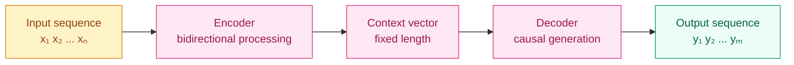

[English](README_EN.md) | [中文](README.md)

# Why Separate "Understanding" from "Generation"? — The Encoder-Decoder Paradigm

## Where This Problem Comes From

> In 2014, Sutskever et al. proposed the Seq2Seq (Sequence-to-Sequence) model: an LSTM encoder compresses the input sequence into a fixed-length vector, and an LSTM decoder expands it into an output sequence. This architecture caused a leap in machine-translation performance.
> But it had a fatal weakness: no matter how long the input, it had to be compressed into the same fixed-size vector — an information bottleneck. This directly spawned attention mechanisms (2015) and the Transformer (2017).
> Today Transformers come in three paradigms: encoder-only (BERT), decoder-only (GPT), and encoder-decoder (T5). Understanding their division of labor is foundational to modern NLP.

## Learning Objectives

After completing this chapter, you should be able to answer:

1. What do the encoder and decoder each负责? Why can't we use just one?
2. Which tasks suit each of the three Transformer paradigms?
3. Why did decoder-only models become the mainstream for generation tasks?

---

## 1. Intuition

Translation is not simultaneous listening and speaking — you first listen and understand the meaning, then organize and express it in words.

The **encoder** is "listening and understanding": it reads the whole sentence, comprehends the meaning of each word and the relationships between them, and outputs a set of "understanding vectors."

The **decoder** is "organizing and expressing": based on the understanding vectors, it generates the target sequence word by word, always referencing what it has already produced.

Why can't we use just one? Because the optimal strategies for understanding and generation are different:
- Understanding needs **bidirectional context** (the words next to "bank" determine whether it means a river bank or a financial bank)
- Generation needs **causality** (you cannot peek at future words, or you would be copying the answer)

> Key takeaway: the encoder's core ability is "bidirectional understanding," and the decoder's core ability is "causal generation." Their attention masks are different.

---

## 2. Mechanics

### 2.1 The Seq2Seq Paradigm



The original Seq2Seq problem: the context vector is fixed-length, so the longer the input, the greater the information loss. Attention solved this by allowing the decoder to dynamically query relevant parts of the input sequence during decoding.

### 2.2 The Three Transformer Paradigms

**Encoder-only (BERT-style)**

```
Input:  [CLS] cat sat on the mat [SEP]
        ↓ ↓ ↓ ↓ ↓ ↓ ↓ ↓  (bidirectional self-attention)
Output: contextual representation at each position
```

- **Attention mask**: fully connected (every token can see all other tokens)
- **Training objective**: Masked Language Model (randomly mask 15% of tokens and predict the masked content)
- **Good at**: understanding tasks — classification, NER, extractive QA, semantic similarity
- **Bad at**: generation tasks (no causal generation mechanism)
- **Representatives**: BERT, RoBERTa, DeBERTa, SimCSE

**Decoder-only (GPT-style)**

```
Input:  cat sat on the mat
        ↓ ↓ ↓ ↓ ↓ ↓  (causal self-attention)
Output: next-token prediction at each position
```

- **Attention mask**: lower-triangular matrix (each token can only see itself and previous tokens)
- **Training objective**: Next Token Prediction (predict the next token)
- **Good at**: generation tasks — dialogue, writing, code, reasoning
- **Can also do**: understanding tasks (via prompt engineering, but less efficient than encoder-only)
- **Representatives**: GPT family, LLaMA, Mistral, Qwen, DeepSeek

**Encoder-Decoder (T5-style)**

```
Encoder input: cat sat on the mat
      ↓ (bidirectional self-attention)
Encoder output: understanding vectors

Decoder input: <s> The cat
      ↓ (causal self-attention + cross-attention)
Decoder output: sat on the mat
```

- **Attention mask**: encoder bidirectional + decoder causal + decoder-to-encoder cross-attention
- **Training objective**: Span Corruption (randomly mask contiguous spans and generate the masked content)
- **Good at**: conditional generation — translation, summarization, generative QA
- **Representatives**: T5, BART, mBART, Flan-T5

### 2.3 Three-Paradigm Comparison

| Dimension | Encoder-only | Decoder-only | Encoder-Decoder |
|-----------|-------------|-------------|-----------------|
| Attention | Bidirectional | Causal (unidirectional) | Encoder bidirectional + decoder causal |
| Training signal | MLM (masked prediction) | NTP (next token) | Span corruption |
| Typical tasks | Classification, NER, extractive QA | Generation, dialogue, reasoning | Translation, summarization |
| Parameter efficiency | High (bidirectional info) | Medium | Medium |
| Generation ability | None | Strong | Strong |
| Representative models | BERT | GPT-4, LLaMA | T5 |

> Key takeaway: decoder-only models became mainstream not because they are theoretically optimal, but because "simplicity + scale" won — a unified architecture, a unified training objective (next token prediction), compensating for architectural disadvantages with scale.

### 2.4 Why Did Decoder-only Win?

Three reasons:

1. **Training efficiency**: NTP (next token prediction) has a 100% training-signal density — every token contributes a training signal. MLM only predicts 15% of tokens, making the signal sparse.

2. **Task unification**: all tasks (understanding, generation, reasoning) can be cast as "predict the next token." No need to design different training objectives for different tasks.

3. **Scaling Law**: the Chinchilla paper (2022) proved that, given a fixed compute budget, decoder-only models are optimal when data is abundant. Once scale is large enough, architectural differences are drowned out by scaling effects.

---

## 3. Progressive Implementation

**Step 1 · Minimal Seq2Seq (proof of concept)**

```python
import torch
import torch.nn as nn

torch.manual_seed(42)

INPUT_DIM = 20   # input vocabulary size
OUTPUT_DIM = 15  # output vocabulary size
EMB_DIM = 32
HIDDEN = 64

# encoder: input sequence → final hidden state
encoder_emb = nn.Embedding(INPUT_DIM, EMB_DIM)
encoder_rnn = nn.LSTM(EMB_DIM, HIDDEN, batch_first=True)

# decoder: initialized with encoder hidden state, generates token by token
decoder_emb = nn.Embedding(OUTPUT_DIM, EMB_DIM)
decoder_rnn = nn.LSTM(EMB_DIM, HIDDEN, batch_first=True)
decoder_fc = nn.Linear(HIDDEN, OUTPUT_DIM)

# simulated input
src = torch.randint(0, INPUT_DIM, (2, 5))  # (batch, src_len)
trg = torch.randint(0, OUTPUT_DIM, (2, 4)) # (batch, trg_len)

# encode
enc_emb = encoder_emb(src)
_, (hidden, cell) = encoder_rnn(enc_emb)

# decode (teacher forcing: use real target as input)
dec_emb = decoder_emb(trg)
dec_out, _ = decoder_rnn(dec_emb, (hidden, cell))
logits = decoder_fc(dec_out)

print(f"Encoder hidden state shape: {hidden.shape}")  # (1, batch, hidden)
print(f"Decoder logits shape: {logits.shape}")          # (batch, trg_len, output_dim)
```

**Step 2 · Attention mask comparison**

```python
import torch

SEQ_LEN = 5

# bidirectional mask (encoder): all positions see each other
enc_mask = torch.ones(SEQ_LEN, SEQ_LEN)
print("Encoder mask (bidirectional):")
print(enc_mask.int())

# causal mask (decoder): can only see self and previous positions
causal_mask = torch.tril(torch.ones(SEQ_LEN, SEQ_LEN))
print("\nDecoder mask (causal):")
print(causal_mask.int())
# [[1, 0, 0, 0, 0],
#  [1, 1, 0, 0, 0],
#  [1, 1, 1, 0, 0],
#  [1, 1, 1, 1, 0],
#  [1, 1, 1, 1, 1]]

# apply mask to attention scores
scores = torch.randn(SEQ_LEN, SEQ_LEN)
print("\nEncoder attention (bidirectional):")
print((scores.masked_fill(enc_mask == 0, float('-inf'))).softmax(dim=-1).round(decimals=2))

print("\nDecoder attention (causal):")
print((scores.masked_fill(causal_mask == 0, float('-inf'))).softmax(dim=-1).round(decimals=2))
# positions strictly above the diagonal become -inf → softmax gives 0
```

**Step 3 · Encoder vs Decoder output behavior**

```python
import torch
import torch.nn as nn

torch.manual_seed(42)

DIM, HEADS, DEPTH = 64, 4, 2

# simplified Transformer block
class SimpleBlock(nn.Module):
    def __init__(self, dim, heads, causal=False):
        super().__init__()
        self.attn = nn.MultiheadAttention(dim, heads, batch_first=True)
        self.causal = causal
        self.dim = dim

    def forward(self, x):
        seq_len = x.size(1)
        mask = None
        if self.causal:
            mask = torch.triu(torch.ones(seq_len, seq_len), diagonal=1).bool()
        out, _ = self.attn(x, x, x, attn_mask=mask)
        return out

# same input, different masks
x = torch.randn(1, 5, DIM)

encoder_block = SimpleBlock(DIM, HEADS, causal=False)
decoder_block = SimpleBlock(DIM, HEADS, causal=True)

enc_out = encoder_block(x)
dec_out = decoder_block(x)

print(f"Encoder output shape: {enc_out.shape}")  # (1, 5, 64)
print(f"Decoder output shape: {dec_out.shape}")  # (1, 5, 64)

# Encoder: position 0 output depends on positions 0-4 (bidirectional)
# Decoder: position 0 output depends only on position 0 (causal)
```

---

## 4. Engineering Pitfalls (Sorted by Severity)

1. **Confusing encoder and decoder masks**
   Symptom: adding causal mask to the encoder (making it unidirectional), or forgetting causal mask on the decoder (allowing it to peek at answers during training).
   Fix: encoder uses bidirectional mask (all-ones matrix), decoder uses causal mask (lower-triangular matrix).

2. **Encoder-decoder cross-attention dimension mismatch**
   Symptom: in decoder cross-attention, Q comes from the decoder while K/V come from the encoder, and dimension mismatch causes an error.
   Fix: ensure encoder output dimension matches decoder hidden dimension (or add a projection layer).

3. **Using an encoder-only model for generation**
   Symptom: BERT’s output is not autoregressive, so it cannot generate tokens one by one.
   Fix: use decoder-only or encoder-decoder for generation tasks. BERT is for understanding only.

> Key takeaway: choose the model paradigm based on the task — encoder-only for understanding, decoder-only for generation, encoder-decoder for conditional generation.

---

## Evolution Notes

> **Paradigm evolution**: Seq2Seq (2014) → Attention-enhanced Seq2Seq (2015) → Transformer encoder-decoder (2017) → BERT encoder-only (2018) → GPT decoder-only (2018–present mainstream).
>
> The victory of decoder-only models is not because they are strongest on any single task, but because of the unification of "one architecture for all tasks." Scaling Laws show that when scale is large enough, decoder-only models can match or even surpass specialized encoder or encoder-decoder architectures on almost all tasks.
>
> **New question left behind**: the core interaction mechanism of encoder-decoder is attention — but how does it actually work?

→ Next chapter: [Attention Primer — Why Do Models Need to "Look Back"?](../attention-primer/README_EN.md)

---

**Previous**: [Tokenization](../tokenization/README_EN.md) | **Next**: [Attention Primer](../attention-primer/README_EN.md)
