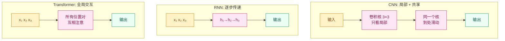

# 为什么 CNN 和 Transformer "看到"的世界不同？—— 归纳偏置

## 这个问题从哪来

> 同样的图像数据，CNN 能用 5 层学会识别物体，MLP 需要 50 层还学不好。不是 MLP 能力不够，而是它对数据结构没有任何假设——每个像素的地位完全平等。
> CNN 做了三个假设：局部像素关系更紧密（局部连接）、同一特征在图像任何位置都有效（参数共享）、物体位置不影响识别（平移不变性）。这些假设让 CNN 用更少的参数、更少的数据学得更快。
> 但这些假设也限制了 CNN——它看不到远距离像素之间的关系。Transformer 放弃了这些假设，用全局注意力替代，代价是需要更多数据来"学会"这些规律。

## 学习目标

完成本章后，你应能回答：

1. 归纳偏置是什么？它如何影响模型的数据效率和泛化能力？
2. CNN、RNN、Transformer 各自有哪些归纳偏置？
3. ViT 如何用数据规模补偿归纳偏置的缺失？

---

## 1. 直觉

归纳偏置是模型在看到数据之前就做的"假设"。

想象你在学习一门新语言。如果你假设"语序和英语类似"（先主语再谓语），你就能从更少的例句中学会基本语法——但遇到语序完全不同的语言时就会困惑。如果你不做任何假设，你需要更多的例句才能归纳出规律，但最终更灵活。

CNN 假设"相邻的像素更有关系"，这让它学图像特别高效——但处理文本时这假设完全不成立（"我"和"爱"之间可能隔了 10 个字）。

Transformer 不做任何空间假设，所有位置一视同仁——这让它在数据足够多时能学到 CNN 的所有规律甚至更多，但数据不够时性能不如 CNN。

> 你要记住：归纳偏置越强 → 数据需求越少 → 但灵活性越低。归纳偏置越弱 → 数据需求越多 → 但灵活性越高。

---

## 2. 机制

### 2.1 什么是归纳偏置？

归纳偏置（Inductive Bias）是学习算法为完成泛化而做的假设。它决定了假设空间中哪些函数更"优先"。

没有归纳偏置的学习是不可能的——这就是 No Free Lunch 定理的含义：没有任何算法能在所有可能的数据分布上都表现最好。归纳偏置决定了你的算法在哪些任务上天然擅长。

### 2.2 CNN 的归纳偏置

| 偏置 | 含义 | 实现 |
|------|------|------|
| 局部性 | 相邻像素的关系比远处像素更紧密 | 卷积核只覆盖局部区域（如 3×3） |
| 参数共享 | 同一特征在不同位置应该用相同的方式检测 | 卷积核在整张图上滑动 |
| 平移不变性 | 物体的位置不影响其识别结果 | 卷积 + 池化的组合效果 |
| 层次性 | 低层特征组合成高层特征 | 多层卷积堆叠 |

这些偏置让 CNN 在图像任务上极其高效——ResNet-18 只有 1100 万参数，但能在 ImageNet（1000 类）上达到 70%+ Top-1 准确率。

### 2.3 RNN 的归纳偏置

| 偏置 | 含义 | 实现 |
|------|------|------|
| 时序性 | 序列中前面的信息影响后面的输出 | 逐步处理，隐状态传递 |
| 马尔可夫性（弱） | 近期信息比远期信息更重要 | 梯度随时间步衰减 |
| 位置敏感 | token 的位置天然嵌入在处理顺序中 | 逐步处理，无需位置编码 |

RNN 对时间序列天然适配，但远距离依赖的梯度消失是硬伤。

### 2.4 Transformer 的归纳偏置

| 偏置 | 含义 | 实现 |
|------|------|------|
| 全局交互 | 任意两个位置都可以直接交互 | Self-Attention（$O(n^2)$ 连接） |
| 无空间假设 | 不假设相邻位置更相关 | 位置关系完全由位置编码注入 |
| 无局部性 | 感受野从第一层就是全局的 | 所有位置对计算注意力 |

**关键洞察**：Transformer 几乎没有几何归纳偏置——它把"数据长什么样"这个问题甩给了位置编码和大规模数据。

### 2.5 三架构对比



| 维度 | CNN | RNN | Transformer |
|------|-----|-----|-------------|
| 感受野 | 局部（逐层扩大） | 前序所有位置 | 全局（第一层就是） |
| 位置信息 | 通过卷积位置隐含 | 通过处理顺序天然获得 | 必须显式注入位置编码 |
| 参数共享 | 空间维度共享 | 时间维度共享 | 无（每个连接独立） |
| 数据效率 | 高（偏置强） | 中 | 低（偏置弱） |
| 灵活性 | 低（只能处理局部关系） | 中（受限于逐步传递） | 高（可以学到任意关系） |
| 并行性 | 高（空间维度并行） | 低（必须逐步） | 高（所有位置并行） |

### 2.6 ViT：用数据规模补偿弱偏置

Vision Transformer（Dosovitskiy et al., 2020）把图像切成 16×16 的 patch，当作"词"输入标准 Transformer。

关键实验结果：
- **中等数据量**（ImageNet，130 万张）：ViT 不如 ResNet
- **大数据量**（JFT-300M，3 亿张）：ViT 超越 ResNet
- **结论**：当数据足够多时，Transformer 可以从数据中学到 CNN 被硬编码的归纳偏置

> 你要记住：ViT 证明了"弱归纳偏置 + 大数据"可以打败"强归纳偏置 + 小数据"。前提是数据量要够大。

---

## 3. 渐进式实现

**Step 1 · 感受野可视化**

```python
# 计算 CNN 多层 3×3 卷积的感受野
# 对比 Transformer 的全局感受野
# 理解局部性与全局性差异
import numpy as np

# CNN 感受野计算：3×3 卷积堆叠
kernel = 3
for layers in [1, 2, 3, 5, 10]:
    receptive = 1
    for _ in range(layers):
        receptive = receptive + (kernel - 1)  # 每层增加 2
    print(f"{layers} 层 3×3 卷积: 感受野 = {receptive}×{receptive}")

# Transformer 感受野：始终全局
print(f"\n1 层 Transformer: 感受野 = 全局")
```

**Step 2 · 参数效率对比**

```python
# 对比 CNN 与 MLP 的参数量
# 展示参数共享带来的数据效率优势
# 理解归纳偏置对模型规模的影响
import torch.nn as nn

IMG_SIZE = 224
CHANNELS = 3
CLASSES = 1000

# CNN: ResNet-18 风格（简化版）
cnn = nn.Sequential(
    nn.Conv2d(3, 64, 7, stride=2, padding=3),
    nn.ReLU(),
    nn.AdaptiveAvgPool2d(1),
    nn.Flatten(),
    nn.Linear(64, CLASSES),
)

# MLP: 全连接（无归纳偏置）
mlp = nn.Sequential(
    nn.Flatten(),
    nn.Linear(CHANNELS * IMG_SIZE * IMG_SIZE, 512),
    nn.ReLU(),
    nn.Linear(512, CLASSES),
)

cnn_params = sum(p.numel() for p in cnn.parameters())
mlp_params = sum(p.numel() for p in mlp.parameters())

print(f"CNN 参数量: {cnn_params:,}")
print(f"MLP 参数量: {mlp_params:,}")
print(f"MLP/CNN 参数比: {mlp_params / cnn_params:.0f}x")
# MLP 参数量远大于 CNN，但 CNN 通过参数共享实现了更高的数据效率
```

**Step 3 · ViT Patch Embedding**

```python
# 将图像切分为 patch 并线性投影
# 模拟 ViT 的 Patch Embedding 流程
# 验证图像到序列的 shape 变换
import torch
import torch.nn as nn

torch.manual_seed(42)

BATCH, CHANNELS, IMG_SIZE = 4, 3, 224
PATCH_SIZE = 16
EMBED_DIM = 768

# 把图像切成 patch 并线性投影
num_patches = (IMG_SIZE // PATCH_SIZE) ** 2  # 196
patch_dim = CHANNELS * PATCH_SIZE * PATCH_SIZE  # 768

patch_embed = nn.Linear(patch_dim, EMBED_DIM)

# 模拟图像
images = torch.randn(BATCH, CHANNELS, IMG_SIZE, IMG_SIZE)

# 切 patch: (batch, channels, h, w) → (batch, num_patches, patch_dim)
patches = images.unfold(2, PATCH_SIZE, PATCH_SIZE).unfold(3, PATCH_SIZE, PATCH_SIZE)
patches = patches.contiguous().view(BATCH, CHANNELS, -1, PATCH_SIZE, PATCH_SIZE)
patches = patches.permute(0, 2, 3, 4, 1).contiguous().view(BATCH, num_patches, -1)

embeddings = patch_embed(patches)
print(f"图像: {images.shape} → Patches: {patches.shape} → Embeddings: {embeddings.shape}")
# (4, 3, 224, 224) → (4, 196, 768) → (4, 196, 768)
```

---

## 4. 工程陷阱（按严重度排序）

1. **小数据上盲目用 Transformer**
   现象：数据量不够大时，ViT 不如 CNN，MLP-Mixer 更差——弱归纳偏置需要大数据补偿。
   处置：数据量 < 10 万时优先用 CNN；100 万+ 可以尝试 ViT；3000 万+ ViT 通常更优。

2. **以为 Transformer 不需要位置编码**
   现象：去掉位置编码后 Transformer 在需要位置信息的任务上性能骤降。
   处置：Self-Attention 是位置无关的（permutation invariant），必须显式注入位置编码。

3. **CNN 的平移不变性不是绝对的**
   现象：卷积本身有平移等变性（平移输入 = 平移输出），但池化和步长会破坏这种性质。
   处置：真正的平移不变性需要特殊设计（如抗混叠池化），标准 CNN 只有近似的平移不变性。

> 你要记住：没有免费的归纳偏置——每一种偏置都是在"数据效率"和"灵活性"之间做权衡。

---

## 演进笔记

> **归纳偏置的演变**：从"人工设计偏置"（CNN 的卷积、RNN 的循环）到"让模型自己学偏置"（Transformer 的全局注意力）。
>
> MLP-Mixer（2021）完全不用注意力也不卷积，只用矩阵乘法和转置——这证明了只要数据够多，最简单的架构也能工作。ConvNeXt（2022）用 Transformer 的训练技巧改进 CNN，性能追平 ViT——说明关键在于训练策略而非架构本身。
>
> **留下的新问题**：模型越来越大，训练成本越来越高——如何用更少的精度（FP16/BF16）训练更大的模型？

→ 下一章：[数值精度与分布式训练 — 为什么 FP16 训练会"丢精度"？](../numerical-precision/README.md)

---

**上一章**：[注意力机制动机](../attention-primer/README.md) | **下一章**：[数值精度与分布式训练](../numerical-precision/README.md)
