[English](README_EN.md) | [中文](README.md)

# Why Do CNNs and Transformers "See" Different Worlds? — Inductive Bias

## Where This Problem Comes From

> The same image data: CNNs can learn object recognition in 5 layers, while MLPs need 50 layers and still perform poorly. It's not that MLPs lack capacity, but that they make no assumptions about data structure — every pixel is treated completely equally.
> CNNs make three assumptions: nearby pixels are more related (local connectivity), the same feature is valid anywhere in the image (parameter sharing), and object location doesn't affect recognition (translation invariance). These assumptions let CNNs learn faster with fewer parameters and less data.
> But these assumptions also constrain CNNs — they cannot see relationships between distant pixels. Transformers abandon these assumptions, replacing them with global attention, at the cost of needing more data to "learn" these patterns.

## Learning Objectives

After completing this chapter, you should be able to answer:

1. What is inductive bias? How does it affect a model's data efficiency and generalization ability?
2. What inductive biases do CNNs, RNNs, and Transformers each have?
3. How does ViT compensate for the lack of inductive bias with data scale?

---

## 1. Intuition

Inductive bias is the "assumption" a model makes before seeing any data.

Imagine learning a new language. If you assume "the word order is similar to English" (subject before verb), you can learn basic grammar from fewer examples — but you'll be confused when encountering a language with completely different word order. If you make no assumptions, you need more examples to generalize patterns, but you'll ultimately be more flexible.

CNNs assume "adjacent pixels are more related," which makes them extremely efficient at learning images — but this assumption completely fails for text ("I" and "love" might be separated by 10 characters).

Transformers make no spatial assumptions; all positions are treated equally — this lets them learn all the patterns CNNs encode and even more when data is abundant, but they underperform CNNs when data is scarce.

> Key takeaway: Stronger inductive bias → less data needed → but less flexibility. Weaker inductive bias → more data needed → but more flexibility.

---

## 2. Mechanics

### 2.1 What is Inductive Bias?

Inductive Bias is the assumption a learning algorithm makes to generalize. It determines which functions are "preferred" in the hypothesis space.

Learning without inductive bias is impossible — this is the meaning of the No Free Lunch theorem: no algorithm can perform best on all possible data distributions. Inductive bias determines which tasks your algorithm is naturally good at.

### 2.2 CNN's Inductive Bias

| Bias | Meaning | Implementation |
|------|---------|----------------|
| Locality | Relationships between adjacent pixels are tighter than between distant pixels | Convolutional kernels only cover local regions (e.g., 3×3) |
| Parameter Sharing | The same feature should be detected the same way at different locations | The same kernel slides across the entire image |
| Translation Invariance | Object location does not affect recognition | Combined effect of convolution + pooling |
| Hierarchy | Low-level features combine into high-level features | Stacking multiple convolutional layers |

These biases make CNNs extremely efficient on image tasks — ResNet-18 has only 11 million parameters but can achieve 70%+ Top-1 accuracy on ImageNet (1000 classes).

### 2.3 RNN's Inductive Bias

| Bias | Meaning | Implementation |
|------|---------|----------------|
| Sequentiality | Information earlier in the sequence affects later outputs | Step-by-step processing, hidden state propagation |
| Markov Property (weak) | Recent information is more important than distant information | Gradient decay over time steps |
| Position Sensitivity | Token positions are naturally embedded in the processing order | Step-by-step processing, no positional encoding needed |

RNNs are naturally suited to time series, but gradient vanishing over long distances is a fatal flaw.

### 2.4 Transformer's Inductive Bias

| Bias | Meaning | Implementation |
|------|---------|----------------|
| Global Interaction | Any two positions can interact directly | Self-Attention ($O(n^2)$ connections) |
| No Spatial Assumptions | No assumption that adjacent positions are more related | Spatial relationships entirely injected by positional encoding |
| No Locality | Receptive field is global from the first layer | All position pairs compute attention |

**Key Insight**: Transformers have almost no geometric inductive bias — they punt the question of "what does the data look like" to positional encoding and massive amounts of data.

### 2.5 Three-Architecture Comparison

```mermaid
graph TD
    subgraph "CNN: local + shared"
        C_IN["Input"]:::input
        C_1["Conv kernel 3×3\nonly sees local"]:::compute
        C_2["Same kernel\nslides everywhere"]:::compute
        C_OUT["Output"]:::output
        C_IN --> C_1 --> C_2 --> C_OUT
    end

    subgraph "RNN: step-by-step propagation"
        R_IN["x₁ x₂ x₃"]:::input
        R_1["h₁→h₂→h₃"]:::compute
        R_OUT["Output"]:::output
        R_IN --> R_1 --> R_OUT
    end

    subgraph "Transformer: global interaction"
        T_IN["x₁ x₂ x₃"]:::input
        T_1["All position pairs\nattend to each other"]:::compute
        T_OUT["Output"]:::output
        T_IN --> T_1 --> T_OUT
    end

    classDef input fill:#fef3c7,stroke:#d97706,color:#92400e
    classDef compute fill:#fce7f3,stroke:#db2777,color:#9d174d
    classDef output fill:#ecfdf5,stroke:#059669,color:#065f46
```



| Dimension | CNN | RNN | Transformer |
|-----------|-----|-----|-------------|
| Receptive Field | Local (grows layer by layer) | All previous positions | Global (from first layer) |
| Position Info | Implicit through convolution position | Naturally obtained through processing order | Must be explicitly injected via positional encoding |
| Parameter Sharing | Shared across spatial dimensions | Shared across time dimensions | None (every connection is independent) |
| Data Efficiency | High (strong bias) | Medium | Low (weak bias) |
| Flexibility | Low (can only handle local relationships) | Medium (limited by step-by-step processing) | High (can learn arbitrary relationships) |
| Parallelism | High (parallel across spatial dimensions) | Low (must be step-by-step) | High (all positions parallel) |

### 2.6 ViT: Compensating Weak Bias with Data Scale

Vision Transformer (Dosovitskiy et al., 2020) cuts images into 16×16 patches and feeds them into a standard Transformer as "words."

Key experimental results:
- **Medium data** (ImageNet, 1.3M images): ViT underperforms ResNet
- **Large data** (JFT-300M, 300M images): ViT surpasses ResNet
- **Conclusion**: When data is abundant enough, Transformers can learn from data the inductive biases that CNNs have hard-coded

> Key takeaway: ViT proved that "weak inductive bias + big data" can beat "strong inductive bias + small data" — provided the data volume is large enough.

---

## 3. Progressive Implementation

**Step 1 · Receptive field visualization**

```python
import numpy as np

# CNN receptive field calculation: stacking 3×3 convolutions
kernel = 3
for layers in [1, 2, 3, 5, 10]:
    receptive = 1
    for _ in range(layers):
        receptive = receptive + (kernel - 1)  # increases by 2 each layer
    print(f"{layers} layers of 3×3 conv: receptive field = {receptive}×{receptive}")

# Transformer receptive field: always global
print(f"\n1 layer Transformer: receptive field = global")
```

**Step 2 · Parameter efficiency comparison**

```python
import torch.nn as nn

IMG_SIZE = 224
CHANNELS = 3
CLASSES = 1000

# CNN: ResNet-18 style (simplified)
cnn = nn.Sequential(
    nn.Conv2d(3, 64, 7, stride=2, padding=3),
    nn.ReLU(),
    nn.AdaptiveAvgPool2d(1),
    nn.Flatten(),
    nn.Linear(64, CLASSES),
)

# MLP: fully connected (no inductive bias)
mlp = nn.Sequential(
    nn.Flatten(),
    nn.Linear(CHANNELS * IMG_SIZE * IMG_SIZE, 512),
    nn.ReLU(),
    nn.Linear(512, CLASSES),
)

cnn_params = sum(p.numel() for p in cnn.parameters())
mlp_params = sum(p.numel() for p in mlp.parameters())

print(f"CNN parameters: {cnn_params:,}")
print(f"MLP parameters: {mlp_params:,}")
print(f"MLP/CNN parameter ratio: {mlp_params / cnn_params:.0f}x")
# MLP has far more parameters than CNN, but CNN achieves higher data efficiency through parameter sharing
```

**Step 3 · ViT Patch Embedding**

```python
import torch
import torch.nn as nn

torch.manual_seed(42)

BATCH, CHANNELS, IMG_SIZE = 4, 3, 224
PATCH_SIZE = 16
EMBED_DIM = 768

# Cut image into patches and linearly project
num_patches = (IMG_SIZE // PATCH_SIZE) ** 2  # 196
patch_dim = CHANNELS * PATCH_SIZE * PATCH_SIZE  # 768

patch_embed = nn.Linear(patch_dim, EMBED_DIM)

# Simulate images
images = torch.randn(BATCH, CHANNELS, IMG_SIZE, IMG_SIZE)

# Split into patches: (batch, channels, h, w) → (batch, num_patches, patch_dim)
patches = images.unfold(2, PATCH_SIZE, PATCH_SIZE).unfold(3, PATCH_SIZE, PATCH_SIZE)
patches = patches.contiguous().view(BATCH, CHANNELS, -1, PATCH_SIZE, PATCH_SIZE)
patches = patches.permute(0, 2, 3, 4, 1).contiguous().view(BATCH, num_patches, -1)

embeddings = patch_embed(patches)
print(f"Image: {images.shape} → Patches: {patches.shape} → Embeddings: {embeddings.shape}")
# (4, 3, 224, 224) → (4, 196, 768) → (4, 196, 768)
```

---

## 4. Engineering Pitfalls (Sorted by Severity)

1. **Blindly using Transformers on small data**
   Symptom: When data volume is insufficient, ViT underperforms CNNs, and MLP-Mixer is even worse — weak inductive bias needs big data to compensate.
   Fix: Prioritize CNNs when data < 100k; try ViT at 1M+; ViT is usually better at 30M+.

2. **Thinking Transformers don't need positional encoding**
   Symptom: After removing positional encoding, Transformer performance drops sharply on tasks requiring positional information.
   Fix: Self-Attention is permutation invariant; positional encoding must be explicitly injected.

3. **CNN translation invariance is not absolute**
   Symptom: Convolution itself has translation equivariance (translating input = translating output), but pooling and stride break this property.
   Fix: True translation invariance requires special design (e.g., anti-aliased pooling); standard CNNs only have approximate translation invariance.

> Key takeaway: There is no free inductive bias — every bias is a trade-off between data efficiency and flexibility.

---

## Evolution Notes

> **The evolution of inductive bias**: From "hand-designed bias" (CNN convolutions, RNN recurrence) to "letting the model learn its own bias" (Transformer global attention).
>
> MLP-Mixer (2021) uses no attention and no convolutions, only matrix multiplications and transpositions — proving that the simplest architecture can work as long as data is abundant. ConvNeXt (2022) improved CNNs with Transformer training techniques, matching ViT performance — showing that the key is training strategy rather than architecture itself.
>
> **New problems left behind**: Models are getting larger and training costs are rising — how to train bigger models with less precision (FP16/BF16)?

→ Next chapter: [Numerical Precision & Distributed Training — Why Does FP16 Training "Lose Precision"?](../numerical-precision/README_EN.md)

---

**Previous**: [Attention Primer](../attention-primer/README_EN.md) | **Next**: [Numerical Precision & Distributed Training](../numerical-precision/README_EN.md)
