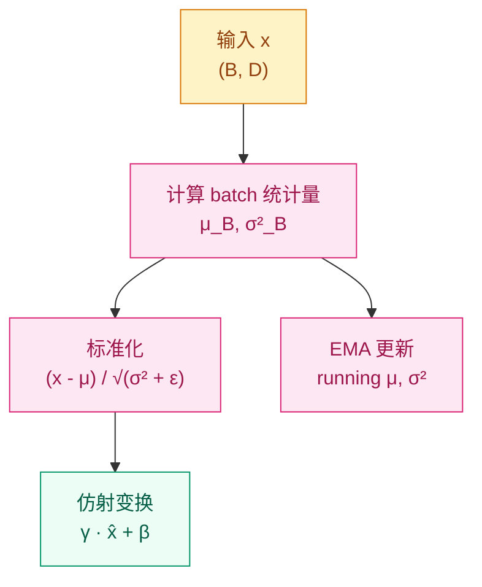

# 为什么训练深度网络需要"校准仪"？—— 归一化机制

## 这个问题从哪来

> 2015 年，Ioffe & Szegedy 提出了 Batch Normalization（BN）。他们的观察是：深层网络训练时，每一层的输入分布都在随前层参数更新而变化（他们称之为 Internal Covariate Shift），这迫使每层不断适应新的输入分布，训练极不稳定。
> BN 的解决方案很简单：在每一层的输出上做标准化（减均值、除标准差），让分布稳定在零均值、单位方差附近。这个操作让训练速度提升了数量级，ResNet 等超深架构得以实现。
> 后来 Transformer 用了 Layer Normalization（LN）——不依赖 batch 维度，更适合变长序列。LLaMA 进一步简化为 RMSNorm。

## 学习目标

完成本章后，你应能回答：

1. BatchNorm 训练和推理时行为有什么不同？为什么需要 `train/eval` 切换？
2. 为什么 Transformer 选 LayerNorm 而不选 BatchNorm？
3. 手写 BatchNorm 的前向传播（含 running mean/var 更新）。

---

## 1. 直觉

归一化是流水线上的"校准仪"。

想象一条汽车装配线。如果冲压车间送来的零件尺寸忽大忽小，焊接车间就得不断调整参数来适应——效率很低。归一化就是在每个车间之间放一台"校准仪"，把零件尺寸标准化到统一范围，让下游车间不用再操心上游的波动。

**BatchNorm** 用当前 batch 的统计量做校准（训练时），推理时用训练过程中累积的全局统计量。

**LayerNorm** 不看 batch 里别的样本，只看自己这一条数据的所有特征，自己给自己做标准化。

> 你要记住：归一化的核心不是"让数据更好看"，而是"稳定各层的输入分布，让梯度流动更稳定"。

---

## 2. 机制

### 2.1 Batch Normalization

对输入 $x \in \mathbb{R}^{B \times D}$（B 个样本，D 个特征），沿 batch 维度计算统计量：

$$
\mu_B = \frac{1}{B}\sum_{i=1}^{B} x_i, \quad \sigma_B^2 = \frac{1}{B}\sum_{i=1}^{B}(x_i - \mu_B)^2
$$

标准化后接可学习的仿射变换：

$$
\hat{x}_i = \frac{x_i - \mu_B}{\sqrt{\sigma_B^2 + \epsilon}}, \quad y_i = \gamma \hat{x}_i + \beta
$$

$\gamma$ 和 $\beta$ 是可学习参数（形状为 `(D,)`），让网络有能力恢复原始分布（如果标准化反而有害的话）。

**训练 vs 推理的关键差异**：

| | 训练 | 推理 |
|---|------|------|
| 均值/方差 | 当前 batch 统计 | running mean/var（训练时 EMA 累积） |
| 行为 | 每个 batch 不同 | 固定，不依赖 batch |
| 为什么要不同 | 需要 batch 统计量来标准化 | batch 可能只有 1 个样本，统计量无意义 |

EMA 更新公式（`momentum=0.1`）：

$$
\mu_{\text{running}} \leftarrow (1 - m) \cdot \mu_{\text{running}} + m \cdot \mu_B
$$



### 2.2 Layer Normalization

沿**特征维度**归一化，不看 batch：

$$
\mu_L = \frac{1}{D}\sum_{j=1}^{D} x_j, \quad \hat{x}_j = \frac{x_j - \mu_L}{\sqrt{\sigma_L^2 + \epsilon}}, \quad y_j = \gamma \hat{x}_j + \beta
$$

关键区别：
- LN 的统计量对每个样本独立计算，不依赖 batch 中其他样本
- 训练和推理**行为完全一致**，不需要 running stats
- 在 NLP 任务中，序列长度可变，batch 中 padding 程度不同——BN 的 batch 统计量会被 padding 污染，LN 不受影响

**为什么 Transformer 选 LN？**
1. 序列长度可变，batch 中各样本有效长度不同
2. 自回归解码时 batch_size=1（逐 token 生成），BN 退化
3. LN 对每个样本独立，适合变长输入

### 2.3 归一化家族速览

| 归一化 | 计算维度 | 依赖 batch | 适用场景 | PyTorch |
|--------|---------|-----------|---------|---------|
| BatchNorm | `(B,)` | 是 | CNN、固定 batch | `nn.BatchNorm1d/2d` |
| LayerNorm | `(D,)` | 否 | Transformer、NLP | `nn.LayerNorm(D)` |
| InstanceNorm | `(D, H, W)` | 否 | 风格迁移 | `nn.InstanceNorm2d` |
| GroupNorm | `(G, D//G, H, W)` | 否 | 小 batch CNN | `nn.GroupNorm(G, D)` |

> 你要记住：选择归一化的核心问题是"沿哪个维度算统计量"。BN 沿 batch（利用样本间统计），LN 沿特征（利用特征间统计）。

### 2.4 Pre-LN vs Post-LN

在 Transformer 中，归一化放在残差连接的不同位置：

**Post-LN**（原始 Transformer）：
$$
y = \text{LN}(x + \text{Sublayer}(x))
$$

**Pre-LN**（GPT-2 之后主流）：
$$
y = x + \text{Sublayer}(\text{LN}(x))
$$

Pre-LN 的优势：残差路径上没有归一化操作阻挡，梯度可以直接从深层流向浅层。训练更稳定，不需要仔细调学习率 warmup。

---

## 3. 渐进式实现

**Step 1 · 手写 BatchNorm 前向（训练模式）**

```python
import numpy as np

np.random.seed(42)

BATCH, DIM = 32, 64

# 模拟一个 batch 的隐藏层输出
x = np.random.randn(BATCH, DIM) * 3 + 2  # 偏移+缩放

# 训练模式：用当前 batch 统计量
mu = x.mean(axis=0)          # (DIM,)
var = x.var(axis=0)          # (DIM,)
x_hat = (x - mu) / np.sqrt(var + 1e-5)

# 可学习参数
gamma = np.ones(DIM)
beta = np.zeros(DIM)
y = gamma * x_hat + beta

print(f"归一化前 - 均值: {x.mean():.4f}, 方差: {x.var():.4f}")
print(f"归一化后 - 均值: {y.mean():.6f}, 方差: {y.var():.6f}")
# 均值接近 0，方差接近 1
```

**Step 2 · 含 running stats 的完整 BatchNorm**

```python
import numpy as np

np.random.seed(42)

class SimpleBatchNorm:
    """简化版 BatchNorm，含 running stats 更新"""

    def __init__(self, dim, momentum=0.1, eps=1e-5):
        self.gamma = np.ones(dim)
        self.beta = np.zeros(dim)
        self.running_mean = np.zeros(dim)
        self.running_var = np.ones(dim)
        self.momentum = momentum
        self.eps = eps
        self.training = True

    def forward(self, x):
        if self.training:
            mu = x.mean(axis=0)
            var = x.var(axis=0)
            x_hat = (x - mu) / np.sqrt(var + self.eps)
            # EMA 更新 running stats
            self.running_mean = (1 - self.momentum) * self.running_mean + self.momentum * mu
            self.running_var = (1 - self.momentum) * self.running_var + self.momentum * var
        else:
            x_hat = (x - self.running_mean) / np.sqrt(self.running_var + self.eps)
        return self.gamma * x_hat + self.beta

bn = SimpleBatchNorm(dim=64)

# 训练模式
bn.training = True
x_train = np.random.randn(32, 64) * 3 + 2
out_train = bn.forward(x_train)
print(f"训练输出均值: {out_train.mean():.6f}")

# 推理模式：使用 running stats
bn.training = False
x_test = np.random.randn(1, 64) * 3 + 2
out_test = bn.forward(x_test)
print(f"推理输出均值: {out_test.mean():.6f}")
```

**Step 3 · PyTorch BatchNorm 验证**

```python
import torch
import torch.nn as nn

torch.manual_seed(42)

DIM = 64
bn = nn.BatchNorm1d(DIM, momentum=0.1)

# 训练模式
bn.train()
x1 = torch.randn(32, DIM) * 3 + 2
out1 = bn(x1)
print(f"训练后 running_mean: {bn.running_mean[:4].tolist()}")

# 推理模式
bn.eval()
x2 = torch.randn(1, DIM) * 3 + 2
out2 = bn(x2)
print(f"推理输出均值: {out2.mean().item():.6f}")
```

**Step 4 · LayerNorm vs BatchNorm 行为对比**

```python
import torch
import torch.nn as nn

torch.manual_seed(42)

BATCH, DIM = 4, 8
x = torch.randn(BATCH, DIM) * 5 + 3

bn = nn.BatchNorm1d(DIM)
ln = nn.LayerNorm(DIM)

# BatchNorm: 每个特征跨样本归一化
bn_out = bn(x)
print("BatchNorm 各样本均值:", bn_out.mean(dim=1).detach().tolist()[:4])
# 每个特征的均值接近 0

# LayerNorm: 每个样本跨特征归一化
ln_out = ln(x)
print("LayerNorm 各样本均值:", ln_out.mean(dim=1).detach().tolist()[:4])
# 每个样本的特征均值接近 0
```

---

## 4. 工程陷阱（按严重度排序）

1. **忘记 `model.eval()`**（最常见）
   现象：推理时 BN 仍然用 batch 统计量，结果随 batch 内容变化。batch_size=1 时统计量退化，结果完全错误。
   处置：推理前一律 `model.eval()`，训练时 `model.train()`。

2. **batch 太小导致 BN 不稳定**
   现象：batch_size=2 或 4 时，batch 统计量噪声很大，训练震荡。
   处置：batch_size < 16 时考虑 GroupNorm（不依赖 batch），或用 SyncBN（跨 GPU 同步统计量）。

3. **LN 的可学习参数初始化不当**
   现象：`gamma` 初始化为 0 或很大值，导致初始输出全零或方差极端。
   处置：默认 `gamma=1, beta=0`（PyTorch 默认值），一般不需要调整。

4. **BN 和 Dropout 的顺序不当**
   现象：Dropout 改变激活分布，影响 BN 的 batch 统计量。
   处置：推荐顺序 `Linear → BN → ReLU → Dropout`，BN 先稳定分布，Dropout 再做正则化。

5. **Pre-LN vs Post-LN 搞混**
   现象：看论文时不知道归一化放在哪，代码实现和论文不一致。
   处置：GPT-2 之后主流用 Pre-LN（先 LN 再进 sublayer），原始 Transformer 用 Post-LN。

> 你要记住：训练/推理行为差异是 BN 最容易出错的地方。LN 没有这个问题。

---

## 演进笔记

> **归一化的演进**：BatchNorm 催生了超深 CNN（ResNet-152+），LayerNorm 催生了稳定训练的 Transformer，RMSNorm（LLaMA）去掉了均值中心化，只做缩放，进一步简化。
>
> 归一化还有一个隐式正则化效果：训练时 batch 统计量的随机波动相当于给模型加了噪声，起到类似 Dropout 的作用。这就是为什么用了 BN 之后可以适当降低 Dropout 率。
>
> **留下的新问题**：归一化让梯度流动更稳定，但深层网络中梯度仍然可能消失——这引出了残差连接的解决方案。

→ 下一章：[残差连接 — 为什么要把输入"抄近路"送回去？](../residual-connections/README.md)

---

**上一章**：[学习率调度与梯度优化](../optimization-scheduling/README.md) | **下一章**：[残差连接](../residual-connections/README.md)
