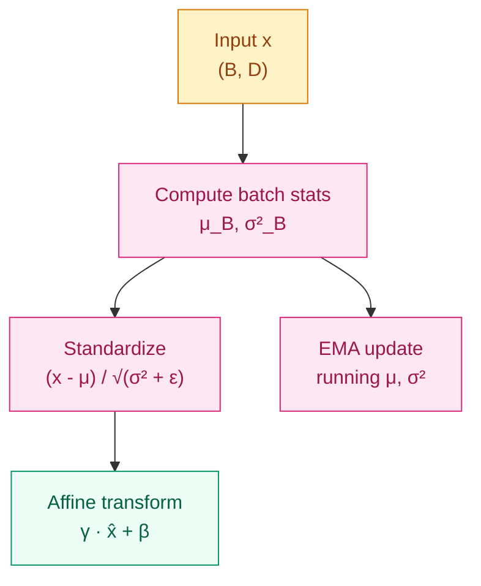

[English](README_EN.md) | [中文](README.md)

# Why Do Deep Networks Need a "Calibrator"? — Normalization

## Where This Problem Comes From

> In 2015, Ioffe & Szegedy proposed Batch Normalization (BN). Their observation was that during deep network training, the input distribution of each layer changes as preceding layer parameters update (they called this Internal Covariate Shift), forcing each layer to constantly adapt to a new input distribution and making training extremely unstable.
> BN's solution is simple: normalize each layer's output (subtract mean, divide by standard deviation) to keep the distribution stable near zero mean and unit variance. This operation improved training speed by orders of magnitude, enabling ultra-deep architectures like ResNet.
> Later, Transformer adopted Layer Normalization (LN) — it doesn't rely on the batch dimension, making it better suited for variable-length sequences. LLaMA further simplified it to RMSNorm.

## Learning Objectives

After completing this chapter, you should be able to answer:

1. How does BatchNorm behave differently during training and inference? Why do we need the `train/eval` switch?
2. Why did Transformer choose LayerNorm instead of BatchNorm?
3. Handwrite BatchNorm's forward pass (including running mean/var update).

---

## 1. Intuition

Normalization is the "calibrator" on the assembly line.

Imagine an automobile assembly line. If the parts coming from the stamping workshop vary wildly in size, the welding workshop has to constantly adjust its parameters to adapt — very inefficient. Normalization is like placing a "calibrator" between each workshop, standardizing part sizes to a uniform range so downstream workshops no longer have to worry about upstream fluctuations.

**BatchNorm** uses statistics from the current batch for calibration (during training), and uses globally accumulated statistics from training during inference.

**LayerNorm** doesn't look at other samples in the batch; it only looks at all features of a single sample and normalizes itself.

> Key takeaway: the core of normalization is not "making data look prettier," but "stabilizing the input distribution of each layer so gradient flow becomes more stable."

---

## 2. Mechanics

### 2.1 Batch Normalization

For input $x \in \mathbb{R}^{B \times D}$ (B samples, D features), compute statistics along the batch dimension:

$$
\mu_B = \frac{1}{B}\sum_{i=1}^{B} x_i, \quad \sigma_B^2 = \frac{1}{B}\sum_{i=1}^{B}(x_i - \mu_B)^2
$$

After standardization, apply a learnable affine transformation:

$$
\hat{x}_i = \frac{x_i - \mu_B}{\sqrt{\sigma_B^2 + \epsilon}}, \quad y_i = \gamma \hat{x}_i + \beta
$$

$\gamma$ and $\beta$ are learnable parameters (shape `(D,)`), giving the network the ability to restore the original distribution if standardization turns out to be harmful.

**Key differences between training and inference:**

| | Training | Inference |
|---|----------|-----------|
| Mean/Variance | Current batch statistics | Running mean/var (EMA accumulated during training) |
| Behavior | Different for each batch | Fixed, independent of batch |
| Why different | Needs batch statistics for standardization | Batch may contain only 1 sample, making batch statistics meaningless |

EMA update formula (`momentum=0.1`):

$$
\mu_{\text{running}} \leftarrow (1 - m) \cdot \mu_{\text{running}} + m \cdot \mu_B
$$



### 2.2 Layer Normalization

Normalize along the **feature dimension**, ignoring the batch:

$$
\mu_L = \frac{1}{D}\sum_{j=1}^{D} x_j, \quad \hat{x}_j = \frac{x_j - \mu_L}{\sqrt{\sigma_L^2 + \epsilon}}, \quad y_j = \gamma \hat{x}_j + \beta
$$

Key differences:
- LN's statistics are computed independently for each sample, without relying on other samples in the batch
- Training and inference **behavior is completely identical**; no running stats needed
- In NLP tasks, sequence lengths vary and padding differs across the batch — BN's batch statistics get polluted by padding, while LN is unaffected

**Why did Transformer choose LN?**
1. Sequence lengths vary, and effective lengths differ across the batch
2. During autoregressive decoding, batch_size=1 (token-by-token generation), BN degrades
3. LN is independent for each sample, suitable for variable-length inputs

### 2.3 Normalization Family Overview

| Normalization | Compute dimension | Depends on batch | Applicable scenario | PyTorch |
|---------------|-------------------|------------------|---------------------|---------|
| BatchNorm | `(B,)` | Yes | CNN, fixed batch | `nn.BatchNorm1d/2d` |
| LayerNorm | `(D,)` | No | Transformer, NLP | `nn.LayerNorm(D)` |
| InstanceNorm | `(D, H, W)` | No | Style transfer | `nn.InstanceNorm2d` |
| GroupNorm | `(G, D//G, H, W)` | No | Small-batch CNN | `nn.GroupNorm(G, D)` |

> Key takeaway: the core question when choosing normalization is "along which dimension to compute statistics." BN computes along the batch (using inter-sample statistics), LN computes along features (using intra-feature statistics).

### 2.4 Pre-LN vs Post-LN

In Transformers, normalization is placed at different positions relative to the residual connection:

**Post-LN** (original Transformer):
$$
y = \text{LN}(x + \text{Sublayer}(x))
$$

**Pre-LN** (mainstream after GPT-2):
$$
y = x + \text{Sublayer}(\text{LN}(x))
$$

Pre-LN advantage: there is no normalization operation on the residual path blocking the way, so gradients can flow directly from deep layers to shallow layers. Training is more stable and doesn't require careful tuning of learning rate warmup.

---

## 3. Progressive Implementation

**Step 1 · Handwritten BatchNorm Forward (Training Mode)**

```python
import numpy as np

np.random.seed(42)

BATCH, DIM = 32, 64

# Simulate a batch of hidden layer outputs
x = np.random.randn(BATCH, DIM) * 3 + 2  # Shift + scale

# Training mode: use current batch statistics
mu = x.mean(axis=0)          # (DIM,)
var = x.var(axis=0)          # (DIM,)
x_hat = (x - mu) / np.sqrt(var + 1e-5)

# Learnable parameters
gamma = np.ones(DIM)
beta = np.zeros(DIM)
y = gamma * x_hat + beta

print(f"Before normalization - mean: {x.mean():.4f}, variance: {x.var():.4f}")
print(f"After normalization - mean: {y.mean():.6f}, variance: {y.var():.6f}")
# Mean near 0, variance near 1
```

**Step 2 · Complete BatchNorm with Running Stats**

```python
import numpy as np

np.random.seed(42)

class SimpleBatchNorm:
    """Simplified BatchNorm with running stats update"""

    def __init__(self, dim, momentum=0.1, eps=1e-5):
        self.gamma = np.ones(dim)
        self.beta = np.zeros(dim)
        self.running_mean = np.zeros(dim)
        self.running_var = np.ones(dim)
        self.momentum = momentum
        self.eps = eps
        self.training = True

    def forward(self, x):
        if self.training:
            mu = x.mean(axis=0)
            var = x.var(axis=0)
            x_hat = (x - mu) / np.sqrt(var + self.eps)
            # EMA update of running stats
            self.running_mean = (1 - self.momentum) * self.running_mean + self.momentum * mu
            self.running_var = (1 - self.momentum) * self.running_var + self.momentum * var
        else:
            x_hat = (x - self.running_mean) / np.sqrt(self.running_var + self.eps)
        return self.gamma * x_hat + self.beta

bn = SimpleBatchNorm(dim=64)

# Training mode
bn.training = True
x_train = np.random.randn(32, 64) * 3 + 2
out_train = bn.forward(x_train)
print(f"Training output mean: {out_train.mean():.6f}")

# Inference mode: use running stats
bn.training = False
x_test = np.random.randn(1, 64) * 3 + 2
out_test = bn.forward(x_test)
print(f"Inference output mean: {out_test.mean():.6f}")
```

**Step 3 · PyTorch BatchNorm Verification**

```python
import torch
import torch.nn as nn

torch.manual_seed(42)

DIM = 64
bn = nn.BatchNorm1d(DIM, momentum=0.1)

# Training mode
bn.train()
x1 = torch.randn(32, DIM) * 3 + 2
out1 = bn(x1)
print(f"Running mean after training: {bn.running_mean[:4].tolist()}")

# Inference mode
bn.eval()
x2 = torch.randn(1, DIM) * 3 + 2
out2 = bn(x2)
print(f"Inference output mean: {out2.mean().item():.6f}")
```

**Step 4 · LayerNorm vs BatchNorm Behavior Comparison**

```python
import torch
import torch.nn as nn

torch.manual_seed(42)

BATCH, DIM = 4, 8
x = torch.randn(BATCH, DIM) * 5 + 3

bn = nn.BatchNorm1d(DIM)
ln = nn.LayerNorm(DIM)

# BatchNorm: normalize each feature across samples
bn_out = bn(x)
print("BatchNorm sample means:", bn_out.mean(dim=1).detach().tolist()[:4])
# Mean of each feature is near 0

# LayerNorm: normalize each sample across features
ln_out = ln(x)
print("LayerNorm sample means:", ln_out.mean(dim=1).detach().tolist()[:4])
# Mean of features within each sample is near 0
```

---

## 4. Engineering Pitfalls (Sorted by Severity)

1. **Forgetting `model.eval()`** (most common)  
   Symptom: BN still uses batch statistics during inference, so results vary with batch content. With batch_size=1, statistics degrade and results are completely wrong.  
   Fix: always call `model.eval()` before inference, and `model.train()` during training.

2. **Batch too small causing BN instability**  
   Symptom: with batch_size=2 or 4, batch statistics are very noisy and training oscillates.  
   Fix: when batch_size < 16, consider GroupNorm (independent of batch) or SyncBN (synchronize statistics across GPUs).

3. **Improper initialization of LN learnable parameters**  
   Symptom: `gamma` initialized to 0 or a very large value, causing initial outputs to be all zero or have extreme variance.  
   Fix: default `gamma=1, beta=0` (PyTorch defaults), generally no need to adjust.

4. **Wrong order of BN and Dropout**  
   Symptom: Dropout changes the activation distribution, affecting BN's batch statistics.  
   Fix: recommended order is `Linear → BN → ReLU → Dropout`; BN stabilizes the distribution first, then Dropout regularizes.

5. **Confusing Pre-LN vs Post-LN**  
   Symptom: reading a paper and not knowing where normalization is placed, or code implementation inconsistent with the paper.  
   Fix: Pre-LN is mainstream after GPT-2 (LN first, then into sublayer); original Transformer used Post-LN.

> Key takeaway: the training/inference behavioral difference is the most error-prone aspect of BN. LN doesn't have this problem.

---

## Evolution Notes

> **The evolution of normalization**: BatchNorm enabled ultra-deep CNNs (ResNet-152+), LayerNorm enabled stably trained Transformers, and RMSNorm (LLaMA) removed mean centering and only does scaling, further simplifying.
>
> Normalization also has an implicit regularization effect: the random fluctuations of batch statistics during training act as noise to the model, playing a role similar to Dropout. This is why using BN allows appropriately reducing the Dropout rate.
>
> **The new problem left behind**: normalization makes gradient flow more stable, but gradients can still vanish in deep networks — this leads to the solution of residual connections.

→ Next chapter: [Residual Connections — Why Take a Shortcut with the Input?](../residual-connections/README.md)

---

**Previous**: [Activation Functions](../activation-functions/README_EN.md) | **Next**: [Residual Connections](../residual-connections/README_EN.md)
