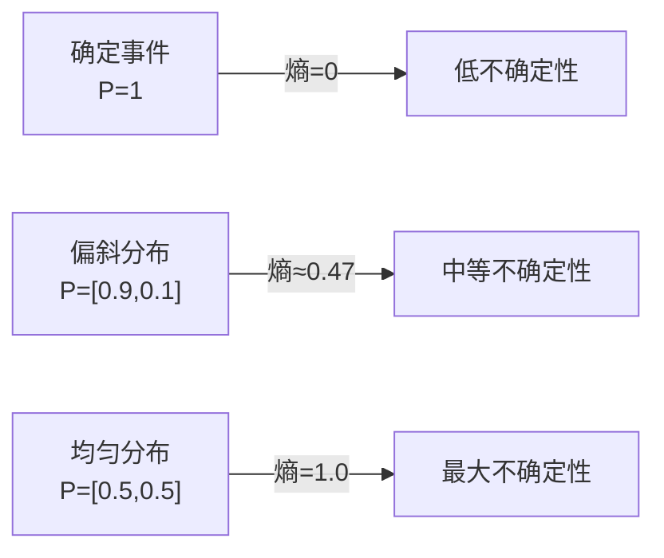

# 交叉熵从哪来？—— 概率与信息论基础

## 这个问题从哪来

> 在前面的模块中，你已经见过交叉熵损失、KL 散度、最大似然估计这些术语——它们在损失函数、Softmax、正则化中反复出现，但从未被系统解释过。
> 这些概念不是深度学习的发明，而是来自 18-20 世纪的概率论与信息论。理解它们的来源，才能真正理解"模型在优化什么"。

## 学习目标

完成本章后，你应能回答：

1. 交叉熵为什么能用来做分类损失？
2. KL 散度衡量的是什么，为什么它不对称？
3. 最大似然估计和最小化交叉熵为什么是同一件事？

---

## 1. 直觉

想象你是一个气象预报员。每天你要预测"明天下雨的概率是多少"。

- **信息熵**衡量的是天气本身的不确定性——如果当地一年 365 天都下雨，熵就低（很好预测）；如果晴雨各半，熵就高（很难预测）。
- **交叉熵**衡量的是你的预报和实际天气的差距——你说明天 90% 下雨，结果真下了，交叉熵低；你说 10% 下雨，结果下了，交叉熵高。
- **KL 散度**衡量的是"用你的预报代替真实天气分布，要多付多少代价"。

> 你要记住：信息论不是关于"信息量有多大"，而是关于"不确定性有多少、你的预测有多准"。

---

## 2. 机制

### 2.1 概率基础

**随机变量**：取值由随机试验决定的变量。离散型（骰子点数）和连续型（身高体重）。

**概率分布**：每个取值对应一个概率。
- 离散：P(X=x)，所有概率之和 = 1
- 连续：f(x)，积分 = 1

**期望与方差**：
$$E[X] = \sum_x x \cdot P(X=x) \quad \text{（离散）}$$
$$\text{Var}(X) = E[(X - E[X])^2] = E[X^2] - (E[X])^2$$

**常见分布速览**：

| 分布 | 公式 | 直觉 | 深度学习中的角色 |
|------|------|------|----------------|
| 伯努利 | P(X=1)=p, P(X=0)=1-p | 硬币翻转 | 二分类标签 |
| 均匀 | f(x)=1/(b-a) | 所有值等可能 | 权重初始化的起点 |
| 高斯 | f(x)=(1/√2πσ²)e^{-(x-μ)²/2σ²} | 钟形曲线 | 权重初始化、VAE 潜空间、噪声模型 |

> 高斯分布在深度学习中无处不在：He/Xavier 初始化假设权重服从高斯分布，VAE 的潜空间被约束为标准高斯，加噪扩散模型的核心也是高斯噪声。

### 2.2 贝叶斯定理

**条件概率 → 联合概率 → 贝叶斯公式**：

$$P(A|B) = \frac{P(B|A) \cdot P(A)}{P(B)}$$

四个关键概念（"医学检测"类比）：

| 概念 | 符号 | 类比 |
|------|------|------|
| 先验 | P(A) | 患病率：检测之前的信念 |
| 似然 | P(B\|A) | 检测灵敏度：患病时检出阳性的概率 |
| 后验 | P(A\|B) | 检测阳性后真正患病的概率 |
| 证据 | P(B) | 检测阳性的总概率 |

**深度学习中的体现**：
- L2 正则化 = 假设权重服从高斯先验的 MAP 估计（详见正则化模块）
- 贝叶斯神经网络：对权重的不确定性建模，而非取点估计

### 2.3 信息熵

**直觉**："描述一个随机变量平均需要多少比特"。

$$H(X) = -\sum_{x} P(x) \log P(x)$$

性质：
- 熵越大，不确定性越高
- 均匀分布有最大熵（每个结果等可能，最难预测）
- 确定事件（P=1）的熵为 0



**最大熵原理**：在满足约束的所有分布中，选择熵最大的那个——因为你不想做没有证据的假设。

### 2.4 交叉熵与 KL 散度

**交叉熵**：用分布 q 编码来自分布 p 的数据，平均需要多少比特。

$$H(p, q) = -\sum_{x} P(x) \log Q(x)$$

与熵的关系：
$$H(p, q) = H(p) + D_{KL}(p \| q)$$

**KL 散度**："用 q 近似 p，要多付出多少编码代价"。

$$D_{KL}(p \| q) = \sum_{x} P(x) \log \frac{P(x)}{Q(x)} = H(p, q) - H(p)$$

关键性质：
- 非负性：$D_{KL}(p \| q) \geq 0$，等号成立当且仅当 p = q
- **非对称性**：$D_{KL}(p \| q) \neq D_{KL}(q \| p)$

**Forward vs Reverse KL 直觉**：

| | Forward KL: $D_{KL}(p \| q)$ | Reverse KL: $D_{KL}(q \| p)$ |
|---|------|------|
| 行为 | q 要覆盖 p 的所有模式 | q 找 p 的一个模式集中拟合 |
| 结果 | 倾向于"宁滥勿缺" | 倾向于"宁缺勿滥" |
| 应用 | 变分推断（VAE） | 知识蒸馏、强化学习 |

> 链接损失函数：交叉熵损失 $L = -\sum y_k \log \hat{y}_k$ 正是 $H(y, \hat{y})$，模型在学习让预测分布 $\hat{y}$ 尽量接近真实分布 $y$。

### 2.5 最大似然估计

**核心思想**：找到让观测数据出现概率最大的参数。

$$\hat{\theta}_{MLE} = \arg\max_{\theta} P(D|\theta) = \arg\max_{\theta} \prod_{i=1}^{N} P(x_i|\theta)$$

取对数（乘积变求和，方便优化）：

$$\hat{\theta}_{MLE} = \arg\max_{\theta} \sum_{i=1}^{N} \log P(x_i|\theta)$$

**与交叉熵的等价性**：对分类问题，最大化似然 = 最小化交叉熵。

$$\max \sum \log P(y_i|x_i, \theta) \iff \min -\sum \log P(y_i|x_i, \theta) = \min H(y, \hat{y})$$

这就是为什么交叉熵能做分类损失——它不是凭空设计的，而是最大似然估计的自然结果。

**MAP 估计**：加先验，正则化的概率解释：

$$\hat{\theta}_{MAP} = \arg\max_{\theta} [\log P(D|\theta) + \log P(\theta)]$$

如果先验 $P(\theta)$ 是高斯分布，$\log P(\theta)$ 恰好是 L2 正则化项。**正则化 = 你在用先验知识约束模型**。

### 2.6 互信息

$$I(X; Y) = H(X) - H(X|Y) = D_{KL}(p(x,y) \| p(x)p(y))$$

**直觉**："知道 Y 之后，X 的不确定性减少了多少"。

- 如果 X 和 Y 独立，$I(X;Y) = 0$（知道 Y 对 X 没帮助）
- 如果 X = Y，$I(X;Y) = H(X)$（完全确定）

**应用**：
- 特征选择：选与标签互信息最高的特征
- InfoNCE 对比损失：最大化查询和正样本键之间的互信息（链接损失函数模块）

---

## 3. 渐进式实现

**Step 1 · 纯 NumPy 实现信息熵、交叉熵、KL 散度**

```python
# 纯 NumPy 实现信息熵、交叉熵与 KL 散度
# 对比真实分布、好预测与差预测的差异
# 验证 H(p,q) = H(p) + D_KL(p||q) 的关系
import numpy as np

def entropy(p):
    """信息熵 H(p)"""
    p = np.clip(p, 1e-10, 1.0)  # 避免 log(0)
    return -np.sum(p * np.log2(p))

def cross_entropy(p, q):
    """交叉熵 H(p, q)"""
    q = np.clip(q, 1e-10, 1.0)
    return -np.sum(p * np.log2(q))

def kl_divergence(p, q):
    """KL 散度 D_KL(p || q)"""
    q = np.clip(q, 1e-10, 1.0)
    return np.sum(p * np.log2(p / q))

# 示例：天气分布
p_true = np.array([0.7, 0.3])   # 真实分布：70% 下雨
q_pred = np.array([0.8, 0.2])   # 预测分布：80% 下雨
q_bad  = np.array([0.2, 0.8])   # 差的预测：20% 下雨

print(f"H(p)      = {entropy(p_true):.4f} bits")
print(f"H(p, q)   = {cross_entropy(p_true, q_pred):.4f} bits")
print(f"H(p, q_bad) = {cross_entropy(p_true, q_bad):.4f} bits")
print(f"D_KL(p||q) = {kl_divergence(p_true, q_pred):.4f}")
print(f"D_KL(p||q_bad) = {kl_divergence(p_true, q_bad):.4f}")
# 差的预测 q_bad 有更高的交叉熵和 KL 散度
```

**Step 2 · MLE 拟合高斯分布**

```python
# 从高斯分布采样并用 MLE 估计参数
# 验证样本均值与样本标准差的收敛性
# 理解最大似然估计的基本思想
import numpy as np

np.random.seed(42)

# 从真实高斯分布采样
true_mu, true_sigma = 5.0, 2.0
data = np.random.normal(true_mu, true_sigma, size=1000)

# MLE 估计：μ 的 MLE 是样本均值，σ 的 MLE 是样本标准差
mu_mle = np.mean(data)
sigma_mle = np.std(data)  # 注意：MLE 用的是 1/N 而非 1/(N-1)

print(f"真实参数: μ={true_mu}, σ={true_sigma}")
print(f"MLE 估计: μ={mu_mle:.4f}, σ={sigma_mle:.4f}")
# 样本量越大，MLE 越接近真实值
```

**Step 3 · PyTorch 对接 `F.cross_entropy`**

```python
# 使用 PyTorch F.cross_entropy 计算分类损失
# 手动验证 softmax + negative log-likelihood
# 理解 log-sum-exp 的数值稳定性
import torch
import torch.nn.functional as F

# 模型输出 logits（未经过 softmax）
logits = torch.tensor([[2.0, 1.0, 0.1]])

# 真实标签
labels = torch.tensor([0])  # 正确类别是第 0 类

# PyTorch 的 CrossEntropyLoss = log_softmax + NLLLoss
loss = F.cross_entropy(logits, labels)
print(f"CrossEntropy loss: {loss.item():.4f}")

# 手动验证：先 softmax 再取负对数
probs = F.softmax(logits, dim=-1)
manual_loss = -torch.log(probs[0, labels[0]])
print(f"手动计算: {manual_loss.item():.4f}")
# 两者应该一致（PyTorch 内部用 log-sum-exp 更稳定）
```

---

## 4. 工程陷阱（按严重度排序）

1. **log(0) 导致 NaN**
   现象：概率为 0 时 log(0) = -inf，后续计算产生 NaN。
   处置：始终加 epsilon clip，`np.clip(p, 1e-10, 1.0)`。PyTorch 的 `F.cross_entropy` 内部已处理。

2. **KL 散度非对称性搞反**
   现象：VAE 训练中用反了 forward/reverse KL，导致生成质量崩塌。
   处置：VAE 用 reverse KL（模型去覆盖数据的模式），知识蒸馏用 forward KL（学生去覆盖教师的分布）。

3. **浮点精度下熵计算失真**
   现象：概率极小时 log 溢出，FP16 尤甚。
   处置：用 log_softmax 代替 log(softmax)，数值更稳定。FP16 下特别注意。
   → 详见 [数值精度](../numerical-precision/README.md)

4. **MLE 过拟合理解偏差**
   现象：认为 MLE 一定最优，忽略它在小样本下严重过拟合。
   处置：MLE 在数据量充足时是渐近无偏的，但小数据下需要 MAP（加先验）来正则化。
   → 详见 [正则化](../regularization/README.md)

---

## 演进笔记

> **概率与信息论的遗产**：Shannon 在 1948 年建立信息论时，想解决的是通信中的编码效率问题。但交叉熵和 KL 散度后来成了深度学习损失函数的数学基础——这完全超出了他的原始设想。
>
> MLE = 最小化交叉熵这一等价性，把"概率建模"和"神经网络训练"统一在了同一个框架下。你不需要同时记两套理论——它们是同一件事的不同表述。
>
> **留下的新问题**：交叉熵衡量了"预测有多准"，但模型输出的是原始分数（logits），不是概率——怎么把 logits 变成概率？这引出了神经网络基础。

→ 下一章：[神经网络基础 — 为什么线性模型不够用了？](../deep-learning-basics/README.md)

---

**上一章**：[前置准备概览](../README.md) | **下一章**：[深度学习基础](../deep-learning-basics/README.md)
