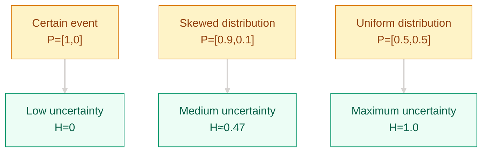

[English](README_EN.md) | [中文](README.md)

# Why Raw Scores Alone Were No Longer Enough — Probability and Information Theory Fundamentals

## Where This Problem Came From

> In 1763, Bayes established the basic framework for inverse probability; in 1948, Shannon turned “uncertainty” into something measurable with information entropy. By the deep learning era, cross-entropy, KL divergence, and maximum likelihood estimation had reappeared inside loss functions, Softmax, and regularization as the mathematical core of what the model is actually optimizing.

## Learning Goals

After completing this chapter, you should be able to answer:

1. Why can cross-entropy be used as a classification loss?
2. What does KL divergence measure, and why is it asymmetric?
3. Why are maximum likelihood estimation and minimizing cross-entropy the same thing?

## 1. Intuition

Imagine you are a weather forecaster. Every day you must predict "what is the probability of rain tomorrow."

- **Information entropy** measures the inherent uncertainty of the weather itself — if it rains 365 days a year, entropy is low (easy to predict); if sunny and rainy days are split evenly, entropy is high (hard to predict).
- **Cross-entropy** measures the gap between your forecast and the actual weather — if you say 90% chance of rain and it rains, cross-entropy is low; if you say 10% chance and it rains, cross-entropy is high.
- **KL divergence** measures "how much extra cost you pay by using your forecast in place of the true weather distribution."

> Key takeaway: information theory is not about "how much information there is," but about "how much uncertainty there is and how accurate your prediction is."

## 2. Mechanism

### 2.1 Probability Basics

**Random variable**: a variable whose value is determined by a random experiment. Discrete (die roll) and continuous (height, weight).

**Probability distribution**: each possible value is assigned a probability.
- Discrete: P(X=x), sum of all probabilities = 1
- Continuous: f(x), integral = 1

**Expectation and variance**:
$$E[X] = \sum_x x \cdot P(X=x) \quad \text{(discrete)}$$
$$\text{Var}(X) = E[(X - E[X])^2] = E[X^2] - (E[X])^2$$

**Common distributions at a glance**:

| Distribution | Formula | Intuition | Role in deep learning |
|--------------|---------|-----------|----------------------|
| Bernoulli | P(X=1)=p, P(X=0)=1-p | Coin flip | Binary classification labels |
| Uniform | f(x)=1/(b-a) | All values equally likely | Starting point for weight initialization |
| Gaussian | f(x)=(1/√2πσ²)e^{-(x-μ)²/2σ²} | Bell curve | Weight initialization, VAE latent space, noise models |

> The Gaussian distribution is everywhere in deep learning: He/Xavier initialization assumes weights follow a Gaussian distribution, the VAE latent space is constrained to a standard Gaussian, and the core of denoising diffusion models is also Gaussian noise.

### 2.2 Bayes' Theorem

**Conditional probability → joint probability → Bayes' formula**:

$$P(A|B) = \frac{P(B|A) \cdot P(A)}{P(B)}$$

Four key concepts ("medical test" analogy):

| Concept | Symbol | Analogy |
|---------|--------|---------|
| Prior | P(A) | Base rate: belief before the test |
| Likelihood | P(B\|A) | Test sensitivity: probability of testing positive given the disease |
| Posterior | P(A\|B) | Probability of actually having the disease after testing positive |
| Evidence | P(B) | Total probability of testing positive |

**Manifestations in deep learning**:
- L2 regularization = MAP estimation assuming a Gaussian prior on weights (see regularization module for details)
- Bayesian neural networks: model uncertainty over weights rather than taking point estimates

### 2.3 Information Entropy

**Intuition**: "On average, how many bits are needed to describe a random variable."

$$H(X) = -\sum_{x} P(x) \log P(x)$$

Properties:
- Higher entropy means higher uncertainty
- The uniform distribution has maximum entropy (all outcomes equally likely, hardest to predict)
- A certain event (P=1) has entropy 0



**Maximum entropy principle**: among all distributions that satisfy given constraints, choose the one with the highest entropy — because you don't want to make assumptions without evidence.

### 2.4 Cross-Entropy and KL Divergence

**Cross-entropy**: the average number of bits needed to encode data from distribution p using distribution q.

$$H(p, q) = -\sum_{x} P(x) \log Q(x)$$

Relationship to entropy:
$$H(p, q) = H(p) + D_{KL}(p \| q)$$

**KL divergence**: "the extra encoding cost of using q to approximate p."

$$D_{KL}(p \| q) = \sum_{x} P(x) \log \frac{P(x)}{Q(x)} = H(p, q) - H(p)$$

Key properties:
- Non-negativity: $D_{KL}(p \| q) \geq 0$, with equality if and only if p = q
- **Asymmetry**: $D_{KL}(p \| q) \neq D_{KL}(q \| p)$

**Forward vs Reverse KL intuition**:

| | Forward KL: $D_{KL}(p \| q)$ | Reverse KL: $D_{KL}(q \| p)$ |
|---|------|------|
| Behavior | q must cover all modes of p | q finds one mode of p and fits it tightly |
| Result | Tends toward "better safe than sorry" | Tends toward "precision over recall" |
| Applications | Variational inference (VAE) | Knowledge distillation, reinforcement learning |

> Linked to loss functions: cross-entropy loss $L = -\sum y_k \log \hat{y}_k$ is exactly $H(y, \hat{y})$; the model is learning to make the predicted distribution $\hat{y}$ as close as possible to the true distribution $y$.

> Remember this: cross-entropy = entropy + KL divergence, so minimizing cross-entropy is really about pushing the predicted distribution toward the true one.

### 2.5 Maximum Likelihood Estimation

**Core idea**: find the parameters that maximize the probability of observing the data.

$$\hat{\theta}_{MLE} = \arg\max_{\theta} P(D|\theta) = \arg\max_{\theta} \prod_{i=1}^{N} P(x_i|\theta)$$

Take the logarithm (product becomes sum, easier to optimize):

$$\hat{\theta}_{MLE} = \arg\max_{\theta} \sum_{i=1}^{N} \log P(x_i|\theta)$$

**Equivalence to cross-entropy**: for classification problems, maximizing likelihood = minimizing cross-entropy.

$$\max \sum \log P(y_i|x_i, \theta) \iff \min -\sum \log P(y_i|x_i, \theta) = \min H(y, \hat{y})$$

This is why cross-entropy works as a classification loss — it is not an ad-hoc design, but the natural consequence of maximum likelihood estimation.

**MAP estimation**: add a prior, the probabilistic explanation of regularization:

$$\hat{\theta}_{MAP} = \arg\max_{\theta} [\log P(D|\theta) + \log P(\theta)]$$

If the prior $P(\theta)$ is Gaussian, $\log P(\theta)$ is exactly the L2 regularization term. **Regularization = you are using prior knowledge to constrain the model**.

### 2.6 Mutual Information

$$I(X; Y) = H(X) - H(X|Y) = D_{KL}(p(x,y) \| p(x)p(y))$$

**Intuition**: "how much does the uncertainty of X decrease after knowing Y."

- If X and Y are independent, $I(X;Y) = 0$ (knowing Y doesn't help with X)
- If X = Y, $I(X;Y) = H(X)$ (completely certain)

**Applications**:
- Feature selection: choose features with the highest mutual information with the label
- InfoNCE contrastive loss: maximize mutual information between the query and positive sample keys (linked to the loss functions module)

### 2.7 Progressive Implementation

**Step 1 · Pure NumPy implementation of entropy, cross-entropy, and KL divergence**

```python
import numpy as np

def entropy(p):
    """Information entropy H(p)"""
    p = np.clip(p, 1e-10, 1.0)  # avoid log(0)
    return -np.sum(p * np.log2(p))

def cross_entropy(p, q):
    """Cross-entropy H(p, q)"""
    q = np.clip(q, 1e-10, 1.0)
    return -np.sum(p * np.log2(q))

def kl_divergence(p, q):
    """KL divergence D_KL(p || q)"""
    q = np.clip(q, 1e-10, 1.0)
    return np.sum(p * np.log2(p / q))

# Example: weather distribution
p_true = np.array([0.7, 0.3])   # true distribution: 70% rain
q_pred = np.array([0.8, 0.2])   # predicted distribution: 80% rain
q_bad  = np.array([0.2, 0.8])   # bad prediction: 20% rain

print(f"H(p)      = {entropy(p_true):.4f} bits")
print(f"H(p, q)   = {cross_entropy(p_true, q_pred):.4f} bits")
print(f"H(p, q_bad) = {cross_entropy(p_true, q_bad):.4f} bits")
print(f"D_KL(p||q) = {kl_divergence(p_true, q_pred):.4f}")
print(f"D_KL(p||q_bad) = {kl_divergence(p_true, q_bad):.4f}")
# Bad prediction q_bad has higher cross-entropy and KL divergence
```

**Step 2 · MLE fitting of a Gaussian distribution**

```python
import numpy as np

np.random.seed(42)

# Sample from a true Gaussian distribution
true_mu, true_sigma = 5.0, 2.0
data = np.random.normal(true_mu, true_sigma, size=1000)

# MLE estimates: MLE for mu is the sample mean, MLE for sigma is the sample std
mu_mle = np.mean(data)
sigma_mle = np.std(data)  # note: MLE uses 1/N not 1/(N-1)

print(f"True parameters: mu={true_mu}, sigma={true_sigma}")
print(f"MLE estimates: mu={mu_mle:.4f}, sigma={sigma_mle:.4f}")
# The larger the sample size, the closer MLE gets to the true values
```

**Step 3 · PyTorch bridge to `F.cross_entropy`**

```python
import torch
import torch.nn.functional as F

# Model outputs logits (not yet passed through softmax)
logits = torch.tensor([[2.0, 1.0, 0.1]])

# True label
labels = torch.tensor([0])  # correct class is class 0

# PyTorch CrossEntropyLoss = log_softmax + NLLLoss
loss = F.cross_entropy(logits, labels)
print(f"CrossEntropy loss: {loss.item():.4f}")

# Manual verification: softmax first, then negative log
probs = F.softmax(logits, dim=-1)
manual_loss = -torch.log(probs[0, labels[0]])
print(f"Manual calculation: {manual_loss.item():.4f}")
# The two should match (PyTorch internally uses log-sum-exp for better stability)
```

**Step 4 · Production-grade numerical stability and shape safety**

```python
# Solve the problem: keep batched logits numerically stable and labels shape-aligned
import torch
import torch.nn.functional as F

logits = torch.tensor([[20.0, -3.0, 0.5], [0.1, 0.2, 0.3]], dtype=torch.float32)
labels = torch.tensor([0, 2], dtype=torch.long)

log_probs = F.log_softmax(logits, dim=-1)
nll = -log_probs[torch.arange(labels.size(0)), labels]
loss = nll.mean()
print(f"stable_ce={loss.item():.4f}")
```

## 3. Engineering Pitfalls (Sorted by Severity)

1. Taking `log` on zero probabilities directly -> `log(0)` turns into `-inf`, and entropy or cross-entropy calculations become NaN  
   Fix: clip probabilities with an epsilon first, for example `np.clip(p, 1e-10, 1.0)`; `F.cross_entropy` already handles this internally.

2. Treating KL divergence like a symmetric distance -> using the wrong direction in VAEs, distillation, or policy optimization distorts the training objective  
   Fix: decide first whether you need mode coverage or mode seeking, then choose `D_{KL}(p \| q)` or `D_{KL}(q \| p)` accordingly.

3. Computing `log(softmax(x))` naively -> tiny probabilities underflow and the entropy estimate becomes numerically unstable, especially in FP16  
   Fix: prefer `log_softmax` or the framework's built-in cross-entropy implementation.  
   → See [Numerical Precision](../numerical-precision/README.md)

4. Assuming MLE is always the best estimate -> small-sample settings ignore prior constraints and overfit the observed data too easily  
   Fix: in low-data regimes, treat MAP as “MLE plus a prior” and use priors or regularization to constrain the solution space.  
   → See [Regularization](../regularization/README.md)

## Evolution Notes

> **The legacy of probability and information theory**: when Shannon founded information theory in 1948, he was trying to solve encoding efficiency problems in communication. Yet cross-entropy and KL divergence later became the mathematical foundation of deep learning loss functions — far beyond his original intent.
>
> The equivalence MLE = minimizing cross-entropy unifies "probabilistic modeling" and "neural network training" within the same framework. You don't need to memorize two separate theories — they are just different phrasings of the same thing.
>
> **New problems left behind**: cross-entropy measures "how accurate the prediction is," but the model outputs raw scores (logits), not probabilities — how do we turn logits into probabilities? This leads to deep learning basics.

→ Next: [Deep Learning Basics — Why Linear Models Fall Short](../deep-learning-basics/README_EN.md)

---

**Previous**: [Prerequisites Overview](../README_EN.md) | **Next**: [Deep Learning Basics](../deep-learning-basics/README_EN.md)
