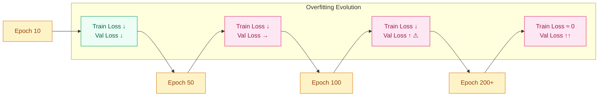
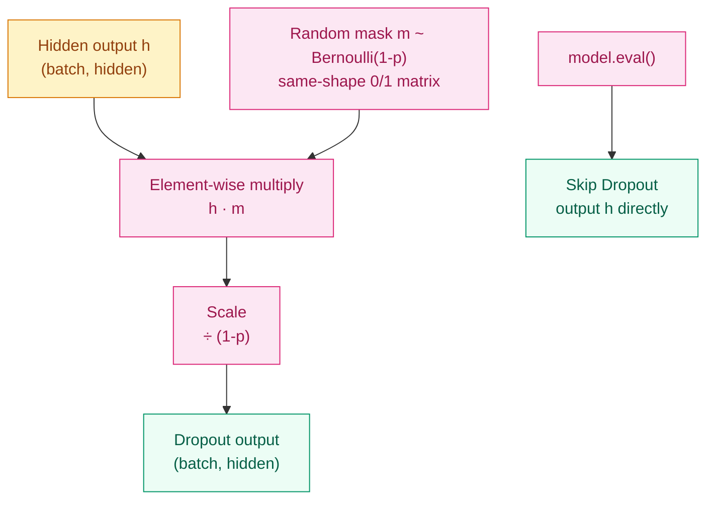

[English](README_EN.md) | [中文](README.md)

# Why Do Models Memorize? — Regularization & Dropout

## Where This Problem Comes From

> In 2012, Hinton’s group observed a strange phenomenon while training deep networks: training loss could approach zero, yet test loss started rising. The model hadn’t failed to learn — it had simply memorized the training data. This is called **overfitting**.
> That same year they proposed Dropout: randomly dropping a fraction of neurons during training to force the network to learn more robust features. This idea, almost suspiciously simple, later became the most widely used regularization technique in deep learning.

## Learning Objectives

After completing this chapter, you should be able to answer:

1. Why are large models prone to overfitting? Where is the tension between capacity and generalization?
2. How does inverted dropout work, and why must it be turned off during inference?
3. From what angles do L2 regularization and Dropout suppress overfitting?
4. What scenarios do DropConnect, SpatialDropout, and DropBlock each address?
5. Which regularization method should you choose, and when?

---

## 1. Intuition

Imagine two students preparing for an exam.

Student A memorizes the answer to every practice problem — scores 100% on the workbook, but is lost when faced with a new test. Student B occasionally wears a blindfold while studying — unable to see neighboring notes, they must derive things independently. Student B ends up more stable on exam day.

**Overfitting** is Student A: the model memorizes the training data without learning the underlying pattern. **Dropout** is the blindfolded practice: randomly silencing some neurons each time forces the remaining ones to learn to complete the task independently.

**L2 weight decay** takes a different path: it sets a "weight ceiling" on every parameter, preventing any single weight from growing too large. It is like putting the model on a diet — not letting it cheat by relying on one oversized parameter.

**Variant intuition**: DropConnect does not blindfold the eyes (dropping activations) but binds the hands and feet (dropping weight connections) — more aggressive, but also slower.

---

## 2. Mechanics

### 2.1 Diagnosing and Root-Causing Overfitting



The root cause of overfitting is **model capacity > information provided by the data**. The more parameters and the less data, the more "spare capacity" the model has to memorize noise instead of learning patterns.

Diagnosis is simple: plot training loss and validation loss curves. When the two lines diverge — training loss keeps dropping while validation loss plateaus or rises — that is the signal of overfitting.

> Key takeaway: regularization is not about "making the model worse"; it is about "limiting effective capacity" so the model spends its limited capacity on learning patterns rather than memorizing noise.

### 2.2 Dropout: Core Mechanism



Inverted Dropout works in three steps:

1. Generate mask: $m_i \sim \text{Bernoulli}(1-p)$, i.e. each neuron is kept with probability $1-p$
2. Element-wise multiply: $\tilde{h}_i = m_i \cdot h_i$
3. Scale: $\tilde{h}_i = \frac{m_i \cdot h_i}{1-p}$

**Why divide by $(1-p)$?** This is the key to inverted dropout: the scaling is done during training, so no adjustment is needed at inference time. Without this step, inference would require multiplying by $(1-p)$ to compensate — easy to forget and easy to get wrong.

From a Bayesian perspective, Dropout approximates **model averaging** over an exponential number of sub-networks. Each random dropout pattern trains a different sub-network; using all neurons at inference approximates averaging the predictions of all those sub-networks.

> Key takeaway: Dropout must be disabled at inference — it is not about adding noise to the network, but about approximating model averaging. Forgetting `model.eval()` causes predictions to jitter randomly.

### 2.3 Weight Decay (L2 Regularization)

Add a penalty on parameter magnitude to the loss:

$$
L_{reg} = L + \frac{\lambda}{2}\|\theta\|^2
$$

During gradient updates an extra term $\lambda \theta$ appears, which subtly pulls weights toward zero every step — hence the name "decay."

**Comparison with Dropout**:

| Dimension | L2 Regularization | Dropout |
|-----------|-------------------|---------|
| Target | Parameter magnitude | Neuron activation |
| Intuition | Do not allow any weight to grow too large | Do not allow any neuron to become too important |
| Theory | Parameter-space constraint (MAP approximation) | Ensemble-learning approximation |
| Applicable layers | All layers | Usually fully-connected layers |
| Inference overhead | None | None (disabled) |

In PyTorch, `optimizer = torch.optim.AdamW(model.parameters(), lr=1e-3, weight_decay=1e-2)` uses `weight_decay` as the L2 strength $\lambda$. Use `AdamW` rather than `Adam + weight_decay` — AdamW decouples weight decay from the gradient update, making it more stable (Loshchilov & Hutter, 2019).

### 2.4 Variant Evolution

**DropConnect (2013, Wan et al.)**

Instead of dropping activations, DropConnect drops **individual elements of the weight matrix**. It is more aggressive than Dropout — each forward pass uses a random sparse substructure of the network.

$$
\tilde{W} = M \odot W
$$

where $M$ is a Bernoulli mask with the same shape as $W$.

Advantage: stronger regularization. Cost: more complex implementation, slower training, and relatively rare in practice.

**SpatialDropout (2014)**

Standard Dropout drops individual pixels independently, but in CNN feature maps neighboring pixels are highly correlated — dropping one pixel leaves almost identical information in its neighbor.

SpatialDropout drops **entire channels**: with probability $p$, an entire feature-map channel is set to zero. This forces the network not to rely on any single channel.

```python
# Standard Dropout vs SpatialDropout
nn.Dropout(p)           # each pixel dropped independently
nn.Dropout2d(p)         # entire channel dropped together
```

**DropBlock (2018, Ghose et al.)**

SpatialDropout drops whole channels, but sometimes feature correlations are localized (e.g. a cat’s ear occupies only a small patch of the feature map).

DropBlock drops **contiguous square regions**. The `block_size` parameter controls region size; it generalizes SpatialDropout (`block_size=1` becomes standard Dropout, `block_size=feature_size` becomes SpatialDropout).

**Dropout in RNNs (2014, Zaremba et al.)**

Recurrent connections are the channels through which information passes across time steps. Adding Dropout here risks dropping critical information at every step, destroying long-range dependencies.

Zaremba’s solution: apply Dropout **only to non-recurrent connections** (between layers), not on recurrent connections. This provides regularization without disrupting temporal information flow.

```python
# PyTorch LSTM/GRU implements this strategy natively
nn.LSTM(input_size, hidden_size, num_layers=2, dropout=0.3)
# dropout is applied only between layers (non-recurrent)
```

### 2.5 Other Regularization Methods (Briefly)

**Early Stopping**: stop training when validation loss fails to improve for $N$ consecutive epochs. $N$ is called patience. This is the simplest and most widely used regularization — rather than limiting model capacity, you simply stop before memorization begins.

**Data Augmentation**: apply random transformations to training data (random crops, flips, color jitter for images; synonym replacement, back-translation for text), effectively creating more samples from limited data. Many experiments show data augmentation regularizes better than Dropout.

**Label Smoothing**: soften hard labels `[0, 1, 0]` to `[0.1, 0.8, 0.1]`, preventing the model from becoming overconfident in any single class. Almost standard in Transformer training.

> Key takeaway: there is no silver-bullet regularizer. Effectiveness depends on the combination of data, model, and task. The most common combo is Data Augmentation + Weight Decay + Early Stopping.

## 3. Progressive Implementation

**Step 1 · Pure NumPy inverted dropout (core logic, standalone)**

```python
# Implement inverted dropout: mask+scale during training, pass-through during inference
import numpy as np

np.random.seed(42)

def dropout_forward(x, p=0.5, training=True):
    # x: (batch, hidden), p: drop probability
    if not training or p == 0:
        return x
    mask = (np.random.rand(*x.shape) > p).astype(x.dtype)
    return x * mask / (1 - p)

h = np.random.randn(4, 8)
print("Training mode:", dropout_forward(h, p=0.5, training=True))
print("Inference mode:", dropout_forward(h, p=0.5, training=False))
```

**Step 2 · PyTorch `nn.Dropout` + train/eval switching**

```python
# Compare manual vs built-in PyTorch, verifying train/eval mode behavior
import torch
import torch.nn as nn

torch.manual_seed(42)

DROPOUT_P = 0.3

layer = nn.Dropout(DROPOUT_P)
x = torch.ones(4, 8)

layer.train()
out_train = layer(x)
print(f"Training mode (non-zero ratio): {(out_train != 0).float().mean():.2f}")

layer.eval()
out_eval = layer(x)
print(f"Inference mode (identical to input): {torch.allclose(out_eval, x)}")
```

**Step 3 · SpatialDropout in CNNs**

```python
# SpatialDropout drops whole channels, matching spatial correlations in CNN feature maps
import torch
import torch.nn as nn

torch.manual_seed(42)

DROPOUT_P = 0.2

layer = nn.Dropout2d(DROPOUT_P)
x = torch.randn(4, 32, 8, 8)  # (batch, channels, H, W)

layer.train()
out = layer(x)
# dropped channels are entirely zero
zero_channels = (out == 0).all(dim=(2, 3))  # (batch, channels)
print(f"Ratio of dropped channels: {zero_channels.float().mean():.2f}")
```

**Step 4 · Comparative experiment: train/val loss under different Dropout rates**

```python
# Verify how Dropout rate affects overfitting
# Same MLP, only dropout rate changes, compare train/val loss curves
import torch
import torch.nn as nn
import matplotlib.pyplot as plt

torch.manual_seed(42)

# --- data ---
X = torch.randn(1000, 20)
y = (X[:, 0] + X[:, 1] > 0).long()
train_X, val_X = X[:800], X[800:]
train_y, val_y = y[:800], y[800:]


def make_model(dropout_p):
    return nn.Sequential(
        nn.Linear(20, 256),
        nn.ReLU(),
        nn.Dropout(dropout_p),
        nn.Linear(256, 256),
        nn.ReLU(),
        nn.Dropout(dropout_p),
        nn.Linear(256, 2),
    )


rates = [0.0, 0.2, 0.5, 0.8]
fig, axes = plt.subplots(1, 4, figsize=(16, 4), sharey=True)

for ax, p in zip(axes, rates):
    model = make_model(p)
    opt = torch.optim.Adam(model.parameters(), lr=1e-3)
    train_losses, val_losses = [], []

    for epoch in range(200):
        model.train()
        loss = nn.functional.cross_entropy(model(train_X), train_y)
        opt.zero_grad()
        loss.backward()
        opt.step()
        train_losses.append(loss.item())

        model.eval()
        with torch.no_grad():
            val_loss = nn.functional.cross_entropy(model(val_X), val_y)
        val_losses.append(val_loss.item())

    ax.plot(train_losses, label="train")
    ax.plot(val_losses, label="val")
    ax.set_title(f"dropout={p}")
    ax.legend()
    ax.set_xlabel("epoch")

axes[0].set_ylabel("loss")
plt.suptitle("Train/Val Loss Comparison Under Different Dropout Rates")
plt.tight_layout()
plt.savefig("dropout_comparison.png", dpi=150)
```

---

## 4. Engineering Pitfalls (Sorted by Severity)

1. **Dropout rate too high (> 0.5)** → shallow networks underfit and training loss stops decreasing
   Fix: start at 0.2–0.3, observe the train/val gap, then decide whether to increase.

2. **Forgetting `model.eval()`** → Dropout remains active at inference, giving different predictions every time
   Fix: always call `model.eval()` before inference, and `model.train()` afterward if needed.

3. **weight_decay + Adam interaction** → standard Adam couples weight decay with adaptive learning rates, making it unstable
   Fix: use `AdamW` instead of `Adam + weight_decay` to decouple weight decay.

4. **Bad ordering of BatchNorm and Dropout** → Dropout alters the activation distribution and disturbs BatchNorm statistics, causing unstable training
   Fix: recommended order is `Linear → BN → ReLU → Dropout` — stabilize distribution first, then regularize.

5. **Dropout placed wrong in RNNs** → adding Dropout on recurrent connections destroys long-range dependencies
   Fix: use PyTorch LSTM/GRU’s `dropout` parameter (only between layers), or manually add it only to non-recurrent connections.

---

## Evolution Notes

> **Regularization's legacy**: starting with Dropout in 2012, regularization evolved from "manually adding noise" to "adaptive regularization" — BatchNorm stabilizes training while providing implicit regularization, and data augmentation evolved from random crops to semantic-level augmentations like MixUp and CutMix.
>
> **New question left behind**: in the large-model era (GPT-4 scale), Dropout is almost never used — why? Because when data is abundant and training is long enough, the model no longer has spare capacity to memorize noise. The premise of overfitting (data < capacity) no longer holds. The focus of regularization has shifted from "limiting the model" to "improving data quality."

→ Next chapter: [Embeddings — Why Are "Apple" and "Orange" Neighbors in Vector Space?](../embeddings/README_EN.md)

---

**Previous**: [Residual Connections](../residual-connections/README_EN.md) | **Next**: [Embeddings](../embeddings/README_EN.md)
