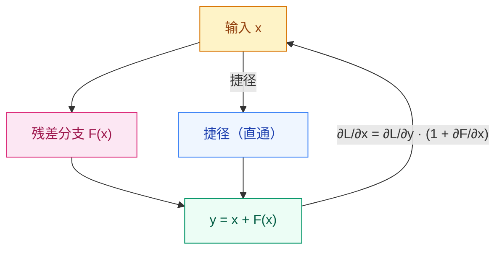

# 为什么要把输入"抄近路"送回去？—— 残差连接

## 这个问题从哪来

> 2015 年，He 等人发现了一个反直觉的现象：把网络从 20 层加深到 56 层，训练误差反而变高了。这不是过拟合（测试误差也高了），而是**退化问题**——更深的网络居然学不到更优解。
> 他们的解决方案极其简单：给每一层加一条"捷径"（shortcut），让输出至少可以等于输入。这就是残差连接（Residual Connection），它让 ResNet 成功训练到 152 层，并赢得了当年 ImageNet 冠军。

## 学习目标

完成本章后，你应能回答：

1. 从梯度推导解释为什么残差连接能缓解梯度消失？
2. projection shortcut 在什么场景下使用？
3. Pre-LN vs Post-LN 对训练稳定性有什么影响？

---

## 1. 直觉

残差连接是一条"跳板"。

想象你在一栋楼里搬东西上楼。普通网络要求每一层都必须把东西完整地搬到下一层——如果某一层手滑了，东西就丢了。残差连接相当于在每层之间架了一条滑梯：即使某一层什么有用的事都没做，原始物品至少可以通过滑梯无损传递到楼下。

关键洞察：让一层学 $F(x)$ 很难，但让它学 $F(x) = H(x) - x$（残差）容易得多。如果某一层的最优变换恰好是恒等映射，那 $F(x) = 0$ 远比 $F(x) = x$ 更容易学到（权重全部趋向 0 即可）。

> 你要记住：残差连接的核心不是"学残差更简单"，而是它提供了一条梯度恒为 1 的直通通道——梯度不需要经过任何权重矩阵就能回传。

---

## 2. 机制

### 2.1 公式与梯度推导

**前向传播**：

$$
y = x + F(x, W)
$$

其中 $F(x, W)$ 是残差分支（通常包含 2-3 层卷积/线性层 + 激活函数）。

**反向传播**：

$$
\frac{\partial L}{\partial x} = \frac{\partial L}{\partial y} \cdot \frac{\partial y}{\partial x} = \frac{\partial L}{\partial y} \cdot \left(1 + \frac{\partial F}{\partial x}\right)
$$

关键：即使 $\frac{\partial F}{\partial x}$ 很小甚至为 0，梯度仍然至少有 $\frac{\partial L}{\partial y} \cdot 1$——残差连接提供了一条**梯度直通通道**，梯度至少以原始强度回传。

对比没有残差连接时：

$$
\frac{\partial L}{\partial x} = \frac{\partial L}{\partial y} \cdot \frac{\partial F}{\partial x}
$$

如果 $\frac{\partial F}{\partial x} < 1$，经过多层连乘后梯度指数衰减。



> 你要记住：`1 + ∂F/∂x` 中的 `1` 是残差连接的灵魂——它保证梯度永远不会完全消失。

### 2.2 Projection Shortcut

当 $x$ 和 $F(x)$ 的维度不同时（比如通道数变化或空间下采样），不能直接相加。需要用 projection 将 $x$ 映射到与 $F(x)$ 相同的维度：

$$
y = W_s x + F(x, W)
$$

$W_s$ 通常是 $1 \times 1$ 卷积（CNN 中）或线性投影（Transformer 中）。

三种策略（ResNet 论文对比）：
- **A**：维度相同时用恒等 shortcut，不同时用 zero-padding（不增加参数）
- **B**：维度相同时用恒等 shortcut，不同时用 projection（推荐）
- **C**：所有 shortcut 都用 projection（效果略好但参数更多）

> 实践中 B 是最佳性价比：只在维度变化时加 projection。

### 2.3 DenseNet 对比

DenseNet（Huang et al., 2017）更进一步：不只是跳一层，而是每一层都和前面所有层直接连接。

$$
x_l = H_l([x_0, x_1, \ldots, x_{l-1}])
$$

其中 $[\cdot]$ 是 channel 维度上的拼接（concatenation）。

与 ResNet 的区别：
- ResNet：加法融合（`x + F(x)`），信息混合
- DenseNet：拼接融合，原始信息完整保留
- DenseNet 的优势：特征复用，参数更少；劣势：显存消耗更大（特征图不断拼接）

### 2.4 在 Transformer 中的应用

Transformer 的每个 block 都使用残差连接：

**Post-LN**（原始 Transformer）：
$$
y = \text{LN}(x + \text{Sublayer}(x))
$$

**Pre-LN**（GPT-2 之后主流）：
$$
y = x + \text{Sublayer}(\text{LN}(x))
$$

注意 Pre-LN 中残差路径是 `y = x + ...`，归一化在子层内部，不影响直通路径。这让梯度可以畅通无阻地经过整条残差链。

---

## 3. 渐进式实现

**Step 1 · 最小残差块**

```python
import torch
import torch.nn as nn

class ResBlock(nn.Module):
    """最简残差块：两层线性 + ReLU，输入输出同维度"""

    def __init__(self, dim):
        super().__init__()
        self.net = nn.Sequential(
            nn.Linear(dim, dim),
            nn.ReLU(),
            nn.Linear(dim, dim),
        )

    def forward(self, x):
        return x + self.net(x)  # 核心：x + F(x)

dim = 64
block = ResBlock(dim)
x = torch.randn(4, dim)
out = block(x)
print(f"输入 shape: {x.shape}, 输出 shape: {out.shape}")
```

**Step 2 · 带 Projection 的残差块（维度变化时）**

```python
import torch
import torch.nn as nn

class ResBlockProjection(nn.Module):
    """维度变化时的残差块：用 1x1 投影对齐维度"""

    def __init__(self, in_dim, out_dim):
        super().__init__()
        self.branch = nn.Sequential(
            nn.Linear(in_dim, out_dim),
            nn.ReLU(),
            nn.Linear(out_dim, out_dim),
        )
        self.shortcut = nn.Linear(in_dim, out_dim) if in_dim != out_dim else nn.Identity()

    def forward(self, x):
        return self.shortcut(x) + self.branch(x)

block = ResBlockProjection(64, 128)
x = torch.randn(4, 64)
print(f"输入: {x.shape} → 输出: {block(x).shape}")
```

**Step 3 · 梯度流对比实验**

```python
import torch
import torch.nn as nn

torch.manual_seed(42)

DEPTH = 20
DIM = 32

# 无残差：20 层全连接
plain_net = nn.Sequential(*[
    nn.Sequential(nn.Linear(DIM, DIM), nn.ReLU())
    for _ in range(DEPTH)
])

# 有残差：20 层残差块
res_net = nn.Sequential(*[
    ResBlock(DIM)
    for _ in range(DEPTH)
])

x = torch.randn(8, DIM)
y = torch.randn(8, DIM)
loss_fn = nn.MSELoss()

# 对比梯度范数
for name, net in [("无残差", plain_net), ("有残差", res_net)]:
    net.zero_grad()
    loss = loss_fn(net(x), y)
    loss.backward()
    # 取第一层的权重梯度范数
    first_grad = list(net.parameters())[0].grad.norm().item()
    print(f"{name}: loss={loss.item():.4f}, 第一层梯度范数={first_grad:.6f}")
# 有残差的第一层梯度范数应显著大于无残差
```

**Step 4 · Transformer 风格的 Pre-LN 残差块**

```python
import torch
import torch.nn as nn

class TransformerBlock(nn.Module):
    """简化的 Transformer block（Pre-LN 风格）"""

    def __init__(self, dim, num_heads=4):
        super().__init__()
        self.ln1 = nn.LayerNorm(dim)
        self.attn = nn.MultiheadAttention(dim, num_heads, batch_first=True)
        self.ln2 = nn.LayerNorm(dim)
        self.ffn = nn.Sequential(
            nn.Linear(dim, dim * 4),
            nn.GELU(),
            nn.Linear(dim * 4, dim),
        )

    def forward(self, x):
        # Pre-LN: LN 在 sublayer 内部，残差路径无阻碍
        x = x + self.attn(self.ln1(x), self.ln1(x), self.ln1(x))[0]
        x = x + self.ffn(self.ln2(x))
        return x

dim = 64
block = TransformerBlock(dim)
x = torch.randn(2, 10, dim)  # (batch, seq_len, dim)
out = block(x)
print(f"Transformer block: {x.shape} → {out.shape}")
```

---

## 4. 工程陷阱（按严重度排序）

1. **维度不匹配时忘记加 projection**
   现象：`x + F(x)` 报错 shape mismatch。
   处置：`x` 和 `F(x)` 维度不同时，必须加线性投影或 1×1 卷积对齐。用 `nn.Identity()` 作为无变化时的 shortcut。

2. **Pre-LN vs Post-LN 混淆**
   现象：看论文用 Pre-LN，代码实现用 Post-LN（或反过来），训练稳定性差异大。
   处置：Pre-LN 是当前主流（GPT-2、LLaMA），先 LN 再进子层。注意残差路径上不能有归一化操作。

3. **残差连接加在错误的位置**
   现象：把 `x + F(x)` 写成 `F(x + x)`（在 F 内部加，没有跨越 F）。
   处置：残差必须**绕过** F，从 F 的输入直接连到 F 的输出。

4. **DenseNet 式拼接导致显存爆炸**
   现象：每一层都拼接前面所有层的输出，channel 数线性增长。
   处置：控制 growth rate（每层只产生少量新 channel），定期用 transition layer 压缩。

> 你要记住：残差连接的检查标准——梯度从 loss 回到第一层时，至少有一条路径上没有权重矩阵相乘。

---

## 演进笔记

> **这一技术的遗产**：残差连接让网络可以无限加深（理论上），直接催生了 ResNet（152 层）、DenseNet（264 层）。后来 Transformer 的每个 block 都使用残差连接，从 BERT 到 GPT-4 无一例外。
>
> DenseNet 的特征复用思想后来也影响了 Dense Retrieval 和特征金字塔网络（FPN）。U-Net 的 skip connection 虽然动机不同（融合不同分辨率特征），但形式上也是残差连接的变体。
>
> **留下的新问题**：残差连接和归一化解决了深层网络的训练问题。但 MLP 对数据结构没有任何假设——图像的局部性和序列的时序性都被忽略。这两个盲区催生了下一阶段的 CNN 和 RNN。

→ 下一章：[激活函数家族](../activation-functions/README.md)

---

**上一章**：[归一化机制](../normalization/README.md) | **下一章**：[激活函数家族](../activation-functions/README.md)
