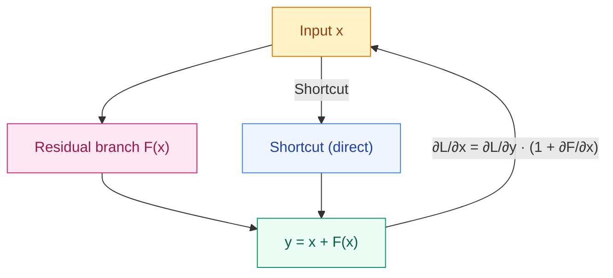

[English](README_EN.md) | [中文](README.md)

# Why Take a Shortcut with the Input? — Residual Connections

## Where This Problem Comes From

> In 2015, He et al. discovered a counter-intuitive phenomenon: increasing a network from 20 layers to 56 layers actually increased training error. This was not overfitting (test error also increased), but the **degradation problem** — deeper networks were unable to learn a better solution.
> Their solution was remarkably simple: add a "shortcut" to every layer so the output can at least equal the input. This is the residual connection (Residual Connection), which allowed ResNet to successfully train up to 152 layers and win the ImageNet championship that year.

## Learning Objectives

After completing this chapter, you should be able to answer:

1. Explain from gradient derivation why residual connections alleviate vanishing gradients.
2. In what scenarios is a projection shortcut used?
3. What impact does Pre-LN vs Post-LN have on training stability?

---

## 1. Intuition

A residual connection is a "springboard."

Imagine you're moving things upstairs in a building. A plain network requires every layer to completely carry things to the next layer — if a layer slips, things are lost. A residual connection is like installing a slide between every floor: even if a layer does nothing useful, the original item can at least pass through the slide intact to the floor below.

Key insight: making a layer learn $F(x)$ is hard, but making it learn $F(x) = H(x) - x$ (the residual) is much easier. If the optimal transformation for a layer happens to be the identity mapping, then $F(x) = 0$ is far easier to learn than $F(x) = x$ (weights simply trend toward 0).

> Key takeaway: the core of residual connections is not that "learning residuals is easier," but that they provide a direct path where the gradient is always 1 — gradients can backpropagate without passing through any weight matrix.

---

## 2. Mechanics

### 2.1 Formula and Gradient Derivation

**Forward pass:**

$$
y = x + F(x, W)
$$

Where $F(x, W)$ is the residual branch (usually containing 2-3 convolutional/linear layers + activation functions).

**Backward pass:**

$$
\frac{\partial L}{\partial x} = \frac{\partial L}{\partial y} \cdot \frac{\partial y}{\partial x} = \frac{\partial L}{\partial y} \cdot \left(1 + \frac{\partial F}{\partial x}\right)
$$

Key point: even if $\frac{\partial F}{\partial x}$ is very small or even 0, the gradient still has at least $\frac{\partial L}{\partial y} \cdot 1$ — the residual connection provides a **direct gradient highway**, so gradients backpropagate with at least their original strength.

Compare without a residual connection:

$$
\frac{\partial L}{\partial x} = \frac{\partial L}{\partial y} \cdot \frac{\partial F}{\partial x}
$$

If $\frac{\partial F}{\partial x} < 1$, after multi-layer multiplication the gradient decays exponentially.



> Key takeaway: the `1` in `1 + ∂F/∂x` is the soul of the residual connection — it guarantees the gradient can never completely vanish.

### 2.2 Projection Shortcut

When the dimensions of $x$ and $F(x)$ differ (e.g., channel count changes or spatial downsampling), they cannot be added directly. A projection is needed to map $x$ to the same dimension as $F(x)$:

$$
y = W_s x + F(x, W)
$$

$W_s$ is usually a $1 \times 1$ convolution (in CNNs) or a linear projection (in Transformers).

Three strategies (compared in the ResNet paper):
- **A**: identity shortcut when dimensions match, zero-padding when they don't (adds no parameters)
- **B**: identity shortcut when dimensions match, projection when they don't (recommended)
- **C**: projection for all shortcuts (slightly better but more parameters)

> In practice, B offers the best cost-performance: only add projection when dimensions change.

### 2.3 DenseNet Comparison

DenseNet (Huang et al., 2017) goes one step further: instead of skipping just one layer, every layer is directly connected to all previous layers.

$$
x_l = H_l([x_0, x_1, \ldots, x_{l-1}])
$$

Where $[\cdot]$ is concatenation along the channel dimension.

Differences from ResNet:
- ResNet: additive fusion (`x + F(x)`), information is mixed
- DenseNet: concatenative fusion, original information is fully preserved
- DenseNet advantages: feature reuse, fewer parameters; disadvantages: larger memory consumption (feature maps keep concatenating)

### 2.4 Application in Transformers

Every block in Transformer uses residual connections:

**Post-LN** (original Transformer):
$$
y = \text{LN}(x + \text{Sublayer}(x))
$$

**Pre-LN** (mainstream after GPT-2):
$$
y = x + \text{Sublayer}(\text{LN}(x))
$$

Note that in Pre-LN the residual path is `y = x + ...`, with normalization inside the sublayer, not affecting the direct path. This allows gradients to flow unimpeded through the entire residual chain.

---

## 3. Progressive Implementation

**Step 1 · Minimal Residual Block**

```python
import torch
import torch.nn as nn

class ResBlock(nn.Module):
    """Minimal residual block: two linear layers + ReLU, same input/output dim"""

    def __init__(self, dim):
        super().__init__()
        self.net = nn.Sequential(
            nn.Linear(dim, dim),
            nn.ReLU(),
            nn.Linear(dim, dim),
        )

    def forward(self, x):
        return x + self.net(x)  # Core: x + F(x)

dim = 64
block = ResBlock(dim)
x = torch.randn(4, dim)
out = block(x)
print(f"Input shape: {x.shape}, output shape: {out.shape}")
```

**Step 2 · Residual Block with Projection (When Dimensions Change)**

```python
import torch
import torch.nn as nn

class ResBlockProjection(nn.Module):
    """Residual block when dimensions change: use 1x1 projection to align dims"""

    def __init__(self, in_dim, out_dim):
        super().__init__()
        self.branch = nn.Sequential(
            nn.Linear(in_dim, out_dim),
            nn.ReLU(),
            nn.Linear(out_dim, out_dim),
        )
        self.shortcut = nn.Linear(in_dim, out_dim) if in_dim != out_dim else nn.Identity()

    def forward(self, x):
        return self.shortcut(x) + self.branch(x)

block = ResBlockProjection(64, 128)
x = torch.randn(4, 64)
print(f"Input: {x.shape} → output: {block(x).shape}")
```

**Step 3 · Gradient Flow Comparison Experiment**

```python
import torch
import torch.nn as nn

torch.manual_seed(42)

DEPTH = 20
DIM = 32

# Without residual: 20-layer MLP
plain_net = nn.Sequential(*[
    nn.Sequential(nn.Linear(DIM, DIM), nn.ReLU())
    for _ in range(DEPTH)
])

# With residual: 20-layer residual block
res_net = nn.Sequential(*[
    ResBlock(DIM)
    for _ in range(DEPTH)
])

x = torch.randn(8, DIM)
y = torch.randn(8, DIM)
loss_fn = nn.MSELoss()

# Compare gradient norms
for name, net in [("No residual", plain_net), ("With residual", res_net)]:
    net.zero_grad()
    loss = loss_fn(net(x), y)
    loss.backward()
    # Take gradient norm of first layer's weights
    first_grad = list(net.parameters())[0].grad.norm().item()
    print(f"{name}: loss={loss.item():.4f}, first-layer grad norm={first_grad:.6f}")
# With residual should have significantly larger first-layer grad norm
```

**Step 4 · Transformer-Style Pre-LN Residual Block**

```python
import torch
import torch.nn as nn

class TransformerBlock(nn.Module):
    """Simplified Transformer block (Pre-LN style)"""

    def __init__(self, dim, num_heads=4):
        super().__init__()
        self.ln1 = nn.LayerNorm(dim)
        self.attn = nn.MultiheadAttention(dim, num_heads, batch_first=True)
        self.ln2 = nn.LayerNorm(dim)
        self.ffn = nn.Sequential(
            nn.Linear(dim, dim * 4),
            nn.GELU(),
            nn.Linear(dim * 4, dim),
        )

    def forward(self, x):
        # Pre-LN: LN inside sublayer, residual path unimpeded
        x = x + self.attn(self.ln1(x), self.ln1(x), self.ln1(x))[0]
        x = x + self.ffn(self.ln2(x))
        return x

dim = 64
block = TransformerBlock(dim)
x = torch.randn(2, 10, dim)  # (batch, seq_len, dim)
out = block(x)
print(f"Transformer block: {x.shape} → {out.shape}")
```

---

## 4. Engineering Pitfalls (Sorted by Severity)

1. **Forgetting to add projection when dimensions mismatch**  
   Symptom: `x + F(x)` raises shape mismatch error.  
   Fix: when `x` and `F(x)` have different dimensions, must add a linear projection or 1×1 convolution to align them. Use `nn.Identity()` as the shortcut when no change is needed.

2. **Confusing Pre-LN vs Post-LN**  
   Symptom: paper uses Pre-LN but code uses Post-LN (or vice versa), leading to large differences in training stability.  
   Fix: Pre-LN is current mainstream (GPT-2, LLaMA); LN first, then into sublayer. Note that there should be no normalization operation on the residual path.

3. **Residual connection placed at the wrong position**  
   Symptom: writing `F(x + x)` (adding inside F, not bypassing F).  
   Fix: the residual must **bypass** F, connecting directly from F's input to F's output.

4. **DenseNet-style concatenation causing memory explosion**  
   Symptom: concatenating outputs from all previous layers at every layer, channel count grows linearly.  
   Fix: control growth rate (each layer produces only a few new channels), and periodically use transition layers to compress.

> Key takeaway: the check standard for residual connections — when gradients travel from loss back to the first layer, there must be at least one path with no weight matrix multiplication.

---

## Evolution Notes

> **This technique's legacy**: residual connections made networks theoretically infinitely deep, directly enabling ResNet (152 layers) and DenseNet (264 layers). Later, every block in Transformer used residual connections, from BERT to GPT-4 without exception.
>
> DenseNet's feature reuse idea also influenced later Dense Retrieval and Feature Pyramid Networks (FPN). U-Net's skip connection, although motivated differently (fusing features at different resolutions), is formally also a variant of residual connection.
>
> **The new problem left behind**: residual connections and normalization solved the training problem for deep networks. But MLPs make no assumptions about data structure — the spatial locality of images and the temporal dependencies of sequences are both ignored. These two blind spots gave rise to the next stage of CNNs and RNNs.

→ Next chapter: [Activation Functions — Why Sigmoid Falls Short](../activation-functions/README.md)

---

**Previous**: [Normalization](../normalization/README_EN.md) | **Next**: [Regularization & Dropout](../regularization/README_EN.md)
