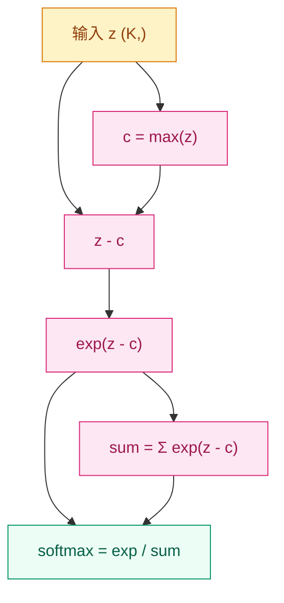

# 为什么多分类不能直接比大小？—— Softmax 与概率分布

## 这个问题从哪来

> 在二分类中，Sigmoid 把任意实数压到 (0,1) 区间，表示"属于正类的概率"。但如果有 10 个类别呢？直接输出 10 个数，它们加起来不等于 1，甚至可能出现负数——根本不是概率。
> Softmax 就是解决这个问题的：它把任意一组实数变成一个合法的概率分布，总和恒为 1。
> 后来 Softmax 成为注意力机制的基石——注意力权重本质上就是用 Softmax 归一化的相似度分数。

## 学习目标

完成本章后，你应能回答：

1. Softmax 的公式是什么，为什么它能保证输出是合法概率？
2. 温度参数 T 如何控制分布的"尖锐"或"平坦"？
3. 手写数值稳定的 Softmax 时，为什么要减最大值？

---

## 1. 直觉

想象一场选秀节目。10 个选手各有一个原始分数（可能是任意实数），但评委需要给出一个"投票分配"——每个人得到一个百分比，加起来等于 100%。Softmax 就是这套投票规则：原始分数越高的人分到的百分比越大，但每个人都至少分到一点（不会是零）。

与 Sigmoid 的关系：Sigmoid 是 Softmax 的二元特例。对两个数 $z_1, z_2$ 做 Softmax，$z_1$ 的概率恰好等于 $\sigma(z_1 - z_2)$。

> 你要记住：Softmax 不是让最大的数更突出，而是把任意实数变成合法概率。它的力量在于"相对比较"——不是看绝对大小，而是看谁比谁大。

---

## 2. 机制

### 2.1 公式

对向量 $z = [z_1, z_2, \ldots, z_K]$：

$$
\text{Softmax}(z_i) = \frac{e^{z_i}}{\sum_{j=1}^{K} e^{z_j}}
$$

三个关键性质：
1. **非负性**：指数函数保证每个输出 $> 0$
2. **归一化**：分母让所有输出之和 $= 1$
3. **保序性**：输入的大小关系不变，最大的 $z_i$ 对应最大的概率

**与 Sigmoid 的关系**：当 $K = 2$ 时：

$$
\text{Softmax}(z_1) = \frac{e^{z_1}}{e^{z_1} + e^{z_2}} = \frac{1}{1 + e^{z_2 - z_1}} = \sigma(z_1 - z_2)
$$

Sigmoid 就是二分类 Softmax（给两个数同时加常数 c，softmax 输出不变——平移不变性）。

**Softmax 的梯度**（后续模块会用到）：

$$
\frac{\partial p_i}{\partial z_j} = p_i(\delta_{ij} - p_j)
$$

其中 $\delta_{ij}$ 是 Kronecker delta。注意：梯度不只有对角线元素——每个输出的梯度都依赖所有输入。

### 2.2 温度参数

引入温度 $T > 0$：

$$
\text{Softmax}(z_i / T) = \frac{e^{z_i/T}}{\sum_{j=1}^{K} e^{z_j/T}}
$$

- $T \to 0^+$：分布趋向 one-hot，只有最大值对应的类得到概率 1
- $T = 1$：标准 softmax
- $T \to \infty$：分布趋向均匀，所有类别概率相等

应用：知识蒸馏（Knowledge Distillation）用高温 $T$ 产生"软标签"，传递类间相似性信息。

### 2.3 数值稳定性：log-sum-exp trick

直接计算 $e^{z_i}$ 可能溢出。例如 $z_i = 1000$ 时，$e^{1000} = \text{inf}$（float64 溢出）。

**解决方案**：减最大值 $c = \max(z)$：

$$
\text{Softmax}(z_i) = \frac{e^{z_i - c}}{\sum_{j} e^{z_j - c}}
$$

数学上等价（分子分母同除以 $e^c$），但指数的输入变成了 $z_i - c \leq 0$，永远不会溢出。

**相关概念 log-sum-exp**：

$$
\text{LSE}(z) = \log \sum_j e^{z_j} = c + \log \sum_j e^{z_j - c}
$$

这是 softmax 分母的稳定计算方式，也常用于损失函数中避免数值溢出。



> 你要记住：实现 softmax 时永远先减最大值。不减的 softmax 在遇到大输入时会输出 NaN。

---

## 3. 渐进式实现

**Step 1 · 朴素实现（理解公式，不可用于生产）**

```python
import numpy as np

def softmax_naive(z):
    """未考虑数值稳定性的 softmax，仅用于理解公式"""
    exp_z = np.exp(z)
    return exp_z / exp_z.sum()

z = np.array([2.0, 1.0, 0.1, -1.0])
print(f"输出: {softmax_naive(z)}")
print(f"总和: {softmax_naive(z).sum():.6f}")  # 应为 1.0

# 大输入会溢出
z_big = np.array([1000.0, 1001.0, 999.0])
try:
    print(f"大输入 softmax: {softmax_naive(z_big)}")  # NaN
except:
    print("大输入导致溢出")
```

**Step 2 · 数值稳定版（生产可用）**

```python
import numpy as np

def softmax_stable(z):
    """数值稳定的 softmax：先减最大值"""
    z_shifted = z - np.max(z)
    exp_z = np.exp(z_shifted)
    return exp_z / exp_z.sum()

z_big = np.array([1000.0, 1001.0, 999.0])
print(f"稳定版 softmax: {softmax_stable(z_big)}")
print(f"总和: {softmax_stable(z_big).sum():.6f}")  # 应为 1.0
```

**Step 3 · 带温度参数的采样**

```python
import numpy as np

def softmax_with_temperature(z, T=1.0):
    """带温度参数的 softmax"""
    z_shifted = (z - np.max(z)) / T
    exp_z = np.exp(z_shifted)
    return exp_z / exp_z.sum()

z = np.array([2.0, 1.0, 0.1, -1.0])
for T in [0.1, 1.0, 5.0]:
    probs = softmax_with_temperature(z, T)
    print(f"T={T}: {probs}  (max={probs.max():.4f})")
```

**Step 4 · PyTorch 验证与梯度**

```python
import torch

torch.manual_seed(42)

z = torch.tensor([2.0, 1.0, 0.1, -1.0], requires_grad=True)

# PyTorch 内置 softmax
probs = torch.softmax(z, dim=0)
print(f"PyTorch softmax: {probs}")

# log_softmax（数值更稳定，用于 CrossEntropyLoss 内部）
log_probs = torch.log_softmax(z, dim=0)
print(f"log_softmax: {log_probs}")
print(f"exp(log_softmax) ≈ softmax: {torch.exp(log_probs)}")

# 验证梯度：dp_i / dz_j = p_i * (delta_ij - p_j)
probs.sum().backward()
print(f"\n梯度 dp_i/dz_j:")
print(f"z.grad = {z.grad}")
# 手动验证：p_0 * (1 - p_0) 应该等于 grad[0]
print(f"p_0*(1-p_0) = {(probs[0] * (1 - probs[0])).item():.6f}")
print(f"grad[0]     = {z.grad[0].item():.6f}")
```

---

## 4. 工程陷阱（按严重度排序）

1. **维度搞错**（最常见）
   现象：对 batch 数据 `(batch, K)` 做 softmax 时忘了指定 `dim=1`，默认沿 dim=0 做，结果每个样本概率和不是 1。
   处置：永远明确指定维度，`torch.softmax(logits, dim=1)`。

2. **先 softmax 再取 log → 数值不稳定**
   现象：`log(softmax(z))` 在概率接近 0 时产生 `-inf`。
   处置：用 `torch.log_softmax(z, dim=1)` 或直接用 `nn.CrossEntropyLoss()`（内部用 log-sum-exp 一步完成）。

3. **温度参数的位置搞错**
   现象：把 T 放在 softmax 外面（`softmax(z) / T`）而不是里面（`softmax(z/T)`）。
   处置：温度必须除在 logits 上再进 softmax。除在外面只是缩放了概率，不会改变分布形状。

4. **忘记 Softmax 输出的梯度不是独立的**
   现象：手动算梯度时，以为 $\frac{\partial p_i}{\partial z_j}$ 只在 $i=j$ 时非零。
   处置：Softmax 的 Jacobian 是 $p_i(\delta_{ij} - p_j)$，每个输出的梯度都依赖所有输入。PyTorch autograd 会正确处理，手动实现时需要注意。

> 你要记住：用 PyTorch 时，几乎所有需要 softmax 的地方都应该用 `log_softmax` 或 `CrossEntropyLoss`，而不是手动组合。

---

## 演进笔记

> **这一技术的遗产**：Softmax 不只是分类器的输出层。在注意力机制中，$\text{QK}^\top$ 的相似度矩阵经过 Softmax 变成注意力权重——本质上是在问"对于当前位置，其他每个位置应该分配多少注意力"。
>
> 温度参数后来成为知识蒸馏（Hinton 2015）的核心工具：教师模型用高温 $T$ 输出软标签，传递"暗知识"（类间相似性）给学生模型。
>
> **留下的新问题**：Softmax 在分类时只关心正确的类得分够不够高，但没有直接优化"错得有多离谱"——这引出了各种损失函数的设计。

→ 下一章：[损失函数全景 — 怎么量化"错得有多离谱"？](../loss-functions/README.md)

---

**上一章**：[线性代数基础](../linear-algebra/README.md) | **下一章**：[损失函数全景](../loss-functions/README.md)
