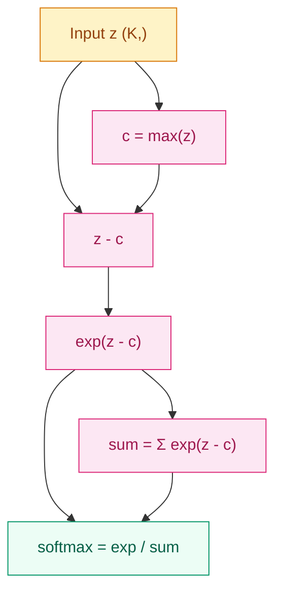

[English](README_EN.md) | [中文](README.md)

# Why Can't We Just Compare Raw Scores in Multi-Class Classification? — Softmax and Probability Distributions

## Where This Problem Comes From

> In binary classification, Sigmoid squeezes any real number into the (0,1) interval, representing "the probability of belonging to the positive class." But what if there are 10 classes? Directly outputting 10 numbers won't make them sum to 1, and negative values might even appear — they are not probabilities at all.
> Softmax solves this problem: it turns any set of real numbers into a valid probability distribution whose sum is always 1.
> Later, Softmax became the cornerstone of attention mechanisms — attention weights are essentially similarity scores normalized by Softmax.

## Learning Objectives

After completing this chapter, you should be able to answer:

1. What is the Softmax formula, and why does it guarantee a valid probability distribution?
2. How does the temperature parameter T control whether the distribution is "sharp" or "flat"?
3. Why do we subtract the maximum value when writing a numerically stable Softmax by hand?

---

## 1. Intuition

Imagine a talent show. Ten contestants each have a raw score (which could be any real number), but the judges need to produce a "vote allocation" — each contestant gets a percentage, and the total adds up to 100%. Softmax is exactly this voting rule: the contestant with the higher raw score gets a larger percentage, but everyone gets at least a little (never exactly zero).

Relationship to Sigmoid: Sigmoid is the binary special case of Softmax. For two numbers $z_1, z_2$, the Softmax probability of $z_1$ equals exactly $\sigma(z_1 - z_2)$.

> Key takeaway: Softmax is not about making the largest number more prominent; it is about turning arbitrary real numbers into valid probabilities. Its power lies in "relative comparison" — it's not about absolute magnitude, but about who is larger than whom.

---

## 2. Mechanics

### 2.1 Formula

For a vector $z = [z_1, z_2, \ldots, z_K]$:

$$
\text{Softmax}(z_i) = \frac{e^{z_i}}{\sum_{j=1}^{K} e^{z_j}}
$$

Three key properties:
1. **Non-negativity**: the exponential function guarantees every output $> 0$
2. **Normalization**: the denominator makes all outputs sum to $= 1$
3. **Order preservation**: the input ranking is preserved; the largest $z_i$ gets the largest probability

**Relationship to Sigmoid**: when $K = 2$:

$$
\text{Softmax}(z_1) = \frac{e^{z_1}}{e^{z_1} + e^{z_2}} = \frac{1}{1 + e^{z_2 - z_1}} = \sigma(z_1 - z_2)
$$

Sigmoid is binary-classification Softmax (adding a constant c to both numbers leaves the Softmax output unchanged — shift invariance).

**Softmax gradient** (used in later modules):

$$
\frac{\partial p_i}{\partial z_j} = p_i(\delta_{ij} - p_j)
$$

Where $\delta_{ij}$ is the Kronecker delta. Note: the gradient is not only on the diagonal — every output's gradient depends on all inputs.

### 2.2 Temperature Parameter

Introduce temperature $T > 0$:

$$
\text{Softmax}(z_i / T) = \frac{e^{z_i/T}}{\sum_{j=1}^{K} e^{z_j/T}}
$$

- $T \to 0^+$: distribution approaches one-hot, only the class with the maximum value gets probability 1
- $T = 1$: standard softmax
- $T \to \infty$: distribution approaches uniform, all classes have equal probability

Application: knowledge distillation uses high temperature $T$ to produce "soft labels," transferring inter-class similarity information.

### 2.3 Numerical Stability: the Log-Sum-Exp Trick

Directly computing $e^{z_i}$ can overflow. For example, when $z_i = 1000$, $e^{1000} = \text{inf}$ (float64 overflow).

**Solution**: subtract the maximum $c = \max(z)$:

$$
\text{Softmax}(z_i) = \frac{e^{z_i - c}}{\sum_{j} e^{z_j - c}}
$$

Mathematically equivalent (numerator and denominator both divided by $e^c$), but the exponent input becomes $z_i - c \leq 0$, so overflow is impossible.

**Related concept log-sum-exp**:

$$
\text{LSE}(z) = \log \sum_j e^{z_j} = c + \log \sum_j e^{z_j - c}
$$

This is the stable way to compute the softmax denominator, and is also commonly used in loss functions to avoid numerical overflow.



> Key takeaway: when implementing softmax, always subtract the maximum first. Without this step, softmax will output NaN on large inputs.

---

## 3. Progressive Implementation

**Step 1 · Naive implementation (understand the formula, not for production)**

```python
import numpy as np

def softmax_naive(z):
    """Softmax without numerical stability, for understanding the formula only"""
    exp_z = np.exp(z)
    return exp_z / exp_z.sum()

z = np.array([2.0, 1.0, 0.1, -1.0])
print(f"Output: {softmax_naive(z)}")
print(f"Sum: {softmax_naive(z).sum():.6f}")  # should be 1.0

# Large inputs overflow
z_big = np.array([1000.0, 1001.0, 999.0])
try:
    print(f"Large-input softmax: {softmax_naive(z_big)}")  # NaN
except:
    print("Large inputs cause overflow")
```

**Step 2 · Numerically stable version (production-ready)**

```python
import numpy as np

def softmax_stable(z):
    """Numerically stable softmax: subtract max first"""
    z_shifted = z - np.max(z)
    exp_z = np.exp(z_shifted)
    return exp_z / exp_z.sum()

z_big = np.array([1000.0, 1001.0, 999.0])
print(f"Stable softmax: {softmax_stable(z_big)}")
print(f"Sum: {softmax_stable(z_big).sum():.6f}")  # should be 1.0
```

**Step 3 · Sampling with temperature parameter**

```python
import numpy as np

def softmax_with_temperature(z, T=1.0):
    """Softmax with temperature parameter"""
    z_shifted = (z - np.max(z)) / T
    exp_z = np.exp(z_shifted)
    return exp_z / exp_z.sum()

z = np.array([2.0, 1.0, 0.1, -1.0])
for T in [0.1, 1.0, 5.0]:
    probs = softmax_with_temperature(z, T)
    print(f"T={T}: {probs}  (max={probs.max():.4f})")
```

**Step 4 · PyTorch verification and gradients**

```python
import torch

torch.manual_seed(42)

z = torch.tensor([2.0, 1.0, 0.1, -1.0], requires_grad=True)

# Built-in PyTorch softmax
probs = torch.softmax(z, dim=0)
print(f"PyTorch softmax: {probs}")

# log_softmax (more numerically stable, used inside CrossEntropyLoss)
log_probs = torch.log_softmax(z, dim=0)
print(f"log_softmax: {log_probs}")
print(f"exp(log_softmax) ≈ softmax: {torch.exp(log_probs)}")

# Verify gradient: dp_i / dz_j = p_i * (delta_ij - p_j)
probs.sum().backward()
print(f"\nGradient dp_i/dz_j:")
print(f"z.grad = {z.grad}")
# Manual verification: p_0 * (1 - p_0) should equal grad[0]
print(f"p_0*(1-p_0) = {(probs[0] * (1 - probs[0])).item():.6f}")
print(f"grad[0]     = {z.grad[0].item():.6f}")
```

---

## 4. Engineering Pitfalls (Sorted by Severity)

1. **Wrong dimension** (most common)
   Symptom: forgetting to specify `dim=1` when applying softmax to batch data `(batch, K)`, defaulting to dim=0, so each sample's probabilities no longer sum to 1.
   Fix: always specify the dimension explicitly, `torch.softmax(logits, dim=1)`.

2. **Softmax then log → numerically unstable**
   Symptom: `log(softmax(z))` produces `-inf` when probabilities approach 0.
   Fix: use `torch.log_softmax(z, dim=1)` or directly use `nn.CrossEntropyLoss()` (internally done in one step with log-sum-exp).

3. **Temperature parameter placed incorrectly**
   Symptom: putting T outside softmax (`softmax(z) / T`) instead of inside (`softmax(z/T)`).
   Fix: temperature must divide the logits before they enter softmax. Dividing outside only scales probabilities and does not change the distribution shape.

4. **Forgetting that Softmax output gradients are not independent**
   Symptom: when computing gradients manually, assuming $\frac{\partial p_i}{\partial z_j}$ is non-zero only when $i=j$.
   Fix: the Softmax Jacobian is $p_i(\delta_{ij} - p_j)$; every output's gradient depends on all inputs. PyTorch autograd handles this correctly, but be careful when implementing by hand.

> Key takeaway: in PyTorch, almost anywhere you need softmax you should use `log_softmax` or `CrossEntropyLoss`, not a manual combination.

---

## Evolution Notes

> **This technique's legacy**: Softmax is not just the output layer of classifiers. In attention mechanisms, the similarity matrix $\text{QK}^\top$ is turned into attention weights via Softmax — essentially asking "for the current position, how much attention should be allocated to every other position."
>
> The temperature parameter later became the core tool of knowledge distillation (Hinton 2015): the teacher model outputs soft labels at high temperature $T$, transferring "dark knowledge" (inter-class similarities) to the student model.
>
> **New problems left behind**: in classification, Softmax only cares whether the correct class's score is high enough, but does not directly optimize "how wrong the mistake is" — this leads to the design of various loss functions.

→ Next: [Loss Functions — How Do We Quantify "How Wrong"?](../loss-functions/README_EN.md)

---

**Previous**: [Linear Algebra](../linear-algebra/README_EN.md) | **Next**: [Loss Functions](../loss-functions/README_EN.md)
