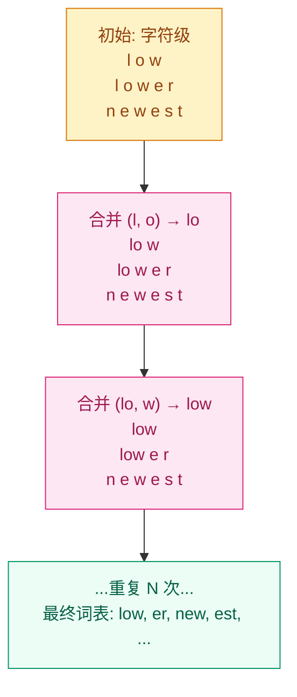

# 模型怎么"读"文字？—— 分词器

## 这个问题从哪来

> 上一章我们学了 Embedding：每个整数 ID 对应一个向量。但人类的文字是怎么变成整数 ID 的？
> 最早的做法是"词级分词"——空格切分。但"unbelievable"是一个词还是三个词？中文没有空格怎么办？"ChatGPT"算一个词吗？
> 2016 年，Sennrich 等人提出了 BPE（Byte Pair Encoding）分词，用数据驱动的方式自动发现最优的子词单元。后来 BERT 用了 WordPiece，GPT 用了 BPE，SentencePiece 用了 Unigram——三种算法，同一个目标：让分词既灵活又高效。

## 学习目标

完成本章后，你应能回答：

1. 子词级分词为什么比词级和字符级更好？
2. BPE 算法的训练过程是怎样的？
3. BPE、WordPiece、Unigram 三者的核心差异是什么？

---

## 1. 直觉

分词器是"翻译官"——把人类文字翻译成模型能理解的整数序列。

三种翻译策略：

- **词级**：把 `"I love cats"` 翻译成 `[I, love, cats]`。问题：词表太大（英语几十万词），遇到新词就没辙（`"unfriend"` → `<unk>`）。
- **字符级**：把 `"cats"` 翻译成 `[c, a, t, s]`。问题：序列太长，每个字符语义太弱（模型需要自己学出 `"c" + "a" + "t"` = 猫）。
- **子词级**：把 `"unfriend"` 翻译成 `[un, friend]`，把 `"cats"` 翻译成 `[cat, s]`。常用词保持完整，罕见词拆成有意义的片段——两全其美。

> 你要记住：子词分词的核心原则是"高频词不拆，低频词拆成高频子词"。

---

## 2. 机制

### 2.1 BPE（Byte Pair Encoding）

**训练过程**：

1. 从字符级词表开始，每个词表示为字符序列（如 `"low"` → `['l', 'o', 'w']`）
2. 统计所有相邻字符对的频率
3. 合并频率最高的字符对（如 `('l', 'o')` → `'lo'`），更新所有词的表示
4. 重复步骤 2-3，直到词表达到目标大小



**编码过程**（推理时）：
对输入文本，按词表从长到短贪心匹配。如果某个片段匹配不上，保留为字符。

**关键参数**：
- `vocab_size`：目标词表大小。GPT-2 用 50,257，LLaMA 用 32,000
- 合并次数 = `vocab_size - 初始字符词表大小`

### 2.2 WordPiece

与 BPE 非常相似，但**选择合并对的策略不同**：

- BPE：选频率最高的对
- WordPiece：选使语言模型似然增加最大的对

实际效果差异很小，主要区别在标记方式：WordPiece 用 `##` 标记非词首子词。

```
输入: "unbelievable"
BPE:       ["un", "believ", "able"]
WordPiece: ["un", "##believ", "##able"]
```

BERT 使用 WordPiece（词表 30,000），DistilBERT 也是。

### 2.3 Unigram（SentencePiece）

与前两者**方向相反**：

- BPE / WordPiece：从小词表开始，逐步合并扩大
- Unigram：从大词表开始，逐步删减缩小

训练过程：
1. 初始化一个很大的词表（如几百万）
2. 对每个子词计算它从词表中删除后的 loss 增加量
3. 删除 loss 增加最小的子词（贡献最小的子词）
4. 重复直到词表达到目标大小

优势：可以为一个输入给出多种分词方案，推理时选概率最高的。这让分词更鲁棒。

### 2.4 Special Tokens

分词器除了正常子词外，还保留几个特殊 token：

| Token | 用途 | 使用者 |
|-------|------|--------|
| `[CLS]` | 句首标记，BERT 用其隐状态做分类 | BERT |
| `[SEP]` | 句子分隔符 | BERT |
| `<pad>` | 批处理时填充短序列 | 所有模型 |
| `<unk>` | 未知词 fallback | 所有模型 |
| `<s>`, `</s>` | 序列起止标记 | GPT, LLaMA |
| `<\|endoftext\|>` | 文档边界标记 | GPT-2/3 |

### 2.5 三种算法对比

| 维度 | BPE | WordPiece | Unigram |
|------|-----|-----------|---------|
| 方向 | 自底向上合并 | 自底向上合并 | 自顶向下删减 |
| 选择标准 | 频率最高 | 似然增益最大 | Loss 贡献最小 |
| 词表固定性 | 唯一分词 | 唯一分词 | 多种分词方案 |
| 实现工具 | GPT-2 tokenizer, HuggingFace | BERT tokenizer | SentencePiece |
| 典型使用者 | GPT 系列, LLaMA | BERT 系列 | T5, ALBERT |

> 你要记住：三种算法的效果差异通常远小于模型架构和训练数据的差异。选哪个不是最重要的，重要的是词表大小和分词一致性。

---

## 3. 渐进式实现

**Step 1 · 手写 BPE 训练**

```python
from collections import Counter

def train_bpe(corpus, num_merges):
    """最简 BPE 训练：从字符级开始，合并最高频对"""
    # 初始化：每个词拆成字符序列
    word_freqs = Counter(corpus.split())
    splits = {word: list(word) for word in word_freqs}

    merges = []
    for _ in range(num_merges):
        # 统计相邻对频率
        pair_freqs = Counter()
        for word, freq in word_freqs.items():
            symbols = splits[word]
            for i in range(len(symbols) - 1):
                pair_freqs[(symbols[i], symbols[i+1])] += freq

        if not pair_freqs:
            break

        # 合并最高频对
        best_pair = pair_freqs.most_common(1)[0][0]
        merges.append(best_pair)

        # 更新所有词的表示
        for word in splits:
            symbols = splits[word]
            new_symbols = []
            i = 0
            while i < len(symbols):
                if i < len(symbols) - 1 and (symbols[i], symbols[i+1]) == best_pair:
                    new_symbols.append(symbols[i] + symbols[i+1])
                    i += 2
                else:
                    new_symbols.append(symbols[i])
                    i += 1
            splits[word] = new_symbols

    return merges

corpus = "low low low low low lower lower newest newest newest newest newest newest widest widest widest"
merges = train_bpe(corpus, num_merges=5)
print("BPE 合并序列:")
for i, (a, b) in enumerate(merges):
    print(f"  Step {i+1}: ({a}, {b}) → {a+b}")
```

**Step 2 · 用 BPE 编码新文本**

```python
def bpe_encode(text, merges):
    """用学到的合并规则编码新文本"""
    words = text.split()
    result = []
    for word in words:
        symbols = list(word)
        for (a, b) in merges:
            new_symbols = []
            i = 0
            while i < len(symbols):
                if i < len(symbols) - 1 and symbols[i] == a and symbols[i+1] == b:
                    new_symbols.append(a + b)
                    i += 2
                else:
                    new_symbols.append(symbols[i])
                    i += 1
            symbols = new_symbols
        result.extend(symbols)
    return result

encoded = bpe_encode("low lower newest", merges)
print(f"编码结果: {encoded}")
```

**Step 3 · HuggingFace tokenizers 使用**

```python
# 需要安装: pip install transformers
from transformers import AutoTokenizer

# GPT-2 的 BPE tokenizer
gpt2_tok = AutoTokenizer.from_pretrained("gpt2")
text = "Unbelievable! ChatGPT is amazing."

tokens = gpt2_tok.encode(text)
print(f"GPT-2 tokens: {tokens}")
print(f"还原: {gpt2_tok.decode(tokens)}")
print(f"子词: {gpt2_tok.convert_ids_to_tokens(tokens)}")

# BERT 的 WordPiece tokenizer
bert_tok = AutoTokenizer.from_pretrained("bert-base-uncased")
tokens_bert = bert_tok.encode(text)
print(f"\nBERT tokens: {tokens_bert}")
print(f"子词: {bert_tok.convert_ids_to_tokens(tokens_bert)}")
# WordPiece 用 ## 标记非词首子词
```

**Step 4 · 中英文分词对比**

```python
from transformers import AutoTokenizer

gpt2_tok = AutoTokenizer.from_pretrained("gpt2")
llama_tok = AutoTokenizer.from_pretrained("meta-llama/Llama-2-7b-hf")

# 英文
en_text = "The cat sat on the mat."
print(f"GPT-2 英文: {gpt2_tok.convert_ids_to_tokens(gpt2_tok.encode(en_text))}")

# 中文（GPT-2 对中文是字节级 BPE，每个中文字符会被拆成多个 token）
zh_text = "猫坐在垫子上"
print(f"GPT-2 中文: {gpt2_tok.convert_ids_to_tokens(gpt2_tok.encode(zh_text))}")

# LLaMA 对中文支持更好（词表中包含更多中文字符）
# print(f"LLaMA 中文: {llama_tok.convert_ids_to_tokens(llama_tok.encode(zh_text))}")
```

---

## 4. 工程陷阱（按严重度排序）

1. **词表大小权衡**
   现象：词表太小 → 序列太长（每个 token 信息量少），推理慢；词表太大 → embedding 参数多，训练慢。
   处置：英文模型 30K-50K，多语言模型 100K+（如 XLM-R 用 250K）。中文每个字本身信息量高，词表可以更小。

2. **中英文分词效率差异**
   现象：GPT-2 处理中文时，一个汉字可能需要 2-3 个 token 编码，导致中文的 token 效率远低于英文（同样语义的文本，中文 token 数是英文的 2-3 倍）。
   处置：选支持目标语言的 tokenizer（如 ChatGLM 对中文优化），或在训练时增加中文语料占比来优化词表。

3. **不同模型的 tokenizer 不通用**
   现象：用 BERT 的 tokenizer 处理文本后喂给 GPT-2 模型，token ID 对不上。
   处置：tokenizer 和模型必须配对使用。`AutoTokenizer.from_pretrained(model_name)` 会自动加载对应的 tokenizer。

4. **Special tokens 的 ID 不在训练分布内**
   现象：自定义 special token 的 embedding 是随机初始化的，如果训练数据中没有足够的该 token 出现次数，embedding 质量差。
   处置：添加 special token 后用 `resize_token_embeddings(new_size)` 调整模型，并在训练数据中包含这些 token。

> 你要记住：tokenizer 决定了模型"看到"的世界。换一个 tokenizer，同样的模型可能表现完全不同。

---

## 演进笔记

> **分词的演进**：从规则分词（空格切分）→ 统计分词（BPE/WordPiece/Unigram）→ 字节级分词（BBPE，GPT-2 直接在 UTF-8 字节上做 BPE，不需要预定义字符集）。
>
> 字节级分词是一个重要趋势：它让模型天然支持任何语言（包括 emoji），不再需要为不同语言训练不同的 tokenizer。GPT-2、LLaMA 都使用字节级 BPE。
>
> **留下的新问题**：分词把文字变成了 token 序列，但 token 之间没有顺序信息——"猫吃鱼"和"鱼吃猫"的 token 集合相同。这引出了位置编码（Positional Encoding）的概念。

→ 下一章：[编码器-解码器范式](../encoder-decoder/README.md)

---

**上一章**：[Embedding 向量](../embeddings/README.md) | **下一章**：[编码器-解码器范式](../encoder-decoder/README.md)
