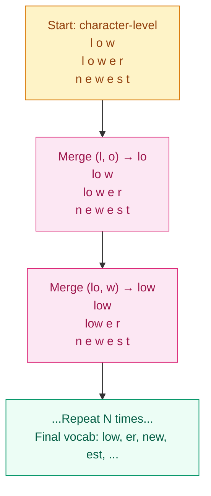

[English](README_EN.md) | [中文](README.md)

# How Do Models "Read" Text? — Tokenization

## Where This Problem Comes From

> In the previous chapter we learned about embeddings: every integer ID maps to a vector. But how does human text become integer IDs in the first place?
> The earliest approach was "word-level tokenization" — splitting on whitespace. But is "unbelievable" one word or three? What about Chinese, which has no spaces? Is "ChatGPT" a single word?
> In 2016, Sennrich et al. proposed BPE (Byte Pair Encoding) tokenization, using a data-driven approach to automatically discover optimal subword units. Later BERT used WordPiece, GPT used BPE, and SentencePiece used Unigram — three algorithms, one goal: making tokenization both flexible and efficient.

## Learning Objectives

After completing this chapter, you should be able to answer:

1. Why is subword tokenization better than word-level and character-level?
2. What does the BPE training process look like?
3. What are the core differences between BPE, WordPiece, and Unigram?

---

## 1. Intuition

A tokenizer is a "translator" — turning human text into a sequence of integers that the model can understand.

Three translation strategies:

- **Word-level**: `"I love cats"` → `[I, love, cats]`. Problem: vocabulary is huge (hundreds of thousands of words in English), and new words are hopeless (`"unfriend"` → `<unk>`).
- **Character-level**: `"cats"` → `[c, a, t, s]`. Problem: sequences become too long, and each character carries too little semantics (the model must learn that `"c" + "a" + "t"` = cat).
- **Subword-level**: `"unfriend"` → `[un, friend]`, `"cats"` → `[cat, s]`. Common words stay intact, rare words are broken into meaningful pieces — the best of both worlds.

> Key takeaway: the core principle of subword tokenization is "don’t split high-frequency words, but split low-frequency words into high-frequency subwords."

---

## 2. Mechanics

### 2.1 BPE (Byte Pair Encoding)

**Training process**:

1. Start from a character-level vocabulary, representing each word as a character sequence (e.g. `"low"` → `['l', 'o', 'w']`)
2. Count frequencies of all adjacent character pairs
3. Merge the most frequent pair (e.g. `('l', 'o')` → `'lo'`), updating the representation of all words
4. Repeat steps 2–3 until the vocabulary reaches the target size



**Encoding process** (at inference):
For input text, greedily match against the vocabulary from longest to shortest. If a fragment cannot be matched, keep it as characters.

**Key parameters**:
- `vocab_size`: target vocabulary size. GPT-2 uses 50,257; LLaMA uses 32,000
- Number of merges = `vocab_size - initial character vocabulary size`

### 2.2 WordPiece

Very similar to BPE, but **differs in how merge pairs are chosen**:

- BPE: pick the most frequent pair
- WordPiece: pick the pair that maximizes the language-model likelihood

In practice the difference is small. The main distinction is in marking: WordPiece uses `##` to mark non-initial subwords.

```
Input: "unbelievable"
BPE:       ["un", "believ", "able"]
WordPiece: ["un", "##believ", "##able"]
```

BERT uses WordPiece (vocab 30,000), as does DistilBERT.

### 2.3 Unigram (SentencePiece)

**Direction is opposite** to the previous two:

- BPE / WordPiece: start small and merge to grow
- Unigram: start large and prune to shrink

Training process:
1. Initialize a very large vocabulary (e.g. several million)
2. For each subword, compute the increase in loss if it were removed from the vocabulary
3. Remove the subword with the smallest loss increase (least contribution)
4. Repeat until the vocabulary reaches the target size

Advantage: it can produce multiple segmentation candidates for a single input, selecting the highest-probability one at inference. This makes tokenization more robust.

### 2.4 Special Tokens

In addition to normal subwords, tokenizers reserve several special tokens:

| Token | Purpose | Used by |
|-------|---------|---------|
| `[CLS]` | Start-of-sequence marker; BERT uses its hidden state for classification | BERT |
| `[SEP]` | Sentence separator | BERT |
| `<pad>` | Padding short sequences during batching | All models |
| `<unk>` | Unknown word fallback | All models |
| `<s>`, `</s>` | Sequence start/end markers | GPT, LLaMA |
| `<\|endoftext\|>` | Document boundary marker | GPT-2/3 |

### 2.5 Comparison of the Three Algorithms

| Dimension | BPE | WordPiece | Unigram |
|-----------|-----|-----------|---------|
| Direction | Bottom-up merge | Bottom-up merge | Top-down prune |
| Selection criterion | Highest frequency | Largest likelihood gain | Smallest loss contribution |
| Segmentation uniqueness | Unique | Unique | Multiple candidates |
| Implementation tool | GPT-2 tokenizer, HuggingFace | BERT tokenizer | SentencePiece |
| Typical users | GPT family, LLaMA | BERT family | T5, ALBERT |

> Key takeaway: the performance differences among the three algorithms are usually far smaller than differences in model architecture or training data. Which one you choose is less important than vocabulary size and tokenization consistency.

---

## 3. Progressive Implementation

**Step 1 · Hand-written BPE training**

```python
from collections import Counter

def train_bpe(corpus, num_merges):
    """Minimal BPE training: start from characters, merge highest-frequency pair"""
    # initialize: split each word into characters
    word_freqs = Counter(corpus.split())
    splits = {word: list(word) for word in word_freqs}

    merges = []
    for _ in range(num_merges):
        # count adjacent pair frequencies
        pair_freqs = Counter()
        for word, freq in word_freqs.items():
            symbols = splits[word]
            for i in range(len(symbols) - 1):
                pair_freqs[(symbols[i], symbols[i+1])] += freq

        if not pair_freqs:
            break

        # merge the most frequent pair
        best_pair = pair_freqs.most_common(1)[0][0]
        merges.append(best_pair)

        # update representations of all words
        for word in splits:
            symbols = splits[word]
            new_symbols = []
            i = 0
            while i < len(symbols):
                if i < len(symbols) - 1 and (symbols[i], symbols[i+1]) == best_pair:
                    new_symbols.append(symbols[i] + symbols[i+1])
                    i += 2
                else:
                    new_symbols.append(symbols[i])
                    i += 1
            splits[word] = new_symbols

    return merges

corpus = "low low low low low lower lower newest newest newest newest newest newest widest widest widest"
merges = train_bpe(corpus, num_merges=5)
print("BPE merge sequence:")
for i, (a, b) in enumerate(merges):
    print(f"  Step {i+1}: ({a}, {b}) → {a+b}")
```

**Step 2 · Encode new text with learned BPE**

```python
def bpe_encode(text, merges):
    """Encode new text using learned merge rules"""
    words = text.split()
    result = []
    for word in words:
        symbols = list(word)
        for (a, b) in merges:
            new_symbols = []
            i = 0
            while i < len(symbols):
                if i < len(symbols) - 1 and symbols[i] == a and symbols[i+1] == b:
                    new_symbols.append(a + b)
                    i += 2
                else:
                    new_symbols.append(symbols[i])
                    i += 1
            symbols = new_symbols
        result.extend(symbols)
    return result

encoded = bpe_encode("low lower newest", merges)
print(f"Encoded result: {encoded}")
```

**Step 3 · Using HuggingFace tokenizers**

```python
# Requires: pip install transformers
from transformers import AutoTokenizer

# GPT-2 BPE tokenizer
gpt2_tok = AutoTokenizer.from_pretrained("gpt2")
text = "Unbelievable! ChatGPT is amazing."

tokens = gpt2_tok.encode(text)
print(f"GPT-2 tokens: {tokens}")
print(f"Decode: {gpt2_tok.decode(tokens)}")
print(f"Subwords: {gpt2_tok.convert_ids_to_tokens(tokens)}")

# BERT WordPiece tokenizer
bert_tok = AutoTokenizer.from_pretrained("bert-base-uncased")
tokens_bert = bert_tok.encode(text)
print(f"\nBERT tokens: {tokens_bert}")
print(f"Subwords: {bert_tok.convert_ids_to_tokens(tokens_bert)}")
# WordPiece marks non-initial subwords with ##
```

**Step 4 · Chinese vs English tokenization comparison**

```python
from transformers import AutoTokenizer

gpt2_tok = AutoTokenizer.from_pretrained("gpt2")
llama_tok = AutoTokenizer.from_pretrained("meta-llama/Llama-2-7b-hf")

# English
en_text = "The cat sat on the mat."
print(f"GPT-2 EN: {gpt2_tok.convert_ids_to_tokens(gpt2_tok.encode(en_text))}")

# Chinese (GPT-2 uses byte-level BPE, so each Chinese character is split into multiple tokens)
zh_text = "猫坐在垫子上"
print(f"GPT-2 ZH: {gpt2_tok.convert_ids_to_tokens(gpt2_tok.encode(zh_text))}")

# LLaMA has better Chinese support (vocabulary contains more Chinese characters)
# print(f"LLaMA ZH: {llama_tok.convert_ids_to_tokens(llama_tok.encode(zh_text))}")
```

---

## 4. Engineering Pitfalls (Sorted by Severity)

1. **Vocabulary size tradeoff**
   Symptom: vocabulary too small → sequences become too long (low information per token), slow inference; vocabulary too large → more embedding parameters, slower training.
   Fix: 30K–50K for English models, 100K+ for multilingual models (e.g. XLM-R uses 250K). Chinese characters carry more information per character, so vocab can be smaller.

2. **Chinese vs English tokenization efficiency gap**
   Symptom: GPT-2 may need 2–3 tokens to encode a single Chinese character, making Chinese token efficiency far lower than English (same semantic text can be 2–3x more tokens in Chinese).
   Fix: choose a tokenizer optimized for the target language (e.g. ChatGLM for Chinese), or increase the proportion of Chinese corpus during training to optimize the vocabulary.

3. **Tokenizer incompatibility across models**
   Symptom: feeding text tokenized by BERT’s tokenizer into a GPT-2 model causes ID mismatch.
   Fix: tokenizer and model must be used as a pair. `AutoTokenizer.from_pretrained(model_name)` automatically loads the matching tokenizer.

4. **Special token IDs outside training distribution**
   Symptom: custom special tokens have randomly initialized embeddings; if they appear too rarely in training data, their embedding quality is poor.
   Fix: after adding special tokens, call `resize_token_embeddings(new_size)` and ensure these tokens appear in the training data.

> Key takeaway: the tokenizer determines the world the model "sees." Changing the tokenizer can make the same model behave completely differently.

---

## Evolution Notes

> **Evolution of tokenization**: from rule-based (whitespace splitting) → statistical (BPE/WordPiece/Unigram) → byte-level (BBPE, where GPT-2 performs BPE directly on UTF-8 bytes without a predefined character set).
>
> Byte-level tokenization is an important trend: it lets the model natively support any language (including emoji) without needing a separate tokenizer per language. GPT-2 and LLaMA both use byte-level BPE.
>
> **New question left behind**: tokenization turns text into token sequences, but tokens have no order information — the token sets of "cat eats fish" and "fish eats cat" are identical. How to explicitly represent "who comes first, who comes next" inside the model is the next question sequence modeling must answer.

→ Next chapter: [Encoder-Decoder Paradigm — Why Separate "Understanding" from "Generation"?](../encoder-decoder/README_EN.md)

---

**Previous**: [Embeddings](../embeddings/README_EN.md) | **Next**: [Encoder-Decoder Paradigm](../encoder-decoder/README_EN.md)
