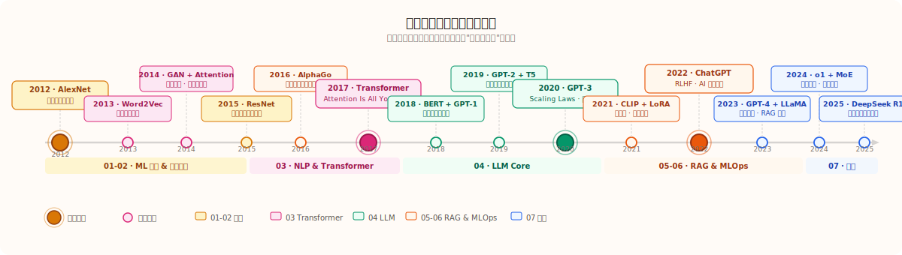

# Deep Learning & LLM Evolution Timeline

> Behind every technology, there was a problem that had to be solved.
> This timeline is not a paper list — it is a history of "being forced into existence."

## Navigation

| Year | Core Event | Year | Core Event |
|------|------------|------|------------|
| [1948](#1948) | Shannon Information Theory — mathematical foundation of information | | |
| [2012](#2012) | AlexNet — year zero of deep learning | [2019](#2019) | GPT-2 + T5 — the ambition of scale |
| [2013](#2013) | Word2Vec + VAE — awakening of representation learning | [2020](#2020) | GPT-3 + Scaling Laws — brute force works |
| [2014](#2014) | GAN + Seq2Seq + Attention + Adam | [2021](#2021) | CLIP + Codex + LoRA — multimodal & efficiency |
| [2015](#2015) | ResNet + BN — liberation of depth | [2022](#2022) | ChatGPT — AI enters the mainstream |
| [2016](#2016) | AlphaGo — reinforcement learning takes the stage | [2023](#2023) | GPT-4 + LLaMA — open source strikes back |
| [2017](#2017) | Transformer — throw away RNN | [2024](#2024) | MoE + long context + reasoning models |
| [2018](#2018) | BERT + GPT-1 — the pre-training era | [2025](#2025) | DeepSeek R1 — open source catches up |

---

## 1948 · Shannon Information Theory: Mathematical Foundation of Information

### The World Before

Communication engineering relied on intuition and experience to design coding schemes, lacking rigorous mathematical theory to answer a fundamental question: how much can information be compressed?

### What Happened

Claude Shannon published "A Mathematical Theory of Communication," proposing the concept of **information entropy** — quantifying the uncertainty of a random variable in bits. He also proved the **source coding theorem**: the average code length of any data compression scheme cannot be lower than the information entropy.

This paper simultaneously defined **mutual information** (the strength of association between two variables) and **channel capacity** (the maximum transmission rate of a noisy channel).

### What Was Solved, and What New Problems Emerged

Shannon established the measurement system for information, transforming communication from craft to mathematical science.

But his theory only focused on "quantity" — semantics, value, and understanding of information were all abstracted away. This problem would not be revisited until the large language model era, more than 70 years later.

### Key Works of the Year

| Work | Proposer / Institution | Core Significance |
|------|------------------------|-------------------|
| Information Entropy | Shannon | Mathematical tool for quantifying uncertainty; theoretical foundation for deep learning loss functions |
| Source Coding Theorem | Shannon | Theoretical limit of data compression |
| Mutual Information | Shannon | Measure of association strength between variables; theoretical foundation for feature selection and contrastive learning |

---

## 2012 · AlexNet: A Cannon Shot, the Old World Ends

### The World Before

Before 2012, computer vision relied heavily on **hand-crafted features**. Researchers spent years designing feature descriptors like SIFT and HOG to tell computers "what is an edge" and "what is texture," then fed them into an SVM for classification. This approach worked, but had a fatal flaw: **its ceiling depended on human understanding of "features."**

The ImageNet Large Scale Visual Recognition Challenge (ILSVRC) had been held since 2010, with the best models' Top-5 error rate hovering around 25–26%, improving slowly. Most people felt this problem was "about maxed out."

### What Happened

In 2012, three people from Hinton's group at the University of Toronto — Alex Krizhevsky, Ilya Sutskever, and Geoffrey Hinton — submitted a model called AlexNet, directly driving the Top-5 error rate down to **15.3%**, nearly 11 percentage points lower than the second place.

The gap was so large that the judges thought they had made a mistake.

AlexNet was essentially a deep convolutional neural network, but several key engineering decisions made it work:

- **ReLU activation**: Replaced sigmoid/tanh, gradients no longer vanished, training speed increased 6×
- **GPU parallel training**: Used two GTX 580s to split computation, first proving GPUs were the right vehicle for training deep networks
- **Dropout**: Randomly dropped half the neurons during training, forcing the network to learn robust features and preventing overfitting
- **Data augmentation**: Random crops and flips, making 1.2 million images "generate" more samples

### What Was Solved, and What New Problems Emerged

AlexNet proved one thing: **features don't need to be designed by humans; networks can learn them themselves**. This shot pierced the ceiling of the hand-crafted feature era.

But it also brought new problems:
- Requires **massive labeled data** (ImageNet had 1.2 million images; where does that come from in reality?)
- Requires **GPUs**, which most researchers didn't have at the time
- Why the network worked was not fully explainable (the interpretability problem continues to this day)

### Key Works of the Year

| Work | Proposer / Institution | Core Contribution | Module |
|------|------------------------|-------------------|--------|
| Dropout | Hinton group (Toronto) | Random deactivation prevents overfitting; standard regularization for deep learning established | [00·Prerequisites·Regularization](../00-Prerequisites/regularization/) |
| ReLU widespread adoption | Hinton et al. | Replaced sigmoid/tanh, restored gradient flow, training speed increased several-fold | [00·Prerequisites·Activation Functions](../00-Prerequisites/activation-functions/) |
| GPU deep learning ecosystem | NVIDIA / Krizhevsky | CUDA accelerates deep network training; computational infrastructure paradigm established | [00·Prerequisites](../00-Prerequisites/) |
| ImageNet LSVRC | Stanford / Princeton | Established the most important visual benchmark of the deep learning era, driving annual competition | [00·Prerequisites](../00-Prerequisites/) |
| Deep learning speech recognition | Hinton + Google/MS | DNN first large-scale industrial validation on ASR, error rate dropped 20%+ | [01·Vision Line](../01-Visual-Intelligence/) |
| Data augmentation | Krizhevsky et al. | Random crop / flip / color jitter; standard practice for training large models with less data | [00·Prerequisites](../00-Prerequisites/) |
| Max Pooling standardization | — | Spatial downsampling + translation invariance; standard component of CNN architecture | [01·Vision Line](../01-Visual-Intelligence/) |
| Local Response Normalization | Krizhevsky | Lateral inhibition mechanism; normalization method before BN appeared | [01·Vision Line](../01-Visual-Intelligence/) |
| DBN → CNN paradigm shift | Hinton | End of unsupervised pre-training era; end-to-end supervised training becomes mainstream | [01·Vision Line](../01-Visual-Intelligence/) |
| CNN feature visualization | — | Understanding what each CNN layer learns; starting point for interpretability research | [01·Vision Line](../01-Visual-Intelligence/) |

---

## 2013 · Word2Vec: Words Can Have Coordinates Too

### The World Before

Natural language processing had a most basic problem: how do you feed words to a model?

The standard answer at the time was **One-Hot encoding**: with a vocabulary of 100,000 words, each word was a 100,000-dimensional vector with only the corresponding position set to 1, everything else 0. This had two serious problems:

1. **Curse of dimensionality**: 100,000-dimensional sparse vectors, extremely inefficient to compute
2. **No semantic relationships**: In the One-Hot world, the distance between "cat" and "dog" is the same as between "cat" and "airplane" — the model has no idea that cats and dogs are more similar

### What Happened

In 2013, Google's Tomas Mikolov team published Word2Vec, proposing two training methods:

- **CBOW** (Continuous Bag of Words): predict the center word from context words
- **Skip-gram**: predict context words from the center word

The core idea is extremely simple: **the meaning of a word is determined by its neighbors** (in linguistics, this is called the "distributional hypothesis"). After training, each word becomes a dense vector of a few hundred dimensions.

This vector has a stunning property:
`king - man + woman ≈ queen`

The addition and subtraction of word vectors actually reflects semantic relationships.

### What Was Solved, and What New Problems Emerged

Word2Vec brought a "coordinate system for words" to NLP, making semantically similar words close in space, greatly improving downstream task performance.

But it had a fundamental limitation: **each word has only one vector**. The word "apple," whether fruit or company, has the same vector. The problem of polysemy was beyond Word2Vec's reach — the real answer would not come until 2018.

### Key Works of the Year

| Work | Proposer / Institution | Core Contribution | Module |
|------|------------------------|-------------------|--------|
| VAE | Kingma & Welling | Learning continuous latent variables via variational inference; mathematical foundation for generative models | [01·Vision Line](../01-Visual-Intelligence/) |
| ZFNet | Zeiler & Fergus (NYU) | Deconvolution visualization of CNNs; won ILSVRC 2013; beginning of CNN interpretability | [01·Vision Line](../01-Visual-Intelligence/) |
| Network in Network | Lin et al. | 1×1 conv + Global Avg Pooling; influenced all subsequent architectures including Inception and ResNet | [01·Vision Line](../01-Visual-Intelligence/) |
| DropConnect | Wan et al. (NYU) | Random zeros on weights rather than activations; generalization variant of Dropout | [00·Prerequisites·Regularization](../00-Prerequisites/regularization/) |
| Maxout Networks | Goodfellow et al. | Piecewise linear activation; can theoretically approximate any convex function; first major work by GAN authors | [01·Vision Line](../01-Visual-Intelligence/) |
| DeepFace | Taigman et al. (Facebook) | Deep learning face recognition first surpasses human level (LFW 97.35%) | [01·Vision Line](../01-Visual-Intelligence/) |
| LSTM sequence modeling | Graves | Using LSTM to generate handwriting; proving recurrent networks can model long-term temporal dependencies | [02·Language Line·RNN](../02-Language-Transformers/recurrent-networks/) |
| DQN precursor | Mnih et al. (DeepMind) | CNN + Q-learning plays Atari; seed paper for deep reinforcement learning | [00·Prerequisites](../00-Prerequisites/) |
| Negative Sampling | Mikolov et al. | Word2Vec training acceleration trick; makes large vocabulary training feasible on CPU | [02·Language Line](../02-Language-Transformers/) |
| GloVe research started | Pennington et al. (Stanford) | Global co-occurrence matrix word vectors; formally published in 2014 | [02·Language Line](../02-Language-Transformers/) |

---

## 2014 · GAN + Seq2Seq + Attention + Adam: Four Shots in One Year

2014 was a dense year — four things emerged simultaneously, each with far-reaching impact.

### GAN: Teaching Networks to "Adversarially" Learn

Ian Goodfellow wrote the code for GAN (Generative Adversarial Network) overnight after a bar conversation.

The idea: train two networks, a **generator** responsible for creating fakes, and a **discriminator** responsible for spotting them. The two play against each other, and eventually the generator learns to create samples indistinguishable from real ones.

This is the first cornerstone of generative AI. From then on, models were not just able to "classify," but also to "create."

### Seq2Seq: A New Paradigm for Machine Translation

Sutskever, Vinyals, and Le (all from Google) proposed the Seq2Seq architecture: an LSTM encoder compresses the input into a vector, and an LSTM decoder generates the output from this vector.

This architecture made end-to-end machine translation possible for the first time, no longer needing alignment tables, grammar rules, and other hand-crafted modules.

But it had a fatal weakness: **no matter how long the input, it had to be compressed into a fixed-size vector**. Translating an article and translating a single word used the same "bottle."

### Attention: Giving the Decoder a Pair of "Looking Back" Eyes

In the same year, Bahdanau et al. proposed the attention mechanism, directly targeting the Seq2Seq information bottleneck:

> When decoding each word, don't just look at that fixed vector; **let the decoder itself decide which positions in the encoder to focus on**.

This idea sounds simple, but it opened a door — the later Transformer was entirely built on its foundation.

### Adam: The Optimizer to End All Optimizers

Kingma and Ba proposed the Adam optimizer, combining momentum and adaptive learning rates, requiring almost no learning rate tuning to run well. For years after, Adam became the default optimizer for deep learning, with virtually no competitors.

### Key Works of the Year

| Work | Proposer / Institution | Core Contribution | Module |
|------|------------------------|-------------------|--------|
| VGGNet | Simonyan & Zisserman (Oxford) | Uniform stacking of 3×3 convolutions; proving depth > width; classic backbone for transfer learning | [01·Vision Line](../01-Visual-Intelligence/) |
| GoogLeNet / Inception | Szegedy et al. (Google) | Inception module with multi-scale parallel convolutions; ILSVRC 2014 champion | [01·Vision Line](../01-Visual-Intelligence/) |
| Adam Optimizer | Kingma & Ba (OpenAI/Amsterdam) | Adaptive learning rate + momentum; almost no tuning needed to converge; becomes default deep learning optimizer | [01·Vision Line](../01-Visual-Intelligence/) |
| GloVe | Pennington et al. (Stanford) | Global co-occurrence matrix word vectors; complementary to Word2Vec; more stable downstream performance | [02·Language Line](../02-Language-Transformers/) |
| GRU | Cho et al. (Montreal) | Simplified LSTM; two gates replace three; more efficient computation; new option for sequence modeling | [02·Language Line·RNN](../02-Language-Transformers/recurrent-networks/) |
| Dropout in RNNs | Zaremba et al. (NYU) | Solves RNN overfitting; makes LSTM language model training more stable | [00·Prerequisites·Regularization](../00-Prerequisites/regularization/) |
| Neural Turing Machine | Graves et al. (DeepMind) | Neural network with external read-write memory; early Agent idea and RAG prototype | [05·Systems & Production](../05-Systems-Production/) |
| FaceNet | Schroff et al. (Google) | Triplet Loss face embedding; technical foundation for large-scale industrial face recognition deployment | [01·Vision Line](../01-Visual-Intelligence/) |
| Deep Learning (book) | Bengio, Goodfellow, Courville | First systematic textbook in the deep learning field; establishes the discipline's knowledge system | [00·Prerequisites](../00-Prerequisites/) |
| DCGAN concept萌芽 | — | Accumulation of GAN training techniques; laying groundwork for DCGAN in 2015 | [01·Vision Line](../01-Visual-Intelligence/) |

---

## 2015 · ResNet + Batch Norm: Liberation of Depth

### The World Before

With AlexNet, the intuition was: **the deeper the network, the better the results**. But reality was cruel — beyond a certain depth, training performance actually degraded, not because of overfitting, but because training simply wouldn't converge.

This problem is called the **Degradation Problem**: a 56-layer network was actually worse than a 20-layer one.

### What Happened

Kaiming He et al. proposed **Residual Networks (ResNet)**, with an elegant idea:

Since directly learning the mapping `H(x)` is hard, let the network learn the **residual** `F(x) = H(x) - x`, and add a **skip connection** to directly add the input `x` back.

This way, even if the network learns nothing, the skip connection at least guarantees the output is no worse than the input — the network "cannot retreat any further."

In the same year, Ioffe and Szegedy proposed **Batch Normalization**: normalize activations after each layer, stabilizing the input distribution for each layer. It increased training speed by an order of magnitude and allowed higher learning rates.

### What Was Solved, and What New Problems Emerged

ResNet liberated network depth. The 152-layer ResNet pushed ImageNet Top-5 error rate down to 3.57%, already **below human level (about 5%)**.

The computer vision classification problem was basically declared solved from this year. The next question was: can the same idea be applied to language?

### Key Works of the Year

| Work | Proposer / Institution | Core Contribution | Module |
|------|------------------------|-------------------|--------|
| ResNet | He et al. (MSRA) | 152-layer residual network; Top-5 error rate 3.57% below human; skip connections solve degradation | [01·Vision Line](../01-Visual-Intelligence/) |
| Batch Normalization | Ioffe & Szegedy (Google) | Normalizes input distribution per layer; training speed increases by order of magnitude; allows higher learning rates; foundation for stable deep network training | [01·Vision Line](../01-Visual-Intelligence/) |
| Highway Networks | Srivastava et al. (IDSIA) | Gated skip connections; direct precursor to ResNet; earliest solution to network degradation | [01·Vision Line](../01-Visual-Intelligence/) |
| DQN (Nature version) | Mnih et al. (DeepMind) | First heavyweight result of deep reinforcement learning; surpasses humans on 57 Atari games | [00·Prerequisites](../00-Prerequisites/) |
| Faster R-CNN | Ren et al. (MSRA) | Region proposal network unifies detection pipeline; standard paradigm for object detection established | [01·Vision Line](../01-Visual-Intelligence/) |
| U-Net | Ronneberger et al. (Freiburg) | Encoder-decoder + skip connections; classic architecture for medical image segmentation | [01·Vision Line](../01-Visual-Intelligence/) |
| DCGAN | Radford et al. (OpenAI) | Convolutional GAN + training stability tricks; first reproducible method for generating realistic images | [01·Vision Line](../01-Visual-Intelligence/) |
| Neural Style Transfer | Gatys et al. (Tübingen) | Content / style disentanglement transfer; generative AI first breaks into mainstream public awareness | [01·Vision Line](../01-Visual-Intelligence/) |
| Deep Speech 2 | Amodei et al. (Baidu) | End-to-end speech recognition; surpasses human level; industrial validation of big data + big models | [01·Vision Line](../01-Visual-Intelligence/) |
| Spatial Transformer | Jaderberg et al. (DeepMind) | Learnable spatial transformations; gives networks geometric attention | [01·Vision Line](../01-Visual-Intelligence/) |
| YOLO v1 | Redmon et al. | Single-stage real-time object detection; efficiency revolution; new option for industrial deployment | [01·Vision Line](../01-Visual-Intelligence/) |
| char-rnn / text generation | Karpathy | LSTM character-level language model; demonstrating RNN's astonishing text generation ability | [02·Language Line·RNN](../02-Language-Transformers/recurrent-networks/) |

---

## 2016 · AlphaGo: Reinforcement Learning Takes the Stage

### The World Before

Go was the last traditional board game unconquered by AI. Its search space is astronomically larger than chess; brute-force search is completely impossible. Experts generally believed AI would need at least another decade to challenge top human players.

### What Happened

In March 2016, DeepMind's AlphaGo defeated world champion Lee Sedol 4:1.

AlphaGo's core was the combination of three technologies:
- **Deep convolutional networks**: evaluate the win rate of the current board position (value network) and recommend moves (policy network)
- **Monte Carlo tree search**: limited forward search
- **Reinforcement learning**: let two networks play against themselves, continuously reinforcing good move strategies

The significance of this match was not just Go. It showed the world: **reinforcement learning + deep networks can surpass humans on extremely complex decision problems**. This idea was later directly applied to aligning large models (RLHF).

### What Was Solved, and What New Problems Emerged

AlphaGo proved the practicality of reinforcement learning, but also exposed its limitations: training requires **massive self-play**, sample efficiency is extremely low. How to let models learn more from less experience became the core problem of the RL field for the next few years.

### Key Works of the Year

| Work | Proposer / Institution | Core Contribution | Module |
|------|------------------------|-------------------|--------|
| WaveNet | van den Oord et al. (DeepMind) | Autoregressive waveform generation; leap in speech synthesis quality; influences subsequent audio generation models | [01·Vision Line](../01-Visual-Intelligence/) |
| FastText | Joulin et al. (Facebook) | Subword n-gram representations; extremely fast word vector training; suitable for low-resource languages | [02·Language Line](../02-Language-Transformers/) |
| DenseNet | Huang et al. (Cornell) | Each layer connects to all previous layers; maximizes feature reuse; extremely high parameter efficiency | [01·Vision Line](../01-Visual-Intelligence/) |
| NAS | Zoph & Le (Google Brain) | Using RL to search network architectures; starting point for AutoML and LLM architecture design | [03·Scale & Multimodal](../03-Scale-Multimodal/) |
| A3C | Mnih et al. (DeepMind) | Asynchronous parallel Actor-Critic; breakthrough in RL training efficiency; foundational technology for RLHF | [00·Prerequisites](../00-Prerequisites/) |
| OpenAI Gym | Brockman et al. (OpenAI) | Standardized RL environment interface; makes reinforcement learning research reproducible and comparable | [00·Prerequisites](../00-Prerequisites/) |
| SqueezeNet | Iandola et al. (Berkeley) | 50× smaller than AlexNet with comparable accuracy; early representative of lightweight models | [01·Vision Line](../01-Visual-Intelligence/) |
| Pointer Networks | Vinyals et al. (Google) | Attention directly points to input positions; solves variable-length structured output problems | [02·Language Line](../02-Language-Transformers/) |
| SSD Object Detection | Liu et al. | Multi-scale feature map real-time detection; new benchmark for precision-speed balance | [01·Vision Line](../01-Visual-Intelligence/) |
| OpenAI founded | OpenAI | Non-profit AI safety research institution founded; institutional starting point of the GPT series | [03·Scale & Multimodal](../03-Scale-Multimodal/) |

---

## 2017 · Transformer: Throw Away RNN for Good

### The World Before

For sequence tasks (translation, language modeling), everyone used LSTM + Attention. This combination worked, but had an unavoidable flaw: **RNNs must compute step by step in time, inherently unable to parallelize**. The longer the sentence, the slower the training.

### What Happened

Google's Vaswani et al. published "Attention Is All You Need," proposing the **Transformer architecture**.

The core judgment was just one sentence: **RNNs are redundant; Attention alone is sufficient**.

Transformer replaced RNNs with **Self-Attention**, allowing every position in the sequence to directly attend to any other position, no longer needing to pass information sequentially. This brought two fundamental changes:

1. **Full parallelization**: the entire sequence is computed simultaneously; GPU parallel capacity is fully utilized
2. **Long-distance dependency without decay**: the relationship between position 1 and position 100 is as direct as between position 1 and position 2

Several key designs:
- **Multi-head attention**: multiple attention heads simultaneously attend to different types of relationships (syntax, semantics, position...)
- **Positional encoding**: because RNN was removed, the model needs to be explicitly told the order of words
- **Residual connections + Layer Norm**: borrowing from ResNet, ensuring deep networks can be trained

### What Was Solved, and What New Problems Emerged

Transformer liberated training speed, making "use bigger models, more data" possible.

New problem: self-attention complexity is **O(n²)** — doubling sequence length quadruples computation. When processing long text, GPU memory explodes. This problem ran through research for several years.

### Key Works of the Year

| Work | Proposer / Institution | Core Contribution | Module |
|------|------------------------|-------------------|--------|
| AlphaGo Zero | Silver et al. (DeepMind) | Pure self-play without human game records; ultimate proof of RL bootstrapping capability | [00·Prerequisites](../00-Prerequisites/) |
| PPO | Schulman et al. (OpenAI) | Proximal policy optimization; core algorithm for RLHF; OpenAI's main RL tool | [00·Prerequisites](../00-Prerequisites/) |
| MobileNet | Howard et al. (Google) | Depthwise separable convolution; efficiency benchmark for mobile deep learning | [01·Vision Line](../01-Visual-Intelligence/) |
| SE-Net | Hu et al. | Channel attention plug-and-play module; ILSVRC 2017 champion | [01·Vision Line](../01-Visual-Intelligence/) |
| Focal Loss / RetinaNet | Lin et al. (Facebook) | Solves class imbalance; single-stage detection performance catches up to two-stage | [01·Vision Line](../01-Visual-Intelligence/) |
| Capsule Networks | Hinton et al. (Google) | Dynamic routing replaces pooling; challenges CNN spatial representation | [01·Vision Line](../01-Visual-Intelligence/) |
| Progressive GAN | Karras et al. (NVIDIA) | Progressive resolution generation; milestone for high-quality face images | [01·Vision Line](../01-Visual-Intelligence/) |
| CycleGAN | Zhu et al. (UC Berkeley) | Unpaired image translation; cycle consistency loss frees from paired data constraints | [01·Vision Line](../01-Visual-Intelligence/) |
| PyTorch mainstream | Paszke et al. (Facebook) | Dynamic graph framework becomes research standard; influences deep learning ecosystem for 10 years | [00·Prerequisites](../00-Prerequisites/) |
| Soft Actor-Critic | Haarnoja et al. (Berkeley) | Maximum entropy RL; high sample efficiency benchmark for continuous control tasks | [00·Prerequisites](../00-Prerequisites/) |
| Multi-head attention theory | — | Empirical research begins on Transformer heads attending to different linguistic structures | [02·Language Line](../02-Language-Transformers/) |

---

## 2018 · BERT + GPT-1: The Pre-training Era Officially Begins

### The World Before

Word2Vec word vectors were static, and each word had only one representation. Using these vectors for downstream tasks still required training massive parameters from scratch for each task.

ELMo (Allen AI, early 2018) took one step forward: using bidirectional LSTM to generate context-dependent word vectors. But the limitations of LSTM itself capped its ceiling.

### What Happened

2018 was the year the "pre-training + fine-tuning" paradigm was established, with two models representing two routes:

**GPT-1 (OpenAI)**: unidirectional (left-to-right) Transformer, pre-trained on large text as a language model, then fine-tuned on downstream tasks. Simple idea, but validated the feasibility of Transformer pre-training.

**BERT (Google)**: bidirectional Transformer, with two training objectives:
- **Masked Language Model (MLM)**: randomly mask 15% of words, let the model guess what was masked
- **Next Sentence Prediction (NSP)**: determine whether two sentences are adjacent

BERT simultaneously set new best scores on 11 NLP tasks, shaking the entire NLP community.

### What Was Solved, and What New Problems Emerged

The **polysemy** problem was finally solved — the same word gets different vectors in different sentences.

**"Pre-training + fine-tuning"** replaced "training from scratch for each task," becoming the new paradigm for NLP.

New problem: fine-tuning still requires labeled data for each task. Can even fine-tuning be eliminated? This is the question the GPT route would answer next.

### Key Works of the Year

| Work | Proposer / Institution | Core Contribution | Module |
|------|------------------------|-------------------|--------|
| ELMo | Peters et al. (AllenAI) | Bidirectional LSTM context word vectors; dynamic representation of polysemy; BERT precursor | [02·Language Line](../02-Language-Transformers/) |
| ULMFiT | Howard & Ruder (Fast.ai) | Language model pre-training + discriminative fine-tuning; earliest systematic validation of NLP transfer learning | [02·Language Line](../02-Language-Transformers/) |
| GLUE Benchmark | Wang et al. (NYU et al.) | Unifies 9 NLP task evaluations; drives pre-trained models into NLP mainstream | [02·Language Line](../02-Language-Transformers/) |
| Transformer-XL | Dai et al. (Google/CMU) | Segment-level recurrence mechanism; breaks fixed context length; direct precursor to XLNet | [02·Language Line](../02-Language-Transformers/) |
| OpenAI Five (Dota 2) | OpenAI | RL defeats professional players in high-complexity multiplayer games; large-scale RL system validation | [00·Prerequisites](../00-Prerequisites/) |
| BigGAN | Brock et al. (DeepMind) | Large-batch GAN training; image quality and diversity greatly improved | [01·Vision Line](../01-Visual-Intelligence/) |
| StyleGAN | Karras et al. (NVIDIA) | Mapping Network + AdaIN layered style control; photo-realistic face generation | [01·Vision Line](../01-Visual-Intelligence/) |
| PyTorch 1.0 official | Paszke et al. (Facebook) | Production-grade dynamic graph framework release; research-industry unification; main competitor to TensorFlow | [00·Prerequisites](../00-Prerequisites/) |
| SNAIL | Mishra et al. (Berkeley) | Temporal convolution + attention meta-learning; new idea for few-shot learning | [00·Prerequisites](../00-Prerequisites/) |
| XLNet research started | Yang et al. (CMU/Google) | Permutation language model idea formed; formally surpasses BERT the next year | [02·Language Line](../02-Language-Transformers/) |
| BERT Chinese version | Google | BERT multilingual support; NLP pre-training expands to global languages | [02·Language Line](../02-Language-Transformers/) |

---

## 2019 · GPT-2 + T5: The Ambition of Scale Begins to Show

### The World Before

BERT dominated the NLP leaderboards, and everyone was competing on the "BERT + fine-tuning" track. But OpenAI was thinking about something else: **could the language model itself be the prototype of general AI?**

### What Happened

**GPT-2 (OpenAI, 2019)**: 1.5B parameters, trained on high-quality Reddit posts (WebText). The generated text was so good that OpenAI initially didn't dare open-source it — they published a blog post saying "this model is too dangerous, we'll only release a small version first."

Although this decision was later widely mocked (the actual danger was overstated), GPT-2's text generation ability was indeed impressive: coherent, logical, consistent style.

**T5 (Google, 2019)**: "Text-to-Text Transfer Transformer" — unifying all NLP tasks into one format: **input a piece of text, output a piece of text**. Translation, summarization, QA, classification, all become the same framework. This is an early manifestation of the "unification" idea.

In the same year, **RoBERTa (Facebook)** proved that BERT was actually under-trained: removing NSP, increasing batch size, training longer, significantly improved results.

### What Was Solved, and What New Problems Emerged

GPT-2 demonstrated the potential of language model scaling; T5 proposed the idea of task unification.

New problem: 1.5B parameters was already large, but seemingly not enough. **Would larger models produce qualitative change?** OpenAI began thinking about this question; the answer would come in 2020.

### Key Works of the Year

| Work | Proposer / Institution | Core Contribution | Module |
|------|------------------------|-------------------|--------|
| XLNet | Yang et al. (CMU/Google) | Permutation language model; simultaneously obtains bidirectional context; comprehensively surpasses BERT | [02·Language Line](../02-Language-Transformers/) |
| ALBERT | Lan et al. (Google) | Parameter sharing + factorized embeddings; 18× smaller than BERT-large with no performance drop | [02·Language Line](../02-Language-Transformers/) |
| DistilBERT | Sanh et al. (HuggingFace) | Knowledge distillation compresses BERT to 60%; 60% faster inference; starting point for lightweight NLP | [02·Language Line](../02-Language-Transformers/) |
| Sparse Transformer | Child et al. (OpenAI) | Sparse attention patterns; reduces long-sequence self-attention from O(n²) | [02·Language Line](../02-Language-Transformers/) |
| Megatron-LM | Shoeybi et al. (NVIDIA) | Model-parallel training framework; 8.3B parameters; large-scale distributed training infrastructure | [05·Systems & Production](../05-Systems-Production/) |
| HuggingFace Transformers | Wolf et al. (HuggingFace) | Unified pre-trained model ecosystem; becomes the de facto standard platform for open-source NLP | [02·Language Line](../02-Language-Transformers/) |
| ERNIE (Baidu) | Sun et al. (Baidu) | Knowledge-enhanced pre-training; integrates knowledge graph into BERT; Chinese NLP milestone | [02·Language Line](../02-Language-Transformers/) |
| MoCo | He et al. (Facebook) | Momentum contrastive learning; validates feasibility of self-supervised visual representation learning | [00·Prerequisites](../00-Prerequisites/) |
| GPT-2 full open source | OpenAI | Eventually open-sources 1.5B version; validates the value of open-source large models for community momentum | [03·Scale & Multimodal](../03-Scale-Multimodal/) |
| SuperGLUE | Wang et al. | Harder NLP evaluation set than GLUE; drives models to surpass human benchmarks | [02·Language Line](../02-Language-Transformers/) |

---

## 2020 · GPT-3 + Scaling Laws: Brute Force Works

### The World Before

Researchers generally believed that large models needed to be fine-tuned on each task to achieve good results. No one knew what would happen if you simply made the model bigger.

### What Happened

**Scaling Laws (OpenAI, January 2020)**: Kaplan et al. discovered that model performance has a **predictable power-law relationship** with three factors: model parameter count, training data volume, and compute (FLOPs). This means: **you can predict training results before spending money on training**.

The significance of this paper is profound — it transformed "large model research" from mysticism into engineering.

**GPT-3 (OpenAI, May 2020)**: 175B parameters, 100× larger than GPT-2.

But what was truly shocking was not the parameter count, but the emergence of a new capability: **Few-shot Learning**.

You don't need fine-tuning; just give a few examples in the prompt, and GPT-3 can generalize from them. This is called **In-Context Learning** — the model "learns temporarily" from the prompt without updating parameters.

### What Was Solved, and What New Problems Emerged

GPT-3 proved that **Scale itself is a capability**. A sufficiently large model can solve many tasks without fine-tuning.

New problems emerged in three directions:
1. **Alignment problem**: GPT-3 will say anything, including harmful, untrue content. How to make it "obedient"?
2. **Cost problem**: Training GPT-3 once costs millions of dollars; only a handful of institutions can do it
3. **Hallucination problem**: The model confidently says wrong things, and it's hard to tell when it's talking nonsense

### Key Works of the Year

| Work | Proposer / Institution | Core Contribution | Module |
|------|------------------------|-------------------|--------|
| Vision Transformer (ViT) | Dosovitskiy et al. (Google) | Pure Transformer processes image patches; breaks CNN monopoly on vision | [03·Scale & Multimodal](../03-Scale-Multimodal/) |
| AlphaFold 2 | Jumper et al. (DeepMind) | Protein structure prediction rivaling experimental precision; AI for Science milestone | [00·Prerequisites](../00-Prerequisites/) |
| RAG paper | Lewis et al. (Facebook) | Retrieval + generation combined; alleviates hallucination + knowledge cutoff; RAG direction formally proposed | [05·Systems & Production](../05-Systems-Production/) |
| Switch Transformer | Fedus et al. (Google) | Mixture of Experts MoE; breaks trillion parameters with same compute; precursor to MoE mainstream | [03·Scale & Multimodal](../03-Scale-Multimodal/) |
| SimCLR | Chen et al. (Google) | Contrastive learning self-supervised pre-training; matures unsupervised visual representation learning | [00·Prerequisites](../00-Prerequisites/) |
| Big Bird | Zaheer et al. (Google) | Sparse global attention; 4096-token long document understanding Transformer | [02·Language Line](../02-Language-Transformers/) |
| ELECTRA | Clark et al. (Google/Stanford) | Replaced token detection training objective; more efficient alternative pre-training scheme to BERT | [02·Language Line](../02-Language-Transformers/) |
| DALL-E research started | OpenAI | Text-to-image generation technology accumulation;蓄水期 for multimodal LLMs | [03·Scale & Multimodal](../03-Scale-Multimodal/) |
| GPT-3 API public beta | OpenAI | LLM provided as API service; starting point for commercial AI application ecosystem | [05·Systems & Production](../05-Systems-Production/) |
| Chinchilla precursor research | DeepMind | Early research on training efficiency vs. data volume; lays foundation for 2022 Chinchilla paper | [03·Scale & Multimodal](../03-Scale-Multimodal/) |

---

## 2021 · CLIP + Codex + LoRA: Breaking Through Multimodal & Efficiency

### The World Before

Vision models only understood images; language models only understood text. The two worlds never interacted. Code generation relied on rules and templates, not flexible enough. Fine-tuning large models was prohibitively expensive; small institutions couldn't afford it.

### What Happened

**CLIP (OpenAI)**: Trained on 400 million image-text pairs, simultaneously training an image encoder and a text encoder, using **contrastive learning** to bring matched image-text pairs closer in vector space. After training, CLIP can do zero-shot image classification — give it an image and some text descriptions, and it can judge which description matches best, without training on the target dataset.

This is a key milestone for **multimodal understanding**, and the foundation for later models like GPT-4V and DALL-E.

**Codex (OpenAI)**: A GPT fine-tuned on GitHub code, powering **GitHub Copilot**. Programmers finally had a truly usable AI pair programming tool. Code completion, function generation, comment-to-code, all became reality.

**LoRA (Hu et al.)**: Large model fine-tuning faced a problem: for a 175B model, how many gradients do you need to store? LoRA's idea is: don't touch the original weights, just attach two low-rank matrices on the side and let them learn task-related changes. Parameter count can be reduced to **1/1000** of the original, with almost no performance loss.

This technology made "individuals can fine-tune large models too" possible; the seed of open-source ecosystem explosion was planted here.

### Key Works of the Year

| Work | Proposer / Institution | Core Contribution | Module |
|------|------------------------|-------------------|--------|
| DALL-E | Ramesh et al. (OpenAI) | First high-quality text-to-image model; multimodal generation enters public awareness | [03·Scale & Multimodal](../03-Scale-Multimodal/) |
| AlphaFold 2 published | Jumper et al. (DeepMind) | Nature official publication; opens 200 million protein structure prediction database | [00·Prerequisites](../00-Prerequisites/) |
| FLAN (instruction tuning) | Wei et al. (Google) | Multi-task instruction data fine-tuning for LLMs; zero-shot capability greatly improved; ChatGPT precursor | [03·Scale & Multimodal](../03-Scale-Multimodal/) |
| InstructGPT research | Ouyang et al. (OpenAI) | RLHF alignment technology落地; GPT-3 aligns toward "helpful, harmless, honest" | [03·Scale & Multimodal](../03-Scale-Multimodal/) |
| WebGPT | Nakano et al. (OpenAI) | Let language models use search engines; early Tool Use / RAG prototype | [05·Systems & Production](../05-Systems-Production/) |
| Decision Transformer | Chen et al. (Berkeley/Google) | RL problem becomes sequence prediction; new paradigm for Transformer solving decision problems | [00·Prerequisites](../00-Prerequisites/) |
| Gopher | Rae et al. (DeepMind) | 280B parameter language model; DeepMind enters the large model arms race | [03·Scale & Multimodal](../03-Scale-Multimodal/) |
| Perceiver IO | Jaegle et al. (DeepMind) | General architecture processing arbitrary modalities; early exploration of unified multimodal representation | [03·Scale & Multimodal](../03-Scale-Multimodal/) |
| GitHub Copilot public beta | GitHub / OpenAI | Codex-powered AI programming assistant; starting point for AI-ification of developer tools | [05·Systems & Production](../05-Systems-Production/) |
| Megatron-LM v2 | NVIDIA | Supports hundred-billion parameter model training; large-scale parallel training infrastructure matures | [05·Systems & Production](../05-Systems-Production/) |

---

## 2022 · ChatGPT + RLHF: AI Truly Enters the Mainstream

### The World Before

GPT-3 was powerful, but awkward to use — it was a "text completion" model, not a "dialogue" model. You ask it a question, and it might continue completing the question rather than answering. The bigger problem: it doesn't care about your feelings; harmful content, bias, lies, it says them all.

### What Happened

The core technology of **InstructGPT / ChatGPT (OpenAI)** is **RLHF (Reinforcement Learning from Human Feedback)**, in three steps:

1. **Supervised Fine-Tuning (SFT)**: fine-tune the model with human-demonstrated "good answers"
2. **Reward Model Training (RM)**: have humans rank different answers, training a "scoring model"
3. **PPO Reinforcement Learning**: use the reward model's score as a signal to continue optimizing the language model

This process transformed the model from "predict the next token" to "learn how to satisfy humans."

On November 30, 2022, ChatGPT launched. Five days later, users exceeded one million. Two months later, it broke 100 million users, becoming **the fastest-growing consumer application in history**.

In the same year, **Stable Diffusion (Stability AI)** open-sourced a text-to-image model, **Midjourney** entered public beta, and AI painting exploded in popularity. **Chinchilla (DeepMind)** proved that previous large models were "under-trained" — with the same compute, a smaller model + more data gives better results.

### What Was Solved, and What New Problems Emerged

RLHF preliminarily solved the **alignment problem**: the model became more helpful, more harmless, and more honest.

But new problems followed:
- **Over-alignment** (Alignment Tax): the model becomes overly cautious, refusing many harmless questions
- **Reward Hacking**: the model learns to "please" the reward model rather than truly being helpful
- **Hallucination persists**: alignment cannot solve the problem of the model "confidently saying wrong things"

### Key Works of the Year

| Work | Proposer / Institution | Core Contribution | Module |
|------|------------------------|-------------------|--------|
| PaLM | Chowdhery et al. (Google) | 540B parameters; first systematic study of Chain-of-Thought reasoning capability | [03·Scale & Multimodal](../03-Scale-Multimodal/) |
| DALL-E 2 | Ramesh et al. (OpenAI) | CLIP + diffusion model; image quality and controllability greatly improved | [03·Scale & Multimodal](../03-Scale-Multimodal/) |
| Whisper | Radford et al. (OpenAI) | Large-scale weakly supervised speech recognition; open-source multilingual ASR solution | [03·Scale & Multimodal](../03-Scale-Multimodal/) |
| Constitutional AI | Bai et al. (Anthropic) | Training AI with AI feedback; reducing human annotation; important variant of alignment methods | [03·Scale & Multimodal](../03-Scale-Multimodal/) |
| DPO | Rafailov et al. (Stanford) | Direct preference optimization; no separate reward model needed; more stable and concise than RLHF | [03·Scale & Multimodal](../03-Scale-Multimodal/) |
| Flamingo | Alayrac et al. (DeepMind) | Few-shot vision-language model; pioneer of multimodal In-Context Learning | [03·Scale & Multimodal](../03-Scale-Multimodal/) |
| OPT | Zhang et al. (Meta) | 175B parameter open-source language model; drives democratization of academic large model research | [03·Scale & Multimodal](../03-Scale-Multimodal/) |
| Minerva | Lewkowycz et al. (Google) | Math reasoning specialized LLM; explores LLM applications in STEM domains | [03·Scale & Multimodal](../03-Scale-Multimodal/) |
| Flash Attention | Dao et al. (Stanford) | IO-aware attention computation; 2–4× training speed; 5–20× memory savings | [05·Systems & Production](../05-Systems-Production/) |
| LLaMA research preparation | Meta | Efficiency-first route launched; smaller model + more data technical route | [03·Scale & Multimodal](../03-Scale-Multimodal/) |

---

## 2023 · GPT-4 + LLaMA: Open Source Strikes Back

### The World Before

Large models were basically the patent of a few companies like OpenAI, Google, and Anthropic. Researchers had no open weights, unable to reproduce, improve, or study the internal mechanisms of these models.

### What Happened

**GPT-4 (OpenAI, March 2023)**: multimodal (can understand images), reasoning ability greatly improved, passed the bar exam in the top 10%, high scores on all GRE sections. Parameter count not officially disclosed, but a qualitative leap in performance.

**LLaMA (Meta, February 2023)**: Meta opened LLaMA model weights (initially through academic application, later directly open-source). Parameters from 7B to 65B, performance approaching GPT-3.5 at the same scale.

LLaMA's open-source directly ignited the community:

- **Alpaca**: Stanford fine-tuned LLaMA with 52K instruction data, one weekend, $600
- **Vicuna**: fine-tuned with ChatGPT dialogue data, approaching ChatGPT level
- **LLaMA 2 (Meta, July 2023)**: officially open-sourced for commercial use, ecosystem fully explodes
- **Mistral 7B**: 7B parameters beats 13B models, efficiency pushed to the extreme

In the same year, **RAG (Retrieval-Augmented Generation)** became a mainstream solution: equip the model with an external knowledge base, first retrieve relevant documents, then generate answers, solving "knowledge cutoff date" and "hallucination" problems.

**DPO (Direct Preference Optimization)** emerged as a simplified alternative to RLHF, not requiring a separately trained reward model, directly optimizing preferences, more stable training.

### What Was Solved, and What New Problems Emerged

LLaMA broke the monopoly of large models; open-source community and closed-source companies began truly competing.

New problem: the **Agent** trend emerged — AutoGPT and other projects went viral, and people began exploring letting models autonomously use tools and complete multi-step tasks. But at the time, model tool-calling ability was unstable; Agents were mostly still in the demo stage.

### Key Works of the Year

| Work | Proposer / Institution | Core Contribution | Module |
|------|------------------------|-------------------|--------|
| LLaMA 2 | Touvron et al. (Meta) | Officially open-sourced for commercial use; 7B/13B/70B; open-source LLM ecosystem fully explodes | [03·Scale & Multimodal](../03-Scale-Multimodal/) |
| Mistral 7B | Jiang et al. (Mistral AI) | Sliding window attention + GQA; 7B beats 13B; efficiency pushed to the extreme | [03·Scale & Multimodal](../03-Scale-Multimodal/) |
| Claude | Anthropic | Constitutional AI alignment; 100K long context; commercial closed-source competition | [03·Scale & Multimodal](../03-Scale-Multimodal/) |
| Code Llama | Rozière et al. (Meta) | Code-specialized large model; new benchmark for open-source code generation | [03·Scale & Multimodal](../03-Scale-Multimodal/) |
| ReAct / Chain-of-Thought | Yao et al. | Reasoning + action loop framework; theoretical foundation for Agent engineering | [05·Systems & Production](../05-Systems-Production/) |
| AutoGPT | Toran Bruce Richards | Let LLM autonomously decompose and execute multi-step tasks; Agent breaks into mainstream awareness | [05·Systems & Production](../05-Systems-Production/) |
| LangChain / LlamaIndex | Open-source community | RAG and Agent engineering frameworks; LLM application development infrastructure takes shape | [05·Systems & Production](../05-Systems-Production/) |
| Mixtral 8x7B | Mistral AI | Open-source MoE; 46B parameters but only 13B activated; high efficiency and high quality combined | [03·Scale & Multimodal](../03-Scale-Multimodal/) |
| Llama 2 Chat | Meta | RLHF-aligned Llama 2; new benchmark for open-source dialogue models | [03·Scale & Multimodal](../03-Scale-Multimodal/) |
| GPT-4 Technical Report | OpenAI | Detailed disclosure of training process and capability evaluation; drives entire industry benchmarking | [03·Scale & Multimodal](../03-Scale-Multimodal/) |

---

## 2024 · MoE + Long Context + Reasoning Models: Dual Breakthrough in Efficiency and Capability

### The World Before

Large models were getting stronger, but training and inference costs were also increasing linearly. Meanwhile, model handling of "complex reasoning" was still unsatisfactory — encountering logical problems in math and code, often one wrong step leads to total failure.

### What Happened

**Mixtral 8x7B (Mistral AI, 2024)**: **Mixture of Experts (MoE)** entered the mainstream. The idea: split the model into multiple "expert" sub-networks, activating only a few during each inference. Total parameters 46B, but inference uses only about 13B, effect approaching 70B dense models, yet much faster.

**Long context** became a competitive breakthrough direction for everyone: Gemini 1.5 Pro supports **1 million Token** context window, equivalent to processing dozens of books at once. Long context solves part of RAG's problems, but also brings the "needle in a haystack" challenge of attention dispersion.

**o1 (OpenAI, September 2024)**: One of the most important paradigm shifts. o1 does "slow thinking" during reasoning — generates an internal Chain-of-Thought, then gives the final answer. Training uses reinforcement learning to reward correct reasoning processes, not just correct answers.

The result: on math competitions, code, and science problems, o1's performance greatly surpasses previous models, approaching doctoral student level.

**Llama 3, Qwen 2, Gemma** and other open-source models followed suit; 7B/8B level small models now approach GPT-3.5 performance from a year ago.

### What Was Solved, and What New Problems Emerged

MoE solved the problem of "large model inference is too expensive"; long context solved the problem of "can't fit the whole document"; o1 opened a new direction of "trading inference time for accuracy."

New problem: **inference cost** rises accordingly (each o1 call is several times more expensive than GPT-4); how to efficiently allocate "thinking budget" becomes a new research direction.

### Key Works of the Year

| Work | Proposer / Institution | Core Contribution | Module |
|------|------------------------|-------------------|--------|
| Claude 3 series | Anthropic | Haiku/Sonnet/Opus tiers; long context + multimodal; leading alignment capability | [03·Scale & Multimodal](../03-Scale-Multimodal/) |
| GPT-4o | OpenAI | Unified multimodal (text/image/voice); real-time interaction; end-to-end training | [03·Scale & Multimodal](../03-Scale-Multimodal/) |
| Sora | Liu et al. (OpenAI) | Text-to-high-quality-long-video generation; prototype of world model; video generation milestone | [03·Scale & Multimodal](../03-Scale-Multimodal/) |
| Llama 3 | Meta | 8B/70B open-source; code and reasoning ability greatly improved; new open-source benchmark | [03·Scale & Multimodal](../03-Scale-Multimodal/) |
| DeepSeek V2/V3 | DeepSeek | Efficient open-source MoE architecture; extremely high cost-performance; challenges closed-source top models | [03·Scale & Multimodal](../03-Scale-Multimodal/) |
| Qwen 2 series | Alibaba | Full series open-source; multilingual; sign of mature Chinese LLM open-source ecosystem | [03·Scale & Multimodal](../03-Scale-Multimodal/) |
| Gemma | Google | Small open-source models; research-friendly; supports edge device deployment | [03·Scale & Multimodal](../03-Scale-Multimodal/) |
| vLLM / PagedAttention | Kwon et al. (Berkeley) | LLM inference service efficiency revolution; throughput improved 24×; becomes serving infrastructure | [05·Systems & Production](../05-Systems-Production/) |
| Flash Attention 2/3 | Dao et al. | Further improves attention computation efficiency; supports longer context training | [05·Systems & Production](../05-Systems-Production/) |
| RLVR | — | Training reasoning with verifiable rewards (math/code results); technical route decomposition of o1 | [03·Scale & Multimodal](../03-Scale-Multimodal/) |

---

## 2025 · Reasoning Models + DeepSeek: Open Source Catches Up, Paradigm Shifts Again

### The World Before

Reasoning models (o1 series) were still OpenAI's exclusive weapon; the open-source world was almost blank in this direction.

### What Happened

**DeepSeek R1 (DeepSeek, January 2025)**: Chinese startup DeepSeek released an open-source reasoning model, matching o1 on math, code, and other reasoning tasks, while open-sourcing weights and technical reports.

Technical highlights:
- Trains reasoning ability with **pure reinforcement learning**, without relying on large amounts of human-annotated reasoning trajectories
- Training cost far below OpenAI's estimates, challenging the perception that "only big money can build large models"
- Complete technical report triggers global researcher analysis frenzy

**Test-Time Compute Scaling** becomes the core topic of 2025: rather than training a bigger model, let existing models "think a bit longer" during inference. This direction implies that **AI capability improvement no longer depends solely on more training data**.

Multimodal Agents begin to become truly usable: vision + language + tool calling gradually mature; models can "look at the screen and operate the computer."

### What Was Solved, and What New Problems Emerged

The open-source world finally caught up to top closed-source models in reasoning ability; the democratization trend further accelerates.

New problems and directions are forming:
- **Reliability of long-chain reasoning**: models "overthink" and take detours, even going deeper on wrong premises
- **Agent reliability**: real-world tasks require dozens of steps; any single error may lead to total failure
- **Evaluation system失效**: traditional benchmarks begin to "overfit"; real capability becomes hard to measure

### Key Works of the Year

| Work | Proposer / Institution | Core Contribution | Module |
|------|------------------------|-------------------|--------|
| o3 / o4-mini | OpenAI | Further improved reasoning ability; ARC-AGI approaching human level; reasoning model ceiling | [03·Scale & Multimodal](../03-Scale-Multimodal/) |
| Claude 3.5 / 3.7 | Anthropic | Extended Thinking; Hybrid reasoning mode | [03·Scale & Multimodal](../03-Scale-Multimodal/) |
| Llama 4 | Meta | MoE architecture + native multimodal; new breakthrough for open-source flagship | [03·Scale & Multimodal](../03-Scale-Multimodal/) |
| Gemini 2.0 | Google | Native multimodal + Agent capability; 2M tokens long context | [03·Scale & Multimodal](../03-Scale-Multimodal/) |
| Test-Time Compute Scaling | — | Inference-time compute scaling laws; alongside training-time Scaling Laws as two major laws of AI | [03·Scale & Multimodal](../03-Scale-Multimodal/) |
| Multimodal Agent maturation | — | Vision + language + tool calling unified; computer-operation Agent enters usable stage | [05·Systems & Production](../05-Systems-Production/) |
| Benchmark失效 crisis | — | MMLU/HumanEval and other mainstream evaluation sets approach saturation; new generation evaluation system reconstruction | [05·Systems & Production](../05-Systems-Production/) |
| Speculative Decoding普及 | — | Draft model + verification model parallel; LLM inference speed 2–3× improvement | [05·Systems & Production](../05-Systems-Production/) |
| Reasoning budget control | — | Allocate "thinking budget"; avoid model over-reasoning; new direction for inference efficiency | [03·Scale & Multimodal](../03-Scale-Multimodal/) |
| Long-chain reasoning reliability research | — | Deep reasoning on wrong premises amplifies bias; new challenge for AI safety and alignment | [03·Scale & Multimodal](../03-Scale-Multimodal/) |

---

## How to Read This Timeline

Every year's breakthrough can be understood with three questions:

| Question | Meaning |
|----------|---------|
| **What was the old ceiling** | What was the limitation of previous methods |
| **Who broke through with what method** | Core technical ideas |
| **What was solved, what was left behind** | What new problems emerged alongside progress |

Technology does not appear out of thin air; it is **forced into existence** by the defects of previous-generation technology.

Detailed chapters → see README.md and notebook.ipynb in corresponding module directories

| Module | Covered Timeline Nodes |
|--------|------------------------|
| [00·Prerequisites](../00-Prerequisites/) | Neural network foundations |
| [01·Vision Line](../01-Visual-Intelligence/) | 2012–2017 CNN · RNN · Generative models |
| [02·Language Line](../02-Language-Transformers/) | 2013–2019 Word vectors · Attention · BERT |
| [03·Scale & Multimodal](../03-Scale-Multimodal/) | 2020–2021 GPT-3 · ViT · CLIP |
| [04·Alignment & Open Source](../04-Alignment-OpenSource/) | 2022–2023 RLHF · DPO · LLaMA |
| [05·Systems & Production](../05-Systems-Production/) | 2023–2025 RAG · Agent · Reasoning · MLOps |
| [06·Capstone Projects](../06-Capstone-Projects/) | Cross-phase synthesis |
