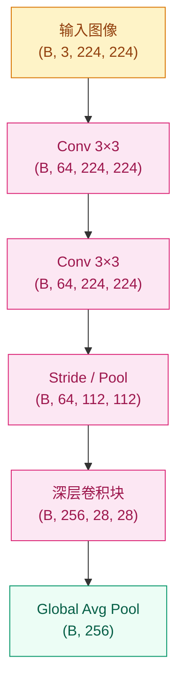
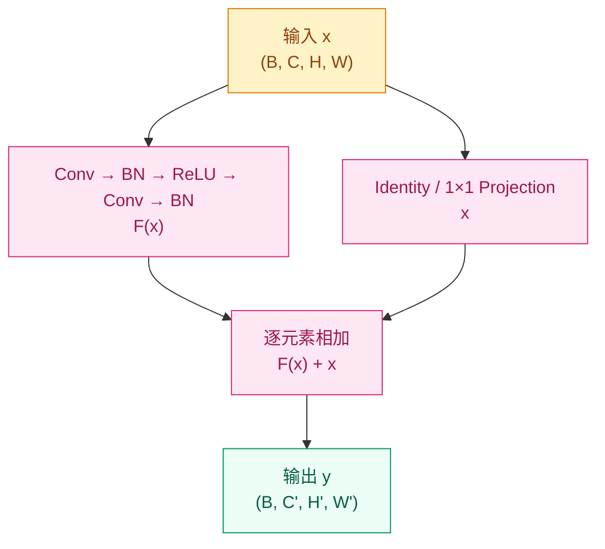

# 为什么图像不能直接交给全连接网络？—— CNN 架构演进（2012–2017）

## 这个问题从哪来

> 2012 年之前，视觉识别系统大量依赖 SIFT、HOG 等手工特征，图像先被设计成特征，再交给分类器。即便使用多层感知机，把图像直接压平成向量也会带来参数爆炸，并破坏像素的空间邻域关系。AlexNet 的突破不只是“更深”，而是第一次大规模证明：把局部性和参数共享写进网络结构，才能让模型真正利用图像这种数据的形状。

## 学习目标

完成本章后，你应能回答：

1. 卷积的局部连接、参数共享、层级特征分别解决了什么问题？
2. 为什么 VGG、GoogLeNet、ResNet、DenseNet、SE-Net 会按这样的顺序出现？
3. CNN 为什么在视觉任务中强大，又为什么最终要与注意力机制汇流？

---

## 1. 直觉

图像不是“很多数字的集合”，而是带有二维邻域关系的信号：相邻像素通常共同构成边缘、纹理和局部形状，远处像素的关联则往往要到更高层语义才会建立。

如果把一张图像直接压平成向量，全连接层会同时犯两个错误：一是参数量随输入尺寸急剧膨胀；二是模型看不见“谁和谁本来是邻居”。对模型而言，左上角的像素和右下角的像素只是两个普通维度，没有结构差别。

卷积层的做法正好相反：先承认图像的局部性，只让一个小卷积核看局部窗口，再把同一组参数复用到整张图上。这样模型学到的就不是“某个固定坐标上的模式”，而是“无论出现在何处都成立的局部模式”。

把卷积核想成一组可复用的小探测器会更直观：第一层看边缘，第二层看纹理与轮廓，后面逐层组合成部件和物体。CNN 的力量不只是“层更多”，而是它从一开始就假设图像有空间结构。

> 你要记住：CNN 的本质不是“层更多”，而是“把空间结构写进模型假设里”。

---

## 2. 机制

### 2.1 卷积与特征图

二维卷积可以写成：

$$
Y(i,j) = \sum_m \sum_n X(i+m,\, j+n) \cdot K(m,n)
$$

真正重要的不是公式本身，而是它隐含的结构假设：

- `kernel size` 决定每次只观察多大的局部窗口
- `stride` 决定特征图按多粗的步幅向前推进
- `padding` 决定边界信息是否被保留
- `channels` 决定同一位置上并行提取多少种模式

特征图不是“压缩后的图像”，而是“某类模式在各个位置上的响应图”。一个卷积核像一个模板，激活越高，表示当前位置越像它要找的模式。

### 2.2 感受野与下采样

CNN 不会一开始就看全图，而是靠层层堆叠逐步扩大感受野。这也是为什么现代 CNN 更偏好连续堆多个 3×3 卷积，而不是直接上一个很大的核：

- 多个 3×3 能用更少参数逼近更大的感受野
- 中间插入非线性，表达能力更强
- 结构更规整，便于堆深

下采样则是另一个核心决定。无论是 pooling 还是 stride=2 卷积，本质都是在用分辨率换计算预算和更大的上下文。但代价也很直接：如果过早下采样，小目标和高频细节会先被抹掉，后面的层再深也救不回来。



理论上，网络够深就能把局部信息一路汇总成全局信息；但这条路是逐层传播的，不是原生的全局连接。

### 2.3 残差连接

当 CNN 从 AlexNet、VGG 继续往更深处走时，问题不再只是参数量，而是“深了之后为什么反而更难训练”。这不是简单的过拟合，而是优化退化：理论上更深的网络至少能学到和浅层网络一样好，但实际训练却更差。

ResNet 的核心写法很简单：

$$
y = F(x, \{W_i\}) + x
$$

这里的关键不是加法本身，而是 identity shortcut：

- 如果新增的层暂时学不到有用东西，网络至少还能走恒等映射
- 梯度可以沿 shortcut 直接回传，信息流和梯度流都更顺
- 网络不必强行“重学一遍输入”，而是只学习相对输入的增量修正



> 你要记住：ResNet 真正解决的不是“表达能力不足”，而是“信息和梯度跨深层流动困难”。

### 2.4 从局部到全局的限制

CNN 的强项来自局部归纳偏置：图像中近处像素往往先组成边缘、纹理、局部部件，再汇总成语义对象。这让 CNN 在数据量不算夸张、视觉先验明确时表现非常强。

但同样的固定偏置也构成了边界。CNN 想看更大范围上下文，通常要靠：

- 堆更多层
- 扩大感受野
- 多尺度分支
- 空洞卷积或全局池化

这些办法都能逼近全局信息，但路径依然偏“逐层传递”。模型不擅长一开始就灵活连接任意远的位置，这也是后面视觉模型会逐步引入注意力机制的根本原因。

### 2.5 渐进式实现

**Step 1 · 最小卷积层（理解 shape 与参数共享）**

```python
# 验证卷积如何改变通道数，同时保持 H/W
# 只保留最小 Conv2d 逻辑，先把 shape 看懂
import torch
import torch.nn as nn

torch.manual_seed(42)

conv = nn.Conv2d(in_channels=3, out_channels=16, kernel_size=3, padding=1)
x = torch.randn(4, 3, 32, 32)
out = conv(x)

assert out.shape == (4, 16, 32, 32), f"Shape 错误: {out.shape}"
print(f"in: {x.shape}  out: {out.shape}")
print(f"参数量: {sum(p.numel() for p in conv.parameters())}")
```

**Step 2 · 标准卷积块（卷积 + 归一化 + 激活 + 下采样）**

```python
# 把 CNN 常见积木拆成最小可运行形式
# 重点观察 stride 如何同时影响通道和空间尺寸
import torch
import torch.nn as nn

torch.manual_seed(42)


def conv_block(in_ch: int, out_ch: int, stride: int = 1) -> nn.Sequential:
    return nn.Sequential(
        nn.Conv2d(in_ch, out_ch, kernel_size=3, stride=stride, padding=1, bias=False),
        nn.BatchNorm2d(out_ch),
        nn.ReLU(inplace=True),
    )


net = nn.Sequential(
    conv_block(3, 32),            # (B, 3, 32, 32) -> (B, 32, 32, 32)
    conv_block(32, 64, stride=2), # -> (B, 64, 16, 16)
    nn.AdaptiveAvgPool2d(1),      # -> (B, 64, 1, 1)
    nn.Flatten(),                 # -> (B, 64)
)

x = torch.randn(4, 3, 32, 32)
out = net(x)
assert out.shape == (4, 64)
print(f"输出 shape: {out.shape}")
```

**Step 3 · 最小残差块（理解 shortcut 对齐）**

```python
# 只保留 ResNet 最关键的残差相加逻辑
# 当通道数或分辨率变化时，用 1×1 Conv 对齐 shortcut
import torch
import torch.nn as nn

torch.manual_seed(42)


class ResBlock(nn.Module):
    def __init__(self, in_ch: int, out_ch: int, stride: int = 1):
        super().__init__()
        self.body = nn.Sequential(
            nn.Conv2d(in_ch, out_ch, 3, stride=stride, padding=1, bias=False),
            nn.BatchNorm2d(out_ch),
            nn.ReLU(inplace=True),
            nn.Conv2d(out_ch, out_ch, 3, padding=1, bias=False),
            nn.BatchNorm2d(out_ch),
        )
        self.shortcut = nn.Sequential(
            nn.Conv2d(in_ch, out_ch, 1, stride=stride, bias=False),
            nn.BatchNorm2d(out_ch),
        ) if (stride != 1 or in_ch != out_ch) else nn.Identity()
        self.relu = nn.ReLU(inplace=True)

    def forward(self, x: torch.Tensor) -> torch.Tensor:
        return self.relu(self.body(x) + self.shortcut(x))


block = ResBlock(64, 128, stride=2)
x = torch.randn(4, 64, 16, 16)
out = block(x)
assert out.shape == (4, 128, 8, 8), f"Shape 错误: {out.shape}"
print(f"in: {x.shape}  out: {out.shape}")
```

---

## 3. 架构演进：每一代都在修上一代的问题

### 3.1 AlexNet：先把 CNN 跑通

AlexNet 回答的第一个问题不是“怎么做到最优”，而是“深度卷积网络到底能不能在大规模视觉任务上稳定工作”。它把卷积、ReLU、GPU 训练、数据增强和 Dropout 放进同一个闭环里，第一次把 ImageNet 级别的视觉学习跑成了工程现实。

它解决了手工特征难以扩展的问题，但也留下两个明显缺口：结构还很经验主义，且不同层的卷积核大小、分组设计都偏试验驱动。

### 3.2 VGG：把“深而整齐”做成范式

VGG 的回应非常干脆：别再用太多花式设计，统一用 3×3 卷积反复堆叠。这样得到的是一个非常规整的深层 CNN 范式，也把“深度本身可以成为性能来源”这件事讲得更清楚。

VGG 的问题也同样明显：参数量和计算量都非常重，尤其全连接层的成本很夸张。它证明了“深而整齐”可行，但没解决“太贵”。

### 3.3 GoogLeNet：回应 VGG 的计算负担

GoogLeNet 针对的瓶颈是：既想扩大表达能力，又不能继续让参数量暴涨。Inception 的做法是同层并行使用多种尺度的卷积，再用 1×1 卷积先降维，把“多尺度特征提取”变成模块化设计。

它的贡献不只是省参数，而是把一个重要思想讲清楚：视觉模式没有单一尺度，网络需要同时看细粒度和粗粒度结构。

### 3.4 ResNet：解决“越深越难训练”

当网络继续加深，问题从“太重”变成“退化”。ResNet 的 shortcut 给出的答案是：如果新增层暂时没学到东西，那就至少别挡住信息流。网络不必从零开始重写映射，而是只学残差修正。

这是 CNN 演进中最关键的一跳，因为它把“深度”从高风险尝试，变成了可系统扩展的设计维度。152 层的意义不只在数值，而在它证明了深层网络可以被稳定组织起来。

### 3.5 DenseNet / SE-Net：在复用与重标定上继续打磨

DenseNet 继续追问：如果每层都重新学一遍相似特征，是不是还在浪费？它让每层都直接接收前面所有层的输出，把特征复用推到更极致。

SE-Net 则追问另一个问题：即便卷积提取了很多通道特征，为什么默认所有通道权重都一样？它通过 squeeze-excitation 机制，让模型按输入自适应地重标定通道重要性。

这两代不再像 AlexNet 或 ResNet 那样改变整条主线，但它们说明了 CNN 后期优化已经从“能不能工作”转向“如何更高效地复用与筛选信息”。

---

## 4. 工程陷阱

1. **shortcut 未对齐** -> 通道数或 stride 不匹配时直接相加，立刻触发 shape 错误
   处置：分辨率或通道变化时，用 1×1 Conv projection 对齐残差分支

2. **过早下采样** -> 算力省了，但高频细节和小目标信息会被提前抹掉
   处置：浅层慎用激进 stride，先看任务是否依赖细粒度局部结构

3. **只堆层数，不看感受野设计** -> 网络很深，却仍看不到足够大的上下文
   处置：联合检查 kernel、stride、多尺度分支和最终感受野，而不是只数层数

4. **BN / activation / residual 顺序混乱** -> 训练不稳定，性能与论文实现明显偏离
   处置：严格对齐目标架构的 block 顺序，尤其是 post-activation / pre-activation 的差异

> 你要记住：CNN 强在局部归纳偏置，限制也同样来自这种固定偏置。

---

## 演进笔记

> **这一技术的遗产**：CNN 把“局部性 + 参数共享”发挥到极致，让视觉模型第一次能稳定、系统地从像素中学习层级特征。它在数据较少、空间先验明确时依然极有优势。但这种固定局部窗口也意味着：模型更擅长从近邻累积全局信息，而不擅长一开始就灵活建模远程依赖。
>
> 这正是后续视觉模型逐步引入注意力机制、并最终走向 ViT 的原因。
>
> → 后续汇流：Transformer / 注意力架构

---

**上一章**：[训练与优化](../training/README.md) | **下一章**：[序列模型](../sequence-models/README.md)
