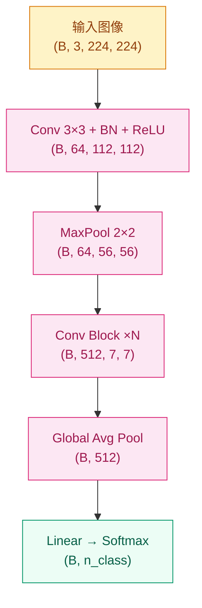

# 为什么全连接网络处理图像太浪费了？—— CNN 架构演进（2012–2017）

## 这个问题从哪来

> 2012 年之前，处理一张 224×224 的 RGB 图像意味着把它压平成 150528 维向量，每个维度连接所有隐藏单元。这不仅参数爆炸，还完全忽略了一个显然的先验：**相邻像素高度相关，远处像素几乎无关**。
> Krizhevsky 等人（2012）用卷积层打破了这个局面，但 AlexNet 只是起点。此后五年，VGG、GoogLeNet、ResNet、DenseNet 每一代架构都是被上一代的局限逼出来的。

## 学习目标

完成本章后，你应能回答：

1. 卷积层的局部连接和参数共享分别解决了全连接网络的什么问题？
2. ResNet 的跳跃连接为什么能训练 152 层而不退化？
3. 从 AlexNet 到 SE-Net，CNN 架构演进的核心驱动力是什么？

---

## 1. 直觉

把卷积核想成一个小探照灯，每次只照亮图像的一小块区域，判断"这里有没有某种模式"。

- **局部感受野**：每个神经元只看一小块，符合图像的局部相关性
- **参数共享**：同一个探照灯扫遍整张图，不管猫耳出现在左上还是右下，同一个核都能检测到
- **层级组合**：第一层学边缘，第二层学轮廓，第三层学部件，第四层学物体——这是 Zeiler & Fergus（2013）用可视化直接看到的

全连接层对一张 224×224 图像需要约 1.5 亿个参数只是第一层。3×3 卷积核只有 9 个参数，共享之后整层只有几千个参数。

> 你要记住：卷积层的核心价值是"局部性 + 参数共享"，不是"精度更高"，而是"在更少参数下提取空间结构"。

---

## 2. 机制

### 2.1 二维卷积

$$
Y(i,j) = \sum_m \sum_n X(i+m,\, j+n) \cdot K(m,n)
$$

关键超参数：

| 参数 | 作用 | 常见值 |
|------|------|--------|
| Kernel Size | 局部感受野大小 | 3×3（首选）、1×1（通道变换）、7×7（浅层） |
| Stride | 下采样步长 | 1（保持分辨率）、2（减半） |
| Padding | 边界信息保留 | `same`（保持 HW）、`valid`（不补零） |
| Channels | 特征表达容量 | 随网络加深翻倍（64→128→256→512） |

### 2.2 CNN 前向传播流



### 2.3 架构演进：每一代都是被逼出来的

| 年份 | 架构 | 上一代的局限 | 核心解法 |
|------|------|------------|---------|
| 2012 | AlexNet | 手工特征无法扩展 | 深度卷积 + ReLU + GPU |
| 2013 | ZFNet | AlexNet 不可解释 | 反卷积可视化，调整卷积核大小 |
| 2014 | VGGNet | AlexNet 设计随意 | 纯 3×3 卷积均匀堆叠，系统化深度 |
| 2014 | GoogLeNet | VGG 参数太多 | Inception 模块多尺度并行，1×1 降维 |
| 2015 | ResNet | 超过 20 层就退化 | 跳跃连接，学残差而非全映射 |
| 2016 | DenseNet | ResNet 特征未充分复用 | 每层连接所有前层，特征复用最大化 |
| 2017 | SE-Net | 所有通道权重相等 | Squeeze-Excitation 通道注意力 |

### 2.4 ResNet 跳跃连接为什么有效

$$
y = F(x, \{W_i\}) + x
$$

- 如果 $F(x) = 0$，跳跃连接保证输出 $\approx$ 输入，网络不会因为加深而退化
- 梯度可以沿跳跃路径直接回传，缓解梯度消失
- 实质上让网络"学残差"比"学全映射"更容易

> 你要记住：ResNet 不是在"加深网络"，而是在说"如果多加的层没用，就让它恒等映射好了"。这个思路让 152 层成为可能。

### 2.5 渐进式实现

**Step 1 · 最小卷积层（感受卷积操作本身）**

```python
# 验证卷积的 shape 变化：in→out, H/W 如何变化
# 只含最核心的 Conv2d，无任何附加组件
import torch
import torch.nn as nn

torch.manual_seed(42)

conv = nn.Conv2d(in_channels=3, out_channels=16, kernel_size=3, padding=1)
# padding=1 + kernel=3 → 输出 HW 与输入相同

x = torch.randn(4, 3, 32, 32)   # (batch, C, H, W)
out = conv(x)

assert out.shape == (4, 16, 32, 32), f"Shape 错误: {out.shape}"
print(f"in: {x.shape}  out: {out.shape}")
print(f"参数量: {sum(p.numel() for p in conv.parameters())}")  # 3*16*3*3+16 = 448
```

**Step 2 · 标准卷积块（Conv + BN + ReLU + Pool）**

```python
# Conv → BN → ReLU 是 CNN 的基本积木
# MaxPool 做空间下采样；shape 注释是排查问题的关键
import torch
import torch.nn as nn

torch.manual_seed(42)


def conv_block(in_ch: int, out_ch: int, stride: int = 1) -> nn.Sequential:
    """Conv 3×3 + BN + ReLU，stride 控制是否下采样"""
    return nn.Sequential(
        nn.Conv2d(in_ch, out_ch, kernel_size=3, stride=stride, padding=1, bias=False),
        nn.BatchNorm2d(out_ch),
        nn.ReLU(inplace=True),
    )


net = nn.Sequential(
    conv_block(3, 32),                        # (B, 3, 32, 32) → (B, 32, 32, 32)
    nn.MaxPool2d(2),                          # → (B, 32, 16, 16)
    conv_block(32, 64),                       # → (B, 64, 16, 16)
    nn.MaxPool2d(2),                          # → (B, 64, 8, 8)
    nn.AdaptiveAvgPool2d(1),                  # → (B, 64, 1, 1)  Global Avg Pool
    nn.Flatten(),                             # → (B, 64)
    nn.Linear(64, 10),
)

x = torch.randn(4, 3, 32, 32)
out = net(x)
assert out.shape == (4, 10)
print(f"输出 shape: {out.shape}")
```

**Step 3 · 残差块（ResNet 核心）**

```python
# 残差连接解决退化问题：F(x) + x
# shortcut 在通道数或分辨率变化时需要 1×1 Conv 对齐
import torch
import torch.nn as nn


class ResBlock(nn.Module):
    """ResBlock · 01-Visual-Intelligence/cnn-architectures · 基本残差块 · 依赖: torch"""

    def __init__(self, in_ch: int, out_ch: int, stride: int = 1):
        super().__init__()
        self.body = nn.Sequential(
            nn.Conv2d(in_ch, out_ch, 3, stride=stride, padding=1, bias=False),
            nn.BatchNorm2d(out_ch),
            nn.ReLU(inplace=True),
            nn.Conv2d(out_ch, out_ch, 3, padding=1, bias=False),
            nn.BatchNorm2d(out_ch),
        )
        # 维度不匹配时用 1×1 Conv 对齐
        self.shortcut = nn.Sequential(
            nn.Conv2d(in_ch, out_ch, 1, stride=stride, bias=False),
            nn.BatchNorm2d(out_ch),
        ) if (stride != 1 or in_ch != out_ch) else nn.Identity()

        self.relu = nn.ReLU(inplace=True)

    def forward(self, x: torch.Tensor) -> torch.Tensor:
        """
        Args:
            x: (B, in_ch, H, W)
        Returns:
            out: (B, out_ch, H', W')  H'=H/stride
        """
        return self.relu(self.body(x) + self.shortcut(x))


# 验证
block = ResBlock(64, 128, stride=2)
x = torch.randn(4, 64, 16, 16)
out = block(x)
assert out.shape == (4, 128, 8, 8), f"Shape 错误: {out.shape}"
print(f"in: {x.shape}  out: {out.shape}")
```

**Step 4 · 完整小型 ResNet（CIFAR-10 可训练）**

```python
# 完整端到端：输入 CIFAR-10 图像 → 分类概率
# 使用 AdaptiveAvgPool 替代 FC 前的 Flatten，兼容不同输入尺寸
import torch
import torch.nn as nn


class ResBlock(nn.Module):
    """ResBlock · 基本残差块"""

    def __init__(self, in_ch: int, out_ch: int, stride: int = 1):
        super().__init__()
        self.body = nn.Sequential(
            nn.Conv2d(in_ch, out_ch, 3, stride=stride, padding=1, bias=False),
            nn.BatchNorm2d(out_ch), nn.ReLU(inplace=True),
            nn.Conv2d(out_ch, out_ch, 3, padding=1, bias=False),
            nn.BatchNorm2d(out_ch),
        )
        self.shortcut = nn.Sequential(
            nn.Conv2d(in_ch, out_ch, 1, stride=stride, bias=False),
            nn.BatchNorm2d(out_ch),
        ) if (stride != 1 or in_ch != out_ch) else nn.Identity()
        self.relu = nn.ReLU(inplace=True)

    def forward(self, x: torch.Tensor) -> torch.Tensor:
        return self.relu(self.body(x) + self.shortcut(x))


class TinyResNet(nn.Module):
    """TinyResNet · 01-Visual-Intelligence/cnn-architectures · CIFAR-10 ResNet · 依赖: torch"""

    def __init__(self, n_class: int = 10):
        super().__init__()
        self.stem = nn.Sequential(
            nn.Conv2d(3, 32, 3, padding=1, bias=False),
            nn.BatchNorm2d(32), nn.ReLU(inplace=True),
        )
        self.layer1 = ResBlock(32, 64, stride=2)   # 32→16
        self.layer2 = ResBlock(64, 128, stride=2)  # 16→8
        self.layer3 = ResBlock(128, 256, stride=2) # 8→4
        self.head = nn.Sequential(
            nn.AdaptiveAvgPool2d(1),
            nn.Flatten(),
            nn.Linear(256, n_class),
        )
        # He 初始化
        for m in self.modules():
            if isinstance(m, nn.Conv2d):
                nn.init.kaiming_normal_(m.weight, mode="fan_out", nonlinearity="relu")
            elif isinstance(m, nn.BatchNorm2d):
                nn.init.ones_(m.weight); nn.init.zeros_(m.bias)

    def forward(self, x: torch.Tensor) -> torch.Tensor:
        """
        Args:
            x: (B, 3, 32, 32)  CIFAR-10 输入
        Returns:
            logits: (B, n_class)
        """
        return self.head(self.layer3(self.layer2(self.layer1(self.stem(x)))))


model = TinyResNet()
x = torch.randn(4, 3, 32, 32)
out = model(x)
assert out.shape == (4, 10)
params = sum(p.numel() for p in model.parameters())
print(f"输出 shape: {out.shape}  参数量: {params:,}")
```

---

## 3. 工程陷阱

优先级从高到低：

1. **感受野不够大** → 深层特征无法感知远处上下文，分类边界模糊
   处置：ResNet 最后几层用 stride=2 下采样，或使用空洞卷积扩大感受野

2. **第一层用 7×7 但 stride=1** → 计算量暴增，早期特征提取过慢
   处置：浅层大 stride（`nn.Conv2d(3, 64, 7, stride=2, padding=3)`），快速降分辨率

3. **Shortcut 维度不对齐但未加 projection** → `RuntimeError: size mismatch`
   处置：通道数或分辨率变化时，shortcut 必须加 1×1 Conv

4. **迁移学习时 BN 层未冻结或全程冻结** → 预训练特征分布被破坏或适应不了新域
   处置：通常先冻结 backbone 训分类头，再解冻后几层联合微调

5. **推理时忘记 `model.eval()`** → BN 使用 batch 统计而非运行统计，小 batch 推理结果随机漂移
   处置：推理前务必 `model.eval()`

> 你要记住：CNN 最常见的错误不是模型选型，而是感受野设计和 BN/shortcut 的细节——这两处加起来覆盖了 70% 以上的 shape 错误和精度异常。

---

## 演进笔记

> **这一技术的遗产**：CNN 通过局部性和参数共享彻底解决了图像的"空间冗余"问题，ResNet 的跳跃连接则证明深度不是障碍。但 CNN 始终有一个盲点：它的感受野是局部的，缺乏对全局上下文的建模能力。
>
> 与此同时，语言任务从来没有"局部性"这个先验——词的意思取决于整个句子。这个差异催生了完全不同的一条线：序列建模 → 注意力机制 → Transformer。

→ 视觉线继续：[序列模型（GAN、VAE、AlphaGo）](../sequence-models/README.md)
→ 语言线入口：[注意力机制](../../02-Language-Transformers/attention-mechanisms/README.md)

---

**上一章**：[训练与优化](../training/README.md) | **下一章**：[序列模型](../sequence-models/README.md)
