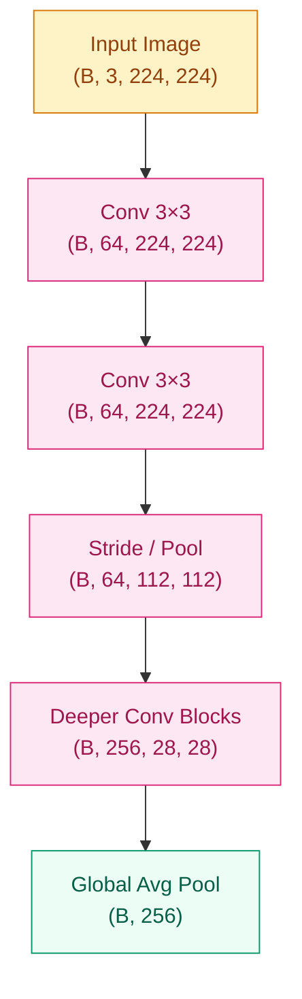
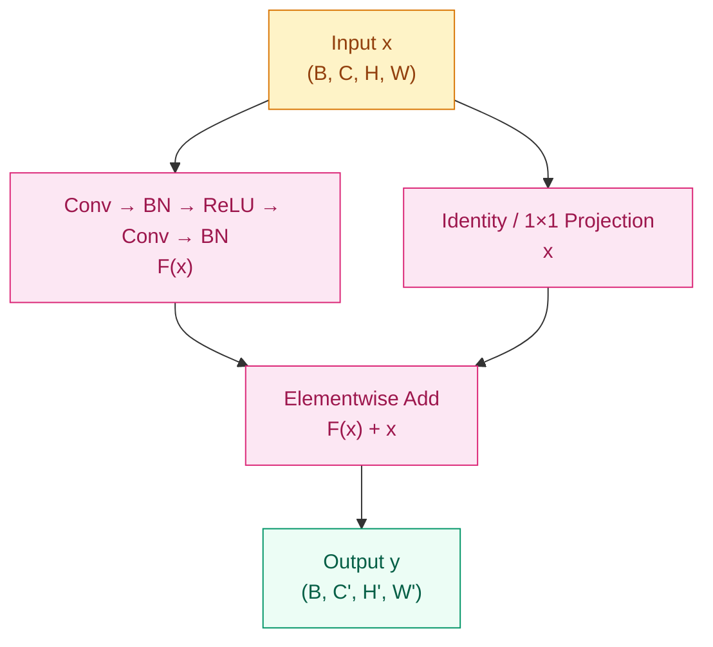

# Why Can't Images Be Modeled Well by Fully Connected Networks? — CNN Architecture Evolution (2012–2017)

**[English](README_EN.md) | [中文](README.md)**

## Where This Problem Came From

> Before AlexNet, visual recognition relied heavily on hand-crafted features such as SIFT and HOG. Flattening an image into a vector made MLPs expensive and structurally blind to spatial locality. The real breakthrough of CNNs was not depth alone, but the decision to encode locality and parameter sharing directly into the architecture.

## Learning Goals

After this chapter, you should be able to answer:

1. What problems are solved by local connectivity, parameter sharing, and hierarchical feature learning?
2. Why did VGG, GoogLeNet, ResNet, DenseNet, and SE-Net appear in that order?
3. Why are CNNs powerful in vision, and why do they eventually need to converge with attention-based modeling?

---

## 1. Intuition

An image is not just a long list of numbers. It is a two-dimensional signal with local structure: neighboring pixels often form edges, textures, and parts, while long-range relationships usually emerge only after higher-level composition.

If you flatten an image and feed it to a fully connected network, you lose two things at once. First, the parameter count explodes with input resolution. Second, the model no longer knows which pixels were originally neighbors. To the network, a pixel in the top-left corner and one in the bottom-right corner are just two unrelated coordinates.

A convolution layer makes the opposite choice. It assumes locality first, applies a small filter to a local window, and reuses the same weights across the whole image. The model is no longer learning “a pattern at one fixed position,” but “a local pattern that matters wherever it appears.”

It helps to think of convolution kernels as reusable detectors: early layers respond to edges, later layers combine them into textures, parts, and objects. The strength of CNNs is not just that they are deeper, but that they build spatial inductive bias directly into the model.

> Remember: the core of a CNN is not “more layers,” but “encoding spatial structure into the hypothesis class.”

---

## 2. Mechanism

### 2.1 Convolution and Feature Maps

Two-dimensional convolution can be written as:

$$
Y(i,j) = \sum_m \sum_n X(i+m,\, j+n) \cdot K(m,n)
$$

What matters more than the equation is the structure it enforces:

- `kernel size` controls how large a local window the model sees at once
- `stride` controls how aggressively the feature map moves across space
- `padding` controls whether border information is preserved
- `channels` control how many different patterns are extracted in parallel

A feature map is not just a compressed image. It is a response map: high activation means “this pattern is strongly present here.”

### 2.2 Receptive Fields and Downsampling

CNNs do not see the whole image at once. They expand context gradually by stacking layers. That is why many modern CNNs prefer repeated 3×3 convolutions over one large kernel:

- multiple 3×3 layers approximate a larger receptive field with fewer parameters
- nonlinearity between layers increases representational power
- the design is more regular and easier to scale

Downsampling is the second big choice. Whether it comes from pooling or stride-2 convolution, it trades spatial detail for larger context and lower compute. The tradeoff is real: if you downsample too early, small objects and high-frequency detail disappear before later layers can use them.



In principle, a deep enough CNN can accumulate local evidence into global understanding. In practice, that path is still layer-by-layer rather than natively global.

### 2.3 Residual Connections

As CNNs grew deeper after AlexNet and VGG, the bottleneck shifted. The question was no longer only “how many parameters can we afford,” but “why does optimization get worse when the network gets deeper?” This is degradation, not merely overfitting.

ResNet answers with a simple form:

$$
y = F(x, \{W_i\}) + x
$$

The crucial idea is the identity shortcut:

- if the added layers are not yet useful, the network can still preserve the input path
- gradients can flow directly through the shortcut
- the block only needs to learn a residual correction, not rebuild the full mapping from scratch



> Remember: ResNet did not mainly solve “insufficient capacity.” It solved “poor information and gradient flow across depth.”

### 2.4 The Limit from Local to Global Modeling

CNNs are strong precisely because they impose local inductive bias. In vision, nearby pixels really do tend to compose edges, textures, and parts before becoming whole objects. That bias is often an advantage when data is limited and the spatial prior is clear.

But the same fixed bias also becomes a limit. CNNs typically need to rely on:

- more layers
- larger receptive fields
- multi-scale branches
- dilated convolutions or global pooling

These tools help them approach global context, but the information path is still largely incremental. CNNs are not naturally built to connect arbitrary distant positions at the first step. That is the deeper reason later vision models began to introduce attention and eventually moved toward ViT-style token mixing.

### 2.5 Progressive Implementation

**Step 1 · Minimal Convolution Layer**

```python
# Verify how convolution changes channels while preserving H/W
# Start with the smallest runnable Conv2d example
import torch
import torch.nn as nn

torch.manual_seed(42)

conv = nn.Conv2d(in_channels=3, out_channels=16, kernel_size=3, padding=1)
x = torch.randn(4, 3, 32, 32)
out = conv(x)

assert out.shape == (4, 16, 32, 32), f"Shape error: {out.shape}"
print(f"in: {x.shape}  out: {out.shape}")
print(f"params: {sum(p.numel() for p in conv.parameters())}")
```

**Step 2 · Standard Convolution Block**

```python
# Build the core CNN building block in minimal form
# Observe how stride affects both channel count and spatial size
import torch
import torch.nn as nn

torch.manual_seed(42)


def conv_block(in_ch: int, out_ch: int, stride: int = 1) -> nn.Sequential:
    return nn.Sequential(
        nn.Conv2d(in_ch, out_ch, kernel_size=3, stride=stride, padding=1, bias=False),
        nn.BatchNorm2d(out_ch),
        nn.ReLU(inplace=True),
    )


net = nn.Sequential(
    conv_block(3, 32),            # (B, 3, 32, 32) -> (B, 32, 32, 32)
    conv_block(32, 64, stride=2), # -> (B, 64, 16, 16)
    nn.AdaptiveAvgPool2d(1),      # -> (B, 64, 1, 1)
    nn.Flatten(),                 # -> (B, 64)
)

x = torch.randn(4, 3, 32, 32)
out = net(x)
assert out.shape == (4, 64)
print(f"output shape: {out.shape}")
```

**Step 3 · Minimal Residual Block**

```python
# Keep only the core residual-addition logic from ResNet
# Use a 1x1 projection when shortcut dimensions do not match
import torch
import torch.nn as nn

torch.manual_seed(42)


class ResBlock(nn.Module):
    def __init__(self, in_ch: int, out_ch: int, stride: int = 1):
        super().__init__()
        self.body = nn.Sequential(
            nn.Conv2d(in_ch, out_ch, 3, stride=stride, padding=1, bias=False),
            nn.BatchNorm2d(out_ch),
            nn.ReLU(inplace=True),
            nn.Conv2d(out_ch, out_ch, 3, padding=1, bias=False),
            nn.BatchNorm2d(out_ch),
        )
        self.shortcut = nn.Sequential(
            nn.Conv2d(in_ch, out_ch, 1, stride=stride, bias=False),
            nn.BatchNorm2d(out_ch),
        ) if (stride != 1 or in_ch != out_ch) else nn.Identity()
        self.relu = nn.ReLU(inplace=True)

    def forward(self, x: torch.Tensor) -> torch.Tensor:
        return self.relu(self.body(x) + self.shortcut(x))


block = ResBlock(64, 128, stride=2)
x = torch.randn(4, 64, 16, 16)
out = block(x)
assert out.shape == (4, 128, 8, 8), f"Shape error: {out.shape}"
print(f"in: {x.shape}  out: {out.shape}")
```

---

## 3. Architecture Evolution: Each Generation Fixed a Different Bottleneck

### 3.1 AlexNet: First Make CNNs Work at Scale

AlexNet did not answer “what is the final best design?” It answered the more urgent question: can a deep convolutional network actually work on large-scale visual recognition? By combining convolution, ReLU, GPU training, data augmentation, and Dropout into one training pipeline, it turned CNNs into a practical ImageNet-era system.

What it solved was the ceiling of hand-crafted features. What it left behind was a design that still felt partly heuristic and expensive.

### 3.2 VGG: Turn “Deep and Regular” into a Paradigm

VGG responded by simplifying the design language. Instead of mixing many kernel styles, it stacked uniform 3×3 convolutions over and over. This made one lesson unmistakable: depth itself could be a systematic source of better features.

But VGG also exposed the next bottleneck very clearly: the model became heavy in both parameters and computation.

### 3.3 GoogLeNet: Answer the Cost Problem of VGG

GoogLeNet asked a sharper question: how do we keep expressive power without paying VGG-level cost? Its Inception modules process multiple scales in parallel and use 1×1 convolutions to reduce dimension first.

The lasting idea here is not just efficiency. It is the recognition that visual patterns exist at multiple scales, and a single fixed branch is often not enough.

### 3.4 ResNet: Solve “More Depth, Worse Optimization”

When CNNs kept getting deeper, the limiting factor became optimization rather than raw capacity. ResNet answered with the shortcut path: if the extra layers are not helping yet, they should at least not block the signal.

This is the most decisive step in CNN evolution because it turned depth from a fragile experiment into a scalable design dimension.

### 3.5 DenseNet / SE-Net: Refine Reuse and Recalibration

DenseNet continues the story by asking whether features are being relearned unnecessarily. By connecting each layer to all previous ones, it pushes feature reuse much further.

SE-Net asks a different question: even if convolution produces many channels, why should they all matter equally? Its squeeze-excitation mechanism lets the model recalibrate channel importance dynamically.

These later steps no longer redefine the whole field the way AlexNet or ResNet did, but they show how CNN design gradually shifted from “can it work?” to “how can information be reused and weighted more intelligently?”

---

## 4. Engineering Pitfalls

1. **Misaligned shortcuts** -> adding tensors with mismatched channels or stride causes immediate shape failures
   Fix: use a 1×1 projection whenever the residual branch changes resolution or channel count

2. **Downsampling too early** -> compute is cheaper, but small objects and high-frequency detail disappear too soon
   Fix: be conservative with aggressive early stride when the task needs fine local structure

3. **Stacking depth without checking receptive fields** -> the model gets deeper without seeing enough context
   Fix: inspect kernel size, stride, multi-scale branches, and the effective context path together

4. **Mixing up BN / activation / residual order** -> training becomes unstable and results drift from the intended architecture
   Fix: follow the exact block ordering of the target design, especially for post-activation vs pre-activation variants

> Remember: CNNs are strong because of local inductive bias, and they are also limited by that same fixed bias.

---

## Evolution Notes

> **What this technique left behind:** CNNs pushed locality and parameter sharing to their limit, making it practical to learn hierarchical visual features directly from pixels. They remain extremely effective when spatial priors are strong and data is not unlimited. But the same fixed local window also means CNNs are better at accumulating global understanding gradually than at modeling long-range dependencies flexibly from the start.
>
> This is why later vision models gradually introduced attention and eventually converged toward ViT-style token mixing.
>
> → Later convergence: Transformer / attention-based vision modeling

---

**Previous**: [Training and Optimization](../training/README_EN.md) | **Next**: [Sequence Models](../sequence-models/README_EN.md)
