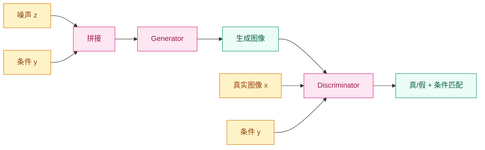
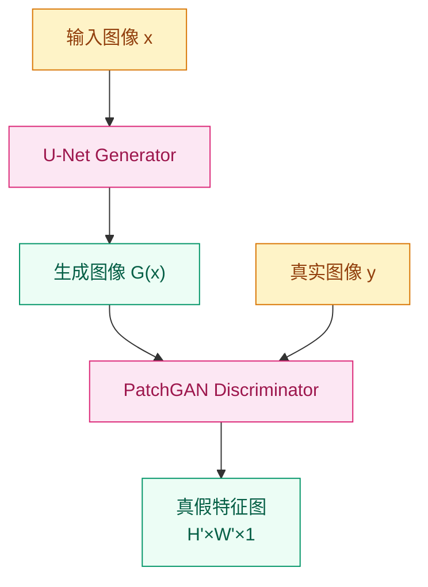
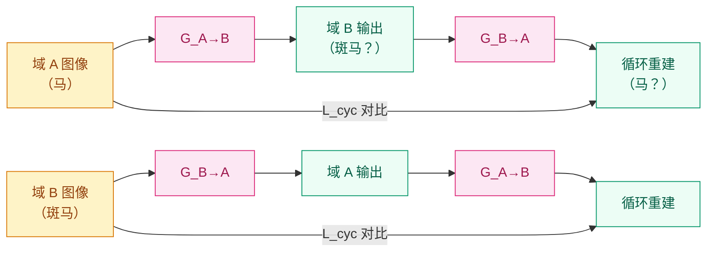
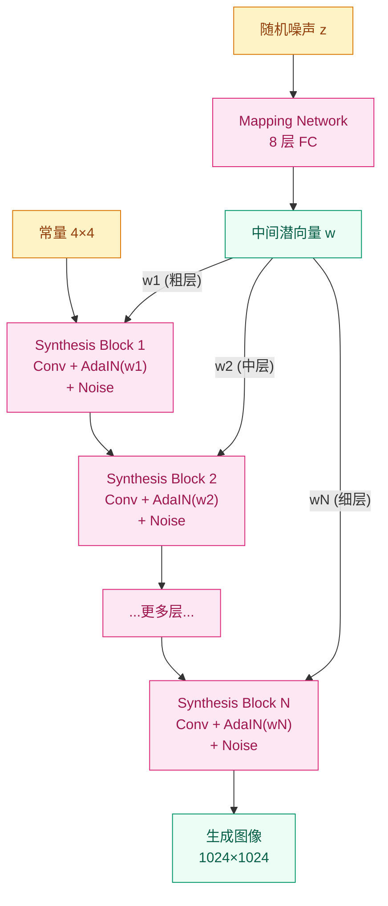

# 从随机噪声到精确控制 —— GAN 进阶（2017–2019）

**[English](README_EN.md) | [中文](README.md)**

## 这个问题从哪来

> DCGAN 给出了稳定训练的配方，Progressive GAN 把分辨率推到了 1024×1024。但原始 GAN 仍然有三个根本性限制：① 生成过程完全不可控——你只能扔进一个随机噪声，得到什么全凭运气；② 训练需要配对数据——每张输入图都必须有对应的输出图；③ 生成质量在面部等特定领域仍有差距。
>
> 2017–2019 年，GAN 社区围绕"可控性""无配对训练""极致质量"三个方向展开了密集探索。条件 GAN 让你指定生成什么，CycleGAN 让你摆脱配对数据的束缚，Pix2Pix 用 PatchGAN 解决了图像翻译的细节问题，StyleGAN 则把面部生成推到了以假乱真的地步。

## 学习目标

完成本章后，你应能回答：

1. 条件 GAN 如何在生成器和判别器中注入条件信息，实现可控生成？
2. CycleGAN 的循环一致性损失为什么能让无配对训练成为可能？
3. PatchGAN 判别器为什么比全图判别器更适合图像翻译任务？
4. StyleGAN 的 Mapping Network 和 AdaIN 如何实现分层风格控制？

---

## 1. 直觉

### 1.1 从"随机抽奖"到"指定菜单"

原始 GAN 就像一个盲盒：你把随机噪声扔进去， Generator 给你一个随机输出。你没法说"我要一匹斑马"或者"我要一张梵高风格的夜景"。

条件 GAN（cGAN）解决了这个问题。它在 Generator 和 Discriminator 中都加入了一个"菜单"——条件信息（类别标签、文本描述、输入图像等）。Generator 不再从纯噪声出发，而是从"噪声 + 菜单"出发；Discriminator 不只判断真假，还要判断"这张图是否符合菜单要求"。

### 1.2 从"翻译需要词典"到"翻译靠语感"

Pix2Pix 解决的是配对图像翻译：把卫星图变地图、把线稿变照片、把白天变黑夜。它需要成对的训练数据——每张输入图都必须有精确对应的输出图。

但现实中配对数据极其稀缺。你想把马变成斑马，你不可能有"同一匹马的两个版本"。CycleGAN 的直觉是：如果你能把 A 翻译成 B，再把 B 翻译回 A 应该得到原来的图。这个"循环一致性"约束，让网络在没有配对数据的情况下也能学到有意义的映射。

### 1.3 从"全图审查"到"局部鉴定"

传统判别器看一张完整的图来判断真假。但在图像翻译任务中，局部细节（边缘锐度、纹理连续性）比全局结构更重要。PatchGAN 的判别器只看图像的一个 N×N 小块，输出一个"这个小块是真还是假"的判断。多个小块的判断拼起来，就是一张完整的"真假热力图"。

PatchGAN 的好处是：参数量小、对输入尺寸不敏感、能捕捉局部瑕疵。一张 256×256 的图，70×70 的 PatchGAN 输出一个 30×30 的真假图，每个位置对应原图的一个感受野区域。

### 1.4 从"随机生成"到"风格导演"

StyleGAN 的直觉是把"这个人长什么样"和"这张图怎么画"分开控制。

传统 GAN 的潜空间 z 直接喂给 Generator，z 的每个维度同时控制着身份、姿态、光照、发型等各种属性，高度纠缠（entangled）。StyleGAN 先用一个 Mapping Network 把 z 映射到一个更解耦的中间空间 W，然后在 Generator 的每一层通过 AdaIN 注入不同层级的风格——浅层控制粗粒度属性（脸型、姿态），中层控制中粒度属性（发型、眼镜），细层控制细节（肤色、毛孔）。

这就像拍电影：导演先确定整体风格（选角、布景），再定摄影风格（打光、构图），最后处理后期细节（调色、特效）。每层风格独立控制，互不干扰。

> 你要记住：GAN 进阶的四条路是①条件控制（cGAN）、②无配对训练（CycleGAN）、�局部判别（PatchGAN）、④分层风格（StyleGAN）。

---

## 2. 机制

### 2.1 条件 GAN（cGAN）

Mirza & Osindero (2014) 的改动极其简洁：在原始 GAN 的 G 和 D 中都加入条件信息 $y$。

**目标函数：**

$$\min_G \max_D \; \mathbb{E}_{x \sim p_{data}}[\log D(x|y)] + \mathbb{E}_{z \sim p_z}[\log(1 - D(G(z|y)|y))]$$

- **Generator**: 输入从 $z$ 变为 $(z, y)$，条件 $y$ 和噪声 $z$ 一起决定输出
- **Discriminator**: 输入从 $x$ 变为 $(x, y)$，D 要判断 $x$ 是否真实 **且** 是否与 $y$ 匹配

条件 $y$ 可以是：
- 类别标签（one-hot 向量）→ 类别条件生成
- 文本嵌入 → 文本到图像生成（StackGAN、AttnGAN）
- 另一张图像 → 图像到图像翻译（Pix2Pix 的基础）

**实现方式**：条件信息通常通过拼接（concatenation）注入。Generator 在输入层把 $z$ 和 $y$ 拼接；Discriminator 在某一层（通常是特征层而非输入层）把特征和 $y$ 拼接。



cGAN 的关键洞察：条件信息对 D 和 G 同等重要。如果只给 G 条件而不给 D，D 无法判断生成结果是否符合条件——它只能判断真假，无法约束语义一致性。

### 2.2 Pix2Pix

Isola et al. (2017) 把图像翻译统一为一个 cGAN 框架：给定输入图像 $x$，生成输出图像 $y$。

**架构：**

- **Generator**: U-Net 结构（编码器-解码器 + 跳跃连接），输入一张图，输出一张翻译后的图
- **Discriminator**: PatchGAN（马尔可夫判别器），判断图像中每个 70×70 块的真伪

**损失函数：**

$$\mathcal{L} = \mathcal{L}_{cGAN}(G, D) + \lambda \cdot \mathcal{L}_{L1}(G)$$

其中：
- $\mathcal{L}_{cGAN}$ 是条件对抗损失，让生成图像在 D 看来"真实"
- $\mathcal{L}_{L1} = \mathbb{E}_{x,y}[\|y - G(x)\|_1]$ 是 L1 重建损失，让生成图像在像素层面接近目标
- $\lambda$ 通常设为 100

L1 损失保证了输出的全局结构正确（不会出现完全离谱的内容），对抗损失保证了局部细节的锐利（不会出现模糊的平均化结果）。两者缺一不可：只有 L1 会得到模糊的输出，只有对抗损失会得到细节丰富但内容错误的输出。

**PatchGAN 判别器：**

PatchGAN 不是对整张图输出一个真/假分数，而是对输入图像的每个重叠的 N×N 区域输出一个真/假值。最终输出一个 H'×W' 的特征图，每个位置对应原图的一个感受野区域。

为什么有效：
1. **参数量小**：只处理 N×N 区域，不需要很大的网络
2. **不依赖图像尺寸**：可以处理任意大小的输入
3. **关注局部质量**：纹理、边缘、颜色的一致性主要取决于局部统计



### 2.3 CycleGAN

Zhu et al. (2017) 的核心问题：没有配对数据，怎么做图像翻译？

**架构：**

两个 Generator 和两个 Discriminator：
- $G_{A \to B}$: 把域 A 的图像翻译到域 B
- $G_{B \to A}$: 把域 B 的图像翻译到域 A
- $D_A$: 判断域 A 的图像真伪
- $D_B$: 判断域 B 的图像真伪

**损失函数：**

$$\mathcal{L} = \mathcal{L}_{GAN}(G_{A \to B}, D_B) + \mathcal{L}_{GAN}(G_{B \to A}, D_A) + \lambda \cdot \mathcal{L}_{cyc}(G_{A \to B}, G_{B \to A})$$

**对抗损失**：每个 Generator 各自与对应的 Discriminator 对抗。

**循环一致性损失（核心创新）：**

$$\mathcal{L}_{cyc} = \mathbb{E}_{x_A}[\|G_{B \to A}(G_{A \to B}(x_A)) - x_A\|_1] + \mathbb{E}_{x_B}[\|G_{A \to B}(G_{B \to A}(x_B)) - x_B\|_1]$$

直觉：如果你把英文翻译成中文，再把中文翻译回英文，你应该得到原文。循环一致性防止了 Generator 产生与输入无关的任意输出——它必须保留输入的核心结构，只改变目标域的"风格"。

**身份损失（可选但推荐）：**

$$\mathcal{L}_{identity} = \mathbb{E}_{x_B}[\|G_{A \to B}(x_B) - x_B\|_1] + \mathbb{E}_{x_A}[\|G_{B \to A}(x_A) - x_A\|_1]$$

如果把域 B 的图像直接输入 $G_{A \to B}$，输出应该不变（因为图像已经是 B 域风格了）。这个损失帮助 Generator 保持颜色映射的稳定性。



### 2.4 StyleGAN

Karras et al. (2018) 的核心创新是重新设计了 Generator 的架构，把"生成什么"和"怎么画"分离开。

**传统 Generator vs StyleGAN Generator：**

传统 GAN Generator：$z \to$ 上采样层链 $\to$ 图像

StyleGAN Generator：
1. **Mapping Network**: $z \to w$（8 层全连接网络），把纠缠的潜空间映射到解耦的中间空间
2. **Synthesis Network**: 从学习到的常量 $4 \times 4$ 特征图出发，每层通过 AdaIN 注入 $w$
3. **噪声注入**: 每层加入高斯噪声，控制随机细节（头发纹理、皮肤毛孔）

**Adaptive Instance Normalization（AdaIN）：**

$$\text{AdaIN}(x_i, y) = y_{s,i} \frac{x_i - \mu(x_i)}{\sigma(x_i)} + y_{b,i}$$

其中 $y_s$ 和 $y_b$ 是从 $w$ 通过学习的仿射变换得到的缩放和偏移参数。AdaIN 在每个卷积层之后注入风格，让不同的 $w$ 值产生不同的视觉效果。

**分层风格控制：**

StyleGAN 发现 $w$ 在不同层注入时控制不同层级的属性：
- **粗层**（4×4 – 8×8）：姿态、脸型、眼镜有无
- **中层**（16×16 – 32×32）：面部特征、发型
- **细层**（64×64 – 1024×1024）：肤色、纹理细节

这使得风格混合（style mixing）成为可能：用一个 $w$ 控制粗层，另一个 $w$ 控制细层，生成同时具有两种特征的图像。



**StyleGAN v2 和 v3 的主要改进：**

- **v2 (2020)**: 消除了 StyleGAN v1 中的"水滴状伪影"（由 AdaIN 的实例归一化引起），引入权重调制/解调制替代 AdaIN，加入路径正则化让 $w$ 空间更平滑
- **v3 (2021)**: 解决了"纹理粘连"问题（生成的纹理在旋转时粘在图像平面上），让生成的图像具有近似平移和旋转等变性

### 2.5 渐进式代码实现

下面我们用 PyTorch 逐步实现 cGAN、PatchGAN、CycleGAN 的循环一致性损失和 StyleGAN 的核心组件。

**Step 1 -- 条件 GAN Generator：**

```python
import torch
import torch.nn as nn

class ConditionalGenerator(nn.Module):
    """条件 GAN 生成器：噪声 z + 条件标签 y → 图像"""
    def __init__(self, z_dim=100, num_classes=10, base_ch=64):
        super().__init__()
        self.label_embed = nn.Embedding(num_classes, num_classes)
        input_dim = z_dim + num_classes
        self.net = nn.Sequential(
            nn.ConvTranspose2d(input_dim, base_ch * 8, 4, 1, 0, bias=False),
            nn.BatchNorm2d(base_ch * 8), nn.ReLU(True),
            nn.ConvTranspose2d(base_ch * 8, base_ch * 4, 4, 2, 1, bias=False),
            nn.BatchNorm2d(base_ch * 4), nn.ReLU(True),
            nn.ConvTranspose2d(base_ch * 4, base_ch * 2, 4, 2, 1, bias=False),
            nn.BatchNorm2d(base_ch * 2), nn.ReLU(True),
            nn.ConvTranspose2d(base_ch * 2, base_ch, 4, 2, 1, bias=False),
            nn.BatchNorm2d(base_ch), nn.ReLU(True),
            nn.ConvTranspose2d(base_ch, 3, 4, 2, 1, bias=False),
            nn.Tanh(),
        )

    def forward(self, z, labels):
        y = self.label_embed(labels)           # (B, num_classes)
        x = torch.cat([z, y], dim=1)           # (B, z_dim + num_classes)
        x = x.view(x.size(0), -1, 1, 1)       # (B, C, 1, 1)
        return self.net(x)
```

关键点：标签通过 Embedding 层转换为稠密向量，然后与噪声 $z$ 在通道维度拼接。拼接后的张量形状为 $(B, z\_dim + num\_classes, 1, 1)$，作为转置卷积链的输入。

**Step 2 -- PatchGAN 判别器：**

```python
class PatchDiscriminator(nn.Module):
    """PatchGAN 判别器：输出 H'×W' 的真假特征图"""
    def __init__(self, in_ch=3, base_ch=64):
        super().__init__()
        self.net = nn.Sequential(
            nn.Conv2d(in_ch, base_ch, 4, 2, 1), nn.LeakyReLU(0.2, True),
            nn.Conv2d(base_ch, base_ch * 2, 4, 2, 1, bias=False),
            nn.BatchNorm2d(base_ch * 2), nn.LeakyReLU(0.2, True),
            nn.Conv2d(base_ch * 2, base_ch * 4, 4, 2, 1, bias=False),
            nn.BatchNorm2d(base_ch * 4), nn.LeakyReLU(0.2, True),
            nn.Conv2d(base_ch * 4, 1, 4, 1, 1),  # 输出单通道特征图
        )

    def forward(self, x):
        return self.net(x)  # (B, 1, H', W') 而非 (B, 1)
```

与 DCGAN Discriminator 的区别：最后一层没有 Sigmoid，输出的是空间特征图而非单一标量。对 256×256 输入，输出约为 30×30 的特征图。训练时对这个特征图取均值得到最终判别分数。

**Step 3 -- CycleGAN 循环一致性损失：**

```python
class CycleGANLoss:
    """CycleGAN 的循环一致性损失"""
    def __init__(self, lambda_cyc=10.0, lambda_identity=5.0):
        self.lambda_cyc = lambda_cyc
        self.lambda_identity = lambda_identity
        self.l1 = nn.L1Loss()

    def cycle_consistency(self, real_A, real_B, G_A2B, G_B2A):
        """A → B → A 和 B → A → B 都应重建原图"""
        fake_B = G_A2B(real_A)
        rec_A = G_B2A(fake_B)                  # A → B → A

        fake_A = G_B2A(real_B)
        rec_B = G_A2B(fake_A)                  # B → A → B

        loss_cycle = self.l1(rec_A, real_A) + self.l1(rec_B, real_B)
        return loss_cycle * self.lambda_cyc

    def identity_loss(self, real_A, real_B, G_A2B, G_B2A):
        """B 输入 G_A2B 应不变，A 输入 G_B2A 应不变"""
        idt_A = G_B2A(real_A)                  # 已经是 A 域，不应变化
        idt_B = G_A2B(real_B)                  # 已经是 B 域，不应变化

        loss_idt = self.l1(idt_A, real_A) + self.l1(idt_B, real_B)
        return loss_idt * self.lambda_identity
```

$\lambda_{cyc} = 10$ 是论文的默认值。循环一致性损失过小会导致内容丢失，过大会压制对抗损失的多样性效果。身份损失的权重通常设为循环一致性的 0.5 倍。

**Step 4 -- StyleGAN Mapping Network + AdaIN：**

```python
class MappingNetwork(nn.Module):
    """把 z 映射到中间潜空间 W"""
    def __init__(self, z_dim=512, w_dim=512, num_layers=8):
        super().__init__()
        layers = []
        for _ in range(num_layers):
            layers += [nn.Linear(z_dim, w_dim), nn.LeakyReLU(0.2, True)]
            z_dim = w_dim
        self.net = nn.Sequential(*layers)

    def forward(self, z):
        return self.net(z)  # (B, w_dim)


class AdaIN(nn.Module):
    """自适应实例归一化：用 w 注入风格"""
    def __init__(self, w_dim, num_features):
        super().__init__()
        self.norm = nn.InstanceNorm2d(num_features, affine=False)
        self.style_scale = nn.Linear(w_dim, num_features)
        self.style_bias = nn.Linear(w_dim, num_features)

    def forward(self, x, w):
        # x: (B, C, H, W), w: (B, w_dim)
        normalized = self.norm(x)
        scale = self.style_scale(w).unsqueeze(-1).unsqueeze(-1)  # (B, C, 1, 1)
        bias = self.style_bias(w).unsqueeze(-1).unsqueeze(-1)
        return scale * normalized + bias


class StyleBlock(nn.Module):
    """StyleGAN 合成网络的基本块：卷积 + AdaIN + 噪声"""
    def __init__(self, in_ch, out_ch, w_dim=512):
        super().__init__()
        self.conv = nn.Conv2d(in_ch, out_ch, 3, padding=1)
        self.adain = AdaIN(w_dim, out_ch)
        self.noise_weight = nn.Parameter(torch.zeros(1))  # 可学习的噪声缩放

    def forward(self, x, w):
        x = self.conv(x)
        noise = torch.randn(x.size(0), 1, x.size(2), x.size(3), device=x.device)
        x = x + self.noise_weight * noise
        x = self.adain(x, w)
        return torch.nn.functional.leaky_relu(x, 0.2)
```

Mapping Network 的 8 层全连接让 $w$ 空间比 $z$ 空间更平滑、更解耦。AdaIN 在每层注入不同的 $w$，实现分层风格控制。噪声注入让 Generator 可以在不改变整体风格的情况下产生随机的细节变化。

---

## 3. 工程要点

### 3.1 CycleGAN 训练不稳定 → 身份损失的引入

**现象**：生成图像的颜色分布与源域不一致（比如把马变成斑马时，背景颜色也跟着变了）。

**处置**：
- 加入身份损失：把域 B 的图像直接输入 $G_{A \to B}$，输出应接近输入。这帮助 Generator 学到颜色映射的恒等性质
- 身份损失权重通常设为循环一致性的 0.5 倍（$\lambda_{identity} = 5$，$\lambda_{cyc} = 10$）
- 使用 Instance Normalization 而非 Batch Normalization——CycleGAN 论文实验表明 IN 在风格迁移任务中效果更好

### 3.2 Pix2Pix 输出模糊 → L1 与对抗损失的平衡

**现象**：L1 权重过大导致输出模糊（过度依赖像素级重建），对抗损失权重过大导致输出噪声多（忽略全局结构）。

**处置**：
- 标准配置：$\lambda_{L1} = 100$，对抗损失权重为 1
- 如果输出仍然模糊：降低 $\lambda_{L1}$ 到 10，让对抗损失在细节生成上有更大话语权
- 使用 PatchGAN（70×70）而非全图判别器——PatchGAN 对局部纹理质量的敏感度更高

### 3.3 StyleGAN 的水滴伪影 → v2 的权重调制

**现象**：StyleGAN v1 生成的图像中经常出现"水滴状"伪影，看起来像液滴附着在物体表面。

**原因**：AdaIN 中的实例归一化破坏了特征图的相对大小关系，导致某些特征被不合理地放大。

**处置**：
- 升级到 StyleGAN v2：用权重调制/解调制（Weight Modulation/Demodulation）替代 AdaIN
- 权重调制先根据 $w$ 缩放卷积核的权重，再归一化到单位方差，避免了实例归一化对特征图的破坏
- 同时加入路径正则化（Path Length Regularization）：让 $w$ 空间的微小变化产生均匀的图像变化

### 3.4 GAN 评估进阶 → FID 的实际计算与陷阱

**现象**：FID 似乎很低但生成质量不理想，或者 FID 的计算结果不可复现。

**常见陷阱**：
- **样本量不足**：FID 需要至少 10,000 张生成图像才能给出稳定估计。用 1,000 张算出的 FID 波动很大
- **预处理不一致**：生成图像和真实图像必须经过完全相同的预处理（resize、crop、归一化）。Inception 网络期望 299×299 的输入
- **FID 不衡量多样性**：FID 衡量的是分布距离，一个只生成高质量但单一模式的 Generator 也可以得到低 FID。配合 Precision/Recall 指标使用更全面

> 你要记住：GAN 进阶的工程排障优先级是 训练是否收敛（loss 曲线）→ 模式多样性（视觉检查 + FID）→ 细节质量（人眼 + FID）。

---

## 4. 关键论文与时间线

| 年份 | 论文 | 核心贡献 |
|------|------|----------|
| 2014 | Mirza & Osindero, *Conditional GAN* | 在 G 和 D 中注入条件信息 |
| 2017 | Isola et al., *Pix2Pix* | 配对图像翻译 + PatchGAN |
| 2017 | Zhu et al., *CycleGAN* | 无配对翻译 + 循环一致性损失 |
| 2018 | Karras et al., *StyleGAN* | Mapping Network + AdaIN 分层风格控制 |
| 2020 | Karras et al., *StyleGAN 2* | 权重调制替代 AdaIN，消除伪影 |
| 2021 | Karras et al., *StyleGAN 3* | 消除纹理粘连，实现等变性 |

---

## 5. 概念速查表

| 概念 | 一句话解释 | 关键公式/结构 |
|------|-----------|--------------|
| cGAN | 在 G 和 D 中同时注入条件信息 | $\min_G \max_D \mathbb{E}[\log D(x\|y)] + \mathbb{E}[\log(1-D(G(z\|y)\|y))]$ |
| Pix2Pix | 配对图像到图像翻译 | U-Net G + PatchGAN D + L1 损失 |
| PatchGAN | 判断图像局部块的真伪 | 输出 H'×W' 特征图而非标量 |
| CycleGAN | 无配对图像翻译 | 循环一致性损失 $A \to B \to A \approx A$ |
| 循环一致性 | 翻译再翻译应回到原点 | $\|G_{B \to A}(G_{A \to B}(x)) - x\|_1$ |
| StyleGAN | 分层风格控制生成 | Mapping Network + AdaIN + Noise |
| AdaIN | 用 w 缩放和偏移归一化后的特征 | $y_s \cdot \frac{x - \mu}{\sigma} + y_b$ |
| Mapping Network | z → w 的非线性映射 | 8 层全连接，解耦潜空间 |
| 身份损失 | 已在目标域的图像应不变 | $\|G_{A \to B}(x_B) - x_B\|_1$ |

---

## 6. 练习与思考

### 6.1 基础理解

1. **cGAN 的条件信息为什么必须同时给 Generator 和 Discriminator？** 如果只给 G 不给 D，训练会发生什么？（提示：D 无法约束语义一致性）

2. **CycleGAN 的循环一致性损失为什么用 L1 而不是 L2？** 从梯度的角度分析：当重建误差较大时，L1 和 L2 的梯度行为有何不同？

3. **StyleGAN 的 Mapping Network 如果去掉（直接把 z 喂给 AdaIN），生成质量会有什么变化？** 为什么中间空间 W 比原始空间 Z 更好？

### 6.2 动手实验

4. **修改 PatchGAN 判别器**：把感受野从 70×70 改为 16×16 和 256×256，分别训练 Pix2Pix。观察生成图像在局部纹理和全局一致性上的差异。哪个感受野效果最好？为什么？

5. **CycleGAN 的身份损失实验**：关闭身份损失重新训练马↔斑马转换。观察背景颜色是否发生不必要的变化。开启身份损失后对比差异。

6. **StyleGAN 的风格混合可视化**：随机采样两个噪声 $z_1$ 和 $z_2$，分别通过 Mapping Network 得到 $w_1$ 和 $w_2$。用 $w_1$ 控制粗层（4×4–8×8），$w_2$ 控制细层（16×16+），生成混合图像。观察哪些属性来自 $w_1$，哪些来自 $w_2$。

### 6.3 进阶思考

7. **从 GAN 到扩散模型**：扩散模型通过逐步去噪生成图像，不需要判别器。从训练稳定性、模式覆盖和可控性三个维度分析：扩散模型是如何解决 GAN 的固有问题的？GAN 在 2024 年后是否还有不可替代的应用场景？

8. **GAN 的理论极限**：原始 GAN 的 JS 散度在分布不重叠时恒为常数，WGAN 用 Wasserstein 距离解决了这个问题。但 Wasserstein 距离也有自己的计算困难（需要 Lipschitz 约束）。有没有更好的分布距离度量？（提示：考虑 f-divergence 家族和 MMD）

---

## 演进笔记

> GAN 进阶的主线从条件控制（cGAN, 2014）→ 配对翻译（Pix2Pix, 2017）→ 无配对翻译（CycleGAN, 2017）→ 极致质量（StyleGAN, 2018–2021），逐步解决了可控性、数据需求和生成质量三大问题。
>
> 但 2020 年后，扩散模型（DDPM, 2020; DDIM, 2021）以更稳定的训练和更好的模式覆盖逐步取代 GAN 成为图像生成的主流方法。StyleGAN 的分层风格控制思想被 Latent Diffusion（Stable Diffusion, 2022）继承——在潜空间而非像素空间做生成，效率更高。
>
> GAN 在 2024 年后仍保有一席之地：实时生成（GAN 推理只需一次前向传播，而扩散模型需要多步去噪）、视频超分、人脸编辑等领域 GAN 架构依然是首选。
>
> Pix2Pix 和 CycleGAN 开创的"图像到图像翻译"范式影响深远——后续的 Neural Style Transfer、Domain Adaptation、甚至 3D 场景生成（NeRF + GAN）都借鉴了这一思路。
>
> PatchGAN 的"局部判别"思想也被扩散模型借鉴——Classifier-Free Guidance 本质上也是一种对生成质量的隐式局部约束。

→ 下一章：[轻量化架构 — 大模型很好，但手机装不下](../lightweight-vision/README.md)

---

**上一章**：[分割与生成](../segmentation-gan/README.md) | **下一章**：[轻量化架构](../lightweight-vision/README.md)
