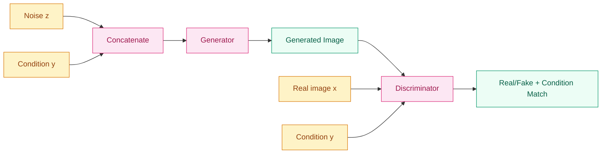
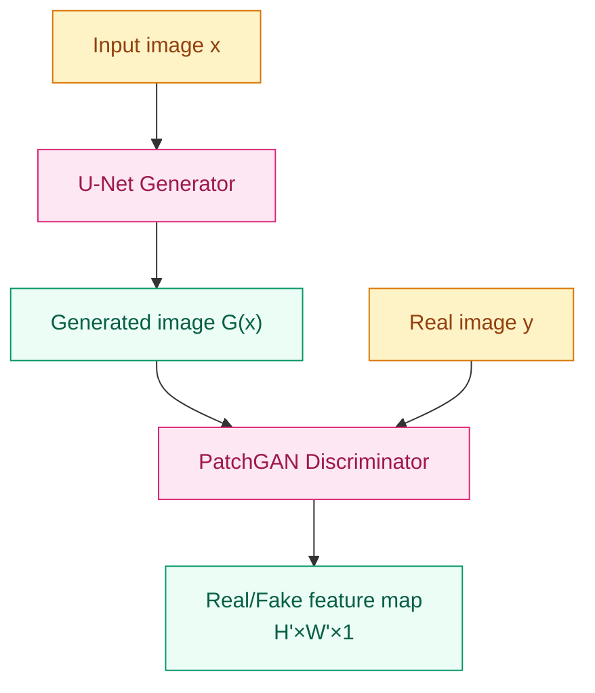
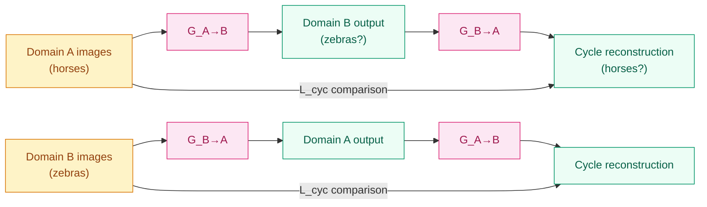
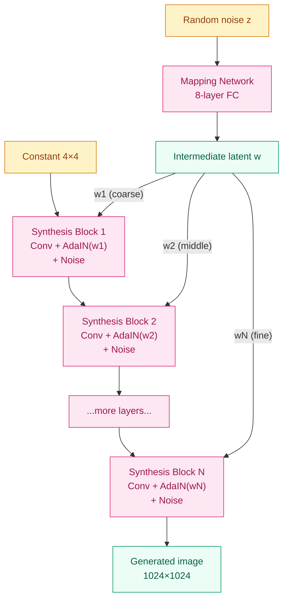

# From Random Noise to Precise Control — Advanced GAN (2017–2019)

**[English](README_EN.md) | [中文](README.md)**

## Where Does This Problem Come From?

> DCGAN provided a recipe for stable training, and Progressive GAN pushed resolution to 1024×1024. But vanilla GAN still has three fundamental limitations: ① the generation process is completely uncontrollable — you can only feed in random noise and hope for the best; ② training requires paired data — every input image must have a corresponding output image; ③ generation quality still falls short in specific domains like faces.
>
> Between 2017 and 2019, the GAN community launched intensive explorations around "controllability," "unpaired training," and "ultimate quality." Conditional GAN lets you specify what to generate, CycleGAN frees you from the constraints of paired data, Pix2Pix solves image translation details with PatchGAN, and StyleGAN pushes face generation to photorealism.

## Learning Objectives

After completing this chapter, you should be able to answer:

1. How does conditional GAN inject condition information into both the generator and discriminator to achieve controllable generation?
2. Why does CycleGAN's cycle consistency loss make unpaired training possible?
3. Why is the PatchGAN discriminator more suitable for image translation tasks than a full-image discriminator?
4. How do StyleGAN's Mapping Network and AdaIN achieve layered style control?

---

## 1. Intuition

### 1.1 From "Random Lottery" to "Ordering from a Menu"

Vanilla GAN is like a blind box: you throw in random noise, and the Generator gives you a random output. You can't say "I want a zebra" or "I want a night scene in Van Gogh's style."

Conditional GAN (cGAN) solves this. It adds a "menu" — condition information (class labels, text descriptions, input images, etc.) — to both the Generator and Discriminator. The Generator no longer starts from pure noise, but from "noise + menu"; the Discriminator doesn't just judge real vs. fake, but also whether "this image matches the menu requirements."

### 1.2 From "Translation Needs a Dictionary" to "Translation by Feel"

Pix2Pix solves paired image translation: satellite images to maps, line drawings to photos, day to night. It requires paired training data — every input image must have an exactly corresponding output image.

But paired data is extremely scarce in reality. You want to turn a horse into a zebra, but you can't have "two versions of the same horse." CycleGAN's intuition: if you can translate A to B, then translating B back to A should give you the original image. This "cycle consistency" constraint lets the network learn meaningful mappings without paired data.

### 1.3 From "Full-Image Review" to "Local Appraisal"

Traditional discriminators judge real vs. fake by looking at a complete image. But in image translation tasks, local details (edge sharpness, texture continuity) matter more than global structure. The PatchGAN discriminator only looks at an N×N patch of the image, outputting a judgment of "real or fake for this patch." Multiple patch judgments stitched together form a complete "real/fake heatmap."

PatchGAN's advantages: small parameter count, insensitive to input size, can catch local flaws. For a 256×256 image, a 70×70 PatchGAN outputs a 30×30 feature map, where each position corresponds to a receptive field region of the original image.

### 1.4 From "Random Generation" to "Style Director"

StyleGAN's intuition is to separately control "what this person looks like" and "how this image is painted."

In traditional GAN, the latent vector z is fed directly to the Generator, and each dimension of z simultaneously controls identity, pose, lighting, hairstyle, and various other attributes — highly entangled. StyleGAN first uses a Mapping Network to map z to a more disentangled intermediate space W, then injects different levels of style at each layer of the Generator through AdaIN — coarse layers control coarse-grained attributes (face shape, pose), middle layers control medium-grained attributes (hairstyle, glasses), and fine layers control details (skin tone, pores).

This is like making a movie: the director first determines overall style (casting, set design), then decides cinematography style (lighting, composition), and finally handles post-production details (color grading, special effects). Each layer's style is controlled independently without interference.

> Remember: the four paths of Advanced GAN are ① conditional control (cGAN), ② unpaired training (CycleGAN), ③ local discrimination (PatchGAN), ④ layered style (StyleGAN).

---

## 2. Mechanism

### 2.1 Conditional GAN (cGAN)

Mirza & Osindero (2014) made a remarkably simple change: add condition information $y$ to both G and D in the original GAN.

**Objective function:**

$$\min_G \max_D \; \mathbb{E}_{x \sim p_{data}}[\log D(x|y)] + \mathbb{E}_{z \sim p_z}[\log(1 - D(G(z|y)|y))]$$

- **Generator**: Input changes from $z$ to $(z, y)$; condition $y$ and noise $z$ together determine the output
- **Discriminator**: Input changes from $x$ to $(x, y)$; D must judge whether $x$ is real **and** whether it matches $y$

Condition $y$ can be:
- Class labels (one-hot vectors) → class-conditional generation
- Text embeddings → text-to-image generation (StackGAN, AttnGAN)
- Another image → image-to-image translation (foundation of Pix2Pix)

**Implementation**: Condition information is typically injected through concatenation. The Generator concatenates $z$ and $y$ at the input layer; the Discriminator concatenates features and $y$ at some layer (usually the feature layer, not the input layer).



Key insight of cGAN: condition information is equally important for D and G. If you only give G the condition but not D, D cannot judge whether the generated result matches the condition — it can only judge real vs. fake, not semantic consistency.

### 2.2 Pix2Pix

Isola et al. (2017) unified image translation into a cGAN framework: given input image $x$, generate output image $y$.

**Architecture:**

- **Generator**: U-Net structure (encoder-decoder + skip connections), takes one image and outputs a translated image
- **Discriminator**: PatchGAN (Markovian discriminator), judges the realness of each 70×70 patch in the image

**Loss function:**

$$\mathcal{L} = \mathcal{L}_{cGAN}(G, D) + \lambda \cdot \mathcal{L}_{L1}(G)$$

Where:
- $\mathcal{L}_{cGAN}$ is the conditional adversarial loss, making generated images appear "real" to D
- $\mathcal{L}_{L1} = \mathbb{E}_{x,y}[\|y - G(x)\|_1]$ is the L1 reconstruction loss, making generated images close to the target at the pixel level
- $\lambda$ is typically set to 100

The L1 loss ensures correct global structure (no completely absurd content), while the adversarial loss ensures sharp local details (no blurry averaged results). Both are indispensable: L1 alone produces blurry outputs, while adversarial loss alone produces detail-rich but content-incorrect outputs.

**PatchGAN Discriminator:**

PatchGAN doesn't output a single real/fake score for the whole image, but outputs a real/fake value for each overlapping N×N region of the input image. The final output is an H'×W' feature map, where each position corresponds to a receptive field region of the original image.

Why it works:
1. **Small parameter count**: only processes N×N regions, does not require a large network
2. **Size-independent**: can handle inputs of arbitrary size
3. **Focuses on local quality**: consistency of texture, edges, and color depends primarily on local statistics



### 2.3 CycleGAN

Zhu et al. (2017) core question: how to do image translation without paired data?

**Architecture:**

Two Generators and two Discriminators:
- $G_{A \to B}$: translates images from domain A to domain B
- $G_{B \to A}$: translates images from domain B to domain A
- $D_A$: judges realness of domain A images
- $D_B$: judges realness of domain B images

**Loss function:**

$$\mathcal{L} = \mathcal{L}_{GAN}(G_{A \to B}, D_B) + \mathcal{L}_{GAN}(G_{B \to A}, D_A) + \lambda \cdot \mathcal{L}_{cyc}(G_{A \to B}, G_{B \to A})$$

**Adversarial loss**: Each Generator adversarially against its corresponding Discriminator.

**Cycle consistency loss (core innovation):**

$$\mathcal{L}_{cyc} = \mathbb{E}_{x_A}[\|G_{B \to A}(G_{A \to B}(x_A)) - x_A\|_1] + \mathbb{E}_{x_B}[\|G_{A \to B}(G_{B \to A}(x_B)) - x_B\|_1]$$

Intuition: if you translate English to Chinese, then translate Chinese back to English, you should get the original text. Cycle consistency prevents the Generator from producing arbitrary outputs unrelated to the input — it must preserve the core structure of the input, only changing the "style" of the target domain.

**Identity loss (optional but recommended):**

$$\mathcal{L}_{identity} = \mathbb{E}_{x_B}[\|G_{A \to B}(x_B) - x_B\|_1] + \mathbb{E}_{x_A}[\|G_{B \to A}(x_A) - x_A\|_1]$$

If you feed a domain B image directly into $G_{A \to B}$, the output should remain unchanged (since the image is already in B domain style). This loss helps the Generator maintain stability of color mapping.



### 2.4 StyleGAN

Karras et al. (2018) core innovation is redesigning the Generator architecture to separate "what to generate" from "how to paint it."

**Traditional Generator vs StyleGAN Generator:**

Traditional GAN Generator: $z \to$ upsampling layer chain $\to$ image

StyleGAN Generator:
1. **Mapping Network**: $z \to w$ (8-layer fully connected network), maps entangled latent space to disentangled intermediate space
2. **Synthesis Network**: starts from a learned constant $4 \times 4$ feature map, injects $w$ through AdaIN at each layer
3. **Noise injection**: adds Gaussian noise at each layer, controlling random details (hair texture, skin pores)

**Adaptive Instance Normalization (AdaIN):**

$$\text{AdaIN}(x_i, y) = y_{s,i} \frac{x_i - \mu(x_i)}{\sigma(x_i)} + y_{b,i}$$

Where $y_s$ and $y_b$ are scale and bias parameters obtained from $w$ through learned affine transformations. AdaIN injects style after each convolution layer, allowing different $w$ values to produce different visual effects.

**Layered style control:**

StyleGAN discovered that $w$ injected at different layers controls different levels of attributes:
- **Coarse layers** (4×4 – 8×8): pose, face shape, glasses presence
- **Middle layers** (16×16 – 32×32): facial features, hairstyle
- **Fine layers** (64×64 – 1024×1024): skin tone, texture details

This makes style mixing possible: use one $w$ to control coarse layers and another $w$ to control fine layers, generating images with both sets of characteristics.



**Key improvements in StyleGAN v2 and v3:**

- **v2 (2020)**: Eliminated "water droplet artifacts" in StyleGAN v1 (caused by AdaIN's instance normalization), introduced weight modulation/demodulation as AdaIN replacement, added path length regularization for smoother $w$ space
- **v3 (2021)**: Solved "texture sticking" problem (generated textures sticking to the image plane during rotation), achieving approximate translational and rotational equivariance

### 2.5 Progressive Code Implementation

Below we progressively implement cGAN, PatchGAN, CycleGAN's cycle consistency loss, and StyleGAN's core components in PyTorch.

**Step 1 -- Conditional GAN Generator:**

```python
import torch
import torch.nn as nn

class ConditionalGenerator(nn.Module):
    """Conditional GAN generator: noise z + condition label y → image"""
    def __init__(self, z_dim=100, num_classes=10, base_ch=64):
        super().__init__()
        self.label_embed = nn.Embedding(num_classes, num_classes)
        input_dim = z_dim + num_classes
        self.net = nn.Sequential(
            nn.ConvTranspose2d(input_dim, base_ch * 8, 4, 1, 0, bias=False),
            nn.BatchNorm2d(base_ch * 8), nn.ReLU(True),
            nn.ConvTranspose2d(base_ch * 8, base_ch * 4, 4, 2, 1, bias=False),
            nn.BatchNorm2d(base_ch * 4), nn.ReLU(True),
            nn.ConvTranspose2d(base_ch * 4, base_ch * 2, 4, 2, 1, bias=False),
            nn.BatchNorm2d(base_ch * 2), nn.ReLU(True),
            nn.ConvTranspose2d(base_ch * 2, base_ch, 4, 2, 1, bias=False),
            nn.BatchNorm2d(base_ch), nn.ReLU(True),
            nn.ConvTranspose2d(base_ch, 3, 4, 2, 1, bias=False),
            nn.Tanh(),
        )

    def forward(self, z, labels):
        y = self.label_embed(labels)           # (B, num_classes)
        x = torch.cat([z, y], dim=1)           # (B, z_dim + num_classes)
        x = x.view(x.size(0), -1, 1, 1)       # (B, C, 1, 1)
        return self.net(x)
```

Key point: labels are converted to dense vectors through an Embedding layer, then concatenated with noise $z$ along the channel dimension. The concatenated tensor has shape $(B, z\_dim + num\_classes, 1, 1)$, serving as input to the transposed convolution chain.

**Step 2 -- PatchGAN Discriminator:**

```python
class PatchDiscriminator(nn.Module):
    """PatchGAN discriminator: outputs H'×W' real/fake feature map"""
    def __init__(self, in_ch=3, base_ch=64):
        super().__init__()
        self.net = nn.Sequential(
            nn.Conv2d(in_ch, base_ch, 4, 2, 1), nn.LeakyReLU(0.2, True),
            nn.Conv2d(base_ch, base_ch * 2, 4, 2, 1, bias=False),
            nn.BatchNorm2d(base_ch * 2), nn.LeakyReLU(0.2, True),
            nn.Conv2d(base_ch * 2, base_ch * 4, 4, 2, 1, bias=False),
            nn.BatchNorm2d(base_ch * 4), nn.LeakyReLU(0.2, True),
            nn.Conv2d(base_ch * 4, 1, 4, 1, 1),  # outputs single-channel feature map
        )

    def forward(self, x):
        return self.net(x)  # (B, 1, H', W') not (B, 1)
```

Difference from DCGAN Discriminator: the last layer has no Sigmoid, outputting a spatial feature map rather than a single scalar. For 256×256 input, it outputs approximately a 30×30 feature map. During training, take the mean of this feature map to obtain the final discrimination score.

**Step 3 -- CycleGAN Cycle Consistency Loss:**

```python
class CycleGANLoss:
    """CycleGAN cycle consistency loss"""
    def __init__(self, lambda_cyc=10.0, lambda_identity=5.0):
        self.lambda_cyc = lambda_cyc
        self.lambda_identity = lambda_identity
        self.l1 = nn.L1Loss()

    def cycle_consistency(self, real_A, real_B, G_A2B, G_B2A):
        """A → B → A and B → A → B should both reconstruct the original"""
        fake_B = G_A2B(real_A)
        rec_A = G_B2A(fake_B)                  # A → B → A

        fake_A = G_B2A(real_B)
        rec_B = G_A2B(fake_A)                  # B → A → B

        loss_cycle = self.l1(rec_A, real_A) + self.l1(rec_B, real_B)
        return loss_cycle * self.lambda_cyc

    def identity_loss(self, real_A, real_B, G_A2B, G_B2A):
        """B input to G_A2B should remain unchanged, A input to G_B2A should remain unchanged"""
        idt_A = G_B2A(real_A)                  # already in A domain, shouldn't change
        idt_B = G_A2B(real_B)                  # already in B domain, shouldn't change

        loss_idt = self.l1(idt_A, real_A) + self.l1(idt_B, real_B)
        return loss_idt * self.lambda_identity
```

$\lambda_{cyc} = 10$ is the default from the paper. Too small a cycle consistency loss leads to content loss, too large suppresses adversarial loss's diversity effect. Identity loss weight is typically set to 0.5× the cycle consistency weight.

**Step 4 -- StyleGAN Mapping Network + AdaIN:**

```python
class MappingNetwork(nn.Module):
    """Maps z to intermediate latent space W"""
    def __init__(self, z_dim=512, w_dim=512, num_layers=8):
        super().__init__()
        layers = []
        for _ in range(num_layers):
            layers += [nn.Linear(z_dim, w_dim), nn.LeakyReLU(0.2, True)]
            z_dim = w_dim
        self.net = nn.Sequential(*layers)

    def forward(self, z):
        return self.net(z)  # (B, w_dim)


class AdaIN(nn.Module):
    """Adaptive Instance Normalization: inject style using w"""
    def __init__(self, w_dim, num_features):
        super().__init__()
        self.norm = nn.InstanceNorm2d(num_features, affine=False)
        self.style_scale = nn.Linear(w_dim, num_features)
        self.style_bias = nn.Linear(w_dim, num_features)

    def forward(self, x, w):
        # x: (B, C, H, W), w: (B, w_dim)
        normalized = self.norm(x)
        scale = self.style_scale(w).unsqueeze(-1).unsqueeze(-1)  # (B, C, 1, 1)
        bias = self.style_bias(w).unsqueeze(-1).unsqueeze(-1)
        return scale * normalized + bias


class StyleBlock(nn.Module):
    """StyleGAN synthesis network basic block: conv + AdaIN + noise"""
    def __init__(self, in_ch, out_ch, w_dim=512):
        super().__init__()
        self.conv = nn.Conv2d(in_ch, out_ch, 3, padding=1)
        self.adain = AdaIN(w_dim, out_ch)
        self.noise_weight = nn.Parameter(torch.zeros(1))  # learnable noise scaling

    def forward(self, x, w):
        x = self.conv(x)
        noise = torch.randn(x.size(0), 1, x.size(2), x.size(3), device=x.device)
        x = x + self.noise_weight * noise
        x = self.adain(x, w)
        return torch.nn.functional.leaky_relu(x, 0.2)
```

The Mapping Network's 8 fully connected layers make the $w$ space smoother and more disentangled than the $z$ space. AdaIN injects different $w$ at each layer, achieving layered style control. Noise injection lets the Generator produce random detail variations without changing the overall style.

---

## 3. Engineering Pitfalls

### 3.1 CycleGAN Training Instability → Introducing Identity Loss

**Symptom**: Color distribution of generated images inconsistent with source domain (e.g., background color also changes when turning a horse into a zebra).

**Fix**:
- Add identity loss: feed domain B images directly into $G_{A \to B}$, output should approximate input. This helps the Generator learn color mapping's identity property
- Identity loss weight typically set to 0.5× the cycle consistency weight ($\lambda_{identity} = 5$, $\lambda_{cyc} = 10$)
- Use Instance Normalization rather than Batch Normalization — CycleGAN paper experiments show IN performs better in style transfer tasks

### 3.2 Pix2Pix Blurry Output → Balancing L1 and Adversarial Loss

**Symptom**: Too large L1 weight leads to blurry output (over-reliance on pixel-level reconstruction), too large adversarial loss weight leads to noisy output (ignoring global structure).

**Fix**:
- Standard configuration: $\lambda_{L1} = 100$, adversarial loss weight = 1
- If output is still blurry: reduce $\lambda_{L1}$ to 10, letting adversarial loss have greater say in detail generation
- Use PatchGAN (70×70) rather than full-image discriminator — PatchGAN is more sensitive to local texture quality

### 3.3 StyleGAN's Water Droplet Artifacts → v2's Weight Modulation

**Symptom**: StyleGAN v1 generated images frequently exhibit "water droplet-like" artifacts, looking like droplets attached to object surfaces.

**Cause**: Instance normalization in AdaIN disrupts feature map's relative magnitude relationships, causing certain features to be unreasonably amplified.

**Fix**:
- Upgrade to StyleGAN v2: replace AdaIN with weight modulation/demodulation
- Weight modulation first scales the convolution kernel weights according to $w$, then normalizes to unit variance, avoiding instance normalization's disruption of feature maps
- Also add path length regularization (Path Length Regularization): let small perturbations in $w$ space produce uniform image changes

### 3.4 Advanced GAN Evaluation → FID's Practical Computation and Pitfalls

**Symptom**: FID seems low but generation quality is unsatisfactory, or FID computation results are not reproducible.

**Common pitfalls**:
- **Insufficient samples**: FID needs at least 10,000 generated images to give stable estimates. FID computed with 1,000 images fluctuates greatly
- **Inconsistent preprocessing**: generated and real images must undergo exactly the same preprocessing (resize, crop, normalization). Inception network expects 299×299 input
- **FID doesn't measure diversity**: FID measures distribution distance; a Generator that only produces high-quality but single-mode outputs can also get low FID. Combine with Precision/Recall metrics for more comprehensive evaluation

> Remember: GAN advanced engineering troubleshooting priority is training convergence (loss curves) → mode diversity (visual inspection + FID) → detail quality (human eye + FID).

---

## 4. Key Papers and Timeline

| Year | Paper | Core Contribution |
|------|-------|-------------------|
| 2014 | Mirza & Osindero, *Conditional GAN* | Inject condition information in G and D |
| 2017 | Isola et al., *Pix2Pix* | Paired image translation + PatchGAN |
| 2017 | Zhu et al., *CycleGAN* | Unpaired translation + cycle consistency loss |
| 2018 | Karras et al., *StyleGAN* | Mapping Network + AdaIN layered style control |
| 2020 | Karras et al., *StyleGAN 2* | Weight modulation replacing AdaIN, artifact elimination |
| 2021 | Karras et al., *StyleGAN 3* | Texture sticking elimination, equivariance |

---

## 5. Concept Cheat Sheet

| Concept | One-line Explanation | Key Formula/Structure |
|---------|---------------------|----------------------|
| cGAN | Inject condition info in both G and D | $\min_G \max_D \mathbb{E}[\log D(x\|y)] + \mathbb{E}[\log(1-D(G(z\|y)\|y))]$ |
| Pix2Pix | Paired image-to-image translation | U-Net G + PatchGAN D + L1 loss |
| PatchGAN | Judge realness of local image patches | Outputs H'×W' feature map rather than scalar |
| CycleGAN | Unpaired image translation | Cycle consistency $A \to B \to A \approx A$ |
| Cycle consistency | Translate then translate back should return to the starting point | $\|G_{B \to A}(G_{A \to B}(x)) - x\|_1$ |
| StyleGAN | Layered style control generation | Mapping Network + AdaIN + Noise |
| AdaIN | Scale and shift normalized features with w | $y_s \cdot \frac{x - \mu}{\sigma} + y_b$ |
| Mapping Network | z → w nonlinear mapping | 8-layer FC, disentangles latent space |
| Identity loss | Images already in target domain should remain unchanged | $\|G_{A \to B}(x_B) - x_B\|_1$ |

---

## 6. Exercises and Practice

### 6.1 Basic Understanding

1. **Why must condition information be given to both Generator and Discriminator in cGAN?** If only given to G but not D, what happens during training? (Hint: D cannot constrain semantic consistency)

2. **Why does CycleGAN's cycle consistency loss use L1 rather than L2?** Analyze from the gradient perspective: when reconstruction error is large, how do L1 and L2 gradients behave differently?

3. **If StyleGAN's Mapping Network is removed (feeding z directly to AdaIN), how does generation quality change?** Why is the intermediate space W better than the original space Z?

### 6.2 Hands-on Experiments

4. **Modify the PatchGAN discriminator**: change receptive field from 70×70 to 16×16 and 256×256, train Pix2Pix separately. Observe differences in local texture and global consistency. Which receptive field works best? Why?

5. **CycleGAN identity loss experiment**: disable identity loss and retrain horse↔zebra conversion. Observe whether background colors undergo unnecessary changes. Compare differences after enabling identity loss.

6. **StyleGAN style mixing visualization**: randomly sample two noises $z_1$ and $z_2$, pass them through Mapping Network to get $w_1$ and $w_2$. Use $w_1$ to control coarse layers (4×4–8×8) and $w_2$ to control fine layers (16×16+), generating mixed images. Observe which attributes come from $w_1$ and which from $w_2$.

### 6.3 Advanced Thinking

7. **From GAN to diffusion models**: diffusion models generate images through gradual denoising, without needing a discriminator. Analyze from three dimensions — training stability, mode coverage, and controllability: how do diffusion models solve GAN's inherent problems? Does GAN still have irreplaceable application scenarios after 2024?

8. **GAN's theoretical limits**: vanilla GAN's JS divergence is constant when distributions don't overlap; WGAN solved this with Wasserstein distance. But Wasserstein distance also has its own computational difficulties (needing Lipschitz constraints). Is there a better distribution distance metric? (Hint: consider the f-divergence family and MMD)

---

## Evolution Notes

> Advanced GAN's main thread goes from conditional control (cGAN, 2014) → paired translation (Pix2Pix, 2017) → unpaired translation (CycleGAN, 2017) → ultimate quality (StyleGAN, 2018–2021), progressively solving controllability, data requirements, and generation quality.
>
> But after 2020, diffusion models (DDPM, 2020; DDIM, 2021) gradually replaced GAN as the mainstream method for image generation with more stable training and better mode coverage. StyleGAN's layered style control thinking was inherited by Latent Diffusion (Stable Diffusion, 2022) — generating in latent space rather than pixel space for higher efficiency.
>
> GAN still maintains a foothold after 2024: real-time generation (GAN inference requires only one forward pass, while diffusion models need multi-step denoising), video super-resolution, face editing — in these areas GAN architecture remains the preferred choice.
>
> Pix2Pix and CycleGAN pioneered the "image-to-image translation" paradigm with far-reaching influence — subsequent Neural Style Transfer, Domain Adaptation, and even 3D scene generation (NeRF + GAN) all drew upon this approach.
>
> PatchGAN's "local discrimination" thinking was also adopted by diffusion models — Classifier-Free Guidance is essentially an implicit local constraint on generation quality.

→ Next chapter: [Lightweight Architectures — Large Models Are Great, But They Won't Fit on a Phone](../lightweight-vision/README_EN.md)

---

**Previous chapter**: [Segmentation & Generation](../segmentation-gan/README_EN.md) | **Next chapter**: [Lightweight Architectures](../lightweight-vision/README_EN.md)
