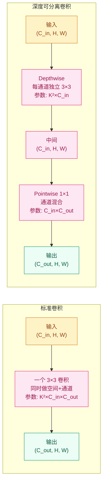
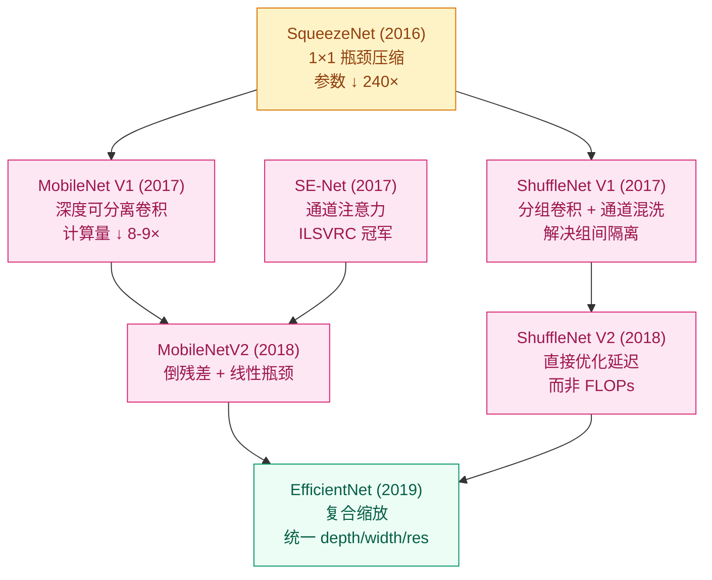

# 大模型很好，但手机装不下 —— 轻量化架构（2016–2017）

## 这个问题从哪来

> ResNet-152 有 6000 万参数、需 11.3 GFLOPs。它能准确分类 ImageNet，
> 但部署到手机、无人机、嵌入式设备时，内存和算力都不够。
> 2016-2017 年，研究者开始追问：能不能用 1/10 甚至 1/50 的参数达到同等精度？
> SqueezeNet、MobileNet、SE-Net 从不同角度回答了这个问题。

## 学习目标

完成本章后，你应能回答：

1. 深度可分离卷积为什么能把计算量降 8-9 倍？它的数学原理是什么？
2. SE-Net 的通道注意力机制如何让网络"学会关注重要通道"？
3. 这些轻量化策略如何影响了后续的 EfficientNet 和 NAS 方向？

---

## 1. 直觉

想象你有一个大型工具箱（标准卷积），里面什么工具都有但很重。每次使用时你都要把所有工具都搬出来，哪怕你只需要拧一颗螺丝。

深度可分离卷积的做法是：把"看每个通道的空间模式"和"混合通道间信息"拆成两步。就像先用手电筒逐个照（depthwise），再用混合器搅拌结果（pointwise）。虽然步骤多了，但每步都很轻，总体快很多。

SE-Net 的直觉：给每个通道打个分——"这层的信息有用吗？"——有用的放大，没用的缩小。就像乐队指挥：不是每个声部都要同样响，重要的声部给更多音量，次要的收回来。

SqueezeNet 则另辟蹊径：用 1×1 卷积先把通道数压窄，再用 3×3 卷积在窄通道上做空间特征提取。整个策略就像搬家时先把不常用的东西扔掉，只带必需品。

> 你要记住：轻量化的三条路是①结构简化（MobileNet）、②通道筛选（SE-Net）、③架构搜索（NAS）。

---

## 2. 机制

### 2.1 SqueezeNet：1×1 卷积的压缩力

Iandola et al. (2016) — AlexNet 级精度，参数量仅 1.2MB（vs AlexNet 240MB）。压缩比达到 240 倍，这是怎么做到的？

核心思路非常朴素：1×1 卷积的参数量只有 3×3 的 1/9。如果能在不损失精度的前提下，尽可能多用 1×1 替换 3×3，参数量自然大幅下降。但这带来一个新问题——1×1 卷积没有空间感受野，无法建模像素间的邻域关系。SqueezeNet 的解法是"压后扩"：先用 1×1 把通道压窄，再用 3×3 在窄通道上做空间特征提取，最后把 1×1 和 3×3 的结果拼回去。

三个设计策略：

1. **用 1×1 卷积替换部分 3×3**（squeeze 层：通道数先压后扩）——直接砍参数量
2. **减少输入通道数**（3×3 前用 1×1 把通道压窄）——让昂贵的 3×3 卷积在更少的通道上工作
3. **延迟下采样**（更大的特征图 → 更高精度）——前面尽量保留高分辨率，后面才缩小

**Fire Module 结构**：

- Squeeze 层：1×1 卷积，输出 $s_1$ 个通道（$s_1$ 通常很小，如 16）
- Expand 层：1×1 卷积（$e_1$ 通道）+ 3×3 卷积（$e_3$ 通道），输出拼接
- 设计约束：$s_1 < e_1 + e_3$（squeeze 比 expand 窄，确保瓶颈压缩效果）

一个 Fire Module 的信息流是：宽通道 → 窄通道（squeeze）→ 再展开（expand）。这种瓶颈结构后来在 MobileNet 和 EfficientNet 中反复出现，只是名字不同。

**SqueezeNet 的局限**：虽然参数极少，但实际推理速度并没有比 AlexNet 快多少。原因是它的层太浅、分支太多，内存访问效率低。这揭示了一个重要教训：**参数量不等于计算量，计算量不等于实际延迟**。SqueezeNet 的真正贡献不在于实用部署，而在于它第一次明确提出了"小模型也能达到大模型精度"的研究方向，启发了后续所有轻量化工作。

### 2.2 MobileNet：深度可分离卷积

Howard et al. (2017) — 把标准卷积拆成两步。这是轻量化方向最核心的洞察。

**标准卷积的计算量**：一个 $K \times K$ 卷积核，输入 $C_{in}$ 通道，输出 $C_{out}$ 通道，在 $H \times W$ 的特征图上滑动。每个输出通道都要"看"所有输入通道，所以总计算量是：

$$\text{FLOPs}_{\text{standard}} = K \times K \times C_{in} \times C_{out} \times H \times W$$

**深度可分离卷积的关键洞察**：标准卷积同时做了两件事——空间特征提取（看局部窗口的模式）和通道混合（把不同通道的信息组合起来）。如果把它拆成两步呢？

- **Depthwise 卷积**：每个输入通道独立地用一个 $K \times K$ 卷积核做空间特征提取，通道间不交互。计算量：$K \times K \times 1 \times C_{in} \times H \times W$
- **Pointwise 卷积（1×1）**：用 1×1 卷积做通道间的线性组合，把 $C_{in}$ 个通道映射到 $C_{out}$ 个通道。计算量：$1 \times 1 \times C_{in} \times C_{out} \times H \times W$

计算量比：

$$\frac{\text{FLOPs}_{\text{ds}}}{\text{FLOPs}_{\text{std}}} = \frac{K^2 \cdot C_{in} + C_{in} \cdot C_{out}}{K^2 \cdot C_{in} \cdot C_{out}} = \frac{1}{C_{out}} + \frac{1}{K^2} \approx \frac{1}{8} \sim \frac{1}{9} \quad (K{=}3,\ C_{out}{=}128{\sim}512)$$

也就是说，深度可分离卷积的计算量只有标准卷积的 1/8 到 1/9，精度损失通常在 1-2% 以内。

这个结果的直觉理解：标准卷积中，$C_{out}$ 个卷积核每个都要遍历 $C_{in}$ 个通道——这是 $C_{in} \times C_{out}$ 的组合爆炸。深度可分离卷积把这个问题拆开了——depthwise 只需要 $C_{in}$ 个独立的空间卷积（没有通道混合），pointwise 用 1×1 完成通道混合（没有空间开销）。两步各司其职，总成本远低于一步全做。



**宽度乘子 $\alpha$（Width Multiplier）**：统一缩放每层通道数。$\alpha \in \{0.25, 0.5, 0.75, 1.0\}$。当 $\alpha < 1$ 时，所有层的通道数按比例减少，计算量和参数量近似按 $\alpha^2$ 缩放。这是一个非常实用的设计：同一个架构只需要改一个参数就能适配从高端服务器到低端手表的不同设备。

**分辨率乘子 $\rho$**：降低输入分辨率。$\rho \in \{224, 192, 160, 128\}$。分辨率下降后，所有特征图的空间维度都变小，计算量按 $\rho^2$ 缩放。

这两个乘子提供了精度-效率的连续调节旋钮，让同一个架构适配不同算力预算的设备。论文中的实验表明：$\alpha=0.5$ 时参数量约 1.3M，ImageNet top-1 精度约 63.7%；$\alpha=1.0$ 时参数量约 4.2M，精度约 70.6%。精度和成本之间的 trade-off 近似线性。

**MobileNet 整体架构**：第一层是标准 3×3 卷积（提取低级特征），后面跟着 13 层深度可分离卷积，最后是全局平均池化和全连接层。注意：并非所有层都用深度可分离卷积——第一层保持标准卷积，因为浅层提取的边缘和纹理特征对空间精度更敏感，深度可分离在这里的精度损失不可接受。

### 2.3 SE-Net：通道注意力

Hu et al. (2017) — ILSVRC 2017 冠军。核心思想：让网络学到每层哪些通道更重要。

标准 CNN 的一个隐含假设是：所有通道同等重要。但在 ResNet 的某一层中，可能有些通道在编码背景纹理，有些在编码物体轮廓，还有些在编码光照信息。对于当前任务，不是所有信息都有用——SE-Net 让网络自己学会做这个筛选。

**SE Block 流程**：

1. **Squeeze（压缩）**：全局平均池化 → $(B, C, 1, 1)$，每个通道压缩成一个标量。这一步把空间信息全部抹掉，只保留"这个通道平均有多活跃"的信号。
2. **Excitation（激励）**：FC → ReLU → FC → Sigmoid → $(B, C)$，生成通道权重。两个 FC 层形成一个瓶颈结构，先降维再升维。
3. **Scale（重标定）**：原特征图 × 通道权重。重要的通道被放大，不重要的被抑制。

数学表达：

$$s = \sigma(W_2 \cdot \text{ReLU}(W_1 \cdot z)), \quad z_c = \frac{1}{H \times W} \sum_{i=1}^{H} \sum_{j=1}^{W} u_c(i,j)$$

其中 $z$ 是 squeeze 后的通道描述向量，$W_1$ 把维度从 $C$ 压到 $C/r$，$W_2$ 再恢复到 $C$，$\sigma$ 是 Sigmoid。

**关键设计：中间层降维比 $r=16$**。$W_1$ 把 $C$ 压到 $C/r$，$W_2$ 恢复到 $C$。这个降维比是经验最优——过大（$r=64$）会让注意力过于粗糙，过小（$r=2$）则参数太多且收益递减。SE Block 的参数开销通常不到总参数的 1%，但能带来 0.5-1.5% 的精度提升。

SE Block 的优雅之处在于它是**即插即用**的：可以嵌入到任何现有架构的卷积块后面。SE-ResNet-50 比 ResNet-50 参数量多约 10%，但在 ImageNet 上 top-1 精度从 76.0% 提升到 77.6%。SE-ResNeXt-101 是 2017 年 ILSVRC 分类任务的冠军方案。

**为什么不用更复杂的注意力？** 一个自然的问题是：为什么不同时做空间注意力（哪个位置重要）和通道注意力（哪个通道重要）？答案是计算开销。SE Block 的设计哲学是"最小开销换取最大收益"——全局平均池化和两个 FC 层的成本极低，但通道筛选带来的精度提升显著。空间注意力（如 CBAM）虽然更精细，但开销也更大，在轻量化场景中不一定划算。

### 2.4 ShuffleNet：分组卷积 + 通道混洗

Zhang et al. (2017) — 从另一个角度降低计算量。

分组卷积（Grouped Convolution）把输入通道分成 $g$ 组，每组独立做卷积。这把计算量降到标准卷积的 $1/g$。但分组卷积有一个致命问题：不同组之间的通道永远不交互，信息流被隔离了。

ShuffleNet 的解法是**通道混洗（Channel Shuffle）**：在两个分组卷积之间，把通道重新排列，让下一层的每个组都能看到上一层的所有组的信息。

通道混洗的操作非常简单：reshape → 转置 → flatten。假设有 $g$ 个组，每组 $n$ 个通道，总共 $g \times n$ 个通道。先把通道维度 reshape 成 $(g, n)$，转置成 $(n, g)$，再 flatten 回 $(g \times n)$。这样原来的"组内连续"变成了"组间交错"，下一层分组卷积时每个组就能看到不同组的通道。

ShuffleNet 的贡献在于：它证明了分组卷积 + 通道混洗也是一种有效的轻量化策略，在某些硬件上（尤其是 ARM CPU）比分组卷积更高效，因为它的内存访问模式更规整。

### 2.5 Capsule Networks（简要对比）

Hinton (2017) 的直觉：池化操作丢失了空间关系（"嘴巴在鼻子上方"）。最大池化只保留最强的响应，但忽略了响应之间的相对位置和层级关系。

胶囊网络用"胶囊"替代标量神经元，每个胶囊是一个向量，编码了特征的存在概率（向量模长）和实例化参数（向量方向，如姿态、形变、光照）。动态路由替代最大池化，让低层胶囊学会把信息发送到最相关的高层胶囊，保留了部分-整体的空间层级关系。

在 MNIST 和 SmallNORB 上表现很好，但扩展到大规模任务（如 ImageNet）后未能替代 CNN——计算开销大、训练不稳定、路由算法难以规模化。胶囊网络更像是一个"方向正确但工程不成熟"的尝试，它提出的"保留空间关系"的思想后来在 Transformer 的位置编码中以不同形式被重新实现。

### 2.6 渐进式实现

**Step 1 · 深度可分离卷积**：

```python
import torch
import torch.nn as nn

class DepthwiseSeparableConv(nn.Module):
    """DepthwiseSeparableConv · 01-Visual-Intelligence/lightweight-vision · 深度可分离卷积 · 依赖: torch"""
    def __init__(self, in_ch, out_ch, stride=1):
        super().__init__()
        # Depthwise: 每个输入通道独立做空间卷积
        self.depthwise = nn.Conv2d(in_ch, in_ch, 3, stride, 1, groups=in_ch, bias=False)
        # Pointwise: 1×1 卷积混合通道信息
        self.pointwise = nn.Conv2d(in_ch, out_ch, 1, bias=False)
        self.bn1 = nn.BatchNorm2d(in_ch)
        self.bn2 = nn.BatchNorm2d(out_ch)

    def forward(self, x):
        x = torch.relu(self.bn1(self.depthwise(x)))
        x = torch.relu(self.bn2(self.pointwise(x)))
        return x
```

**Step 2 · SE Block**：

```python
class SEBlock(nn.Module):
    """SEBlock · 01-Visual-Intelligence/lightweight-vision · 通道注意力 · 依赖: torch"""
    def __init__(self, channels, reduction=16):
        super().__init__()
        self.squeeze = nn.AdaptiveAvgPool2d(1)  # (B, C, H, W) → (B, C, 1, 1)
        self.excitation = nn.Sequential(
            nn.Linear(channels, channels // reduction, bias=False),
            nn.ReLU(inplace=True),
            nn.Linear(channels // reduction, channels, bias=False),
            nn.Sigmoid(),
        )

    def forward(self, x):
        b, c, _, _ = x.shape
        s = self.squeeze(x).view(b, c)          # squeeze: 空间维度压成 1
        s = self.excitation(s).view(b, c, 1, 1) # excitation: 生成通道权重
        return x * s                              # scale: 重标定
```

**Step 3 · 计算量对比**：

```python
def count_flops(conv_type, in_ch, out_ch, h, w, kernel=3):
    """比较标准卷积与深度可分离卷积的计算量"""
    if conv_type == "standard":
        # 每个输出通道要看所有输入通道，卷积核在 H×W 上滑动
        return kernel * kernel * in_ch * out_ch * h * w
    else:  # depthwise separable
        dw = kernel * kernel * in_ch * h * w      # depthwise: 每通道独立
        pw = in_ch * out_ch * h * w               # pointwise: 1×1 通道混合
        return dw + pw

in_ch, out_ch, h, w = 64, 128, 56, 56
std_flops = count_flops("standard", in_ch, out_ch, h, w)
ds_flops  = count_flops("depthwise_separable", in_ch, out_ch, h, w)
print(f"标准卷积: {std_flops/1e6:.1f}M | 深度可分离: {ds_flops/1e6:.1f}M | 比率: {ds_flops/std_flops:.2%}")
# 输出: 标准卷积: 120.5M | 深度可分离: 26.8M | 比率: 22.26%
```

**Step 4 · 完整轻量网络（MobileNet 风格）**：

```python
import torch
import torch.nn as nn

torch.manual_seed(42)


class MobileNetTiny(nn.Module):
    """MobileNetTiny · 01-Visual-Intelligence/lightweight-vision · 轻量分类网络 · 依赖: torch"""

    def __init__(self, n_class: int = 10):
        super().__init__()
        # 第一层：标准卷积（浅层对空间精度敏感）
        self.stem = nn.Sequential(
            nn.Conv2d(3, 32, 3, stride=2, padding=1, bias=False),
            nn.BatchNorm2d(32),
            nn.ReLU(inplace=True),
        )
        # 中间层：深度可分离卷积
        self.features = nn.Sequential(
            DepthwiseSeparableConv(32, 64, stride=1),
            DepthwiseSeparableConv(64, 128, stride=2),
            DepthwiseSeparableConv(128, 128, stride=1),
            DepthwiseSeparableConv(128, 256, stride=2),
            DepthwiseSeparableConv(256, 256, stride=1),
        )
        self.classifier = nn.Sequential(
            nn.AdaptiveAvgPool2d(1),
            nn.Flatten(),
            nn.Linear(256, n_class),
        )

    def forward(self, x: torch.Tensor) -> torch.Tensor:
        """Args: x (B, 3, 224, 224) → returns logits (B, n_class)"""
        x = self.stem(x)
        x = self.features(x)
        return self.classifier(x)


model = MobileNetTiny()
x = torch.randn(4, 3, 224, 224)
out = model(x)
params = sum(p.numel() for p in model.parameters())
print(f"输入: {x.shape}  输出: {out.shape}  参数量: {params/1e6:.2f}M")
# 输入: (4, 3, 224, 224)  输出: (4, 10)  参数量: ~0.3M
```

**Step 5 · SE-ResNet Block（SE 模块嵌入残差块）**：

```python
import torch
import torch.nn as nn


class SEResBlock(nn.Module):
    """SEResBlock · 01-Visual-Intelligence/lightweight-vision · SE 残差块 · 依赖: torch"""

    def __init__(self, in_ch, out_ch, stride=1, reduction=16):
        super().__init__()
        self.body = nn.Sequential(
            nn.Conv2d(in_ch, out_ch, 3, stride=stride, padding=1, bias=False),
            nn.BatchNorm2d(out_ch),
            nn.ReLU(inplace=True),
            nn.Conv2d(out_ch, out_ch, 3, padding=1, bias=False),
            nn.BatchNorm2d(out_ch),
        )
        self.se = SEBlock(out_ch, reduction)
        self.shortcut = nn.Sequential(
            nn.Conv2d(in_ch, out_ch, 1, stride=stride, bias=False),
            nn.BatchNorm2d(out_ch),
        ) if (stride != 1 or in_ch != out_ch) else nn.Identity()
        self.relu = nn.ReLU(inplace=True)

    def forward(self, x: torch.Tensor) -> torch.Tensor:
        """Args: x (B, C_in, H, W) → returns (B, C_out, H', W')"""
        out = self.body(x)
        out = self.se(out)       # SE 重标定放在残差相加之前
        return self.relu(out + self.shortcut(x))


block = SEResBlock(64, 128, stride=2, reduction=16)
x = torch.randn(4, 64, 16, 16)
out = block(x)
print(f"输入: {x.shape}  输出: {out.shape}")
# 输入: (4, 64, 16, 16)  输出: (4, 128, 8, 8)
```

---

## 3. 工程要点

1. **深度可分离卷积精度损失** → 不是所有层都适合替换
   浅层（边缘/纹理提取）用标准卷积，深层用深度可分离。或采用混合策略：对精度敏感的 block 用标准卷积，其余用深度可分离。实践中，替换前两层以外的所有卷积层通常能在精度和效率之间取得好的平衡。MobileNetV2 进一步优化了这个策略，使用倒残差结构（先扩后压），让 depthwise 在更宽的通道上工作，减少信息损失。

2. **SE Block 开销** → 额外 FC 层增加参数
   reduction ratio $r=16$ 是经验最优。过小（$r=2$）参数多收益少；过大（$r=64$）注意力过于粗糙。另外，SE Block 引入的矩阵乘法在某些硬件上可能成为瓶颈（尤其是通道数极大时），需要实测验证。在实际部署中，SE Block 的两个 FC 层可以融合成一个算子，减少 kernel launch 的开销。

3. **量化部署** → 浮点模型转 INT8 精度下降
   轻量化模型通常还需要进一步量化才能在移动端实时运行。量化感知训练（QAT）或训练后量化（PTQ）+ 校准数据集是标准流程。深度可分离卷积中的 depthwise 部分对量化更敏感（通道数少、每通道统计量不稳定），可能需要逐通道量化而非逐张量量化。在实践中，FP16 是更安全的中间选择——精度损失极小，在支持 FP16 的移动芯片上速度接近 INT8。

4. **延迟 vs 准确率的 Pareto 曲线** → 不能只看 FLOPs
   FLOPs 低不等于实际推理快。内存访问模式、缓存命中率、算子融合机会都会影响实际延迟。ShuffleNet 指出：group convolution 虽然计算量低，但内存访问不连续，在某些 GPU 上反而更慢。用目标设备实测才是唯一可靠的标准。一个实用的做法是：先在目标设备上跑 benchmark 确定瓶颈（是计算还是内存带宽），再选择对应的优化策略。

5. **知识蒸馏配合轻量化** → 小模型从大模型学
   轻量化架构受限于容量，单靠自己训练可能精度不够。用大模型（如 ResNet-152）做教师，通过知识蒸馏把暗知识转移到轻量学生模型，通常能再提升 1-3% 精度。这是后续（2018-2019）轻量化方向的重要补充。知识蒸馏的核心是让学生模型学习教师模型的 soft label（温度缩放后的概率分布），而不只是 hard label（one-hot 编码）。soft label 包含了类别间的相似性信息，比如"猫和狗比猫和汽车更相似"——这些信息对训练小模型非常有价值。

6. **算子融合与推理优化** → 部署前的最后一公里
   深度可分离卷积在框架层面是两个独立算子（depthwise conv + pointwise conv），但在推理引擎（如 TensorRT、TFLite）中通常可以和 BatchNorm、ReLU 融合成一个算子。融合后减少了内存读写次数和 kernel launch 开销。在做延迟 benchmark 时一定要用融合后的版本，否则对比不公平。

> 你要记住：轻量化的目标是"在目标设备上达到目标精度的最快模型"，不是"最少参数"。参数量、FLOPs、实际延迟是三个不同的指标，优化时需要同时关注。

---

## 4. 架构对比

| 模型 | 年份 | 核心策略 | 参数量 | ImageNet Top-1 | 关键洞察 |
|------|------|---------|--------|---------------|---------|
| SqueezeNet | 2016 | 1×1 瓶颈压缩 | 1.2MB | 57.5% | 参数可压到极小，但速度不一定快 |
| MobileNet V1 | 2017 | 深度可分离卷积 | 4.2M | 70.6% | 拆分空间与通道操作，计算量降 8-9× |
| ShuffleNet V1 | 2017 | 分组卷积 + 通道混洗 | ~2M | 70.9% | 解决分组卷积的通道隔离问题 |
| SE-Net | 2017 | 通道注意力 | ~28M | 77.6% | 让网络自适应调整通道重要性 |
| Capsule Net | 2017 | 动态路由 | ~8M | — | 概念创新但未能规模化 |

这张表揭示了一个关键事实：SqueezeNet 虽然参数最少，但精度远不如 MobileNet。单纯压缩参数量是一条死路——必须从计算效率的角度重新设计运算本身。MobileNet 的深度可分离卷积和 SE-Net 的通道注意力分别代表了"重新设计运算"和"重新设计信息流"两条路线。它们不是互斥的，MobileNetV3 就同时使用了深度可分离卷积和 SE 模块。

另一个值得注意的趋势：2016-2017 年的轻量化工作主要集中在 ImageNet 分类任务上。但这些技术很快被迁移到目标检测（SSD + MobileNet）、语义分割（DeepLabV3 + MobileNet）和人脸识别等领域，成为移动端视觉应用的标配。

---

## 5. 时间线：轻量化架构的演进脉络



这张时间线展示了轻量化方向的三条主线如何演进并最终汇流：

- **参数压缩线**：SqueezeNet → 证明了极端压缩的可行性
- **结构重设计线**：MobileNet → ShuffleNet → MobileNetV2/V3 → EfficientNet
- **注意力线**：SE-Net → CBAM → 融入 MobileNetV3 → Transformer 注意力

三条线最终在 EfficientNet（2019）处汇流，它同时使用了深度可分离卷积、SE 模块和复合缩放策略。这标志着手工设计的轻量化架构达到了成熟期，此后 NAS 和知识蒸馏成为新的前沿。

---

## 演进笔记

> **这一技术的遗产**：MobileNet 确立了深度可分离卷积作为移动端视觉模型的基石。它的拆分思想——"空间特征提取"和"通道混合"分开做——后来被几乎所有轻量化架构采用。
>
> MobileNet → MobileNetV2（2018）引入倒残差结构（先扩后压）和线性瓶颈，精度和速度同时提升。MobileNetV3（2019）结合 NAS 搜索和 SE 模块，进一步优化。MobileNet 系列是最成功的移动端视觉架构，至今仍在 Android 生态中被广泛使用。
>
> SE-Net 的注意力思想后来被扩展到空间注意力（CBAM，2018）和时间注意力（视频理解领域），并最终启发了 Transformer 中的自注意力机制。它证明了"让网络学会筛选信息"是一个通用的性能提升范式。
>
> ShuffleNet → ShuffleNetV2（2018）提出了一个重要观点：应该直接优化实际推理延迟，而不是 FLOPs。它给出了四个指导原则：等通道宽度、减少分组数、减少碎片化、减少元素级操作。这些原则对后续的模型设计产生了深远影响。
>
> NAS（Neural Architecture Search）在 2018 年出现，用搜索替代手工设计。EfficientNet (2019) 用复合缩放（depth/width/resolution 同步）统一了轻量化方向，在 ImageNet 上以 66M 参数达到 84.3% top-1 精度。
>
> 轻量化路线最终被 ViT 的 patch embedding 和知识蒸馏部分取代——小模型不再依赖特殊的卷积结构，而是从大模型蒸馏学习。但深度可分离卷积仍然活在现代架构中：ViT 的 patch embedding 层、ConvNeXt 的 depthwise conv 都是这个思想的延续。
>
> → 下一阶段：[语言线 — 序列建模与 Transformer](../../02-Language-Transformers/README.md)

---

**上一章**：[GAN 进阶](../gan-advanced/README.md) | **下一阶段**：[语言线](../../02-Language-Transformers/README.md)
