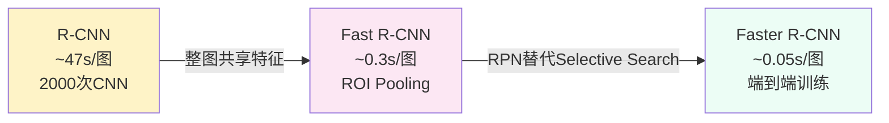

# 图像里到底有什么？—— 目标检测的演进（2014–2017）

## 这个问题从哪来

> 2014 年之前，CNN 已经能准确分类 ImageNet 图片，但分类只回答"这张图是什么"。现实世界需要更多：自动驾驶要知道行人在哪里，医学影像要定位病灶有几个、有多大，安防监控要同时追踪多个人。Girshick et al. (2014) 提出 R-CNN，开启了"在图像中找物体"的检测范式。此后三年，检测框架从两阶段到单阶段、从慢到快、从粗到精，演进了完整的一代。

## 学习目标

完成本章后，你应能回答：

1. 两阶段检测（R-CNN → Fast → Faster）解决了什么问题，每代改进了什么瓶颈？
2. YOLO 为什么能把检测变成回归问题，单阶段检测的 trade-off 是什么？
3. Focal Loss 解决的类别不平衡问题的数学本质是什么？

---

## 1. 直觉

想象你在人群中找一个朋友。

方法一：先看每个人的脸（区域提案），再判断是不是他（分类）。这是两阶段检测。

方法二：一眼扫过去，同时定位和识别。这是单阶段检测。

方法一更准但慢，方法二快但容易漏。目标检测的核心张力就在这里——**速度与精度的权衡**。

更具体地说，检测比分类多了两个要求：**定位**（物体在哪里，用边界框表示）和**数量**（图里有几个同类物体）。这导致检测必须同时解决"在哪里"和"是什么"两个问题。

> 你要记住：检测 = 定位 + 分类。两阶段拆开做，单阶段合在一起。

---

## 2. 机制

### 2.1 两阶段检测：从滑窗到区域提案

#### R-CNN (2014)

R-CNN 的流程可以分成四步：

1. **候选区域**：用 Selective Search 算法从图片中提取 ~2000 个候选区域
2. **特征提取**：每个候选区域 warp 到 227×227，分别过 CNN 提取 4096 维特征
3. **分类**：用 SVM 对每个区域的特征做分类
4. **边界框回归**：用线性回归微调边界框位置

问题：**极慢**。每张图要跑 2000 次 CNN forward pass，处理一张图需要 ~47 秒。

#### Fast R-CNN (2015)

核心改进：**整张图只过一次 CNN**。

1. 整图过 CNN 得到特征图
2. 在特征图上用 ROI Pooling 提取每个候选区域的固定大小特征
3. 全连接层做分类 + 边界框回归

速度从 47 秒降到 0.3 秒，但瓶颈变成了 Selective Search（CPU 上跑 ~2 秒）。

#### Faster R-CNN (2015)

关键洞察——**"候选框本身也可以用网络学"**。

用 RPN（Region Proposal Network）替代 Selective Search：

- 在特征图每个位置生成 $k$ 个 anchor（不同尺度和宽高比的参考框）
- 对每个 anchor 预测：是否包含物体（二分类）+ 边界框偏移量 $(t_x, t_y, t_w, t_h)$
- 回归目标：

$$t_x = \frac{x - x_a}{w_a}, \quad t_y = \frac{y - y_a}{h_a}, \quad t_w = \log\frac{w}{w_a}, \quad t_h = \log\frac{h}{h_a}$$

其中 $(x_a, y_a, w_a, h_a)$ 是 anchor 的坐标和尺寸，$(x, y, w, h)$ 是真实框。

三代的演进对比：



### 2.2 单阶段检测：YOLO

YOLO v1 (Redmon et al., 2016) 的核心思想：**把检测变成回归问题**。

#### 网格划分

把输入图像分成 $S \times S$ 的网格（论文中 $S=7$）。每个网格负责预测：

- $B$ 个边界框（论文中 $B=2$），每个框包含 5 个值：$(x, y, w, h, \text{confidence})$
- $C$ 个类别概率（论文中 $C=20$，Pascal VOC）

输出张量大小：$S \times S \times (B \times 5 + C)$

YOLO v1 输出 $7 \times 7 \times 30$ 的张量，一个 forward pass 完成检测。

#### 损失函数（5 项之和）

$$\mathcal{L} = \lambda_{\text{coord}} \cdot \mathcal{L}_{\text{loc}} + \mathcal{L}_{\text{conf}}^{\text{obj}} + \lambda_{\text{noobj}} \cdot \mathcal{L}_{\text{conf}}^{\text{noobj}} + \mathcal{L}_{\text{cls}}$$

各项含义：

| 损失项 | 含义 | 权重 |
|--------|------|------|
| $\mathcal{L}_{\text{loc}}$ | 边界框坐标损失（宽高用平方根） | $\lambda_{\text{coord}} = 5$ |
| $\mathcal{L}_{\text{conf}}^{\text{obj}}$ | 有物体位置的置信度损失 | 1 |
| $\mathcal{L}_{\text{conf}}^{\text{noobj}}$ | 无物体位置的置信度损失 | $\lambda_{\text{noobj}} = 0.5$ |
| $\mathcal{L}_{\text{cls}}$ | 分类损失 | 1 |

关键设计：宽高损失用 $\sqrt{w}$ 和 $\sqrt{h}$ 而非直接用 $w$ 和 $h$，避免大框主导梯度。

### 2.3 多尺度检测：SSD

SSD (Liu et al., 2016) 解决的核心问题：**YOLO 用最后一层特征图做检测，小物体检测差**。

改进：

- 在多个尺度的特征图上同时做检测
- 低分辨率特征图（如 19×19）检测大物体
- 高分辨率特征图（如 38×38）检测小物体
- Default box 类似 anchor，但跨越多个特征图层

直觉：大物体在深层特征图上已经有足够大的感受野来覆盖，而小物体在浅层高分辨率特征图上才能被看到。

### 2.4 类别不平衡：Focal Loss / RetinaNet

#### 核心问题

检测中背景框远多于前景框，典型比例 1000:1。大部分负样本都是"很容易判断的背景"，它们不提供有用梯度，却因为数量巨大淹没了少量困难正样本的梯度信号。

#### Focal Loss

标准交叉熵：$\text{CE}(p_t) = -\log(p_t)$，其中 $p_t$ 是正确类别的预测概率。

Focal Loss 在此基础上加了一个调制因子：

$$\text{FL}(p_t) = -\alpha_t (1 - p_t)^\gamma \log(p_t)$$

效果分析：

- 当 $p_t$ 接近 1（easy example）：$(1 - p_t)^\gamma$ 接近 0，loss 权重大幅降低
- 当 $p_t$ 接近 0（hard example）：$(1 - p_t)^\gamma$ 接近 1，loss 权重基本不变
- $\gamma = 0$ 时退化为标准交叉熵
- 实践中 $\gamma = 2$ 效果最好

直觉：Focal Loss 让网络把注意力集中在"难以分类的样本"上，而不是被大量简单负样本的梯度牵着走。

### 2.5 渐进式实现

#### Step 1 · IoU 计算（检测的基础度量）

```python
import torch

def compute_iou(boxes1: torch.Tensor, boxes2: torch.Tensor) -> torch.Tensor:
    """计算两组边界框之间的 IoU 矩阵。

    Args:
        boxes1: (N, 4) xyxy 格式
        boxes2: (M, 4) xyxy 格式
    Returns:
        (N, M) IoU 矩阵
    """
    area1 = (boxes1[:, 2] - boxes1[:, 0]) * (boxes1[:, 3] - boxes1[:, 1])
    area2 = (boxes2[:, 2] - boxes2[:, 0]) * (boxes2[:, 3] - boxes2[:, 1])

    inter_x1 = torch.max(boxes1[:, None, 0], boxes2[None, :, 0])
    inter_y1 = torch.max(boxes1[:, None, 1], boxes2[None, :, 1])
    inter_x2 = torch.min(boxes1[:, None, 2], boxes2[None, :, 2])
    inter_y2 = torch.min(boxes1[:, None, 3], boxes2[None, :, 3])

    inter = (inter_x2 - inter_x1).clamp(min=0) * (inter_y2 - inter_y1).clamp(min=0)
    return inter / (area1[:, None] + area2[None, :] - inter)
```

#### Step 2 · Anchor 生成

```python
def generate_anchors(feature_size: int, stride: int,
                     scales: list, ratios: list) -> torch.Tensor:
    """在特征图上生成 anchor 网格。

    Args:
        feature_size: 特征图边长
        stride: 特征图到原图的下采样步长
        scales: anchor 尺度列表，如 [128, 256, 512]
        ratios: anchor 宽高比列表，如 [0.5, 1.0, 2.0]
    Returns:
        (K, 4) xyxy 格式的 anchor 张量
    """
    anchors = []
    for y in range(feature_size):
        for x in range(feature_size):
            cx = (x + 0.5) * stride
            cy = (y + 0.5) * stride
            for s in scales:
                for r in ratios:
                    h = s * torch.sqrt(torch.tensor(r))
                    w = s / torch.sqrt(torch.tensor(r))
                    anchors.append([cx - w/2, cy - h/2, cx + w/2, cy + h/2])
    return torch.tensor(anchors)
```

#### Step 3 · NMS（非极大值抑制）

```python
def nms(boxes: torch.Tensor, scores: torch.Tensor,
        threshold: float = 0.5) -> list:
    """非极大值抑制：去除重叠过高的冗余检测框。

    Args:
        boxes: (N, 4) xyxy 格式
        scores: (N,) 每个框的置信度
        threshold: IoU 阈值，高于此值的重叠框被抑制
    Returns:
        保留的框索引列表
    """
    order = scores.argsort(descending=True)
    keep = []
    while order.numel() > 0:
        i = order[0].item()
        keep.append(i)
        if order.numel() == 1:
            break
        ious = compute_iou(boxes[i:i+1], boxes[order[1:]])[0]
        mask = ious <= threshold
        order = order[1:][mask]
    return keep
```

---

## 3. 工程要点

1. **Anchor 设计不当** → 覆盖不住目标尺寸 → Recall 低
   处置：在训练集上 K-means 聚类真实框尺寸，生成数据驱动的 anchor

2. **NMS 阈值太严** → 密集物体被误抑制（如一群人）
   处置：Soft-NMS 或调高阈值；YOLO 系列 0.3–0.5 之间调

3. **小物体漏检** → 特征图分辨率不够
   处置：用高分辨率特征图层（FPN 的 P3/P4）

4. **mAP 评估** → IoU 阈值选择影响巨大
   处置：COCO 标准 mAP@[0.5:0.95]，不只是 mAP@0.5

5. **训练不收敛** → 检测头梯度不稳定
   处置：先冻结 backbone 训练检测头 2–3 epoch，再解冻全模型微调

> 你要记住：检测 pipeline 的排障顺序是 Anchor 设计 → NMS → 特征图尺度 → Loss 权重 → Backbone 微调策略。

---

## 演进笔记

> **这一技术的遗产**：检测框架从手工设计 anchor 到 anchor-free（CornerNet, CenterNet），从单尺度到多尺度（FPN），再到 DETR 用 Transformer 端到端做检测。检测的演进主线是"减少手工设计、增加端到端学习"。Focal Loss 的思想后来也被借鉴到其他极端不平衡场景（如长尾分类）。
>
> 检测任务从视觉线延伸到了多模态——当检测器开始识别文本描述的物体（Referring Expression）、检测视频中的动作时，检测就不再是纯粹的视觉问题了。

→ 下一章：[分割与生成 — 编码器-解码器的两副面孔](../segmentation-gan/README.md)

---

**上一章**：[CNN 架构](../cnn-architectures/README.md) | **下一章**：[分割与生成](../segmentation-gan/README.md)
