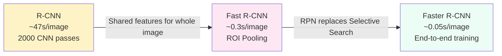

**[English](README_EN.md) | [中文](README.md)**

# What's Actually in the Image? — Object Detection Evolution (2014–2017)

## Where Does This Problem Come From?

> Before 2014, CNNs could already classify ImageNet images accurately, but classification only answers "what is this picture?" The real world demands more: autonomous driving needs to know where pedestrians are, medical imaging must localize lesions and determine how many there are and how large, and surveillance systems need to track multiple people simultaneously. Girshick et al. (2014) proposed R-CNN, kicking off the "finding objects in images" detection paradigm. Over the next three years, detection frameworks evolved from two-stage to single-stage, from slow to fast, from coarse to refined — an entire generation of progress.

## Learning Objectives

After completing this chapter, you should be able to answer:

1. What problems did two-stage detection (R-CNN → Fast → Faster) solve, and what bottleneck did each generation improve?
2. Why could YOLO reformulate detection as a regression problem, and what are the trade-offs of single-stage detection?
3. What is the mathematical essence of the class imbalance problem that Focal Loss addresses?

---

## 1. Intuition

Imagine you're looking for a friend in a crowd.

Method 1: First look at each person's face (region proposals), then judge whether it's them (classification). This is two-stage detection.

Method 2: Scan the entire scene at a glance, simultaneously localizing and recognizing. This is single-stage detection.

Method 1 is more accurate but slower; Method 2 is faster but more prone to misses. The core tension in object detection lies right here — **the trade-off between speed and accuracy**.

More specifically, detection adds two requirements beyond classification: **localization** (where is the object, represented by a bounding box) and **quantity** (how many objects of the same class are in the image). This means detection must simultaneously solve "where" and "what."

> Key takeaway: Detection = Localization + Classification. Two-stage methods do them separately; single-stage methods do them together.

---

## 2. Mechanism

### 2.1 Two-Stage Detection: From Sliding Windows to Region Proposals

#### R-CNN (2014)

R-CNN's pipeline can be broken into four steps:

1. **Region proposals**: Use the Selective Search algorithm to extract ~2000 candidate regions from the image
2. **Feature extraction**: Warp each candidate region to 227×227, run each through a CNN to extract 4096-dimensional features
3. **Classification**: Use SVMs to classify each region's features
4. **Bounding box regression**: Use linear regression to fine-tune bounding box positions

The problem: **extremely slow**. Each image requires ~2000 CNN forward passes, taking ~47 seconds per image.

#### Fast R-CNN (2015)

Core improvement: **run the CNN only once on the entire image**.

1. Pass the entire image through a CNN to get a feature map
2. Use ROI Pooling on the feature map to extract fixed-size features for each candidate region
3. Fully connected layers perform classification + bounding box regression

Speed dropped from 47 seconds to 0.3 seconds, but the bottleneck became Selective Search (~2 seconds on CPU).

#### Faster R-CNN (2015)

Key insight — **"proposal boxes themselves can be learned by a network"**.

Replace Selective Search with an RPN (Region Proposal Network):

- Generate $k$ anchors at each position on the feature map (reference boxes of different scales and aspect ratios)
- For each anchor, predict: whether it contains an object (binary classification) + bounding box offsets $(t_x, t_y, t_w, t_h)$
- Regression targets:

$$t_x = \frac{x - x_a}{w_a}, \quad t_y = \frac{y - y_a}{h_a}, \quad t_w = \log\frac{w}{w_a}, \quad t_h = \log\frac{h}{h_a}$$

where $(x_a, y_a, w_a, h_a)$ are the anchor's coordinates and dimensions, and $(x, y, w, h)$ are the ground-truth box coordinates.

Evolution comparison across three generations:



### 2.2 Single-Stage Detection: YOLO

YOLO v1 (Redmon et al., 2016) core idea: **reformulate detection as a regression problem**.

#### Grid Partitioning

Divide the input image into an $S \times S$ grid ($S=7$ in the paper). Each grid cell predicts:

- $B$ bounding boxes ($B=2$ in the paper), each box containing 5 values: $(x, y, w, h, \text{confidence})$
- $C$ class probabilities ($C=20$ in the paper, for Pascal VOC)

Output tensor size: $S \times S \times (B \times 5 + C)$

YOLO v1 outputs a $7 \times 7 \times 30$ tensor, completing detection in a single forward pass.

#### Loss Function (Sum of 5 Terms)

$$\mathcal{L} = \lambda_{\text{coord}} \cdot \mathcal{L}_{\text{loc}} + \mathcal{L}_{\text{conf}}^{\text{obj}} + \lambda_{\text{noobj}} \cdot \mathcal{L}_{\text{conf}}^{\text{noobj}} + \mathcal{L}_{\text{cls}}$$

Meaning of each term:

| Loss Term | Meaning | Weight |
|-----------|---------|--------|
| $\mathcal{L}_{\text{loc}}$ | Bounding box coordinate loss (width/height use square root) | $\lambda_{\text{coord}} = 5$ |
| $\mathcal{L}_{\text{conf}}^{\text{obj}}$ | Confidence loss at positions with objects | 1 |
| $\mathcal{L}_{\text{conf}}^{\text{noobj}}$ | Confidence loss at positions without objects | $\lambda_{\text{noobj}} = 0.5$ |
| $\mathcal{L}_{\text{cls}}$ | Classification loss | 1 |

Key design: width and height losses use $\sqrt{w}$ and $\sqrt{h}$ instead of raw $w$ and $h$, preventing large boxes from dominating the gradient.

### 2.3 Multi-Scale Detection: SSD

The core problem SSD (Liu et al., 2016) addresses: **YOLO uses only the final feature map for detection, resulting in poor small-object performance**.

Improvements:

- Perform detection simultaneously on feature maps at multiple scales
- Low-resolution feature maps (e.g., 19×19) detect large objects
- High-resolution feature maps (e.g., 38×38) detect small objects
- Default boxes are similar to anchors, but span multiple feature map layers

Intuition: Large objects already have sufficiently large receptive fields on deep feature maps to cover them, while small objects can only be captured on shallow, high-resolution feature maps.

### 2.4 Class Imbalance: Focal Loss / RetinaNet

#### Core Problem

In detection, background boxes vastly outnumber foreground boxes — a typical ratio is 1000:1. Most negative samples are "trivially easy backgrounds" that provide no useful gradients, yet they overwhelm the gradient signal from the few hard positive samples due to sheer volume.

#### Focal Loss

Standard cross-entropy: $\text{CE}(p_t) = -\log(p_t)$, where $p_t$ is the predicted probability of the correct class.

Focal Loss adds a modulating factor on top of this:

$$\text{FL}(p_t) = -\alpha_t (1 - p_t)^\gamma \log(p_t)$$

Effect analysis:

- When $p_t$ is close to 1 (easy example): $(1 - p_t)^\gamma$ approaches 0, dramatically reducing the loss weight
- When $p_t$ is close to 0 (hard example): $(1 - p_t)^\gamma$ approaches 1, keeping the loss weight essentially unchanged
- When $\gamma = 0$, it degenerates to standard cross-entropy
- In practice, $\gamma = 2$ works best

Intuition: Focal Loss forces the network to focus its attention on "hard-to-classify samples" rather than being pulled along by the gradients of the vast number of easy negative samples.

### 2.5 Progressive Implementation

#### Step 1 · IoU Computation (The Foundational Detection Metric)

```python
import torch

def compute_iou(boxes1: torch.Tensor, boxes2: torch.Tensor) -> torch.Tensor:
    """Compute the IoU matrix between two sets of bounding boxes.

    Args:
        boxes1: (N, 4) in xyxy format
        boxes2: (M, 4) in xyxy format
    Returns:
        (N, M) IoU matrix
    """
    area1 = (boxes1[:, 2] - boxes1[:, 0]) * (boxes1[:, 3] - boxes1[:, 1])
    area2 = (boxes2[:, 2] - boxes2[:, 0]) * (boxes2[:, 3] - boxes2[:, 1])

    inter_x1 = torch.max(boxes1[:, None, 0], boxes2[None, :, 0])
    inter_y1 = torch.max(boxes1[:, None, 1], boxes2[None, :, 1])
    inter_x2 = torch.min(boxes1[:, None, 2], boxes2[None, :, 2])
    inter_y2 = torch.min(boxes1[:, None, 3], boxes2[None, :, 3])

    inter = (inter_x2 - inter_x1).clamp(min=0) * (inter_y2 - inter_y1).clamp(min=0)
    return inter / (area1[:, None] + area2[None, :] - inter)
```

#### Step 2 · Anchor Generation

```python
def generate_anchors(feature_size: int, stride: int,
                     scales: list, ratios: list) -> torch.Tensor:
    """Generate an anchor grid on the feature map.

    Args:
        feature_size: feature map side length
        stride: downsampling stride from feature map to original image
        scales: list of anchor scales, e.g. [128, 256, 512]
        ratios: list of anchor aspect ratios, e.g. [0.5, 1.0, 2.0]
    Returns:
        (K, 4) anchor tensor in xyxy format
    """
    anchors = []
    for y in range(feature_size):
        for x in range(feature_size):
            cx = (x + 0.5) * stride
            cy = (y + 0.5) * stride
            for s in scales:
                for r in ratios:
                    h = s * torch.sqrt(torch.tensor(r))
                    w = s / torch.sqrt(torch.tensor(r))
                    anchors.append([cx - w/2, cy - h/2, cx + w/2, cy + h/2])
    return torch.tensor(anchors)
```

#### Step 3 · NMS (Non-Maximum Suppression)

```python
def nms(boxes: torch.Tensor, scores: torch.Tensor,
        threshold: float = 0.5) -> list:
    """Non-maximum suppression: remove redundant detection boxes with excessive overlap.

    Args:
        boxes: (N, 4) in xyxy format
        scores: (N,) confidence score for each box
        threshold: IoU threshold; overlapping boxes above this value are suppressed
    Returns:
        list of indices of kept boxes
    """
    order = scores.argsort(descending=True)
    keep = []
    while order.numel() > 0:
        i = order[0].item()
        keep.append(i)
        if order.numel() == 1:
            break
        ious = compute_iou(boxes[i:i+1], boxes[order[1:]])[0]
        mask = ious <= threshold
        order = order[1:][mask]
    return keep
```

---

## 3. Engineering Notes

1. **Poor anchor design** → anchors don't cover target sizes → low recall
   Fix: K-means clustering on ground-truth box sizes in the training set to generate data-driven anchors

2. **NMS threshold too strict** → dense objects are incorrectly suppressed (e.g., a crowd of people)
   Fix: Use Soft-NMS or raise the threshold; tune YOLO-series models between 0.3–0.5

3. **Small object miss rate** → feature map resolution insufficient
   Fix: Use high-resolution feature map layers (FPN's P3/P4)

4. **mAP evaluation** → IoU threshold choice has enormous impact
   Fix: Use COCO standard mAP@[0.5:0.95], not just mAP@0.5

5. **Training fails to converge** → detection head gradients unstable
   Fix: Freeze the backbone and train the detection head for 2–3 epochs first, then unfreeze the full model for fine-tuning

> Key takeaway: The troubleshooting order for the detection pipeline is Anchor design → NMS → Feature map scale → Loss weights → Backbone fine-tuning strategy.

---

## Evolution Notes

> **The legacy of this technology**: Detection frameworks evolved from hand-designed anchors to anchor-free (CornerNet, CenterNet), from single-scale to multi-scale (FPN), and then to DETR using Transformers for end-to-end detection. The main storyline of detection evolution is "reducing hand-crafted design, increasing end-to-end learning." The Focal Loss idea was later borrowed for other extreme imbalance scenarios (e.g., long-tail classification).
>
> The detection task extended from the visual track into multimodal territory — when detectors began identifying objects described by text (Referring Expressions) and detecting actions in video, detection was no longer a purely visual problem.

→ Next chapter: [Segmentation & Generation — Two Faces of Encoder-Decoders](../segmentation-gan/README_EN.md)

---

**Previous**: [CNN Architectures](../cnn-architectures/README_EN.md) | **Next**: [Segmentation & Generation](../segmentation-gan/README_EN.md)
