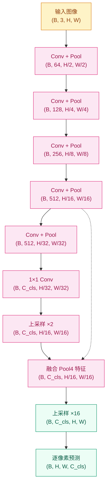
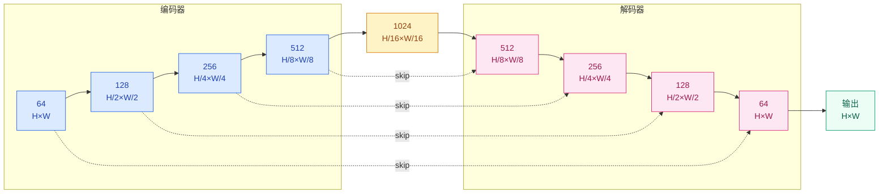
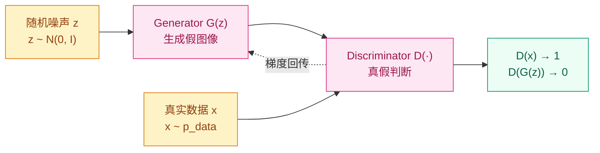

# 理解像素还是创造像素？—— 分割与生成（2015–2017）

## 这个问题从哪来

> CNN 已经能分类和检测了，但分类输出一个标签，检测输出几个矩形框。现实需要更精细的回答：自动驾驶要精确到每个像素属于道路还是人行道（语义分割），医学影像要从 CT 切片中逐像素圈出器官边界。与此同时，Goodfellow et al. (2014) 提出了 GAN：如果判别器和生成器对抗训练，网络能否学会"创造"逼真的图像？分割和生成看似方向相反——一个是从图像到标签，一个是从噪声到图像——但它们共享同一种核心架构：编码器-解码器。

2015 年前后，视觉领域同时爆发了两条线索。分割线：FCN 首次把分类网络改造成逐像素预测，U-Net 用跳跃连接在医学影像上取得了惊人效果。生成线：GAN 从理论提议变成工程现实，DCGAN 给出了第一份稳定的训练配方，Progressive GAN 把分辨率推到了 1024×1024。两条线索在架构层面交汇——它们都需要把低维表示"展开"回高维空间，只不过一个展开的是语义标签，另一个展开的是像素颜色。

## 学习目标

完成本章后，你应能回答：

1. FCN 和 U-Net 如何把分类网络改造为逐像素预测？跳跃连接在其中扮演什么角色？
2. GAN 的博弈训练框架为什么能工作，训练不稳定的原因是什么？
3. 编码器-解码器架构如何在分割和生成中分别发挥作用？
4. DCGAN 的工程实践解决了哪些稳定性问题？Progressive GAN 的渐进式策略为什么有效？

---

## 1. 直觉

### 1.1 分割的直觉：填色游戏

想象你拿到了一本巨大的填色书。图片上有街道、汽车、行人、树木、天空。你的任务不是给整张图写一个标签（那是分类），也不是画几个框把物体圈出来（那是检测），而是给每一个像素涂上正确的颜色——道路像素涂灰色，天空像素涂蓝色，行人像素涂红色。这就是语义分割：逐像素分类。

难度在于，分类网络经过多次池化和下采样后，空间分辨率急剧缩小。一张 224×224 的输入，经过五次下采样后只剩 7×7 的特征图。你如何从 7×7 恢复到 224×224 的逐像素预测？这是分割网络要解决的核心问题。

### 1.2 生成的直觉：画家与鉴定师

现在换一个场景。有一个画家和一个鉴定师。鉴定师看过很多真画，能分辨真假。画家不断创作，试图骗过鉴定师。两人一起进步——鉴定师的眼力越来越毒，画家的画也越来越像真的。

GAN 的 Generator 就是画家，Discriminator 就是鉴定师。Generator 从随机噪声出发，尝试生成图像；Discriminator 则要判断一张图是真实数据还是 Generator 生成的假图。训练的目标是达到纳什均衡：Generator 生成的图与真实数据无法区分，Discriminator 只能随机猜测（输出 0.5）。

### 1.3 共享的架构基因

分割和生成都需要"从小到大"：分割要把低分辨率的语义特征图上采样回原始分辨率；生成要把低维噪声向量展开成高维图像。两者都采用编码器-解码器结构——编码器把输入压缩成紧凑表示，解码器把紧凑表示展开为目标输出。

> 你要记住：分割是"每个像素都分类"，生成是"从噪声中采样出真实分布"。两者共享编码器-解码器结构，本质都是在做空间分辨率的恢复。

### 1.4 为什么 2015 年是分水岭

2012 年 AlexNet 证明 CNN 能做图像分类，2014 年 VGGNet 和 GoogLeNet 把网络推向更深更宽。但分类只是视觉任务中最基础的一环——现实世界不仅需要知道"图里有什么"，还需要知道"每个像素属于什么"和"能不能凭空创造出逼真的图像"。

2015 年之所以成为分割和生成两条线同时爆发的节点，有两个前提条件：

1. **编码器足够成熟**：VGG 和 ResNet 提供了强大的特征提取骨干网络。FCN 直接把预训练的 VGG 改造为分割网络，U-Net 也借鉴了 VGG 的双卷积设计。没有好的编码器，解码器再精巧也无法生成有意义的输出。

2. **GPU 算力持续增长**：GAN 的对抗训练需要同时维护两个网络，训练成本大约是单一网络的 2-3 倍。只有 GPU 足够快，实验迭代周期才能缩短到可以调参的程度。

---

## 2. 机制

### 2.1 语义分割：FCN（Fully Convolutional Networks）

Long et al. (2015) 的核心洞察极其简洁：分类网络最后的全连接层其实就是卷积核大小等于整个特征图的卷积。既然如此，为什么不直接用卷积层替代全连接层，然后上采样回原始分辨率？

**标准分类 CNN 的流程：**
```
输入图像 → 卷积/池化（多次）→ 全连接层 → 类别概率
```

**FCN 的流程：**
```
输入图像 → 卷积/池化（多次）→ 1×1 卷积（替代全连接）→ 上采样 → 逐像素类别概率
```

关键转变是：全连接层输出一个固定长度的向量（丢弃了空间信息），而 1×1 卷积保留空间维度，输出一个 H'×W'×C 的张量，其中 C 是类别数。然后通过上采样把这个低分辨率预测恢复到输入分辨率。

**上采样的方式——转置卷积（Transposed Convolution）：**

转置卷积也叫"反卷积"（严格来说这个叫法不精确），它的作用是把低分辨率特征图"展开"到高分辨率。普通卷积是"多个输入贡献一个输出"，转置卷积反过来，是"一个输入贡献多个输出"：

$$Y(i,j) = \sum_m \sum_n X(\lfloor i/s \rfloor + m,\, \lfloor j/s \rfloor + n) \cdot K(m,n)$$

其中 $s$ 是步幅，$K$ 是卷积核。直觉上，转置卷积在输入的每个像素周围"播种"，然后叠加得到输出。

FCN 还提出了**跳跃融合（Skip Fusion）**的技巧：把浅层高分辨率特征图与深层低分辨率预测融合。浅层保留空间细节，深层提供语义信息，两者结合能得到更精确的分割边界。

FCN 论文给出了三种变体：FCN-32s（直接上采样 32 倍，最粗糙）、FCN-16s（融合 pool4 特征，16 倍上采样）、FCN-8s（再融合 pool3 特征，8 倍上采样）。效果递进提升，说明跳跃融合带来的空间信息增益是实质性的。

**FCN 的分割损失函数**采用逐像素的交叉熵，对每个像素独立计算：

$$\mathcal{L} = -\frac{1}{N} \sum_{i=1}^{N} \sum_{c=1}^{C} y_{ic} \log(\hat{y}_{ic})$$

其中 $N$ 是像素总数，$C$ 是类别数，$y_{ic}$ 是像素 $i$ 属于类别 $c$ 的 one-hot 标签，$\hat{y}_{ic}$ 是模型预测的概率。这意味着分割网络的损失计算量是分类网络的 $N$ 倍——如果输入是 256×256 的图像，每个 batch 的损失要累加 65536 个像素的交叉熵。

**评估指标——IoU（Intersection over Union）：**

语义分割最常用的评估指标是 mIoU（mean IoU），即所有类别 IoU 的均值：

$$\text{IoU}_c = \frac{TP_c}{TP_c + FP_c + FN_c}$$

其中 $TP_c$ 是类别 $c$ 正确预测的像素数，$FP_c$ 是错误预测为 $c$ 的像素数，$FN_c$ 是本属于 $c$ 但被预测为其他类别的像素数。mIoU 对小类别的错误特别敏感，这在自动驾驶等场景中很重要（比如远处的行人只占几个像素）。



### 2.2 U-Net：医学图像分割的对称之美

Ronneberger et al. (2015) 为医学图像分割设计。医学图像的特点是数据量小（标注一张 CT 切片需要专业医生），但要求精度极高（少圈一个像素可能就意味着漏诊）。

U-Net 的架构是对称的编码器-解码器，像一个 U 字母：

- **编码器（左半）**：逐步下采样，提取越来越抽象的语义特征。每一步包含两次 3×3 卷积 + ReLU，然后 2×2 最大池化。通道数逐层翻倍（64 → 128 → 256 → 512 → 1024）。
- **解码器（右半）**：逐步上采样，恢复空间分辨率。每一步包含一次 2×2 转置卷积（上采样），然后与编码器对应层的特征图拼接，再做两次 3×3 卷积。通道数逐层减半。
- **跳跃连接（横杠）**：这是 U-Net 的精髓。把编码器每层的高分辨率特征图直接拼接到解码器对应层。这样解码器同时拥有两份信息：深层传来的语义信息和浅层保留的空间细节。



跳跃连接的意义不止于"细节补充"。在梯度流方面，它为深层网络提供了一条短路路径，类似 ResNet 的残差连接。但与 ResNet 不同，U-Net 的跳跃连接传输的是完整的特征图（不是残差），且通过拼接（concatenation）而非相加（addition）来融合信息。

### 2.3 GAN：生成对抗框架

Goodfellow et al. (2014) 的极小极大博弈可以用一个目标函数概括：

$$\min_G \max_D \; \mathbb{E}_{x \sim p_{data}}[\log D(x)] + \mathbb{E}_{z \sim p_z}[\log(1 - D(G(z)))]$$

这个公式在说什么？

- **Discriminator 的目标（$\max_D$）**：对于真实数据 $x$，最大化 $\log D(x)$（让它输出接近 1）；对于生成数据 $G(z)$，最大化 $\log(1 - D(G(z)))$（让它输出接近 0）。合在一起，D 要尽可能准确地区分真假。
- **Generator 的目标（$\min_G$）**：最小化 $\log(1 - D(G(z)))$，即让 D 对生成样本的判断越困惑越好。

当训练收敛时，理论上 $p_G = p_{data}$，即 Generator 学到的分布等于真实数据分布，此时 $D(x) = 0.5$（对任意输入都给出五五开）。

**但实践中训练 GAN 极其不稳定，原因有三个：**

1. **模式坍塌（Mode Collapse）**：Generator 发现只要生成少数几种样本就能骗过 Discriminator，就不再探索数据分布的其他模式。结果：所有输出看起来都差不多。比如训练集有 10 种数字，Generator 可能只学会生成"1"和"7"。

2. **判别器太强导致梯度消失**：如果 D 训练得太好，能完美区分真假，那么 $D(G(z)) \approx 0$，Generator 的梯度 $\nabla_G \log(1 - D(G(z)))$ 趋近于零。G 收不到有用的学习信号，训练停滞。

3. **训练震荡**：G 和 D 交替训练，如果一方突然变强，另一方来不及适应，训练就在两个极端之间来回震荡，无法收敛到纳什均衡。



**GAN 训练的替代损失函数：**

Goodfellow 在论文中还提出了一个实践技巧：不要让 Generator 最小化 $\log(1 - D(G(z)))$，而是最大化 $\log D(G(z))$。原因在于：当 $D(G(z))$ 接近 0 时，$\log(1 - D(G(z)))$ 的梯度很小，但 $\log D(G(z))$ 的梯度很大。后者在训练初期提供了更强的学习信号。

后来 WGAN（Arjovsky et al., 2017）用 Wasserstein 距离替代了 JS 散度，从根本上缓解了梯度消失问题。WGAN 的核心洞察是：原始 GAN 的 loss 本质上在衡量 $p_G$ 和 $p_{data}$ 之间的 JS 散度，但当两个分布完全没有重叠时，JS 散度恒为 $\log 2$，梯度为零。Wasserstein 距离即使分布不重叠也能提供有意义的梯度。

### 2.4 DCGAN：让 GAN 稳定训练的工程实践

Radford et al. (2015) 的贡献不是新算法，而是把 GAN 从"理论上能跑但实际很难调"变成"照着做就能跑"。他们通过大量实验总结出一套架构准则：

**Generator 的设计原则：**
- 全部用转置卷积做上采样，不使用全连接层
- 每层都加 BatchNorm（输出层除外，因为会让样本方差不稳定）
- 中间层用 ReLU，输出层用 Tanh（把输出约束到 [-1, 1]）
- 卷积核大小统一用 4×4 或 5×5，步幅用 2

**Discriminator 的设计原则：**
- 全部用步幅卷积（strided convolution）做下采样，不用池化层
- 每层都加 BatchNorm（输入层除外）
- 全部用 LeakyReLU（斜率 0.2），不用 ReLU（ReLU 在 D 中容易导致稀疏梯度）

**训练超参数：**
- Adam 优化器，lr = 0.0002，beta1 = 0.5（比默认的 0.9 更小，减少动量带来的震荡）
- 潜在空间维度 z_dim = 100
- 所有权重初始化为均值 0、标准差 0.02 的正态分布

DCGAN 的贡献在于：它证明了 GAN 的稳定性主要来自架构选择，而不是更复杂的训练算法。在 WGAN、StyleGAN 等后续工作出现之前，DCGAN 的准则就是训练 GAN 的标准做法。

### 2.5 Progressive GAN：逐步增大分辨率

Karras et al. (2017) 解决了 GAN 另一个难题：如何生成高分辨率图像。直接训练 1024×1024 的 GAN 几乎不可能收敛，Progressive GAN 的思路是从低分辨率开始，逐步增加网络深度。

**训练过程：**

1. 先训练一个只生成 4×4 图像的 GAN。此时网络很浅，训练相对容易。
2. 训练稳定后，在 G 和 D 的末尾分别添加新的层，分辨率翻倍到 8×8。
3. 为了避免分辨率突变导致的震荡，新层不是一步到位的，而是用 α 参数线性混合：

$$\text{output} = (1 - \alpha) \cdot \text{旧层输出（上采样）} + \alpha \cdot \text{新层输出}$$

α 从 0 平滑过渡到 1，训练稳定后新层完全接管。

4. 重复这个过程：16×16 → 32×32 → ... → 512×512 → 1024×1024。

**为什么渐进式策略有效？**

核心原因是在低分辨率阶段，网络先学会了数据的全局结构（大致形状、颜色分布），再逐步学习局部细节（纹理、边缘）。这类似于画家先打草稿再细化——先画轮廓，再填细节。如果一开始就要求网络同时学习全局结构和局部细节，优化空间太复杂，很容易陷入局部最优或模式坍塌。

### 2.6 Neural Style Transfer（简要）

Gatys et al. (2015) 做了一件有趣的事：用预训练 VGG 网络的特征图来分离图像的"内容"和"风格"，然后把一张图的内容和另一张图的风格融合。

**内容损失（Content Loss）：**

取 VGG 高层（如 conv4_2）的特征图，计算生成图像与内容图像在该层的均方误差：

$$\mathcal{L}_{content} = \frac{1}{2} \sum_{i,j} (F_{ij}^l - P_{ij}^l)^2$$

高层特征图捕捉的是图像的"内容"——大致形状和空间布局。

**风格损失（Style Loss）：**

先用 Gram 矩阵表示特征图的风格（通道间的相关性）：

$$G_{ij}^l = \sum_k F_{ik}^l \cdot F_{jk}^l$$

然后计算生成图像与风格图像在多层 Gram 矩阵上的均方误差。Gram 矩阵丢弃了空间信息，只保留了纹理和颜色统计。

**总损失：**

$$\mathcal{L}_{total} = \alpha \cdot \mathcal{L}_{content} + \beta \cdot \mathcal{L}_{style}$$

通过调整 α 和 β 的比值，可以控制生成图像在内容保真度和风格匹配度之间的平衡。

风格迁移本身不是 GAN，但它揭示了 CNN 特征表示的一个有趣性质：不同层的特征图编码了不同层次的信息。低层编码纹理，高层编码语义。这个洞察后来影响了 GAN 的发展——StyleGAN 就利用了类似的分层控制机制。

### 2.7 渐进式代码实现

下面我们用 PyTorch 从基本块到完整网络，逐步实现 U-Net 和 DCGAN Generator。

**Step 1 -- U-Net 基本块：**

U-Net 的每一层都由两次 3×3 卷积 + BatchNorm + ReLU 组成，这被称为"双卷积"模式：

```python
import torch
import torch.nn as nn

class UNetBlock(nn.Module):
    """Double conv: Conv → BN → ReLU × 2"""
    def __init__(self, in_ch, out_ch):
        super().__init__()
        self.block = nn.Sequential(
            nn.Conv2d(in_ch, out_ch, 3, padding=1), nn.BatchNorm2d(out_ch), nn.ReLU(inplace=True),
            nn.Conv2d(out_ch, out_ch, 3, padding=1), nn.BatchNorm2d(out_ch), nn.ReLU(inplace=True),
        )
    def forward(self, x):
        return self.block(x)
```

每个 UNetBlock 接受 `in_ch` 通道的输入，输出 `out_ch` 通道的特征图。3×3 卷积配合 padding=1 保持空间尺寸不变。BatchNorm 在训练时稳定梯度，推理时固定为运行均值。

**Step 2 -- 完整 U-Net（编码器 + 解码器 + 跳跃连接）：**

```python
class UNet(nn.Module):
    def __init__(self, in_ch=1, out_ch=1, base=64):
        super().__init__()
        # 编码器：逐步下采样
        self.enc1 = UNetBlock(in_ch, base)          # 64 通道
        self.enc2 = UNetBlock(base, base * 2)       # 128 通道
        self.enc3 = UNetBlock(base * 2, base * 4)   # 256 通道
        self.bottleneck = UNetBlock(base * 4, base * 8)  # 512 通道

        # 解码器：上采样 + 拼接 + 双卷积
        self.up3 = nn.ConvTranspose2d(base * 8, base * 4, 2, stride=2)
        self.dec3 = UNetBlock(base * 8, base * 4)   # 拼接后通道数翻倍
        self.up2 = nn.ConvTranspose2d(base * 4, base * 2, 2, stride=2)
        self.dec2 = UNetBlock(base * 4, base * 2)
        self.up1 = nn.ConvTranspose2d(base * 2, base, 2, stride=2)
        self.dec1 = UNetBlock(base * 2, base)

        self.final = nn.Conv2d(base, out_ch, 1)     # 1×1 卷积映射到目标通道
        self.pool = nn.MaxPool2d(2)                  # 2×2 最大池化

    def forward(self, x):
        # 编码路径
        e1 = self.enc1(x)                            # (B, 64, H, W)
        e2 = self.enc2(self.pool(e1))                 # (B, 128, H/2, W/2)
        e3 = self.enc3(self.pool(e2))                 # (B, 256, H/4, W/4)
        b  = self.bottleneck(self.pool(e3))           # (B, 512, H/8, W/8)

        # 解码路径（带跳跃连接）
        d3 = self.dec3(torch.cat([self.up3(b),  e3], dim=1))  # (B, 256, H/4, W/4)
        d2 = self.dec2(torch.cat([self.up2(d3), e2], dim=1))  # (B, 128, H/2, W/2)
        d1 = self.dec1(torch.cat([self.up1(d2), e1], dim=1))  # (B, 64,  H, W)

        return self.final(d1)                         # (B, out_ch, H, W)
```

注意 `torch.cat([self.up3(b), e3], dim=1)` 这一行——这就是跳跃连接的实现。`self.up3(b)` 把瓶颈层的输出上采样到与 `e3` 相同的空间尺寸，然后在通道维度上拼接。拼接后的通道数是上采样输出通道数加上编码器通道数，所以 `dec3` 的输入通道数是 `base * 8`（512 + 256 的两倍来自 base*4，但拼接后是 base*4 + base*4 = base*8）。

**Step 3 -- DCGAN Generator：**

```python
class DCGANGenerator(nn.Module):
    def __init__(self, z_dim=100, base_ch=64):
        super().__init__()
        self.net = nn.Sequential(
            # z_dim × 1 × 1 → base_ch*8 × 4 × 4
            nn.ConvTranspose2d(z_dim, base_ch * 8, 4, 1, 0, bias=False),
            nn.BatchNorm2d(base_ch * 8), nn.ReLU(True),
            # base_ch*8 × 4 × 4 → base_ch*4 × 8 × 8
            nn.ConvTranspose2d(base_ch * 8, base_ch * 4, 4, 2, 1, bias=False),
            nn.BatchNorm2d(base_ch * 4), nn.ReLU(True),
            # base_ch*4 × 8 × 8 → base_ch*2 × 16 × 16
            nn.ConvTranspose2d(base_ch * 4, base_ch * 2, 4, 2, 1, bias=False),
            nn.BatchNorm2d(base_ch * 2), nn.ReLU(True),
            # base_ch*2 × 16 × 16 → base_ch × 32 × 32
            nn.ConvTranspose2d(base_ch * 2, base_ch, 4, 2, 1, bias=False),
            nn.BatchNorm2d(base_ch), nn.ReLU(True),
            # base_ch × 32 × 32 → 3 × 64 × 64
            nn.ConvTranspose2d(base_ch, 3, 4, 2, 1, bias=False),
            nn.Tanh(),  # 输出范围 [-1, 1]
        )

    def forward(self, z):
        return self.net(z.view(z.size(0), -1, 1, 1))
```

DCGAN Generator 的结构与 U-Net 解码器类似——都是从低维表示逐步上采样到高维输出。区别在于：U-Net 的输入是图像（通过编码器压缩后），而 GAN Generator 的输入是随机噪声；U-Net 有跳跃连接提供空间细节，GAN Generator 没有这样的辅助信息，完全依赖自身学习上采样。

**Step 4 -- DCGAN Discriminator：**

```python
class DCGANDiscriminator(nn.Module):
    def __init__(self, base_ch=64):
        super().__init__()
        self.net = nn.Sequential(
            # 3 × 64 × 64 → base_ch × 32 × 32
            nn.Conv2d(3, base_ch, 4, 2, 1, bias=False),
            nn.LeakyReLU(0.2, inplace=True),
            # base_ch × 32 × 32 → base_ch*2 × 16 × 16
            nn.Conv2d(base_ch, base_ch * 2, 4, 2, 1, bias=False),
            nn.BatchNorm2d(base_ch * 2), nn.LeakyReLU(0.2, inplace=True),
            # base_ch*2 × 16 × 16 → base_ch*4 × 8 × 8
            nn.Conv2d(base_ch * 2, base_ch * 4, 4, 2, 1, bias=False),
            nn.BatchNorm2d(base_ch * 4), nn.LeakyReLU(0.2, inplace=True),
            # base_ch*4 × 8 × 8 → base_ch*8 × 4 × 4
            nn.Conv2d(base_ch * 4, base_ch * 8, 4, 2, 1, bias=False),
            nn.BatchNorm2d(base_ch * 8), nn.LeakyReLU(0.2, inplace=True),
            # base_ch*8 × 4 × 4 → 1 × 1 × 1
            nn.Conv2d(base_ch * 8, 1, 4, 1, 0, bias=False),
            nn.Sigmoid(),
        )

    def forward(self, x):
        return self.net(x).view(-1, 1).squeeze(1)
```

Discriminator 是 Generator 的镜像：用步幅卷积逐步下采样，最终输出一个 0-1 之间的概率值。注意第一层没有 BatchNorm（DCGAN 的规定），且全部使用 LeakyReLU 而非 ReLU。

**Step 5 -- GAN 训练循环：**

```python
def train_gan(G, D, dataloader, z_dim=100, epochs=200, lr=2e-4, device="cuda"):
    """DCGAN 的标准训练循环"""
    opt_G = torch.optim.Adam(G.parameters(), lr=lr, betas=(0.5, 0.999))
    opt_D = torch.optim.Adam(D.parameters(), lr=lr, betas=(0.5, 0.999))
    criterion = nn.BCELoss()

    real_label = 1.0
    fake_label = 0.0

    for epoch in range(epochs):
        for i, (real_imgs, _) in enumerate(dataloader):
            batch_size = real_imgs.size(0)
            real_imgs = real_imgs.to(device)

            # --- 训练 Discriminator ---
            # 真实样本的损失
            real_labels = torch.full((batch_size,), real_label, device=device)
            d_real = D(real_imgs)
            loss_d_real = criterion(d_real, real_labels)

            # 生成假样本的损失
            z = torch.randn(batch_size, z_dim, 1, 1, device=device)
            fake_imgs = G(z).detach()  # detach 防止梯度流到 G
            fake_labels = torch.full((batch_size,), fake_label, device=device)
            d_fake = D(fake_imgs)
            loss_d_fake = criterion(d_fake, fake_labels)

            loss_d = loss_d_real + loss_d_fake
            opt_D.zero_grad()
            loss_d.backward()
            opt_D.step()

            # --- 训练 Generator ---
            # G 希望 D 把假样本判断为真
            z = torch.randn(batch_size, z_dim, 1, 1, device=device)
            fake_imgs = G(z)
            output = D(fake_imgs)
            loss_g = criterion(output, real_labels)  # 注意：目标是 real_label

            opt_G.zero_grad()
            loss_g.backward()
            opt_G.step()

        if (epoch + 1) % 20 == 0:
            print(f"Epoch {epoch+1}/{epochs}  "
                  f"D_loss: {loss_d.item():.4f}  G_loss: {loss_g.item():.4f}")
```

训练循环中有几个容易踩的坑：`fake_imgs.detach()` 是必须的——如果不 detach，D 的反向传播会修改 G 的参数，破坏训练的分离性；Generator 的 loss 用 `real_label` 作为目标，因为 G 的目标是"让 D 认为假图是真的"；`betas=(0.5, 0.999)` 是 DCGAN 论文推荐的超参数，比默认的 `(0.9, 0.999)` 震荡更小。

**Step 6 -- U-Net 训练与数据增强：**

```python
def train_unet(model, dataloader, epochs=50, lr=1e-3, device="cuda"):
    """U-Net 的标准训练循环"""
    optimizer = torch.optim.Adam(model.parameters(), lr=lr)
    criterion = nn.BCEWithLogitsLoss()  # 二分类分割用 BCE + Logits

    for epoch in range(epochs):
        model.train()
        total_loss = 0.0
        for imgs, masks in dataloader:
            imgs, masks = imgs.to(device), masks.to(device)
            preds = model(imgs)
            loss = criterion(preds, masks)

            optimizer.zero_grad()
            loss.backward()
            optimizer.step()
            total_loss += loss.item()

        avg_loss = total_loss / len(dataloader)
        if (epoch + 1) % 10 == 0:
            print(f"Epoch {epoch+1}/{epochs}  Loss: {avg_loss:.4f}")
```

U-Net 的训练相比 GAN 要简单得多——没有对抗训练的稳定性问题，没有两个网络的平衡博弈，就是一个标准的监督学习任务。难度主要在数据端：医学图像的标注成本极高，所以 U-Net 原始论文大量使用数据增强（弹性变形、旋转、翻转）来扩充训练集。弹性变形特别适合医学图像，因为器官组织本身就有自然的形变。

---

## 3. 工程要点

### 3.1 GAN 训练不收敛 → D 太强导致 G 梯度消失

**现象**：Discriminator 的 loss 快速趋近于 0，Generator 的 loss 稳定在高位，生成的图像一片噪声或完全不变化。

**处置**：
- 降低 Discriminator 的学习率（比如设为 Generator 的一半）
- 调整训练频率比例（常见的 1:1 或 1:2 的 G:D 训练次数比）
- 给 Discriminator 加 Dropout 或标签平滑（真实标签从 1.0 改为 0.9）

### 3.2 模式坍塌 → G 只生成少数几种输出

**现象**：生成的图像看起来质量还行，但千篇一律——比如生成人脸时只输出同一个人。

**处置**：
- 加入谱归一化（Spectral Normalization），约束 D 每层的 Lipschitz 常数
- 使用 Minibatch Discrimination，让 D 能看到一批样本的多样性
- 改用 WGAN-GP 或其他改进的 GAN 损失函数

### 3.3 分割边界模糊 → 上采样丢失细节

**现象**：分割结果的物体内部区域正确，但边界粗糙、锯齿明显，小物体丢失。

**处置**：
- U-Net 的跳跃连接是标配，不要省略
- 必要时加 Deep Supervision：在解码器的多个中间层同时输出预测，用它们的加权损失辅助训练
- 后处理可以用条件随机场（CRF）精细化边界，但这属于传统方法，现代做法更倾向于在网络结构上改进

### 3.4 GAN 评估困难 → 没有单一的"准确率"指标

**现象**：GAN 没有"正确答案"可以比较，人眼评估不可靠且不可复现。

**处置**：
- **FID（Frechet Inception Distance）** 是当前主流指标。它用 Inception 网络提取真实图像和生成图像的特征，然后计算两个高斯分布之间的 Frechet 距离。FID 越低越好。
- **IS（Inception Score）** 也可参考，它衡量生成图像的分类置信度和类别分布的边缘熵。IS 越高越好。
- 人眼评估仍然重要，但不能作为唯一标准。

> 你要记住：GAN 的排障优先级是 训练稳定性（loss 是否在震荡）→ 模式多样性（FID）→ 图像质量。先确保训练能跑，再追求多样性，最后优化细节。

### 3.5 分割类别不平衡 → 小物体被淹没

**现象**：在道路场景分割中，"道路"和"天空"占据图像绝大部分面积，而"行人"和"交通标志"只占几个像素。模型倾向于把所有像素都预测为多数类，整体准确率很高，但小类别的 IoU 接近于零。

**处置**：
- 使用加权交叉熵损失：给小类别更高的权重，让模型更关注它们
- 使用 Dice Loss 或 Focal Loss：Dice Loss 直接优化 IoU 相关指标，Focal Loss 让模型聚焦于难分类的样本
- 过采样包含小类别的图像切片，或者使用滑动窗口策略增加小类别的出现频率

### 3.6 GPU 显存管理 → 分割任务的高分辨率挑战

**现象**：分割需要输出与输入同分辨率的预测图，而分类只需要输出一个向量。一张 512×512 的输入，分割的输出是 512×512×C 的张量，如果 C=21（PASCAL VOC 的类别数），单张图片的标签就有 550 万个值。Batch size 通常只能设为 1-4。

**处置**：
- 使用梯度累积（gradient accumulation）模拟更大的 batch size
- 使用混合精度训练（FP16）减少显存占用
- 在推理时使用滑动窗口切片处理超大图像

---

## 4. 关键论文与时间线

| 年份 | 论文 | 核心贡献 |
|------|------|----------|
| 2014 | Goodfellow et al. *Generative Adversarial Nets* | 提出 GAN 框架，极小极大博弈 |
| 2015 | Long et al. *Fully Convolutional Networks* | FCN，把分类网络改为逐像素预测 |
| 2015 | Ronneberger et al. *U-Net* | 对称编码器-解码器 + 跳跃连接 |
| 2015 | Radford et al. *DCGAN* | GAN 稳定训练的架构准则 |
| 2015 | Gatys et al. *Neural Style Transfer* | 内容-风格分离，Gram 矩阵 |
| 2017 | Karras et al. *Progressive GAN* | 渐进式训练，1024×1024 生成 |
| 2017 | He et al. *Mask R-CNN* | 实例分割，分割与检测的统一 |

---

## 5. 概念速查表

| 概念 | 一句话解释 | 关键公式/结构 |
|------|-----------|--------------|
| FCN | 把全连接层换成卷积层，实现逐像素分类 | 1×1 Conv + 上采样 |
| U-Net | 对称编码器-解码器，跳跃连接保细节 | Encoder-Decoder + Skip Concat |
| GAN | 生成器和判别器的对抗训练 | min-max 博弈 |
| DCGAN | GAN 的稳定训练架构指南 | 转置卷积 + BN + LeakyReLU |
| Progressive GAN | 从低分辨率逐步增长到高分辨率 | 渐进式添加层 + α 混合 |
| 转置卷积 | 学习型上采样操作 | 一个输入贡献多个输出 |
| FID | 生成质量的距离度量 | Frechet 距离 |
| 模式坍塌 | Generator 只输出少数几种样本 | 需要谱归一化等手段 |

---

## 6. 分割与生成：对比分析

| 维度 | 语义分割（FCN/U-Net） | 图像生成（GAN/DCGAN） |
|------|----------------------|----------------------|
| 任务类型 | 判别式（判别每个像素的类别） | 生成式（从噪声生成新样本） |
| 输入 | 图像 | 随机噪声向量 |
| 输出 | H×W×C 的分割图 | H×W×3 的生成图像 |
| 损失函数 | 逐像素交叉熵 | 对抗损失（min-max 博弈） |
| 训练稳定性 | 高（标准监督学习） | 低（对抗训练） |
| 评估指标 | mIoU、Pixel Accuracy | FID、IS、人眼评估 |
| 数据需求 | 图像 + 像素级标注（昂贵） | 仅图像（无需标注） |
| 共享架构 | 编码器-解码器 | 编码器-解码器（仅解码器部分） |
| 跳跃连接 | 关键（U-Net 的核心） | 无（或后期工作如 StyleGAN 的自适应） |

这个对比揭示了一个有趣的对称性：分割是"从图像到像素标签"，需要编码器提取特征再解码为空间输出；生成是"从噪声到图像"，只需要解码器把低维向量展开为高维输出。两者共享"解码器上采样"的操作，但输入来源完全不同。

分割的解码器有跳跃连接提供真实的空间信息，而生成的解码器完全从零开始——这也是为什么 GAN 训练比分割训练困难得多的原因之一。分割的每一步上采样都有编码器的对应层"指导"，而 GAN 的每一步上采样都需要从头学习。

---

## 7. 练习与思考

### 7.1 基础理解

1. **FCN 为什么能把分类网络改造为分割网络？** 关键操作是什么？如果不用转置卷积，还有哪些上采样方式？（提示：双线性插值）

2. **U-Net 的跳跃连接如果改成相加（addition）而非拼接（concatenation），会有什么影响？** 从参数量、信息容量和梯度流三个角度分析。

3. **GAN 的 Discriminator 如果一直比 Generator 强很多，训练会怎样？** 如果 Generator 一直比 Discriminator 强呢？

### 7.2 动手实验

4. **修改 UNet 代码**：把 `base` 从 64 改为 32，观察参数量变化。如果再加一层编码器-解码器（enc4/dec4），输入尺寸需要满足什么条件？（提示：需要能被 2 整除四次）

5. **GAN 训练监控**：在训练循环中记录 `D(x)` 和 `D(G(z))` 的均值。理想状态下，随着训练进行，两者应该各自趋近于什么值？如果你看到 `D(x)` 一直在 0.99 而 `D(G(z))` 一直在 0.01，说明了什么问题？

6. **转置卷积的棋盘效应**：用 DCGAN Generator 生成一些图像，仔细观察是否有棋盘格状的伪影。这是因为转置卷积的核大小和步幅不匹配导致的重叠不均匀。试把核大小从 4 改为 5，观察伪影是否减轻。

### 7.3 进阶思考

7. **从分割到检测**：Mask R-CNN 在 Faster R-CNN 的基础上加了一个分割分支。为什么实例分割比语义分割更难？（提示：同一类别的不同实例需要区分）

8. **GAN 为什么被扩散模型取代？** 从训练稳定性、生成多样性和可控性三个维度分析 GAN 的局限性。扩散模型是如何解决这些问题的？（将在后续章节详细讨论）

---

## 演进笔记

> 分割线从语义分割走向实例分割（Mask R-CNN, 2017）和全景分割（Panoptic Segmentation, 2019）。后来 DETR（2020）用 Transformer 统一了检测和分割，SegFormer（2021）用纯 Transformer 做分割。2024 年的 SAM（Segment Anything Model）进一步走向通用分割。
>
> 生成线从 GAN 到 StyleGAN（2018-2019）的无条件高保真生成，再到 2020 年后扩散模型（DDPM, DDIM）逐步取代 GAN 成为图像生成的主流方法。GAN 的训练不稳定性和评估困难最终催生了更可控的生成范式。
>
> FID 后来成为图像生成评估的事实标准。
>
> 风格迁移后来被 CycleGAN（2017，无需配对训练）和 Neural Radiance Fields（2020，3D 场景表示）继承发展。
>
> 编码器-解码器的思想贯穿始终——从 U-Net 到 VAE 到 Transformer 的 Encoder-Decoder，"压缩再展开"是深度学习的通用范式。

→ 下一章：[GAN 进阶 — 从随机噪声到精确控制](../gan-advanced/README.md)

---

**上一章**：[目标检测](../object-detection/README.md) | **下一章**：[GAN 进阶](../gan-advanced/README.md)
