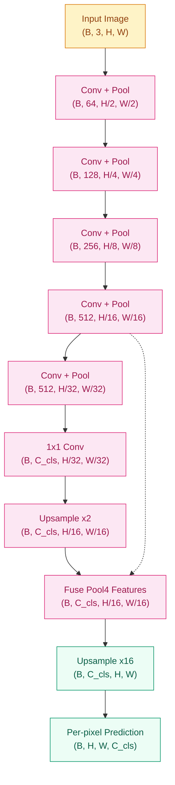
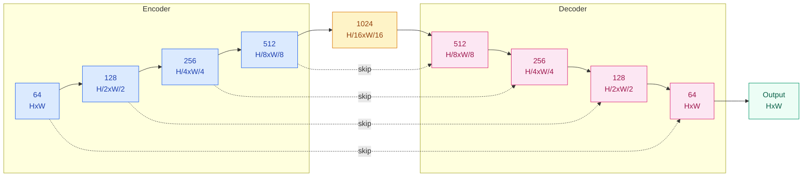
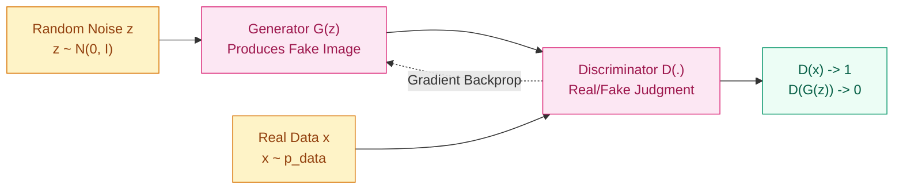

**[English](README_EN.md) | [中文](README.md)**

# Understanding Pixels or Creating Them? — Segmentation & Generation (2015–2017)

## Where Does This Question Come From?

> CNNs can already classify and detect, but classification outputs a single label and detection outputs a few bounding boxes. Reality demands finer-grained answers: autonomous driving needs to know exactly which pixels belong to the road versus the sidewalk (semantic segmentation), and medical imaging needs to trace organ boundaries pixel by pixel from CT slices. Meanwhile, Goodfellow et al. (2014) proposed GAN: if a discriminator and a generator train adversarially, can the network learn to "create" realistic images? Segmentation and generation seem to go in opposite directions — one goes from image to label, the other from noise to image — but they share the same core architecture: encoder-decoder.

Around 2015, two threads exploded simultaneously in the vision community. The segmentation thread: FCN was the first to convert a classification network into per-pixel prediction, and U-Net used skip connections to achieve stunning results on medical images. The generation thread: GAN went from a theoretical proposal to an engineering reality, DCGAN provided the first stable training recipe, and Progressive GAN pushed resolution to 1024x1024. The two threads converge at the architectural level — both need to "unfold" low-dimensional representations back into high-dimensional space, except one unfolds semantic labels and the other unfolds pixel colors.

## Learning Objectives

After completing this chapter, you should be able to answer:

1. How do FCN and U-Net convert classification networks into per-pixel prediction? What role do skip connections play?
2. Why does GAN's adversarial training framework work, and what causes training instability?
3. How does the encoder-decoder architecture serve segmentation and generation respectively?
4. What stability issues did DCGAN's engineering practices solve? Why is Progressive GAN's incremental strategy effective?

---

## 1. Intuition

### 1.1 The Intuition of Segmentation: A Coloring Game

Imagine you have a giant coloring book. The image contains streets, cars, pedestrians, trees, and sky. Your task is not to assign one label to the entire image (that's classification), nor to draw boxes around objects (that's detection), but to color every pixel correctly — road pixels gray, sky pixels blue, pedestrian pixels red. This is semantic segmentation: per-pixel classification.

The difficulty is that after multiple pooling and downsampling operations, the spatial resolution of a classification network shrinks dramatically. A 224x224 input, after five rounds of downsampling, leaves only a 7x7 feature map. How do you recover 224x224 per-pixel predictions from 7x7? This is the core problem that segmentation networks must solve.

### 1.2 The Intuition of Generation: A Painter and an Appraiser

Now consider a different scenario. There is a painter and an appraiser. The appraiser has seen many genuine paintings and can distinguish real from fake. The painter keeps creating, trying to fool the appraiser. Both improve together — the appraiser's eye becomes sharper, and the painter's works look increasingly real.

GAN's Generator is the painter, and the Discriminator is the appraiser. The Generator starts from random noise and attempts to produce images; the Discriminator must judge whether an image is real data or a fake produced by the Generator. The training goal is to reach Nash equilibrium: the Generator's images are indistinguishable from real data, and the Discriminator can only guess randomly (outputting 0.5).

### 1.3 A Shared Architectural DNA

Both segmentation and generation need to go "from small to large": segmentation must upsample low-resolution semantic feature maps back to original resolution; generation must expand a low-dimensional noise vector into a high-dimensional image. Both employ encoder-decoder structures — the encoder compresses the input into a compact representation, and the decoder expands the compact representation into the target output.

> Key takeaway: segmentation is "classify every pixel" and generation is "sample from noise to approximate the true distribution." Both share the encoder-decoder structure; at their core, both are recovering spatial resolution.

---

## 2. Mechanisms

### 2.1 Semantic Segmentation: FCN (Fully Convolutional Networks)

The core insight of Long et al. (2015) is elegantly simple: the fully connected layers at the end of a classification network are essentially convolutions whose kernel size equals the entire feature map. If so, why not replace fully connected layers with convolutional layers directly, and then upsample back to the original resolution?

**Standard classification CNN pipeline:**
```
Input image → Conv/Pool (multiple times) → Fully connected layers → Class probabilities
```

**FCN pipeline:**
```
Input image → Conv/Pool (multiple times) → 1x1 Conv (replaces FC) → Upsample → Per-pixel class probabilities
```

The key transformation is: fully connected layers output a fixed-length vector (discarding spatial information), while 1x1 convolutions preserve spatial dimensions, outputting an H'xW'xC tensor where C is the number of classes. Then upsampling recovers the low-resolution prediction back to input resolution.

**Upsampling method — Transposed Convolution:**

Transposed convolution is also called "deconvolution" (strictly speaking, this name is imprecise). Its purpose is to "unfold" a low-resolution feature map to high resolution. An ordinary convolution has "multiple inputs contributing to one output"; transposed convolution is the reverse — "one input contributes to multiple outputs":

$$Y(i,j) = \sum_m \sum_n X(\lfloor i/s \rfloor + m,\, \lfloor j/s \rfloor + n) \cdot K(m,n)$$

where $s$ is the stride and $K$ is the kernel. Intuitively, transposed convolution "seeds" around each input pixel, then overlays the results to produce the output.

FCN also proposed the technique of **Skip Fusion**: fusing shallow, high-resolution feature maps with deep, low-resolution predictions. Shallow layers preserve spatial details, deep layers provide semantic information, and combining both yields more precise segmentation boundaries.



### 2.2 U-Net: The Symmetric Beauty of Medical Image Segmentation

Ronneberger et al. (2015) designed this for medical image segmentation. Medical images have small datasets (annotating a single CT slice requires a specialist physician) but demand extreme precision (missing one pixel could mean a missed diagnosis).

U-Net's architecture is a symmetric encoder-decoder, shaped like the letter U:

- **Encoder (left half)**: gradually downsamples, extracting increasingly abstract semantic features. Each step contains two 3x3 convolutions + ReLU, followed by 2x2 max pooling. Channel count doubles at each layer (64 -> 128 -> 256 -> 512 -> 1024).
- **Decoder (right half)**: gradually upsamples, recovering spatial resolution. Each step contains one 2x2 transposed convolution (upsampling), then concatenation with the corresponding encoder layer's feature map, followed by two 3x3 convolutions. Channel count halves at each layer.
- **Skip connections (horizontal bars)**: This is the essence of U-Net. The high-resolution feature map from each encoder layer is directly concatenated to the corresponding decoder layer. This way the decoder simultaneously has two sources of information: semantic information passed from the deep layers and spatial details preserved by the shallow layers.



The significance of skip connections goes beyond "detail supplementation." In terms of gradient flow, they provide a short-circuit path for deep networks, similar to ResNet's residual connections. But unlike ResNet, U-Net's skip connections transmit complete feature maps (not residuals), and they fuse information via concatenation rather than addition.

### 2.3 GAN: The Generative Adversarial Framework

The minimax game of Goodfellow et al. (2014) can be captured in a single objective function:

$$\min_G \max_D \; \mathbb{E}_{x \sim p_{data}}[\log D(x)] + \mathbb{E}_{z \sim p_z}[\log(1 - D(G(z)))]$$

What is this formula saying?

- **Discriminator's objective ($\max_D$)**: For real data $x$, maximize $\log D(x)$ (push output toward 1); for generated data $G(z)$, maximize $\log(1 - D(G(z)))$ (push output toward 0). Together, D tries to distinguish real from fake as accurately as possible.
- **Generator's objective ($\min_G$)**: Minimize $\log(1 - D(G(z)))$, i.e., make D as confused as possible about generated samples.

When training converges, theoretically $p_G = p_{data}$, meaning the Generator's learned distribution equals the true data distribution, at which point $D(x) = 0.5$ (outputting a coin flip for any input).

**But in practice, training GANs is extremely unstable, for three reasons:**

1. **Mode Collapse**: The Generator discovers that producing only a few types of samples is enough to fool the Discriminator, so it stops exploring other modes of the data distribution. Result: all outputs look the same. For example, if the training set has 10 digit types, the Generator might only learn to produce "1" and "7."

2. **Discriminator too strong leading to vanishing gradients**: If D is trained too well and can perfectly distinguish real from fake, then $D(G(z)) \approx 0$, and the Generator's gradient $\nabla_G \log(1 - D(G(z)))$ approaches zero. G receives no useful learning signal, and training stalls.

3. **Training oscillation**: G and D are trained alternately. If one suddenly becomes much stronger, the other cannot adapt in time, and training oscillates between two extremes without converging to Nash equilibrium.



### 2.4 DCGAN: Engineering Practices for Stable GAN Training

The contribution of Radford et al. (2015) is not a new algorithm, but rather turning GAN from "works in theory but extremely hard to tune in practice" into "follow this recipe and it works." Through extensive experiments, they distilled a set of architectural guidelines:

**Generator design principles:**
- Use transposed convolutions exclusively for upsampling, no fully connected layers
- Add BatchNorm to every layer (except the output layer, as it destabilizes sample variance)
- Use ReLU in intermediate layers, Tanh in the output layer (constraining output to [-1, 1])
- Use uniform kernel sizes of 4x4 or 5x5, stride of 2

**Discriminator design principles:**
- Use strided convolutions exclusively for downsampling, no pooling layers
- Add BatchNorm to every layer (except the input layer)
- Use LeakyReLU everywhere (slope 0.2), not ReLU (ReLU in D easily leads to sparse gradients)

**Training hyperparameters:**
- Adam optimizer, lr = 0.0002, beta1 = 0.5 (smaller than the default 0.9, reducing oscillation from momentum)
- Latent space dimension z_dim = 100
- All weights initialized from a normal distribution with mean 0 and standard deviation 0.02

DCGAN's contribution lies in demonstrating that GAN stability primarily comes from architectural choices, not more complex training algorithms. Before subsequent works like WGAN and StyleGAN appeared, DCGAN's guidelines were the standard practice for training GANs.

### 2.5 Progressive GAN: Gradually Increasing Resolution

Karras et al. (2017) solved another difficult problem for GANs: how to generate high-resolution images. Directly training a 1024x1024 GAN is nearly impossible to converge. Progressive GAN's approach is to start from low resolution and gradually increase network depth.

**Training process:**

1. First train a GAN that only generates 4x4 images. The network is shallow at this point, and training is relatively easy.
2. Once training stabilizes, add new layers to the end of both G and D, doubling the resolution to 8x8.
3. To avoid oscillation from abrupt resolution changes, new layers are not introduced all at once but blended linearly using an alpha parameter:

$$\text{output} = (1 - \alpha) \cdot \text{old layer output (upsampled)} + \alpha \cdot \text{new layer output}$$

Alpha transitions smoothly from 0 to 1; once training stabilizes, the new layer fully takes over.

4. Repeat this process: 16x16 -> 32x32 -> ... -> 512x512 -> 1024x1024.

**Why does the progressive strategy work?**

The core reason is that at low resolution stages, the network first learns the global structure of the data (rough shapes, color distributions), then gradually learns local details (textures, edges). This is analogous to how a painter first sketches then refines — outlines first, then details. If the network is required to simultaneously learn global structure and local details from the start, the optimization landscape is too complex, and it easily falls into local optima or mode collapse.

### 2.6 Neural Style Transfer (Brief)

Gatys et al. (2015) did something interesting: using feature maps from a pretrained VGG network to separate the "content" and "style" of an image, then fusing the content of one image with the style of another.

**Content Loss:**

Take the feature map from a high VGG layer (e.g., conv4_2) and compute the mean squared error between the generated image and the content image at that layer:

$$\mathcal{L}_{content} = \frac{1}{2} \sum_{i,j} (F_{ij}^l - P_{ij}^l)^2$$

High-layer feature maps capture the image's "content" — rough shapes and spatial layout.

**Style Loss:**

First, represent the style of feature maps using the Gram matrix (cross-channel correlations):

$$G_{ij}^l = \sum_k F_{ik}^l \cdot F_{jk}^l$$

Then compute the mean squared error between the generated image and the style image's Gram matrices across multiple layers. The Gram matrix discards spatial information, retaining only texture and color statistics.

**Total Loss:**

$$\mathcal{L}_{total} = \alpha \cdot \mathcal{L}_{content} + \beta \cdot \mathcal{L}_{style}$$

By adjusting the ratio of alpha to beta, you can control the balance between content fidelity and style matching in the generated image.

Style transfer itself is not a GAN, but it reveals an interesting property of CNN feature representations: feature maps at different layers encode information at different levels. Lower layers encode texture, higher layers encode semantics. This insight later influenced GAN development — StyleGAN exploits a similar layer-wise control mechanism.

### 2.7 Progressive Code Implementation

Below we implement U-Net and the DCGAN Generator step by step in PyTorch, from basic blocks to the complete network.

**Step 1 -- U-Net Basic Block:**

Each layer of U-Net consists of two 3x3 convolutions + BatchNorm + ReLU, a pattern known as the "double convolution":

```python
import torch
import torch.nn as nn

class UNetBlock(nn.Module):
    """Double conv: Conv -> BN -> ReLU x 2"""
    def __init__(self, in_ch, out_ch):
        super().__init__()
        self.block = nn.Sequential(
            nn.Conv2d(in_ch, out_ch, 3, padding=1), nn.BatchNorm2d(out_ch), nn.ReLU(inplace=True),
            nn.Conv2d(out_ch, out_ch, 3, padding=1), nn.BatchNorm2d(out_ch), nn.ReLU(inplace=True),
        )
    def forward(self, x):
        return self.block(x)
```

Each UNetBlock takes an input of `in_ch` channels and outputs a feature map of `out_ch` channels. The 3x3 convolutions with padding=1 preserve spatial dimensions. BatchNorm stabilizes gradients during training and uses running statistics at inference time.

**Step 2 -- Complete U-Net (Encoder + Decoder + Skip Connections):**

```python
class UNet(nn.Module):
    def __init__(self, in_ch=1, out_ch=1, base=64):
        super().__init__()
        # Encoder: gradual downsampling
        self.enc1 = UNetBlock(in_ch, base)          # 64 channels
        self.enc2 = UNetBlock(base, base * 2)       # 128 channels
        self.enc3 = UNetBlock(base * 2, base * 4)   # 256 channels
        self.bottleneck = UNetBlock(base * 4, base * 8)  # 512 channels

        # Decoder: upsample + concatenate + double conv
        self.up3 = nn.ConvTranspose2d(base * 8, base * 4, 2, stride=2)
        self.dec3 = UNetBlock(base * 8, base * 4)   # channel count doubles after concatenation
        self.up2 = nn.ConvTranspose2d(base * 4, base * 2, 2, stride=2)
        self.dec2 = UNetBlock(base * 4, base * 2)
        self.up1 = nn.ConvTranspose2d(base * 2, base, 2, stride=2)
        self.dec1 = UNetBlock(base * 2, base)

        self.final = nn.Conv2d(base, out_ch, 1)     # 1x1 conv maps to target channels
        self.pool = nn.MaxPool2d(2)                  # 2x2 max pooling

    def forward(self, x):
        # Encoding path
        e1 = self.enc1(x)                            # (B, 64, H, W)
        e2 = self.enc2(self.pool(e1))                 # (B, 128, H/2, W/2)
        e3 = self.enc3(self.pool(e2))                 # (B, 256, H/4, W/4)
        b  = self.bottleneck(self.pool(e3))           # (B, 512, H/8, W/8)

        # Decoding path (with skip connections)
        d3 = self.dec3(torch.cat([self.up3(b),  e3], dim=1))  # (B, 256, H/4, W/4)
        d2 = self.dec2(torch.cat([self.up2(d3), e2], dim=1))  # (B, 128, H/2, W/2)
        d1 = self.dec1(torch.cat([self.up1(d2), e1], dim=1))  # (B, 64,  H, W)

        return self.final(d1)                         # (B, out_ch, H, W)
```

Note the line `torch.cat([self.up3(b), e3], dim=1)` — this is the skip connection implementation. `self.up3(b)` upsamples the bottleneck output to the same spatial size as `e3`, then they are concatenated along the channel dimension. The concatenated channel count is the upsampled output channels plus the encoder channels, so `dec3`'s input channel count is `base * 8` (base*4 + base*4 from concatenation).

**Step 3 -- DCGAN Generator:**

```python
class DCGANGenerator(nn.Module):
    def __init__(self, z_dim=100, base_ch=64):
        super().__init__()
        self.net = nn.Sequential(
            # z_dim x 1 x 1 -> base_ch*8 x 4 x 4
            nn.ConvTranspose2d(z_dim, base_ch * 8, 4, 1, 0, bias=False),
            nn.BatchNorm2d(base_ch * 8), nn.ReLU(True),
            # base_ch*8 x 4 x 4 -> base_ch*4 x 8 x 8
            nn.ConvTranspose2d(base_ch * 8, base_ch * 4, 4, 2, 1, bias=False),
            nn.BatchNorm2d(base_ch * 4), nn.ReLU(True),
            # base_ch*4 x 8 x 8 -> base_ch*2 x 16 x 16
            nn.ConvTranspose2d(base_ch * 4, base_ch * 2, 4, 2, 1, bias=False),
            nn.BatchNorm2d(base_ch * 2), nn.ReLU(True),
            # base_ch*2 x 16 x 16 -> base_ch x 32 x 32
            nn.ConvTranspose2d(base_ch * 2, base_ch, 4, 2, 1, bias=False),
            nn.BatchNorm2d(base_ch), nn.ReLU(True),
            # base_ch x 32 x 32 -> 3 x 64 x 64
            nn.ConvTranspose2d(base_ch, 3, 4, 2, 1, bias=False),
            nn.Tanh(),  # output range [-1, 1]
        )

    def forward(self, z):
        return self.net(z.view(z.size(0), -1, 1, 1))
```

The DCGAN Generator's structure is similar to the U-Net decoder — both progressively upsample from a low-dimensional representation to a high-dimensional output. The difference is: U-Net's input is an image (compressed through the encoder), while the GAN Generator's input is random noise; U-Net has skip connections that provide spatial details, while the GAN Generator has no such auxiliary information and must rely entirely on learning the upsampling on its own.

**Step 4 -- DCGAN Discriminator:**

```python
class DCGANDiscriminator(nn.Module):
    def __init__(self, base_ch=64):
        super().__init__()
        self.net = nn.Sequential(
            # 3 x 64 x 64 -> base_ch x 32 x 32
            nn.Conv2d(3, base_ch, 4, 2, 1, bias=False),
            nn.LeakyReLU(0.2, inplace=True),
            # base_ch x 32 x 32 -> base_ch*2 x 16 x 16
            nn.Conv2d(base_ch, base_ch * 2, 4, 2, 1, bias=False),
            nn.BatchNorm2d(base_ch * 2), nn.LeakyReLU(0.2, inplace=True),
            # base_ch*2 x 16 x 16 -> base_ch*4 x 8 x 8
            nn.Conv2d(base_ch * 2, base_ch * 4, 4, 2, 1, bias=False),
            nn.BatchNorm2d(base_ch * 4), nn.LeakyReLU(0.2, inplace=True),
            # base_ch*4 x 8 x 8 -> base_ch*8 x 4 x 4
            nn.Conv2d(base_ch * 4, base_ch * 8, 4, 2, 1, bias=False),
            nn.BatchNorm2d(base_ch * 8), nn.LeakyReLU(0.2, inplace=True),
            # base_ch*8 x 4 x 4 -> 1 x 1 x 1
            nn.Conv2d(base_ch * 8, 1, 4, 1, 0, bias=False),
            nn.Sigmoid(),
        )

    def forward(self, x):
        return self.net(x).view(-1, 1).squeeze(1)
```

The Discriminator is the mirror image of the Generator: it uses strided convolutions to progressively downsample, ultimately outputting a probability between 0 and 1. Note that the first layer has no BatchNorm (per DCGAN's guidelines), and LeakyReLU is used throughout instead of ReLU.

---

## 3. Engineering Considerations

### 3.1 GAN Training Not Converging -> D Too Strong Leading to Vanishing G Gradients

**Symptom**: The Discriminator's loss rapidly approaches 0, the Generator's loss stays high, and generated images are either pure noise or completely unchanging.

**Remedies**:
- Lower the Discriminator's learning rate (e.g., set it to half of the Generator's)
- Adjust the training frequency ratio (common G:D training step ratios are 1:1 or 1:2)
- Add Dropout to the Discriminator or use label smoothing (change real labels from 1.0 to 0.9)

### 3.2 Mode Collapse -> G Only Produces a Few Types of Output

**Symptom**: Generated images look decent in quality but are all the same — for example, when generating faces, it always outputs the same person.

**Remedies**:
- Add Spectral Normalization, constraining the Lipschitz constant of each D layer
- Use Minibatch Discrimination, allowing D to see the diversity of a batch of samples
- Switch to WGAN-GP or other improved GAN loss functions

### 3.3 Blurry Segmentation Boundaries -> Upsampling Loses Details

**Symptom**: The interior regions of segmented objects are correct, but boundaries are rough, jagged, and small objects are lost.

**Remedies**:
- U-Net's skip connections are essential, do not omit them
- If necessary, add Deep Supervision: output predictions from multiple intermediate decoder layers simultaneously, using their weighted loss to assist training
- Post-processing with Conditional Random Fields (CRF) can refine boundaries, but this is a traditional approach; modern practice favors improvements in network architecture

### 3.4 GAN Evaluation Difficulties -> No Single "Accuracy" Metric

**Symptom**: GANs have no "correct answer" to compare against, and human evaluation is unreliable and non-reproducible.

**Remedies**:
- **FID (Frechet Inception Distance)** is the current mainstream metric. It uses the Inception network to extract features from real and generated images, then computes the Frechet distance between the two Gaussian distributions. Lower FID is better.
- **IS (Inception Score)** is also a useful reference; it measures the classification confidence and marginal entropy of the class distribution of generated images. Higher IS is better.
- Human evaluation remains important, but should not be the sole criterion.

> Key takeaway: GAN troubleshooting priority is training stability (is loss oscillating?) -> mode diversity (FID) -> image quality. First ensure training runs, then pursue diversity, and finally optimize details.

### 3.5 Segmentation Class Imbalance -> Small Objects Drowned Out

**Symptom**: In road scene segmentation, "road" and "sky" occupy the vast majority of the image, while "pedestrians" and "traffic signs" occupy only a few pixels. The model tends to predict all pixels as the majority class, with high overall accuracy but near-zero IoU for small classes.

**Remedies**:
- Use weighted cross-entropy loss: assign higher weights to small classes so the model pays more attention to them
- Use Dice Loss or Focal Loss: Dice Loss directly optimizes IoU-related metrics, while Focal Loss makes the model focus on hard-to-classify samples
- Oversample image patches containing small classes, or use sliding window strategies to increase the frequency of small class appearances

### 3.6 GPU Memory Management -> High-Resolution Challenges for Segmentation

**Symptom**: Segmentation requires output predictions at the same resolution as the input, while classification only outputs a vector. For a 512x512 input, the segmentation output is a 512x512xC tensor; if C=21 (PASCAL VOC classes), the label for a single image has 5.5 million values. Batch size is typically limited to 1-4.

**Remedies**:
- Use gradient accumulation to simulate larger batch sizes
- Use mixed precision training (FP16) to reduce memory usage
- Use sliding window patching during inference to process very large images

---

## 4. Key Papers and Timeline

| Year | Paper | Core Contribution |
|------|-------|-------------------|
| 2014 | Goodfellow et al. *Generative Adversarial Nets* | Proposed the GAN framework, minimax game |
| 2015 | Long et al. *Fully Convolutional Networks* | FCN, converting classification networks to per-pixel prediction |
| 2015 | Ronneberger et al. *U-Net* | Symmetric encoder-decoder + skip connections |
| 2015 | Radford et al. *DCGAN* | Architectural guidelines for stable GAN training |
| 2015 | Gatys et al. *Neural Style Transfer* | Content-style separation, Gram matrix |
| 2017 | Karras et al. *Progressive GAN* | Progressive training, 1024x1024 generation |
| 2017 | He et al. *Mask R-CNN* | Instance segmentation, unifying segmentation and detection |

---

## 5. Concept Cheat Sheet

| Concept | One-Line Explanation | Key Formula/Structure |
|---------|---------------------|----------------------|
| FCN | Replace fully connected layers with convolutions for per-pixel classification | 1x1 Conv + Upsampling |
| U-Net | Symmetric encoder-decoder, skip connections preserve details | Encoder-Decoder + Skip Concat |
| GAN | Adversarial training of generator and discriminator | Min-max game |
| DCGAN | Stable training architecture guide for GANs | Transposed Conv + BN + LeakyReLU |
| Progressive GAN | Gradually grow from low to high resolution | Progressive layer addition + alpha blending |
| Transposed Convolution | Learnable upsampling operation | One input contributes to multiple outputs |
| FID | Distance metric for generation quality | Frechet distance |
| Mode Collapse | Generator only outputs a few types of samples | Requires spectral normalization etc. |

---

## 6. Segmentation vs. Generation: Comparative Analysis

| Dimension | Semantic Segmentation (FCN/U-Net) | Image Generation (GAN/DCGAN) |
|-----------|-----------------------------------|-------------------------------|
| Task type | Discriminative (classify each pixel) | Generative (generate new samples from noise) |
| Input | Image | Random noise vector |
| Output | H x W x C segmentation map | H x W x 3 generated image |
| Loss function | Per-pixel cross-entropy | Adversarial loss (min-max game) |
| Training stability | High (standard supervised learning) | Low (adversarial training) |
| Evaluation metrics | mIoU, Pixel Accuracy | FID, IS, human evaluation |
| Data requirements | Image + pixel-level annotations (expensive) | Images only (no annotations needed) |
| Shared architecture | Encoder-decoder | Encoder-decoder (decoder only) |
| Skip connections | Critical (U-Net's core) | None (or later works like StyleGAN's adaptive) |

This comparison reveals an interesting symmetry: segmentation goes "from image to pixel labels," requiring an encoder to extract features that are then decoded into spatial outputs; generation goes "from noise to image," requiring only a decoder to unfold low-dimensional vectors into high-dimensional outputs. Both share the "decoder upsampling" operation, but their input sources are completely different.

Segmentation decoders have skip connections providing real spatial information, while generation decoders start from scratch — this is also one of the reasons why GAN training is much harder than segmentation training. Each upsampling step in segmentation has guidance from the corresponding encoder layer, while each upsampling step in GAN must be learned from scratch.

---

## 7. Exercises and Practice

### 7.1 Basic Understanding

1. **Why can FCN convert a classification network into a segmentation network?** What is the key operation? If transposed convolution is not used, what other upsampling methods are available? (Hint: bilinear interpolation)

2. **If U-Net's skip connections were changed from concatenation to addition, what would be the impact?** Analyze from three perspectives: parameter count, information capacity, and gradient flow.

3. **If GAN's Discriminator is always much stronger than the Generator, what happens to training?** What if the Generator is always much stronger than the Discriminator?

### 7.2 Hands-On Experiments

4. **Modify the UNet code**: Change `base` from 64 to 32 and observe the parameter count change. If you add another encoder-decoder layer (enc4/dec4), what condition must the input size satisfy? (Hint: must be divisible by 2 four times)

5. **GAN training monitoring**: Record the mean of `D(x)` and `D(G(z))` during the training loop. Ideally, as training progresses, what values should each converge to? If you see `D(x)` always at 0.99 and `D(G(z))` always at 0.01, what does that indicate?

6. **Checkerboard artifacts in transposed convolution**: Generate some images with the DCGAN Generator and carefully observe whether there are checkerboard-pattern artifacts. This is caused by uneven overlap due to kernel size and stride mismatches. Try changing the kernel size from 4 to 5 and observe whether the artifacts are reduced.

### 7.3 Advanced Thinking

7. **From segmentation to detection**: Mask R-CNN added a segmentation branch on top of Faster R-CNN. Why is instance segmentation harder than semantic segmentation? (Hint: different instances of the same class need to be distinguished)

8. **Why were GANs replaced by diffusion models?** Analyze GAN's limitations from three dimensions: training stability, generation diversity, and controllability. How do diffusion models solve these problems? (Will be discussed in detail in later chapters)

---

## Evolution Notes

> The segmentation thread moved from semantic segmentation to instance segmentation (Mask R-CNN, 2017) and panoptic segmentation (Panoptic Segmentation, 2019). Later, DETR (2020) used Transformers to unify detection and segmentation, and SegFormer (2021) used pure Transformers for segmentation. In 2024, SAM (Segment Anything Model) further advanced toward universal segmentation.
>
> The generation thread went from GAN to StyleGAN (2018-2019) for unconditional high-fidelity generation, and then after 2020, diffusion models (DDPM, DDIM) gradually replaced GANs as the mainstream approach for image generation. GAN's training instability and evaluation difficulties ultimately gave rise to more controllable generation paradigms.
>
> FID later became the de facto standard for evaluating image generation.
>
> Style transfer was subsequently developed by CycleGAN (2017, unpaired training) and Neural Radiance Fields (2020, 3D scene representation).
>
> The encoder-decoder idea runs throughout — from U-Net to VAE to Transformer's Encoder-Decoder, "compress then expand" is a universal paradigm in deep learning.

-> Next chapter: [Advanced GAN — From Random Noise to Precise Control](../gan-advanced/README_EN.md)

---

**Previous chapter**: [Object Detection](../object-detection/README_EN.md) | **Next chapter**: [Advanced GAN](../gan-advanced/README_EN.md)
