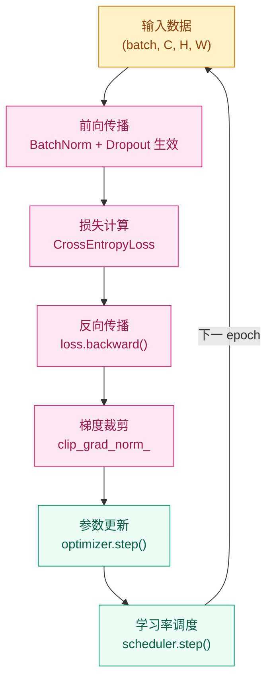

# 为什么加深网络之后训练反而变差了？—— 优化与训练稳定性

## 这个问题从哪来

> 2012 年，Krizhevsky 训练 AlexNet 时发现：加了 Dropout 和 ReLU，一个 8 层网络就能稳定跑完 ImageNet。但"为什么能稳定"当时并没有系统的答案。
> 三年后，Ioffe 和 Szegedy（2015）给出了更深一层的解释：只要每层的输入分布保持稳定，网络可以训练到任意深度——这就是 Batch Normalization。
> 这一章把 2012–2015 年间涌现的训练技巧组成一套完整的方法论。

## 学习目标

完成本章后，你应能回答：

1. Dropout、BatchNorm、权重衰减各自解决什么问题，它们能叠加使用吗？
2. 学习率调度和梯度裁剪分别在训练的哪个阶段发挥作用？
3. 当训练不稳定或 val loss 不降时，排查顺序应该是什么？

---

## 1. 直觉

想象你在学骑自行车。

如果每次练习场地的坡度、风速、路面都不一样（内部协变量偏移），你很难建立稳定的肌肉记忆。但如果每次条件一致，你的身体知道"这个力度在这种条件下会产生这个结果"，学习速度会快很多。

BatchNorm 做的事和这个完全类似：它让每一层的"输入环境"保持一致，下游层就不用每轮重新适应上游的分布变化。

而 Dropout 则像"蒙眼练习"——强迫每个神经元不能依赖其他特定神经元，学到更独立、更鲁棒的特征。

> 你要记住：BatchNorm 解决"训练不稳"，Dropout 解决"泛化不好"，两者针对不同问题，可以叠加。

---

## 2. 机制

### 2.1 训练循环全貌



### 2.2 Dropout

训练时以概率 $p$ 随机将神经元置零，推理时关闭。关键：**训练时开，推理时关**，`model.eval()` 自动切换。

> Dropout 的原理、inverted dropout 公式、变体（DropConnect / SpatialDropout / DropBlock / RNN Dropout）详见前置章节 [正则化与 Dropout](../../00-Prerequisites/regularization/README.md)。

### 2.3 Batch Normalization

对 mini-batch 的激活值做归一化，再用可学习的 $\gamma, \beta$ 恢复表达能力：

$$
\hat{x}_i = \frac{x_i - \mu_B}{\sqrt{\sigma_B^2 + \epsilon}}, \qquad
y_i = \gamma \hat{x}_i + \beta
$$

- **训练时**：用当前 batch 的均值和方差
- **推理时**：用训练期间维护的运行均值和运行方差（`model.eval()` 切换）

### 2.4 学习率调度

| 策略 | 公式直觉 | 适用场景 |
|------|---------|---------|
| StepLR | 每 N epoch 乘以衰减因子 | 传统 CV 流程 |
| CosineAnnealing | 余弦曲线从 max→min | 现代通用默认 |
| Warmup + Cosine | 先线性升到峰值，再余弦降 | Transformer / 大模型 |
| ReduceLROnPlateau | val 指标停滞时自动降 LR | 调参不确定时的保险策略 |

### 2.5 渐进式实现

**Step 1 · 最小训练循环（核心骨架，可独立运行）**

```python
# 建立可复现的最小闭环
# 验证 zero_grad → backward → step 顺序
import torch
import torch.nn as nn

torch.manual_seed(42)

model = nn.Sequential(nn.Linear(16, 32), nn.ReLU(), nn.Linear(32, 10))
optimizer = torch.optim.SGD(model.parameters(), lr=0.01)
loss_fn = nn.CrossEntropyLoss()

x = torch.randn(32, 16)
y = torch.randint(0, 10, (32,))

logits = model(x)              # 前向
loss = loss_fn(logits, y)      # 计算损失

optimizer.zero_grad()          # 清除上一步梯度
loss.backward()                # 反向传播
optimizer.step()               # 参数更新

print(f"loss: {loss.item():.4f}")
```

**Step 2 · 加入正则化（Dropout + BatchNorm）**

```python
# BatchNorm 稳定训练；Dropout 防止神经元共适应
# train() / eval() 模式切换影响两者行为
import torch
import torch.nn as nn

torch.manual_seed(42)


class RegularizedNet(nn.Module):
    """RegularizedNet · 01-Visual-Intelligence/training · BN+Dropout 示例 · 依赖: torch"""

    def __init__(self, in_dim: int = 16, hidden: int = 64, n_class: int = 10):
        super().__init__()
        self.net = nn.Sequential(
            nn.Linear(in_dim, hidden),
            nn.BatchNorm1d(hidden),   # 稳定每层输入分布
            nn.ReLU(),
            nn.Dropout(0.3),          # 抑制共适应
            nn.Linear(hidden, n_class),
        )

    def forward(self, x: torch.Tensor) -> torch.Tensor:
        """Args: x (batch, in_dim) → returns logits (batch, n_class)"""
        return self.net(x)


model = RegularizedNet()
optimizer = torch.optim.AdamW(model.parameters(), lr=1e-3, weight_decay=1e-2)
loss_fn = nn.CrossEntropyLoss()

x, y = torch.randn(32, 16), torch.randint(0, 10, (32,))

model.train()
logits = model(x)
loss = loss_fn(logits, y)

optimizer.zero_grad()
loss.backward()
optimizer.step()

# 推理模式：BN 用运行统计，Dropout 关闭
model.eval()
with torch.no_grad():
    val_logits = model(x)
```

**Step 3 · 加入梯度裁剪和学习率调度**

```python
# 梯度裁剪防止爆炸；Warmup+Cosine 是现代标准调度
import torch
import torch.nn as nn
from torch.optim.lr_scheduler import LinearLR, CosineAnnealingLR, SequentialLR

torch.manual_seed(42)

WARMUP_STEPS = 100
TOTAL_STEPS  = 1000
MAX_GRAD_NORM = 1.0

model = nn.Sequential(
    nn.Linear(16, 64), nn.BatchNorm1d(64), nn.ReLU(), nn.Dropout(0.3),
    nn.Linear(64, 10),
)
optimizer = torch.optim.AdamW(model.parameters(), lr=1e-3, weight_decay=1e-2)
loss_fn = nn.CrossEntropyLoss()

warmup = LinearLR(optimizer, start_factor=0.01, end_factor=1.0, total_iters=WARMUP_STEPS)
cosine = CosineAnnealingLR(optimizer, T_max=TOTAL_STEPS - WARMUP_STEPS, eta_min=1e-6)
scheduler = SequentialLR(optimizer, schedulers=[warmup, cosine], milestones=[WARMUP_STEPS])

x, y = torch.randn(32, 16), torch.randint(0, 10, (32,))

model.train()
logits = model(x)
loss = loss_fn(logits, y)

optimizer.zero_grad()
loss.backward()
nn.utils.clip_grad_norm_(model.parameters(), MAX_GRAD_NORM)  # 裁剪后再 step
optimizer.step()
scheduler.step()

print(f"loss: {loss.item():.4f}  lr: {scheduler.get_last_lr()[0]:.2e}")
```

**Step 4 · 生产级（完整 epoch 循环 + 早停 + 检查点）**

```python
# 完整闭环：train/val 分离 + early stopping + 最优模型保存
# train() / eval() 切换是 BatchNorm 和 Dropout 正确工作的前提
import torch
import torch.nn as nn
from torch.utils.data import DataLoader, TensorDataset
from torch.optim.lr_scheduler import CosineAnnealingLR

torch.manual_seed(42)

BATCH, IN_DIM, N_CLASS = 32, 16, 10
NUM_EPOCHS, PATIENCE = 20, 5
MAX_GRAD_NORM = 1.0


class Net(nn.Module):
    """Net · 01-Visual-Intelligence/training · 生产级训练示例 · 依赖: torch"""

    def __init__(self, in_dim: int, n_class: int):
        super().__init__()
        self.net = nn.Sequential(
            nn.Linear(in_dim, 64), nn.BatchNorm1d(64), nn.ReLU(), nn.Dropout(0.3),
            nn.Linear(64, n_class),
        )
        for m in self.modules():
            if isinstance(m, nn.Linear):
                nn.init.kaiming_normal_(m.weight, nonlinearity="relu")
                nn.init.zeros_(m.bias)

    def forward(self, x: torch.Tensor) -> torch.Tensor:
        """Args: x (batch, in_dim) → returns logits (batch, n_class)"""
        return self.net(x)


def run_epoch(model, loader, loss_fn, optimizer=None):
    is_train = optimizer is not None
    model.train() if is_train else model.eval()
    total_loss, correct, n = 0.0, 0, 0
    for x, y in loader:
        with torch.set_grad_enabled(is_train):
            logits = model(x)
            loss = loss_fn(logits, y)
        if is_train:
            optimizer.zero_grad()
            loss.backward()
            nn.utils.clip_grad_norm_(model.parameters(), MAX_GRAD_NORM)
            optimizer.step()
        total_loss += loss.item() * y.size(0)
        correct += (logits.argmax(1) == y).sum().item()
        n += y.size(0)
    return total_loss / n, correct / n


# 数据
x_all = torch.randn(400, IN_DIM)
y_all = torch.randint(0, N_CLASS, (400,))
train_loader = DataLoader(TensorDataset(x_all[:320], y_all[:320]), batch_size=BATCH, shuffle=True)
val_loader   = DataLoader(TensorDataset(x_all[320:], y_all[320:]), batch_size=BATCH)

model = Net(IN_DIM, N_CLASS)
optimizer = torch.optim.AdamW(model.parameters(), lr=1e-3, weight_decay=1e-2)
scheduler = CosineAnnealingLR(optimizer, T_max=NUM_EPOCHS, eta_min=1e-6)
loss_fn = nn.CrossEntropyLoss()

best_val_acc, bad_epochs = 0.0, 0
for epoch in range(NUM_EPOCHS):
    tr_loss, tr_acc = run_epoch(model, train_loader, loss_fn, optimizer)
    val_loss, val_acc = run_epoch(model, val_loader, loss_fn)
    scheduler.step()

    if val_acc > best_val_acc:
        best_val_acc, bad_epochs = val_acc, 0
        torch.save({"epoch": epoch, "state_dict": model.state_dict()}, "best.pth")
    else:
        bad_epochs += 1
        if bad_epochs >= PATIENCE:
            print(f"早停于 epoch {epoch+1}")
            break

    print(f"[{epoch+1:02d}] train_acc={tr_acc:.3f}  val_acc={val_acc:.3f}  lr={scheduler.get_last_lr()[0]:.2e}")
```

---

## 3. 工程陷阱

优先级从高到低：

1. **忘记 `zero_grad()`** → 梯度在每个 batch 上累积，等效学习率随步数爆增
   处置：`optimizer.zero_grad()` 紧接在 `loss.backward()` 之前

2. **train/eval 模式未切换** → BatchNorm 在推理时使用当前 batch 统计而非运行统计；Dropout 在推理时仍生效
   处置：推理前 `model.eval()`，训练时 `model.train()`，这是最易漏最难 debug 的错误之一

3. **学习率设错** → 过大：loss 震荡/爆炸；过小：训练极慢或陷入鞍点
   处置：先试 `1e-3`（AdamW），看前 10 个 batch 的 loss 是否平稳下降

4. **梯度爆炸** → loss 突然变 NaN 或极大值
   处置：加 `clip_grad_norm_(model.parameters(), 1.0)` 在 `backward()` 后、`step()` 前

5. **Dropout 比例不当** → 过高（>0.5）可能让浅层网络欠拟合，CNN 中 Dropout 通常只加在全连接层
   处置：从 0.2–0.3 起步，验证集表现决定是否调整

> 你要记住：先确认 `zero_grad → backward → step` 顺序和 `train/eval` 切换无误，再去查超参数。这两处错误覆盖了 60% 以上的"莫名其妙不收敛"问题。

---

## 演进笔记

> **这一技术的遗产**：Dropout + BatchNorm + Adam 组合让深层网络的训练变得可靠，但它们解决的是"全连接层的训练稳定性"。图像数据有一个朴素的先验——相邻像素高度相关，远处像素几乎无关。用全连接层处理图像，每个像素连接所有参数，既浪费又忽略了这个先验。
>
> 这个问题催生了 CNN：用局部卷积核捕捉空间结构，让视觉模型的参数量从百万降到可控。

→ 下一章：[CNN 架构 — 为什么全连接网络处理图像太浪费了？](../cnn-architectures/README.md)

---

**上一章**：[深度学习基础](../../00-Prerequisites/deep-learning-basics/README.md) | **下一章**：[CNN 架构](../cnn-architectures/README.md)
