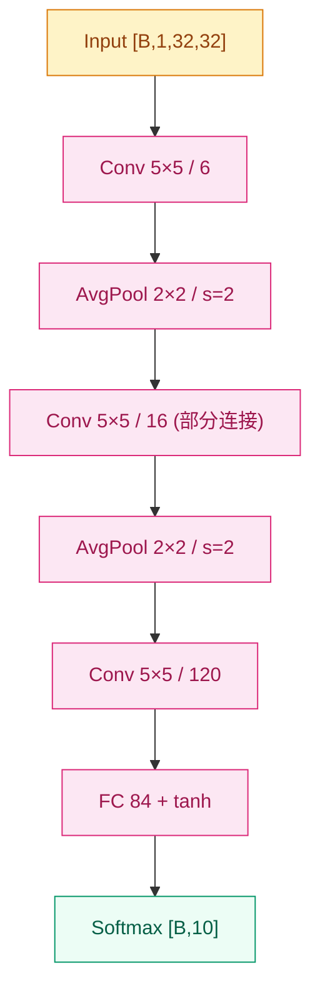

# LeNet-5 (1998)

## 之前卡在哪

LeNet 之前，处理图像的主流神经网络做法是把二维图像**压平成一维向量**，再喂给多层感知机（MLP）。这条路看起来直接，但代价巨大：一旦把 32×32 的图像拉平成 1024 维向量，**像素的二维邻域结构就被彻底丢掉**——左上角的像素和它正右边的邻居，和它在向量末尾的某个像素，对 MLP 而言地位完全一样。

后果是双重的。第一，模型必须从零学起"哪些像素是邻居"这件事，这对小数据集几乎不可能；第二，参数量随图像尺寸**平方级**膨胀——一张 32×32 灰度图喂给一层 1024 维 hidden 的 FC，就要 100 万参数，再叠几层很快撑爆当年的算力。社区其实意识到了这个问题，但在 80 年代末到 90 年代初，把"二维结构"硬塞进神经网络的尝试还停留在零散原型阶段，没有一个被工业部署验证的范式。

## 核心思想

LeNet-5 给出的答案是把三件事捆在一起：**局部连接的卷积层**（共享一组小滤波器扫整张图，参数量与图像尺寸解耦）、**降采样层**（每隔一段空间分辨率减半，让感受野逐层放大）、最后再用**全连接层**做分类。整条网络端到端用[反向传播](../foundations/01-neural-network-basics/)训练——这套范式从此定义了"卷积神经网络"这个词。


*图 1：LeNet-5 主干（C1 → S2 → C3 → S4 → C5 → F6 → output）。*

具体到形状：输入是 32×32 的灰度图（MNIST 实际是 28×28，论文做了 zero-pad 到 32），经过 C1 得到 6@28×28 的特征图，S2 平均池化降到 6@14×14，C3 升到 16@10×10，S4 再降到 16@5×5，C5 用 5×5 卷积把空间维度压成 1×1 共 120 维，F6 是 84 维全连接，最后输出 10 类。卷积核统一是 5×5，激活函数是 [tanh](../foundations/02-activations/)（当年 ReLU 还没出现），降采样层用的是**平均池化**（不是后来流行的 max pool）。

卷积层的核心数学是在二维平面共享一组小滤波器：

$$
y_{i,j,k} = \sum_{c,u,v} w_{c,u,v,k} \cdot x_{i+u,\, j+v,\, c} + b_k
$$

参数数量只取决于卷积核大小和通道数，**与输入图像的空间尺寸完全解耦**。这是为什么 LeNet-5 全网只有约 **60K 参数**——对比 14 年后的 AlexNet 60M 参数，差了 1000 倍。

> 你要记住：LeNet 真正的贡献不是"把 MNIST 跑到 0.95% 错误率"，而是**第一次把卷积+池化+全连接 + 反向传播这套组合作为一个完整范式提出来**。后来 20 多年的视觉 CNN，骨架都是这一套。

有两个细节值得单独点名。第一，C3 层并不是把 6 个输入通道全连到 16 个输出通道，而是用了一张**部分连接表**——16 个输出里有 10 个只看前面 6 通道的某个子集。这是当年为省参数和打破对称性手工设计的，今天的代码里早就不写了，但它是"分组卷积"思想的远祖。第二，原始论文的输出层不是 softmax，而是 **RBF（径向基）单元** + MSE 变体损失——每个类别对应一个 84 维的"原型向量"，输出是和原型的欧氏距离。今天的教科书实现都把它换成了普通的 softmax + 交叉熵，效果几乎一样而代码简单太多。

LeNet 当年部署在美国邮政编码识别和银行支票识别系统里，论文报告 MNIST 测试错误率 0.95%——在那个年代已经相当惊艳。但 LeNet 并没有立刻改写视觉社区的研究主线：90 年代末到 2000 年代中，**SVM + 手工特征** 的风头一度盖过神经网络，CNN 这条路安静了十多年，直到 [AlexNet](02-alexnet.md) 才被重新点亮。当时卡住的不是算法本身，而是**数据规模和算力**——手写数字勉强够，自然图像就远远不够；CPU 训练几层 CNN 也太慢。

## 关键代码

下面这段框出 LeNet-5 的主干（C1 → S2 → C3 → S4 → C5 → F6 → output），激活按论文原版用 tanh，输出层用普通全连接代替原始 RBF：

```python
import torch
import torch.nn as nn

class LeNet5(nn.Module):
    def __init__(self, num_classes: int = 10):
        super().__init__()
        self.features = nn.Sequential(
            nn.Conv2d(1, 6, kernel_size=5),          # [B,6,28,28]
            nn.Tanh(),
            nn.AvgPool2d(kernel_size=2, stride=2),   # [B,6,14,14]
            nn.Conv2d(6, 16, kernel_size=5),         # [B,16,10,10]
            nn.Tanh(),
            nn.AvgPool2d(kernel_size=2, stride=2),   # [B,16,5,5]
            nn.Conv2d(16, 120, kernel_size=5),       # [B,120,1,1]
            nn.Tanh(),
        )
        self.classifier = nn.Sequential(
            nn.Linear(120, 84), nn.Tanh(),
            nn.Linear(84, num_classes),              # 原版是 RBF + MSE
        )

    def forward(self, x: torch.Tensor) -> torch.Tensor:
        x = self.features(x)
        x = torch.flatten(x, 1)
        return self.classifier(x)
```

约 60K 参数，单卡几分钟可在 MNIST 上跑到 ~99% 准确率。

## 影响 / 后续

LeNet-5 的历史地位不在性能数字上，而在**范式**——卷积、池化、层级特征、端到端反传，这四件事第一次被同一张网络同时演示。后续 20 年的视觉 CNN 不论怎么改深度、宽度、连接方式，骨架基本都是 LeNet 的延伸。但 LeNet 本身也留下了局限：网络只有 7 层左右、激活是会饱和的 tanh、没有任何正则化手段、所有实验都跑在像 MNIST 这样的小灰度图上——一旦尺度扩到自然图像和千类分类，每一项都要重新被解决。

这个洞要等到 14 年后 [AlexNet](02-alexnet.md) 才被一次性补上：深度从 7 层放大到 8 层并把宽度扩大 1000 倍，把 tanh 换成 ReLU，加上 Dropout 和 GPU 训练，第一次让 CNN 在 ImageNet 上**稳定碾压手工特征**。

→ [02-alexnet.md](02-alexnet.md) · 把这套范式放大 1000 倍并加上 GPU / ReLU / Dropout，第一次跑赢手工特征
→ [../foundations/01-neural-network-basics/](../foundations/01-neural-network-basics/) · 反向传播是 LeNet 端到端训练的支柱
→ [../foundations/02-activations/](../foundations/02-activations/) · tanh 是 LeNet 的默认激活，后来被 ReLU 取代
