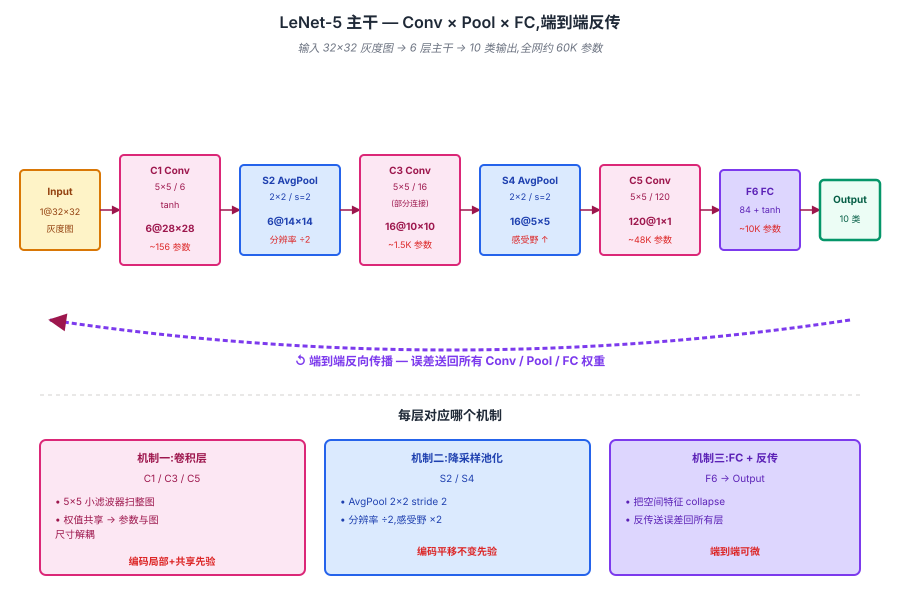
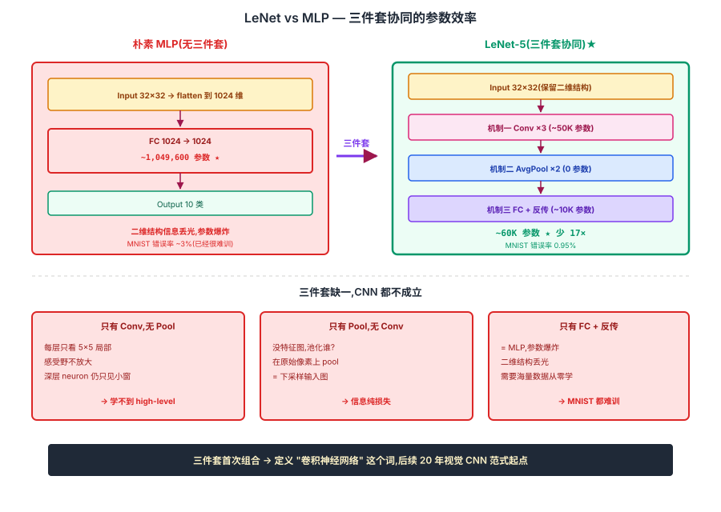

# LeNet-5 (1998)

## 前作进展

LeNet 之前，处理图像的主流神经网络做法是把二维图像压平成一维向量，再喂给多层感知机（MLP）。这种处理方式存在两个明显问题：第一，将 32×32 图像拉平成 1024 维向量后，像素的二维邻域结构信息丢失——MLP 中每个输入维度地位等价，需要从零学习"哪些像素互为邻居"；第二，参数量随图像尺寸平方级膨胀——一张 32×32 灰度图喂给一层 1024 维 hidden 的 FC 层即需约 100 万参数。

80 年代末到 90 年代初，已有若干工作探索将二维结构纳入神经网络（如 Fukushima 的 Neocognitron, 1980；早期权重共享网络），但缺少一个端到端、可工业部署的完整范式。

## 核心思想

### 直觉

90 年代之前处理图像的 MLP 范式有两个绕不开的硬伤:**把二维图像拉平成一维向量丢掉了像素的邻域结构**(网络要从零学习"哪些像素互为邻居"),**参数量随图像尺寸平方膨胀**(32×32 接 1024 维 FC 就要 ~100 万参数)。

LeCun 的洞察:**图像的两个先验先用结构编码进网络,再让反传去学剩下的**——一是"局部相关性"(相邻像素相关、远处像素无关),二是"平移不变性"(数字 7 在哪都是 7)。前者用**局部连接 + 权值共享的卷积**编码,后者用**降采样池化**编码,最后再用**全连接分类头**收尾,整条网络端到端反传训练。

但这三件事必须**同时上**才能 work:

1. **卷积层** —— 把"局部+共享"先验写进结构,让参数与图像尺寸解耦
2. **降采样层** —— 感受野逐层放大,让深层 neuron 看到更大空间范围
3. **全连接分类头 + 端到端反传** —— 把空间特征 collapse 成类别 logits,反传把误差送回前面所有层

→ 三机制首次组合,定义了"卷积神经网络"这个词,**60K 参数在 MNIST 上达到 0.95% 错误率**。整体流水线见图 1。



### 机制一:局部连接卷积层 — 参数与图像尺寸解耦

卷积层的核心数学是在二维平面共享一组小滤波器:

$$
y_{i,j,k} = \sum_{c,u,v} w_{c,u,v,k} \cdot x_{i+u,\, j+v,\, c} + b_k
$$

参数数量只取决于卷积核大小和通道数,**与输入图像的空间尺寸完全解耦**。这是为什么 LeNet-5 全网只有约 **60K 参数**——同样输入接 MLP 的话光第一层就要 100 万参数,LeNet 整网比 MLP 第一层还少一个量级。

具体到形状:输入是 32×32 灰度图(MNIST 实际是 28×28,论文做了 zero-pad 到 32),经过 C1 得到 6@28×28 的特征图,卷积核统一是 5×5,激活函数是 [tanh](../foundations/02-activations/)(当年 ReLU 还没出现)。

### 机制二:平均池化降采样 — 感受野逐层放大

S2 平均池化把 6@28×28 降到 6@14×14,S4 把 16@10×10 降到 16@5×5。每经过一次池化:

- 空间分辨率减半,计算量降 4×
- **感受野放大** —— 深层 neuron 在原图上能"看到"的范围倍增

LeNet 用的是**平均池化**(不是后来流行的 max pool)。降采样层是把"平移不变性"先验编码进网络的关键——小幅度像素位移对池化输出影响很小。

### 机制三:全连接分类头 + 端到端反传

C5 用 5×5 卷积把空间维度压成 1×1 共 120 维,F6 是 84 维全连接,最后输出 10 类。

整条网络从输入图到输出 logits **完全可微**,误差通过反向传播一次性送回所有卷积 / 池化 / 全连接层的权重——这是 LeNet 区别于早期 Neocognitron 等"非端到端"工作的关键。

### 三件套协同 — 缺一不可

> **卷积写"局部+共享"先验 + 池化写"平移不变"先验 + 全连接 + 端到端反传** —— 三者缺一,CNN 都不成立。

- 只有 **卷积**:没池化感受野不够,深层 neuron 只看到原图的小窗口,学不到 high-level 结构
- 只有 **池化**:没卷积特征,池化谁也没意义(池化是特征图的池化,不是原始像素)
- 只有 **FC + 反传**:就是 MLP,1024 维输入 100 万参数,二维结构信息丢光,在 MNIST 上也跑不到 1%

三件套首次组合,LeNet 60K 参数 0.95% 错误率,定义后续 20 年 CNN 范式。见图 2 与 MLP 的参数 / 性能对比。



### 历史细节

有两个细节值得单独点名。第一,C3 层并不是把 6 个输入通道全连到 16 个输出通道,而是用了一张**部分连接表**——16 个输出里有 10 个只看前面 6 通道的某个子集。这是当年为省参数和打破对称性手工设计的,今天的代码里已不常使用,但它可视作"分组卷积"思想的早期形态。第二,原始论文的输出层不是 softmax,而是 **RBF(径向基)单元** + MSE 变体损失——每个类别对应一个 84 维的"原型向量",输出是和原型的欧氏距离。今天的教科书实现都把它换成了普通的 softmax + 交叉熵,效果接近而代码简洁得多。

LeNet 当年部署在美国邮政编码识别和银行支票识别系统里,论文报告 MNIST 测试错误率 0.95%。90 年代末到 2000 年代中期,SVM + 手工特征在视觉任务上取得更广泛应用,CNN 路线进展相对缓慢,直到 [AlexNet](02-alexnet.md) 才再度成为主流。这一时期的主要约束并非算法本身,而是**数据规模和算力**——手写数字数据集规模有限,自然图像数据集尚未成型;CPU 训练深层 CNN 速度受限。

## 关键代码

下面这段框出 LeNet-5 的主干（C1 → S2 → C3 → S4 → C5 → F6 → output），激活按论文原版用 tanh，输出层用普通全连接代替原始 RBF：

```python
import torch
import torch.nn as nn

class LeNet5(nn.Module):
    def __init__(self, num_classes: int = 10):
        super().__init__()
        self.features = nn.Sequential(
            nn.Conv2d(1, 6, kernel_size=5),          # [B,6,28,28]
            nn.Tanh(),
            nn.AvgPool2d(kernel_size=2, stride=2),   # [B,6,14,14]
            nn.Conv2d(6, 16, kernel_size=5),         # [B,16,10,10]
            nn.Tanh(),
            nn.AvgPool2d(kernel_size=2, stride=2),   # [B,16,5,5]
            nn.Conv2d(16, 120, kernel_size=5),       # [B,120,1,1]
            nn.Tanh(),
        )
        self.classifier = nn.Sequential(
            nn.Linear(120, 84), nn.Tanh(),
            nn.Linear(84, num_classes),              # 原版是 RBF + MSE
        )

    def forward(self, x: torch.Tensor) -> torch.Tensor:
        x = self.features(x)
        x = torch.flatten(x, 1)
        return self.classifier(x)
```

约 60K 参数，单卡几分钟可在 MNIST 上跑到 ~99% 准确率。

## 影响 / 后续

LeNet-5 的历史地位在于**范式**——卷积、池化、层级特征、端到端反传四要素首次在同一张网络中同时出现并完成训练。后续 20 年的视觉 CNN 不论如何调整深度、宽度、连接方式，骨架基本沿用 LeNet 的延伸。LeNet 自身的局限也很明确：网络仅约 7 层、激活函数使用会饱和的 tanh、未引入正则化手段、所有实验仅在 MNIST 这类小灰度图上完成——一旦扩展到自然图像和千类分类，每一项都需要重新设计。

这些问题在 14 年后由 [AlexNet](02-alexnet.md) 较为系统地处理：深度从 7 层扩展到 8 层、宽度扩大约 1000 倍、tanh 替换为 ReLU、引入 Dropout 与 GPU 训练，使 CNN 在 ImageNet 上的性能首次超越手工特征方法。

→ [02-alexnet.md](02-alexnet.md) · 把这套范式放大 1000 倍并加上 GPU / ReLU / Dropout，第一次跑赢手工特征
→ [../foundations/01-neural-network-basics/](../foundations/01-neural-network-basics/) · 反向传播是 LeNet 端到端训练的支柱
→ [../foundations/02-activations/](../foundations/02-activations/) · tanh 是 LeNet 的默认激活，后来被 ReLU 取代
