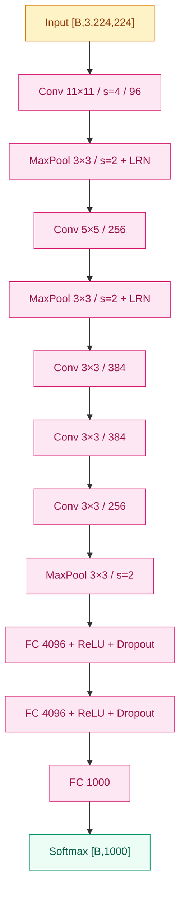

# AlexNet (2012)

## 之前卡在哪

2012 年之前，图像识别的主流是 SIFT、HOG 这类**人手设计的局部特征** + SVM 这种线性/核分类器。ImageNet 这种规模的视觉竞赛，多年来 Top-5 错误率卡在 25–26% 之间寸步难行——每年的进展更多靠特征工程的拼凑，而不是真正的能力跃迁。

神经网络这条路，社区其实没忘——[反向传播](../foundations/01-neural-network-basics/)早在 80 年代就被提出过，LeNet-5 也跑通过手写数字。但深一点的网络一上来就遇到三个看上去无解的麻烦：

- **算力**：训练几百万张 224×224 的图像，CPU 算力差几个数量级
- **过拟合**：参数量到千万级，没有正则手段，几乎必然过拟合
- **梯度**：Sigmoid/Tanh 这类饱和激活让深层梯度迅速衰减

主流观点是：神经网络这条路在视觉上"很可能永远比不过手工特征"。AlexNet 出现之前的几年，几乎没有 vision 大会论文严肃地把 CNN 当 baseline。

## 核心思想

AlexNet 不是某一个新想法的胜利，而是**一组耦合招式**第一次被同时拿出来：8 层卷积/全连接（5 conv + 3 fc）+ [ReLU 激活](../foundations/02-activations/) + [Dropout](../foundations/07-regularization/) + 数据增强 + 双 GPU 并行训练 + 比赛级 CUDA 实现。这一组里少一样，可能都跑不出来。


*图 1：AlexNet 主干（5 conv + 3 fc），shape 与 LRN 位置标注。*

**卷积层** 在二维平面共享一组小滤波器，对像素的二维邻域关系敏感：

$$
y_{i,j,k} = \sum_{c,u,v} w_{c,u,v,k} \cdot x_{i+u,\, j+v,\, c} + b_k
$$

参数数量与图像尺寸**解耦**（只取决于卷积核与通道），相比把图像压平喂全连接，参数量降几个数量级，同时把"邻居像素更可能相关"这件事写进了结构里。

**最后一层 Softmax + 交叉熵** 把 1000 维 logits 转成概率分布并最大化对正确类的对数似然：

$$
p_k = \frac{e^{z_k}}{\sum_{j} e^{z_j}}, \quad \mathcal{L} = -\log p_{y}
$$

> 你要记住：AlexNet 真正改写游戏的不是"更深一点的 CNN"，而是**第一次证明端到端学到的特征在视觉上能稳定碾压所有手工特征**。从这一刻起，"先设计特征再分类"这条 30 年的主路死了。

ReLU 取代 Sigmoid 是另一个看似小但极其关键的改动。原本梯度在深层迅速衰减，训练几乎不收敛；换成 `max(0, x)` 后梯度在正区间恒等于 1，深网才真的能"训得动"。这条经验后来变成了所有现代视觉模型的默认配置（[激活函数演化](../foundations/02-activations/)）。

**LRN（Local Response Normalization）** —— 原始论文用 LRN 在 ReLU 之后做一种"侧向抑制"：相邻通道相互压制，让响应大的位置更突出。形式上：

$$
b_{x,y,k} = a_{x,y,k} \left/ \left( c_0 + \alpha \sum_{j=\max(0,k-n/2)}^{\min(K-1,k+n/2)} a_{x,y,j}^2 \right)^{\beta} \right.
$$

参数取 $c_0=2, n=5, \alpha=10^{-4}, \beta=0.75$。**这一层在后续工作里被快速抛弃**——VGG 与 Inception 都证明 LRN 对最终精度几乎无贡献，BatchNorm 出现后更是彻底取代了它。今天读 AlexNet 代码看到 LRN，知道是历史遗物即可，不要照抄。

**双 GPU 切分（Group Conv 的祖宗）** —— AlexNet 论文里通道维被切成两半，分别放在两块 GTX 580（每块 3 GB 显存）上跑。只有部分层（如 conv3、fc 层）跨 GPU 通信，其它层各自独立。这种切分**纯粹是显存约束下的工程妥协**，但它在后续以"分组卷积（group convolution）"的名义在 ResNeXt、MobileNet 里重生，成了高效模型的标配。今天用单卡跑 AlexNet，把通道合并即可，不必复现切分。

**感受野的累积** —— 5 个卷积层叠下来，最后一个 conv 输出位置看到的输入感受野显著扩大。粗略估算（忽略 padding 边界）：

| 层 | kernel / stride | 累积感受野（相对 input） |
|---|---|---|
| conv1 | 11/4 | 11 |
| pool1 | 3/2 | 19 |
| conv2 | 5/1 | 51 |
| pool2 | 3/2 | 67 |
| conv3 | 3/1 | 99 |
| conv4 | 3/1 | 131 |
| conv5 | 3/1 | 163 |
| pool5 | 3/2 | 195 |

最后一层每个空间位置看到的"上下文"约 195×195，已经覆盖 224 输入的大部分。

数据增强（随机裁剪、左右翻转、PCA 颜色扰动）和 Dropout（在两层 4096 维的 FC 之间）则一起把过拟合压了下去——千万级参数 + 百万级图像本来一定会过拟合，但加上这两招后训练曲线和验证曲线之间的鸿沟被缩到可以接受的范围。

## 训练细节

| 维度 | 值 |
|---|---|
| 优化器 | SGD + Momentum |
| 学习率 | 0.01，验证 loss 停滞时手动除以 10，共降 3 次 |
| 动量 | 0.9 |
| 权重衰减 | 5×10⁻⁴ |
| Dropout | p=0.5，仅 fc6 / fc7 |
| Batch size | 128 |
| Epochs | ~90 |
| 权重初始化 | N(0, 0.01²)，bias 用常数（卷积层 0，部分 fc 用 1） |

**数据增强**（在 256×256 训练图上做）：

- **随机裁剪**：从 256 中随机抠 224×224，加 5 倍数据
- **左右翻转**：再加 1 倍
- **PCA 颜色扰动**：对 ImageNet 训练集像素做 PCA，按主成分加随机扰动模拟光照变化

**测试时增强**：取中心 + 四角共 5 个 224×224 patch + 各自水平翻转，共 10 个 crop 输入网络，平均 softmax 概率。

**训练资源**：两块 GTX 580（3 GB 显存）跨卡训练，~5 天。

**ImageNet 错误率年表（Top-5）：**

| 年份 | 方法 | Top-5 错误率 |
|---|---|---|
| 2010 | NEC-UIUC（手工特征 + SVM） | 28.2% |
| 2011 | XRCE（手工特征 + Fisher Vector） | 25.8% |
| 2012 | **AlexNet 单模型** | **18.2%** |
| 2012 | **AlexNet 5-model ensemble** | **16.4%** |
| 2012 | **AlexNet 7-model + 预训练** | **15.3%** |

15.3% 这个最终上榜数字比第二名领先约 10 个百分点——这个差距让"CNN 是否真的能赢"的争论一夜终结。

## 关键代码

下面这段框出 AlexNet 的主干结构（5 conv + 3 fc + ReLU + Dropout），shape 注释标在每层旁边。LRN 与双 GPU 切分按现代实践省略：

```python
import torch
import torch.nn as nn

class AlexNet(nn.Module):
    def __init__(self, num_classes: int = 1000):
        super().__init__()
        # 5 个卷积块：渐缩空间 / 渐增通道 / 关键节点 MaxPool
        self.features = nn.Sequential(
            nn.Conv2d(3, 96, kernel_size=11, stride=4, padding=2),   # [B,96,55,55]
            nn.ReLU(inplace=True),
            nn.MaxPool2d(kernel_size=3, stride=2),                   # [B,96,27,27]
            nn.Conv2d(96, 256, kernel_size=5, padding=2),            # [B,256,27,27]
            nn.ReLU(inplace=True),
            nn.MaxPool2d(kernel_size=3, stride=2),                   # [B,256,13,13]
            nn.Conv2d(256, 384, kernel_size=3, padding=1),
            nn.ReLU(inplace=True),
            nn.Conv2d(384, 384, kernel_size=3, padding=1),
            nn.ReLU(inplace=True),
            nn.Conv2d(384, 256, kernel_size=3, padding=1),
            nn.ReLU(inplace=True),
            nn.MaxPool2d(kernel_size=3, stride=2),                   # [B,256,6,6]
        )
        # 3 个全连接：两层 4096 + Dropout，最后 1000 类
        self.classifier = nn.Sequential(
            nn.Dropout(p=0.5),
            nn.Linear(256 * 6 * 6, 4096), nn.ReLU(inplace=True),
            nn.Dropout(p=0.5),
            nn.Linear(4096, 4096), nn.ReLU(inplace=True),
            nn.Linear(4096, num_classes),
        )

    def forward(self, x: torch.Tensor) -> torch.Tensor:
        x = self.features(x)
        x = torch.flatten(x, 1)
        return self.classifier(x)
```

## 影响 / 后续

AlexNet 的成绩——Top-5 错误率 **15.3%**，比第二名（26.2%）领先 10 个百分点以上——直接让 ImageNet 2012 成了视觉社区的转折点。从这一刻起，CNN 不再是"一种 baseline"，而是**唯一 baseline**；手工特征工程作为一个研究方向迅速萎缩。

但 AlexNet 自己留下的局限同样明显。它的"深"只到 8 层，再往上叠会出现退化——训练误差先降后升，看上去像优化问题而不是过拟合。**这个洞要等到 ResNet 才被真正填上**。同时它的 11×11 大卷积、复杂双 GPU 切分、五种学习率调度、LRN 这些工程上的"原始痕迹"，在后续几年里被逐个抛弃。

→ [03-vgg.md](03-vgg.md) · 把"深 CNN"标准化成纯 3×3 堆叠，证明深度本身的价值
→ [05-resnet.md](05-resnet.md) · 用残差连接终结"再深就退化"的问题
→ [../foundations/04-normalization/](../foundations/04-normalization/) · BatchNorm 出现后训练稳定性才真正被解决（AlexNet 用的 LRN 已淘汰）
→ [../foundations/02-activations/](../foundations/02-activations/) · ReLU 取代饱和激活，是后续所有视觉模型的默认起点
