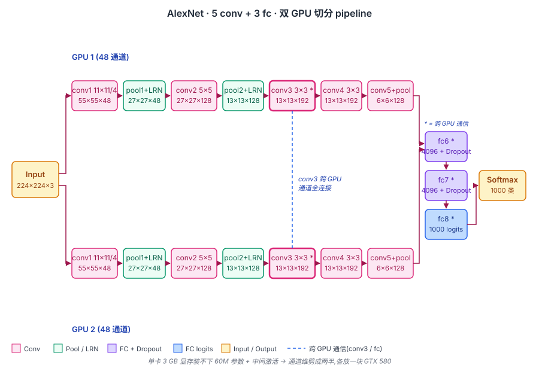
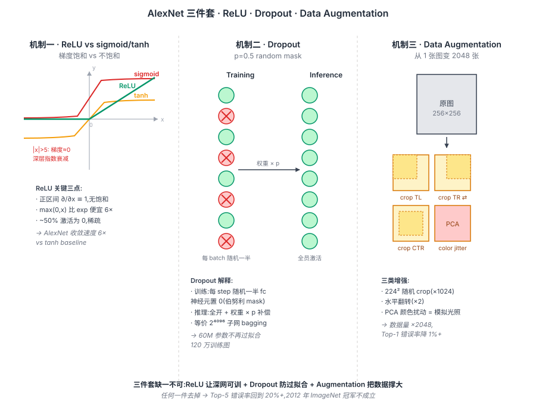

# AlexNet (2012)

## 前作进展

2012 年之前，ImageNet 大规模图像分类任务上，主流方法以 SIFT、HOG 等手工设计的局部特征结合 SVM、Fisher Vector 等分类器为主。2010–2011 年的 ILSVRC 冠军方法 Top-5 错误率维持在 25–28% 区间，年度进展主要来自特征工程的迭代。

神经网络方向的早期工作包括[反向传播](../foundations/01-neural-network-basics/)（1980 年代）与 LeNet-5（1998）在手写数字识别上的应用，但深层网络在大规模视觉任务上落地面临三类工程瓶颈：

- **算力**：训练数百万张 224×224 图像，CPU 时代算力存在数量级差距
- **过拟合**：参数量达千万级，缺少有效正则手段
- **梯度**：Sigmoid/Tanh 等饱和激活函数导致深层梯度衰减

这一时期 CNN 在主流视觉会议中较少被作为 baseline 使用。

## 核心思想

### 直觉:为什么深度 CNN 在 2012 年突然 work

CNN 不是 2012 年才发明的。LeCun 早在 1989 年就用 CNN 做手写数字识别(后来工程化为 LeNet-5),1990 年代末已部署到全美 20% 的支票自动识别。2003 年 LeCun 进一步把 CNN 推到了"通用图像识别"的尝试上。也就是说——**CNN 的核心结构(卷积 + 池化 + 反传)在 AlexNet 之前已经存在 20 多年**。那为什么 ImageNet 这种"自然图像 1000 类"的任务一直要等到 2012 年才被 CNN 攻克?

答案是**三件事在 2010-2012 同时成熟**,缺一项 AlexNet 都不存在:

- **数据**:ImageNet(Fei-Fei Li,2009)首次提供了 120 万张带标注的自然图像。在此之前 CNN 训练集普遍是 MNIST(6 万张灰度数字)、Caltech-101(9000 张)这种数据,千万级参数的网络根本"喂不饱"——给一个 60M 参数的网络看 9000 张图,等于让它把每张图背下来,过拟合是必然的
- **算力**:NVIDIA 在 2007 年发布 CUDA,2010 年起科学计算社区开始用 GPU 做矩阵乘。GTX 580(2010 年底发布)单卡 1.5 TFLOPS,比同时代顶级 CPU 快约 30 倍。Krizhevsky 自己写了一份 CUDA 卷积 kernel(后来开源为 `cuda-convnet`),把训练时间从"CPU 上几个月"压到"两块 GPU 上 5 天"
- **优化技术**:ReLU(Nair & Hinton 2010)、Dropout(Hinton 2012)、SGD + Momentum 的调参经验——这三样组合起来,首次让 8 层网络能从随机初始化稳定训出来

**前两件是外部条件,第三件是 AlexNet 自己的工程贡献**。Krizhevsky / Sutskever / Hinton 三人的功劳不是发明新结构(架构上 AlexNet 与 LeNet-5 高度同构),而是**把这三件外部条件拼成一台真正能在 ImageNet 上工作的机器**——一组工程要素的首次系统化组合:8 层 conv/fc + ReLU + Dropout + 数据增强 + 双 GPU 并行 + 比赛级 CUDA 实现。


*图 1:AlexNet 整体结构——5 conv + 3 fc,从 224×224×3 → 1000 类。**标志特性是双 GPU 切分**:通道维被劈成两半,分别放在两块 GTX 580 上,只有 conv3 与 fc 层做跨 GPU 通信(蓝色虚线)。这是 2012 年单卡 3 GB 显存约束下的工程妥协,也是"分组卷积(group convolution)"概念的早期雏形——后来被 ResNeXt、MobileNet 重新发现并发扬。*

### 机制一:ReLU 取代 sigmoid/tanh — 让深层网络可训

LeNet 时代用 sigmoid 或 tanh 作激活,在 5 层以内问题不大。但堆到 8 层时,sigmoid/tanh 会暴露三个致命问题——AlexNet 把它们一次性换成了 ReLU $\max(0, x)$。

**问题一:梯度饱和**。sigmoid 在 $|x| > 5$ 区间几乎完全平坦,导数 $\sigma'(x) = \sigma(x)(1-\sigma(x))$ 最大值仅 0.25,在 $x = \pm 5$ 时已经掉到约 $0.007$。反向传播时梯度要乘 8 层的 $\sigma'$——即便每层只取最大值 0.25,8 层下来梯度也衰减到 $0.25^8 \approx 1.5 \times 10^{-5}$,网络前几层根本"学不动"。ReLU 在正区间梯度恒为 1,8 层串起来梯度乘积仍是 1,没有任何衰减;负区间梯度为 0(死亡),但只要 ReLU 单元中至少有一半被激活,网络整体仍能稳定训练。

**问题二:计算便宜**。sigmoid 要算 $\exp$,在 2012 年 GPU 上一次 exp 的代价约等于 6 次浮点乘。ReLU 只是一个比较 + 选择,**便宜 6 倍以上**——在 60M 参数 × 上千个 step 的训练里,这个差距直接决定能不能 5 天内训完。

**问题三:稀疏激活**。ReLU 把所有负值 clamp 到 0,实际网络中约 50% 的激活值是 0。这一稀疏性既减少了后续矩阵乘的计算量,也提供了一种隐式正则——网络被迫学到"分工明确"的表征(每个 unit 只对特定模式响应),而非 sigmoid 那种"所有 unit 都被部分激活"的稠密表征。

AlexNet 论文里有一张著名的对比图:同一架构用 ReLU 比用 tanh **训练速度快约 6 倍**(达到同样的训练 error)。这一改动本身只需要改 1 行代码,但对深度学习后续 10 年的影响极大——ReLU 及其变体(LeakyReLU / PReLU / GELU)从此成为深度网络的默认激活函数。

### 机制二:Dropout — 防止 60M 参数过拟合

AlexNet 全网 60M 参数,其中 **58M 集中在两层 4096 维 FC** 上(`9216×4096 + 4096×4096 ≈ 54M`)。这是过拟合的高危区——千万级参数对应 120 万张训练图,纸面上参数量比样本量还多 50 倍,如果不做正则,网络会迅速把训练集"背下来"。

Hinton 2012 年提出 **Dropout** 正是为这个场景设计的:

- **训练时**:每个 forward,FC 层的每个神经元以概率 $p = 0.5$ 独立"被关掉"(输出乘 0),这是一个伯努利 mask。哪些被关每个 batch 都重新随机
- **推理时**:所有神经元全部打开,但每个权重乘 $p$ 作为补偿(让输出期望不变)

为什么这样能防过拟合?有两个互补解释:

**解释一:打破共适应**。如果不做 Dropout,FC 层的多个神经元很容易学到"互相依赖"的脆弱组合——比如 "unit A 永远配合 unit B 才有意义"。Dropout 每次随机干掉一半,逼迫每个神经元**独立学到有用的特征**,不能依赖固定搭档存在。

**解释二:bagging 的隐式集成**。4096 维 FC 层有 $2^{4096}$ 种可能的 mask 子集——每个 forward 实际上是在训练一个**不同的子网络**。所有这些子网共享底层参数。推理时"权重 × p"近似等于对所有子网做几何平均,等价于一次廉价的 model ensemble。

AlexNet 论文报告:**没有 Dropout 时,FC 层会严重过拟合,验证 error 比训练 error 高 5% 以上**。加了 Dropout 后,训练时间约翻倍(因为每个 step 实际只更新一半神经元),但泛化误差显著下降。这是 Dropout 第一次在大型任务上证明其价值,此后成为 2012-2017 年视觉与语音模型的标配,直到 BatchNorm 与 LayerNorm 在大模型上部分替代它的角色。

### 机制三:GPU + Data Augmentation — 让训练在 6 天内跑完

ReLU 解决了"能不能训",Dropout 解决了"训完会不会过拟合",但还有一个工程问题:**60M 参数 × 120 万张图 × 90 epoch,在 CPU 上要训几个月**——这种时间尺度上 ImageNet 比赛根本玩不起来。AlexNet 在两个维度同时硬刚这个问题。

**GPU 维度:跨卡切分 + 手写 CUDA**。一块 GTX 580 只有 3 GB 显存,装不下 AlexNet 的完整 forward(激活 + 参数 + 梯度大约要 5-6 GB)。Krizhevsky 把通道维直接劈成两半,分别放在两块 GPU 上跑。架构层面:大部分层各 GPU 独立计算,只有 conv3 和所有 fc 层做跨 GPU 通信(因为这些层需要"看全所有通道")——这个设计既绕开了显存约束,又把通信成本压到最低。同时他自己写了一份 CUDA 卷积 kernel(`cuda-convnet`),性能比当时主流的 Caffe 实现快约 2 倍。最终训练时间:**2 块 GTX 580,约 5-6 天**。

**数据维度:暴力数据增强**。120 万张图对于 60M 参数仍然不够。AlexNet 在训练时实时做三类增强,把单张图扩展成 ~2048 张:

- **随机裁剪**:原图缩到短边 256,从中随机抠 224×224 → 一张图变 $32^2 = 1024$ 种 crop
- **水平翻转**:再 ×2 = 2048 种
- **PCA 颜色扰动**:对 ImageNet 训练集所有像素做 RGB PCA,按主成分加随机扰动模拟光照变化(室内/室外/晴天/阴天)。这个 trick 把 Top-1 错误率又降了约 1%

测试时也做 10-crop(中心 + 四角 + 各自水平翻转),平均 softmax 概率。

**LRN 与今天的关系**——原论文还用了 Local Response Normalization 在 ReLU 之后做侧向抑制,贡献约 1-2% 错误率下降。但 VGG / Inception 后续消融显示 LRN 收益有限,**BatchNorm(2015)出现后 LRN 在主流工作中被替代**。今天读 AlexNet 代码看到 LRN,知作为历史实现保留即可,无需复现。


*图 2:AlexNet 的三个核心 trick。**左**:ReLU 与 sigmoid/tanh 对比——后两者在 $|x|>5$ 几乎完全饱和(梯度 ≈ 0),深层叠加会导致梯度指数衰减;ReLU 在正区间梯度恒为 1。**中**:Dropout 在训练时随机关闭一半 FC 神经元,推理时全开 + 权重 × p 作为补偿,等价于 $2^{4096}$ 个子网的 bagging。**右**:三类数据增强(随机 crop / 水平翻转 / PCA 颜色扰动)把每张图扩展成 ~2048 个变体。*

### 三件套协同:ReLU + Dropout + GPU/data 缺一不可

回到本节开头那句话:**AlexNet 真正的贡献不是任何单项技术,而是把这三件事拼到一起,让它们互相 enable 对方**。逐条拆解"少了任何一个不行":

- **少了 ReLU(用 sigmoid)** → 8 层梯度衰减到 $10^{-5}$ 量级,前几层学不动;同时训练速度慢 6 倍,即便能收敛也来不及在 ILSVRC 截止日前训完。结果:模型根本训不出有用的特征
- **少了 Dropout** → 58M 参数的两层 FC 在 120 万张图上严重过拟合,验证 error 比训练 error 高 5%+。AlexNet 论文报告这一对照实验里,Top-1 错误率会从 37.5% 上升到 ~43%——刚好就是被 SIFT+SVM baseline 超过的程度
- **少了 GPU + Data Augmentation** → CPU 上 60M 参数训 90 epoch 要数月,根本来不及参赛;同时不做增强的话,120 万张图相对 60M 参数仍偏少,泛化 error 会再差 1-2%

更深层的协同还有两点:

**ReLU 让 Dropout 更稳定**——sigmoid 网络上做 Dropout 会让"被关闭的神经元"输出 0,这个 0 经过下一层的 sigmoid 后被映射到 0.5(因为 $\sigma(0)=0.5$),并不是真正的"关闭"。ReLU 网络上 0 经过下一层后仍是 0(ReLU 对负值 clamp),Dropout 的"真正屏蔽"效果才能传递下去。

**GPU 让 Dropout 可承受**——Dropout 让训练时间约翻倍(每 step 只更新一半神经元,需要更多 step 才能收敛)。如果是 CPU 训练,Dropout 这个代价会让训练时间从几个月变成接近一年——根本不可行。只有 GPU 把每 step 的成本压到秒级,Dropout 的"训练时间 × 2"代价才能被吸收。

这就是"系统级胜利"的含义:任何一项单拎出来都已是 2010-2012 年发表过的想法,但只有 AlexNet 把它们**正确地拼在一起**,才让"深度 CNN 在 ImageNet 规模上 work"这个判断真正成立。这种"工程组合优于单点突破"的范式,在后续 ResNet(残差 + BN + He 初始化三件套)、Transformer(self-attention + 残差 + LayerNorm 三件套)中反复重演。

## 训练细节

| 维度 | 值 |
|---|---|
| 优化器 | SGD + Momentum |
| 学习率 | 0.01，验证 loss 停滞时手动除以 10，共降 3 次 |
| 动量 | 0.9 |
| 权重衰减 | 5×10⁻⁴ |
| Dropout | p=0.5，仅 fc6 / fc7 |
| Batch size | 128 |
| Epochs | ~90 |
| 权重初始化 | N(0, 0.01²)，bias 用常数（卷积层 0，部分 fc 用 1） |

**数据增强**（在 256×256 训练图上做）：

- **随机裁剪**：从 256 中随机抠 224×224，加 5 倍数据
- **左右翻转**：再加 1 倍
- **PCA 颜色扰动**：对 ImageNet 训练集像素做 PCA，按主成分加随机扰动模拟光照变化

**测试时增强**：取中心 + 四角共 5 个 224×224 patch + 各自水平翻转，共 10 个 crop 输入网络，平均 softmax 概率。

**训练资源**：两块 GTX 580（3 GB 显存）跨卡训练，~5 天。

**ImageNet 错误率年表（Top-5）：**

| 年份 | 方法 | Top-5 错误率 |
|---|---|---|
| 2010 | NEC-UIUC（手工特征 + SVM） | 28.2% |
| 2011 | XRCE（手工特征 + Fisher Vector） | 25.8% |
| 2012 | **AlexNet 单模型** | **18.2%** |
| 2012 | **AlexNet 5-model ensemble** | **16.4%** |
| 2012 | **AlexNet 7-model + 预训练** | **15.3%** |

15.3% 的最终成绩比第二名领先约 10 个百分点，是 ILSVRC 历史上的一次显著差距，也使 CNN 在大规模视觉任务上的竞争力得到广泛认可。

## 关键代码

下面这段框出 AlexNet 的主干结构（5 conv + 3 fc + ReLU + Dropout），shape 注释标在每层旁边。LRN 与双 GPU 切分按现代实践省略：

```python
import torch
import torch.nn as nn

class AlexNet(nn.Module):
    def __init__(self, num_classes: int = 1000):
        super().__init__()
        # 5 个卷积块：渐缩空间 / 渐增通道 / 关键节点 MaxPool
        self.features = nn.Sequential(
            nn.Conv2d(3, 96, kernel_size=11, stride=4, padding=2),   # [B,96,55,55]
            nn.ReLU(inplace=True),
            nn.MaxPool2d(kernel_size=3, stride=2),                   # [B,96,27,27]
            nn.Conv2d(96, 256, kernel_size=5, padding=2),            # [B,256,27,27]
            nn.ReLU(inplace=True),
            nn.MaxPool2d(kernel_size=3, stride=2),                   # [B,256,13,13]
            nn.Conv2d(256, 384, kernel_size=3, padding=1),
            nn.ReLU(inplace=True),
            nn.Conv2d(384, 384, kernel_size=3, padding=1),
            nn.ReLU(inplace=True),
            nn.Conv2d(384, 256, kernel_size=3, padding=1),
            nn.ReLU(inplace=True),
            nn.MaxPool2d(kernel_size=3, stride=2),                   # [B,256,6,6]
        )
        # 3 个全连接：两层 4096 + Dropout，最后 1000 类
        self.classifier = nn.Sequential(
            nn.Dropout(p=0.5),
            nn.Linear(256 * 6 * 6, 4096), nn.ReLU(inplace=True),
            nn.Dropout(p=0.5),
            nn.Linear(4096, 4096), nn.ReLU(inplace=True),
            nn.Linear(4096, num_classes),
        )

    def forward(self, x: torch.Tensor) -> torch.Tensor:
        x = self.features(x)
        x = torch.flatten(x, 1)
        return self.classifier(x)
```

## 影响 / 后续

AlexNet 在 ImageNet 2012 上的结果（Top-5 错误率 **15.3%**，第二名 26.2%）使 CNN 在大规模视觉任务中成为主流 baseline，手工特征工程作为主导研究方向的占比迅速下降。

AlexNet 自身也留下若干待解决问题。其网络深度仅 8 层，继续加深会出现训练误差先降后升的退化现象，属于优化问题而非过拟合，这一现象在 ResNet 中被系统处理。同时其 11×11 大卷积、双 GPU 切分、多段学习率调度、LRN 等工程实现在后续工作中陆续被简化或替换。

→ [03-vgg.md](03-vgg.md) · 把"深 CNN"标准化成纯 3×3 堆叠，验证深度对精度的贡献
→ [05-resnet.md](05-resnet.md) · 用残差连接处理深层网络的退化问题
→ [../foundations/04-normalization/](../foundations/04-normalization/) · BatchNorm 在后续工作中替代 LRN，提升训练稳定性
→ [../foundations/02-activations/](../foundations/02-activations/) · ReLU 取代饱和激活，是后续视觉模型的默认起点
