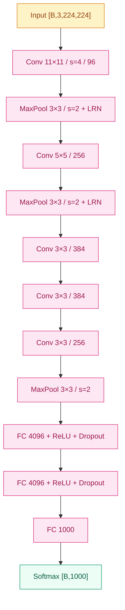

# AlexNet (2012)

## 前作进展

2012 年之前，ImageNet 大规模图像分类任务上，主流方法以 SIFT、HOG 等手工设计的局部特征结合 SVM、Fisher Vector 等分类器为主。2010–2011 年的 ILSVRC 冠军方法 Top-5 错误率维持在 25–28% 区间，年度进展主要来自特征工程的迭代。

神经网络方向的早期工作包括[反向传播](../foundations/01-neural-network-basics/)（1980 年代）与 LeNet-5（1998）在手写数字识别上的应用，但深层网络在大规模视觉任务上落地面临三类工程瓶颈：

- **算力**：训练数百万张 224×224 图像，CPU 时代算力存在数量级差距
- **过拟合**：参数量达千万级，缺少有效正则手段
- **梯度**：Sigmoid/Tanh 等饱和激活函数导致深层梯度衰减

这一时期 CNN 在主流视觉会议中较少被作为 baseline 使用。

## 核心思想

AlexNet 的贡献在于将一组工程要素首次系统化组合：8 层卷积/全连接（5 conv + 3 fc）+ [ReLU 激活](../foundations/02-activations/) + [Dropout](../foundations/07-regularization/) + 数据增强 + 双 GPU 并行训练 + 比赛级 CUDA 实现。这些要素相互依赖，缺一项都难以达到论文报告的精度。


```mermaid
graph TD
    x["Input [B,3,224,224]"]:::input
    c1["Conv 11×11 / s=4 / 96"]:::compute
    p1["MaxPool 3×3 / s=2 + LRN"]:::compute
    c2["Conv 5×5 / 256"]:::compute
    p2["MaxPool 3×3 / s=2 + LRN"]:::compute
    c3["Conv 3×3 / 384"]:::compute
    c4["Conv 3×3 / 384"]:::compute
    c5["Conv 3×3 / 256"]:::compute
    p5["MaxPool 3×3 / s=2"]:::compute
    fc6["FC 4096 + ReLU + Dropout"]:::compute
    fc7["FC 4096 + ReLU + Dropout"]:::compute
    fc8["FC 1000"]:::compute
    y["Softmax [B,1000]"]:::output

    x --> c1 --> p1 --> c2 --> p2 --> c3 --> c4 --> c5 --> p5 --> fc6 --> fc7 --> fc8 --> y

    classDef input fill:#fef3c7,stroke:#d97706,color:#92400e;
    classDef compute fill:#fce7f3,stroke:#db2777,color:#9d174d;
    classDef output fill:#ecfdf5,stroke:#059669,color:#065f46;
```
*图 1：AlexNet 主干（5 conv + 3 fc），shape 与 LRN 位置标注。*

**卷积层** 在二维平面共享一组小滤波器，对像素的二维邻域关系敏感：

$$
y_{i,j,k} = \sum_{c,u,v} w_{c,u,v,k} \cdot x_{i+u,\, j+v,\, c} + b_k
$$

参数数量与图像尺寸解耦（只取决于卷积核与通道），相比将图像压平喂全连接的方式参数量降低数个数量级，同时将"邻居像素更可能相关"这一先验直接编码进网络结构。

**最后一层 Softmax + 交叉熵** 把 1000 维 logits 转成概率分布并最大化对正确类的对数似然：

$$
p_k = \frac{e^{z_k}}{\sum_{j} e^{z_j}}, \quad \mathcal{L} = -\log p_{y}
$$

AlexNet 的核心论据是：在 ImageNet 规模的数据集上，端到端学到的特征首次系统性优于手工设计的视觉特征。这一结果标志着视觉社区从"特征工程 + 浅分类器"向"端到端表征学习"的转移。

ReLU 取代 Sigmoid 是另一个看似小但影响较大的改动。Sigmoid/Tanh 在深层网络中梯度衰减严重，训练难以收敛；ReLU `max(0, x)` 在正区间梯度恒为 1，使深层网络可以稳定训练。这一选择后续成为视觉模型的默认配置（[激活函数演化](../foundations/02-activations/)）。

**LRN（Local Response Normalization）** —— 原始论文用 LRN 在 ReLU 之后做一种"侧向抑制"：相邻通道相互压制，让响应大的位置更突出。形式上：

$$
b_{x,y,k} = a_{x,y,k} \left/ \left( c_0 + \alpha \sum_{j=\max(0,k-n/2)}^{\min(K-1,k+n/2)} a_{x,y,j}^2 \right)^{\beta} \right.
$$

参数取 $c_0=2, n=5, \alpha=10^{-4}, \beta=0.75$。**这一层在后续工作中被逐步弃用**——VGG 与 Inception 的消融结果显示 LRN 对最终精度贡献有限，BatchNorm 出现后则在主流工作中替代了它。今天读 AlexNet 代码看到 LRN，知作为历史实现保留即可，无需复现。

**双 GPU 切分（分组卷积的早期形态）** —— AlexNet 论文里通道维被切成两半，分别放在两块 GTX 580（每块 3 GB 显存）上跑。只有部分层（如 conv3、fc 层）跨 GPU 通信，其它层各自独立。这种切分是当时显存约束下的工程方案，其思路在后续以"分组卷积（group convolution）"的形式出现在 ResNeXt、MobileNet 等高效模型中。今天用单卡跑 AlexNet，把通道合并即可，不必复现切分。

**感受野的累积** —— 5 个卷积层叠下来，最后一个 conv 输出位置看到的输入感受野显著扩大。粗略估算（忽略 padding 边界）：

| 层 | kernel / stride | 累积感受野（相对 input） |
|---|---|---|
| conv1 | 11/4 | 11 |
| pool1 | 3/2 | 19 |
| conv2 | 5/1 | 51 |
| pool2 | 3/2 | 67 |
| conv3 | 3/1 | 99 |
| conv4 | 3/1 | 131 |
| conv5 | 3/1 | 163 |
| pool5 | 3/2 | 195 |

最后一层每个空间位置看到的"上下文"约 195×195，已经覆盖 224 输入的大部分。

数据增强（随机裁剪、左右翻转、PCA 颜色扰动）与 Dropout（用于两层 4096 维 FC 之间）联合控制了过拟合——千万级参数 + 百万级图像的设置下，这两类正则手段将训练与验证误差的差距控制在可接受范围内。

## 训练细节

| 维度 | 值 |
|---|---|
| 优化器 | SGD + Momentum |
| 学习率 | 0.01，验证 loss 停滞时手动除以 10，共降 3 次 |
| 动量 | 0.9 |
| 权重衰减 | 5×10⁻⁴ |
| Dropout | p=0.5，仅 fc6 / fc7 |
| Batch size | 128 |
| Epochs | ~90 |
| 权重初始化 | N(0, 0.01²)，bias 用常数（卷积层 0，部分 fc 用 1） |

**数据增强**（在 256×256 训练图上做）：

- **随机裁剪**：从 256 中随机抠 224×224，加 5 倍数据
- **左右翻转**：再加 1 倍
- **PCA 颜色扰动**：对 ImageNet 训练集像素做 PCA，按主成分加随机扰动模拟光照变化

**测试时增强**：取中心 + 四角共 5 个 224×224 patch + 各自水平翻转，共 10 个 crop 输入网络，平均 softmax 概率。

**训练资源**：两块 GTX 580（3 GB 显存）跨卡训练，~5 天。

**ImageNet 错误率年表（Top-5）：**

| 年份 | 方法 | Top-5 错误率 |
|---|---|---|
| 2010 | NEC-UIUC（手工特征 + SVM） | 28.2% |
| 2011 | XRCE（手工特征 + Fisher Vector） | 25.8% |
| 2012 | **AlexNet 单模型** | **18.2%** |
| 2012 | **AlexNet 5-model ensemble** | **16.4%** |
| 2012 | **AlexNet 7-model + 预训练** | **15.3%** |

15.3% 的最终成绩比第二名领先约 10 个百分点，是 ILSVRC 历史上的一次显著差距，也使 CNN 在大规模视觉任务上的竞争力得到广泛认可。

## 关键代码

下面这段框出 AlexNet 的主干结构（5 conv + 3 fc + ReLU + Dropout），shape 注释标在每层旁边。LRN 与双 GPU 切分按现代实践省略：

```python
import torch
import torch.nn as nn

class AlexNet(nn.Module):
    def __init__(self, num_classes: int = 1000):
        super().__init__()
        # 5 个卷积块：渐缩空间 / 渐增通道 / 关键节点 MaxPool
        self.features = nn.Sequential(
            nn.Conv2d(3, 96, kernel_size=11, stride=4, padding=2),   # [B,96,55,55]
            nn.ReLU(inplace=True),
            nn.MaxPool2d(kernel_size=3, stride=2),                   # [B,96,27,27]
            nn.Conv2d(96, 256, kernel_size=5, padding=2),            # [B,256,27,27]
            nn.ReLU(inplace=True),
            nn.MaxPool2d(kernel_size=3, stride=2),                   # [B,256,13,13]
            nn.Conv2d(256, 384, kernel_size=3, padding=1),
            nn.ReLU(inplace=True),
            nn.Conv2d(384, 384, kernel_size=3, padding=1),
            nn.ReLU(inplace=True),
            nn.Conv2d(384, 256, kernel_size=3, padding=1),
            nn.ReLU(inplace=True),
            nn.MaxPool2d(kernel_size=3, stride=2),                   # [B,256,6,6]
        )
        # 3 个全连接：两层 4096 + Dropout，最后 1000 类
        self.classifier = nn.Sequential(
            nn.Dropout(p=0.5),
            nn.Linear(256 * 6 * 6, 4096), nn.ReLU(inplace=True),
            nn.Dropout(p=0.5),
            nn.Linear(4096, 4096), nn.ReLU(inplace=True),
            nn.Linear(4096, num_classes),
        )

    def forward(self, x: torch.Tensor) -> torch.Tensor:
        x = self.features(x)
        x = torch.flatten(x, 1)
        return self.classifier(x)
```

## 影响 / 后续

AlexNet 在 ImageNet 2012 上的结果（Top-5 错误率 **15.3%**，第二名 26.2%）使 CNN 在大规模视觉任务中成为主流 baseline，手工特征工程作为主导研究方向的占比迅速下降。

AlexNet 自身也留下若干待解决问题。其网络深度仅 8 层，继续加深会出现训练误差先降后升的退化现象，属于优化问题而非过拟合，这一现象在 ResNet 中被系统处理。同时其 11×11 大卷积、双 GPU 切分、多段学习率调度、LRN 等工程实现在后续工作中陆续被简化或替换。

→ [03-vgg.md](03-vgg.md) · 把"深 CNN"标准化成纯 3×3 堆叠，验证深度对精度的贡献
→ [05-resnet.md](05-resnet.md) · 用残差连接处理深层网络的退化问题
→ [../foundations/04-normalization/](../foundations/04-normalization/) · BatchNorm 在后续工作中替代 LRN，提升训练稳定性
→ [../foundations/02-activations/](../foundations/02-activations/) · ReLU 取代饱和激活，是后续视觉模型的默认起点
