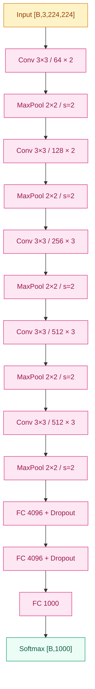

# VGG (2014)

## 之前卡在哪

[AlexNet](02-alexnet.md) 在 2012 年用 8 层 CNN 把 ImageNet Top-5 错误率从 26% 一脚踹到 15.3%，社区瞬间相信了"CNN + GPU"这条路。但**接下来该往哪走**，并没有共识。

当年的设计空间散得很：AlexNet 第一层用 11×11/s=4 的大卷积，ZFNet（2013）改成 7×7/s=2 拿到更好的精度，OverFeat 又试了别的尺寸——大家似乎默认"前几层得用大 kernel 才能看到足够大的局部"，但同时**网络深度始终卡在 8 层左右**。再往上叠会发生什么？参数量怎么控制？kernel 该多大？这些问题没人给出系统答案。

普遍的直觉是"再深一点应该会更好，但代价是参数和算力会爆炸"。VGG 之前，没有一个工作把"深度"作为**单一变量**严肃地推到极限，看看到底能走多远。

## 核心思想

VGG 的答案极其偏执：**把所有卷积统一成 3×3、stride=1、padding=1，然后往死里堆**。第一层不再是 11×11 也不是 7×7，就 3×3；池化也统一成 2×2 MaxPool / stride=2。整个网络的设计哲学缩成一句话——**用最小的卷积单元，靠堆叠拿到深度**。


*图 1：VGG-16 主干（5 个 conv block + 3 fc）。每 block 内 3×3 卷积重复 2–3 次，再 MaxPool。*

这条结构里，VGG-16 含 13 层卷积（block 内分别叠 2、2、3、3、3 次）+ 3 层全连接，VGG-19 把后三个 block 各加一层卷积。通道数沿着深度 64 → 128 → 256 → 512 → 512 翻倍再封顶，每过一个 MaxPool 空间维度减半，"空间换通道"这个习惯从 VGG 起被定型。

**为什么只用 3×3** 是整篇论文最值得反复咀嚼的地方。表面上看，3×3 视野小得可怜，怎么可能比 5×5、7×7 更好？关键不在单层，而在**堆叠**。两个 3×3 卷积叠起来，第二层的每个神经元能看到的输入区域是 5×5：

$$
\text{RF}_2 = 3 + (3 - 1) = 5
$$

三个 3×3 叠起来，感受野扩到 7×7。也就是说，从"看多大局部"这个维度看，2 个 3×3 等价于 1 个 5×5，3 个 3×3 等价于 1 个 7×7。但**参数量完全不一样**。设输入输出都是 $C$ 通道：

| 等价感受野 | 实现方式 | 参数量 |
|---|---|---|
| 5×5 | 1 层 5×5 conv | $25C^2$ |
| 5×5 | 2 层 3×3 conv | $2 \cdot 9C^2 = 18C^2$ |
| 7×7 | 1 层 7×7 conv | $49C^2$ |
| 7×7 | 3 层 3×3 conv | $3 \cdot 9C^2 = 27C^2$ |

也就是说，用 3 个 3×3 替换 1 个 7×7，**参数量降到 55%，同时网络深度增加了 2 层、ReLU 非线性多了 2 次**——既更省又更深，几乎没有代价。这是 VGG 全文的中心结论：小 kernel 堆叠是赚到的，不是省到的。

> 你要记住：VGG 真正的洞察不是"更深更好"，而是**网络的"深"和单层 kernel 的"大"是两件可以解耦的事**，而且小 kernel 堆深，比大 kernel 摊薄，参数效率更高、非线性更丰富。

整张网络的**结构极其规整**：所有卷积 3×3/s=1/p=1，所有池化 2×2/s=2，每段 block 内通道不变、跨 block 翻倍。这种"统一性（uniformity）"在 VGG 之前没有被严肃追求过——AlexNet 那种"第一层 11×11、第二层 5×5、后面 3×3"的混搭从此被淘汰，**统一的小 kernel + 模块化 block 成了所有后续视觉网络的默认起点**（Inception 的 stem 之外都是 3×3 + 1×1；ResNet 的 basic block 是两层 3×3；这种"3×3 砖头"思维直接来自 VGG）。

但 VGG 也付出了沉重代价。VGG-16 有大约 **138M 参数**，其中绝大多数堆在最后三个全连接层——尤其 fc6 把 $7 \times 7 \times 512 = 25088$ 维特征压到 4096 维，单这一层就吃掉约 **102M 参数**，占全网 74%。卷积层加起来只有 14.7M。这是一个尴尬的事实：**VGG 名义上是个"深 CNN"，但它的参数主要在 FC**。这个观察后来直接催生了 Inception 用全局平均池化替代 fc6 的设计（GoogLeNet 仅 6.8M 参数），也是 1×1 卷积降维登场的导火索。

## 训练细节

| 维度 | 值 |
|---|---|
| 优化器 | SGD + Momentum |
| 学习率 | 0.01，验证 loss 停滞时除以 10，共降 3 次 |
| 动量 | 0.9 |
| 权重衰减 | 5×10⁻⁴ |
| Dropout | p=0.5，仅 fc6 / fc7 |
| Batch size | 256 |
| Epochs | ~74 |
| 权重初始化 | 先训 VGG-11（浅版）再用其权重去初始化深版本对应层 |

VGG 的训练有几个特别值得拎出来的细节。

**先训浅版再迁移到深版** —— 在 BatchNorm 还没出现的 2014 年，直接从随机初始化训 16/19 层网络几乎跑不动，loss 会卡住。Simonyan & Zisserman 的办法是先训 VGG-11（11 层、随机初始化能跑动），训好后用它的卷积层权重去**初始化** VGG-13/16/19 中位置对应的层，新增的层随机初始化。这个"预训练浅版当种子"的笨办法暴露了当年训练深网的脆弱性——直到 [BatchNorm](../foundations/04-normalization/) 出现后，这套接力才被彻底淘汰。

**Multi-scale 训练（scale jitter）** —— 训练图先按短边长度 $S$ 缩放，再随机裁 224×224。VGG 让 $S$ 从 $[256, 512]$ 区间内随机采样，相当于让模型看到不同尺度下的物体——小尺度时物体几乎填满裁剪窗，大尺度时只裁到一部分。这是 VGG 第一次系统使用多尺度训练，后来成为目标检测和分割任务的标配数据增强。

**测试时 dense evaluation** —— 推理阶段把最后三个 FC 层**全卷积化**（fc6 变成 7×7 conv、fc7/fc8 变成 1×1 conv），整个网络就成了一个全卷积网络，可以输入任意大尺寸图像，输出一张得分图，再做空间平均得到最终分类得分。再配合多尺度推理（在多个 $Q$ 尺度上各跑一遍取平均），就是著名的 "multi-scale dense evaluation"。

**训练资源**：4 块 NVIDIA Titan Black GPU 并行，单模型训练 2–3 周。

**ImageNet 错误率（Top-5）：**

| 年份 | 方法 | Top-5 错误率 |
|---|---|---|
| 2012 | AlexNet | 15.3% |
| 2013 | ZFNet | 14.8% |
| 2014 | **VGG-16 single model** | **8.1%** |
| 2014 | **VGG ensemble** | **7.3%** |
| 2014 | GoogLeNet（冠军） | 6.7% |

7.3% 这个数字之所以重要——它**已经接近人类水平**（约 5%）。视觉社区从这一刻起开始严肃讨论"CNN 是否会饱和"。VGG 拿了 ImageNet 2014 亚军，冠军是 GoogLeNet（Inception）——但 VGG 因为结构极简、特征可迁移性强，**在工业界和学术界的实际使用频率反而长期高于 GoogLeNet**。

## 关键代码

下面这段用列表参数化 5 个 block 的通道数，nn.Sequential 嵌套出 VGG-16 的主干：

```python
import torch
import torch.nn as nn

# 每个 block 的 (重复次数, 输出通道) ——VGG-16 的配置
VGG16_CFG = [(2, 64), (2, 128), (3, 256), (3, 512), (3, 512)]


def make_block(in_c: int, out_c: int, n_conv: int) -> nn.Sequential:
    layers = []
    for i in range(n_conv):
        layers += [
            nn.Conv2d(in_c if i == 0 else out_c, out_c, kernel_size=3, padding=1),
            nn.ReLU(inplace=True),
        ]
    layers.append(nn.MaxPool2d(kernel_size=2, stride=2))
    return nn.Sequential(*layers)


class VGG16(nn.Module):
    def __init__(self, num_classes: int = 1000):
        super().__init__()
        blocks, in_c = [], 3
        for n_conv, out_c in VGG16_CFG:
            blocks.append(make_block(in_c, out_c, n_conv))
            in_c = out_c
        self.features = nn.Sequential(*blocks)          # [B,512,7,7]
        self.classifier = nn.Sequential(
            nn.Linear(512 * 7 * 7, 4096), nn.ReLU(True), nn.Dropout(0.5),   # ~102M 参数瓶颈
            nn.Linear(4096, 4096), nn.ReLU(True), nn.Dropout(0.5),
            nn.Linear(4096, num_classes),
        )

    def forward(self, x: torch.Tensor) -> torch.Tensor:
        x = self.features(x)                            # [B,512,7,7]
        x = torch.flatten(x, 1)                         # [B,25088]
        return self.classifier(x)
```

138M 参数中，`self.classifier` 第一行单层就占约 102M——这是 VGG 留给后人的最大改造空间。

## 影响 / 后续

VGG 的成绩——Top-5 错误率 **7.3%**，已逼近人类水平——是"深度本身就是性能来源"这个判断的第一个硬证据。从这之后，每一篇视觉论文都默认要回答"我比 VGG 深多少、参数省多少"。

VGG 的另一份遗产是**作为通用 backbone**。它结构极简、卷积特征质量高且通用性强，被 Faster R-CNN（检测）、SSD（检测）、Neural Style Transfer（风格迁移）、FCN（语义分割）等一票后续工作直接拿去当特征提取器。"`vgg16.features` 加载预训练权重"这一行代码在 2015–2017 年的视觉论文里出现频率高得离谱。

但 VGG 自己暴露的问题同样尖锐。第一，**参数量过大、FC 层是瓶颈**——138M 中 102M 在一层 fc6 上，这种比例显然不健康。第二，**再往深走开始失效**——VGG-19 相比 VGG-16 的增益已经微乎其微，把 VGG 思路简单堆到 30、50 层会出现训练误差先降后升的"退化"现象，而不是过拟合。第三，**没有 BatchNorm 之前训练极不稳定**，要靠"先训浅版当种子"这种工程兜底。

→ [04-inception.md](04-inception.md) · 同年用多分支 + 1×1 降维直接解决 VGG 的参数量问题，仅用 6.8M 参数拿下 ImageNet 2014 冠军
→ [05-resnet.md](05-resnet.md) · 用残差连接让"VGG 的深度路线"再上两个数量级，把 16 层推到 152 层
→ [../foundations/04-normalization/](../foundations/04-normalization/) · BatchNorm 出现后 VGG 这种深网才真正稳定训练，再不需要"先训浅版"的接力
→ [../08-vit/](../08-vit/) · 深度路线的下一个版本不是更深的 CNN，而是把"统一砖头堆叠"的思想搬到 Transformer 上
