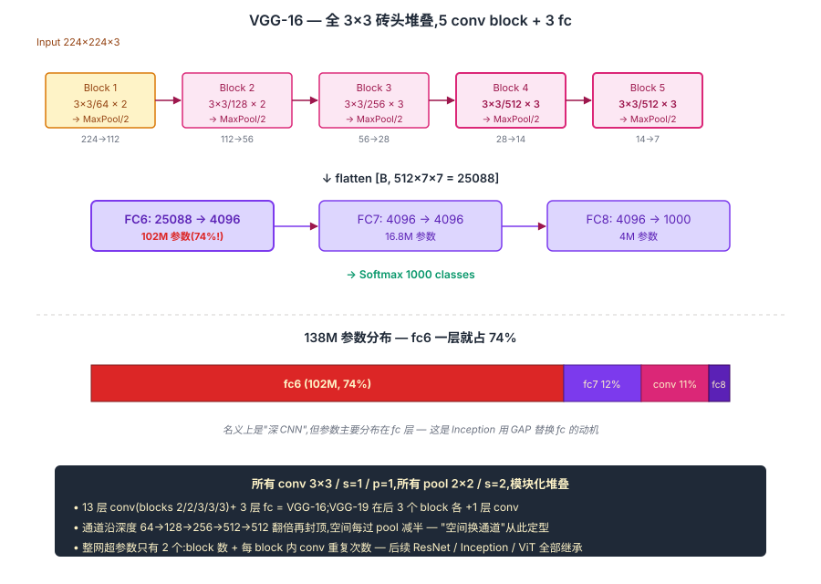
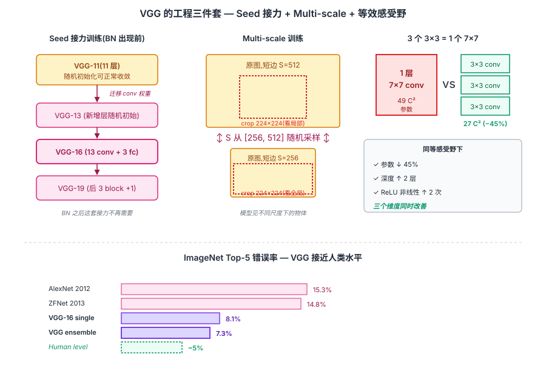

# VGG (2014)

## 前作进展

[AlexNet](02-alexnet.md) 在 2012 年用 8 层 CNN 把 ImageNet Top-5 错误率从 26% 降至 15.3%，确立了 "CNN + GPU" 作为视觉任务主流路径的地位。但 AlexNet 之后的两年里，关于"网络应当如何继续演化"的共识并未形成。

2013–2014 年的设计空间相对分散：AlexNet 第一层使用 11×11 / stride=4 的大卷积，ZFNet（2013）改为 7×7 / stride=2 取得更好精度，OverFeat 尝试其他尺寸——多数方法默认前几层需要较大 kernel 以获取足够大的感受野，同时网络深度普遍在 8 层附近。如何继续加深、参数量如何控制、kernel 大小如何选择，这些问题缺乏系统性的回答。

普遍的直觉是"更深可能带来更好性能，但参数和算力开销会显著上升"。VGG 出现之前，尚无工作将"深度"作为单一变量推进到 16/19 层这种规模，以系统比较其效果。

## 核心思想

### 直觉：把 3×3 当成"砖头"，靠堆叠拿深度而非靠大 kernel 拿感受野

理解 VGG 真正需要先抓一件事:**[AlexNet](02-alexnet.md) / ZFNet / OverFeat 之前的共识是"前几层要大 kernel 才能拿到足够感受野"**——11×11、7×7、5×5 都试过。VGG 反问:**为什么不把所有 conv 都换成最小的 3×3,通过堆叠拿到等价感受野,而且参数还更少、深度还更深、非线性还更多?**

两件事让这件事在 2014 年突然 work:

- **感受野的可叠加性** — 2 个 3×3 等价于 1 个 5×5、3 个 3×3 等价于 1 个 7×7,但参数量分别降 28% / 45%,**深度反而增加 2 层、ReLU 非线性增加 2 次**
- **预训练 seeding 让深网能训出来** — 2014 年没有 BatchNorm,随机初始化 16/19 层会不收敛;VGG 先训 11 层做 seed,再迁移权重到 16/19 层。这是 BN 出现前训深网的标准做法

把这两件事合起来:VGG 用"统一的 3×3 砖头 + 模块化 block"在 ImageNet 上拿到 Top-5 7.3%(接近 5% 人类水平),且**结构高度规整 — 所有 conv 3×3/s=1/p=1、所有 pool 2×2/s=2、每过 pool 空间减半通道翻倍**。这种 uniformity 之前没人当成设计目标,VGG 之后所有视觉网络的"砖头堆叠"思维(Inception block / ResNet basic block / ViT block)都源自这里。


*图 1:VGG-16 主干 5 个 conv block + 3 fc。每 block 内 3×3 卷积重复 2-3 次,再 MaxPool/2。通道沿深度 64→128→256→512→512 翻倍再封顶,空间 224→112→56→28→14→7 减半。底部柱状图标 138M 参数分布:fc6 一层就占 102M(74%),卷积层合计仅 14.7M — 这是后续 Inception 用 GAP 替换 fc6 的动机。*

### 机制一:3×3 砖头堆叠 — 用最小卷积单元拿等价感受野 + 更少参数

VGG 的方案非常简洁:**所有 conv 统一 3×3 / stride=1 / padding=1,所有 pool 统一 2×2 / stride=2,通过堆叠到 16/19 层**。VGG-16 包含 13 层 conv(5 个 block 内分别叠 2/2/3/3/3 次)+ 3 层 fc。

为什么只用 3×3?关键在堆叠的感受野可叠加性:

$$
\text{RF}_2 = 3 + (3 - 1) = 5,\quad \text{RF}_3 = 5 + (3 - 1) = 7
$$

设输入输出都是 $C$ 通道:

| 等价感受野 | 实现方式 | 参数量 |
|---|---|---|
| 5×5 | 1 层 5×5 conv | $25C^2$ |
| 5×5 | 2 层 3×3 conv | $18C^2$(−28%) |
| 7×7 | 1 层 7×7 conv | $49C^2$ |
| 7×7 | 3 层 3×3 conv | $27C^2$(−45%) |

**用 3 个 3×3 替换 1 个 7×7,参数降 45% 同时深度多 2 层、非线性多 2 次**——参数 / 深度 / 非线性三个维度同时改善。这是 VGG 论文的核心结论:小 kernel 堆叠全面优于大 kernel。

### 机制二:模块化 block — 同 block 内通道不变,跨 block 翻倍

VGG 把网络组织成 5 个 conv block + 3 个 fc:每 block 内通道数固定(64 / 128 / 256 / 512 / 512),跨 block 用 MaxPool/2 把空间减半,同时下一 block 通道翻倍。这种"空间换通道"的固定模式后来被 ResNet / Inception / ViT 全部继承——成为 CNN 通用设计模板。

通道翻倍的本质是**让网络在感受野扩大时容量同步增长**:每过一次 pool,空间 H×W 减小 4 倍,通道翻倍 2 倍,总特征量减半 → 计算量稳定下降;同时通道翻倍补偿了"分辨率下降导致的表达力损失"。

这种规整性还有一个工程红利:**整网超参数只有 2 个**——block 数、每 block 内的 conv 重复次数。AlexNet 那种"第一层 11×11 / 第二层 5×5 / 后面 3×3"的混合设计变得不必要,后续视觉网络的"模块化堆叠"思维直接源自 VGG。

### 机制三:预训练浅版 seeding — BN 出现前训深网的工程方案

2014 年没有 [BatchNorm](../foundations/04-normalization/),从随机初始化直接训 16/19 层 VGG 经常不收敛(梯度消失 / 损失震荡)。VGG 的解决方案是**接力训练**:

1. 先训 VGG-11(11 层,随机初始化可正常收敛)
2. 用 VGG-11 的卷积权重**初始化**对应位置的 VGG-13/16/19 层
3. 新增的层用随机初始化,在已有权重基础上继续训

加上 multi-scale 训练(短边 S 从 [256, 512] 随机采样,相当于让模型看不同尺度物体)+ test-time dense evaluation(fc 全卷积化,支持任意尺寸输入),VGG 在 ImageNet 拿到 Top-5 7.3%(ensemble),接近人类水平 5%。

**BN 出现后这套接力不再需要**——BN 直接解决了深网训练的初始化敏感性,这也是为什么 ResNet 之后没人再用 VGG 风格的 seed 训练。


*图 2:**左** seed 接力训练 — VGG-11(随机初始化能收敛)→ 迁移 conv 权重 → VGG-13 → VGG-16 → VGG-19,每代多加一层。**中** Multi-scale 训练 — 短边 S 从 [256, 512] 随机采样后裁 224×224,让模型见不同尺度。**右** 参数饼图 — fc6 一层就占 74%(102M),所有 conv 合计仅 11%(14.7M),fc7/fc8 占 15%。底部 callout:fc6 是后续 Inception 用 GAP 干掉的目标。*

### 三件套协同:3×3 砖头 + 模块化 block + 预训练 seeding 缺一不可

VGG 在 2014 年能把"加深网络"这一直觉变成实证,**不是单一改进**,而是三件套同时调到协同点 —— 任何一个抽掉 VGG 都不成立,这一点和 [ResNet](05-resnet.md) 的 `shortcut + BN + He 初始化` 协同关系一致:

- **只有 3×3 砖头,没有模块化 block** — 没有跨 block 通道翻倍 / 空间减半的规整设计,网络容量分配混乱,加深到 16 层后参数 / 算力都失控
- **只有模块化 block,没有 3×3 砖头** — 大 kernel 让参数爆炸,16 层 VGG 用 5×5/7×7 参数会膨胀到 200M+,训不起也跑不起
- **只有 3×3 + 模块化,没有预训练 seeding** — 2014 年的初始化方案让 16 层直接随机训不收敛,VGG-16 根本拿不到 7.3% 的结果

三件套合起来才让 VGG 第一次系统证明"深度本身就是性能来源",为 2015 [ResNet](05-resnet.md) 把深度推到 152 层铺平了道路。但 VGG 也留下一个明确遗产 —— **138M 参数中 74% 都在 fc6**,这成为 Inception 用 global average pooling 干掉 fc 的直接动机。

## 训练细节

| 维度 | 值 |
|---|---|
| 优化器 | SGD + Momentum |
| 学习率 | 0.01，验证 loss 停滞时除以 10，共降 3 次 |
| 动量 | 0.9 |
| 权重衰减 | 5×10⁻⁴ |
| Dropout | p=0.5，仅 fc6 / fc7 |
| Batch size | 256 |
| Epochs | ~74 |
| 权重初始化 | 先训 VGG-11（浅版）再用其权重去初始化深版本对应层 |

VGG 的训练有几个特别值得拎出来的细节。

**先训浅版再迁移到深版** —— 2014 年时 BatchNorm 尚未出现，直接从随机初始化训练 16/19 层网络容易出现 loss 不收敛。Simonyan & Zisserman 采用的方案是先训练 VGG-11（11 层，随机初始化可正常收敛），训完后用其卷积层权重**初始化** VGG-13/16/19 中位置对应的层，新增层使用随机初始化。这种"预训练浅版作为种子"的做法反映了当时训练深层网络的工程困难——[BatchNorm](../foundations/04-normalization/) 出现后，这套接力不再需要。

**Multi-scale 训练（scale jitter）** —— 训练图先按短边长度 $S$ 缩放，再随机裁 224×224。VGG 让 $S$ 从 $[256, 512]$ 区间内随机采样，相当于让模型看到不同尺度下的物体——小尺度时物体几乎填满裁剪窗，大尺度时只裁到一部分。这是 VGG 第一次系统使用多尺度训练，后来成为目标检测和分割任务的标配数据增强。

**测试时 dense evaluation** —— 推理阶段把最后三个 FC 层**全卷积化**（fc6 变成 7×7 conv、fc7/fc8 变成 1×1 conv），整个网络就成了一个全卷积网络，可以输入任意大尺寸图像，输出一张得分图，再做空间平均得到最终分类得分。再配合多尺度推理（在多个 $Q$ 尺度上各跑一遍取平均），就是著名的 "multi-scale dense evaluation"。

**训练资源**：4 块 NVIDIA Titan Black GPU 并行，单模型训练 2–3 周。

**ImageNet 错误率（Top-5）：**

| 年份 | 方法 | Top-5 错误率 |
|---|---|---|
| 2012 | AlexNet | 15.3% |
| 2013 | ZFNet | 14.8% |
| 2014 | **VGG-16 single model** | **8.1%** |
| 2014 | **VGG ensemble** | **7.3%** |
| 2014 | GoogLeNet（冠军） | 6.7% |

7.3% 这个数字已**接近人类水平**（约 5%），视觉社区开始讨论"CNN 是否会饱和"。VGG 是 ImageNet 2014 亚军，冠军是 GoogLeNet（Inception）——但 VGG 因结构简洁、特征可迁移性强，**在工业界和学术界的实际使用频率长期高于 GoogLeNet**。

## 关键代码

下面这段用列表参数化 5 个 block 的通道数，nn.Sequential 嵌套出 VGG-16 的主干：

```python
import torch
import torch.nn as nn

# 每个 block 的 (重复次数, 输出通道) ——VGG-16 的配置
VGG16_CFG = [(2, 64), (2, 128), (3, 256), (3, 512), (3, 512)]

def make_block(in_c: int, out_c: int, n_conv: int) -> nn.Sequential:
    layers = []
    for i in range(n_conv):
        layers += [
            nn.Conv2d(in_c if i == 0 else out_c, out_c, kernel_size=3, padding=1),
            nn.ReLU(inplace=True),
        ]
    layers.append(nn.MaxPool2d(kernel_size=2, stride=2))
    return nn.Sequential(*layers)

class VGG16(nn.Module):
    def __init__(self, num_classes: int = 1000):
        super().__init__()
        blocks, in_c = [], 3
        for n_conv, out_c in VGG16_CFG:
            blocks.append(make_block(in_c, out_c, n_conv))
            in_c = out_c
        self.features = nn.Sequential(*blocks)          # [B,512,7,7]
        self.classifier = nn.Sequential(
            nn.Linear(512 * 7 * 7, 4096), nn.ReLU(True), nn.Dropout(0.5),   # ~102M 参数瓶颈
            nn.Linear(4096, 4096), nn.ReLU(True), nn.Dropout(0.5),
            nn.Linear(4096, num_classes),
        )

    def forward(self, x: torch.Tensor) -> torch.Tensor:
        x = self.features(x)                            # [B,512,7,7]
        x = torch.flatten(x, 1)                         # [B,25088]
        return self.classifier(x)
```

138M 参数中，`self.classifier` 第一行单层就占约 102M——这是 VGG 主要的参数优化空间。

## 影响 / 后续

VGG 的结果——Top-5 错误率 **7.3%**，接近人类水平——为"深度本身即为性能来源"这一判断提供了实证支持。此后多年，视觉论文常以"相对 VGG 的深度与参数对比"作为基准。

VGG 的另一项贡献是**作为通用 backbone**。其结构简洁、卷积特征质量与通用性较好，被 Faster R-CNN（检测）、SSD（检测）、Neural Style Transfer（风格迁移）、FCN（语义分割）等后续工作直接用作特征提取器。"`vgg16.features` 加载预训练权重"这一用法在 2015–2017 年的视觉论文中广泛出现。

VGG 也存在几个明显的局限。第一，**参数量过大、FC 层是瓶颈**——138M 中 102M 集中在 fc6。第二，**继续加深的边际收益快速下降**——VGG-19 相比 VGG-16 的提升已经较小，把 VGG 结构简单堆叠到 30、50 层会出现训练误差先降后升的"退化"现象（不属于过拟合）。第三，**BatchNorm 尚未出现时训练不稳定**，依赖"先训浅版作为种子"的工程方案。

→ [04-inception.md](04-inception.md) · 同年用多分支 + 1×1 降维直接解决 VGG 的参数量问题，仅用 6.8M 参数拿下 ImageNet 2014 冠军
→ [05-resnet.md](05-resnet.md) · 用残差连接让"VGG 的深度路线"再上两个数量级，把 16 层推到 152 层
→ [../foundations/04-normalization/](../foundations/04-normalization/) · BatchNorm 出现后 VGG 这种深网才真正稳定训练，再不需要"先训浅版"的接力
→ [../08-vit/](../08-vit/) · 深度路线的下一个版本不是更深的 CNN，而是把"统一砖头堆叠"的思想搬到 Transformer 上
