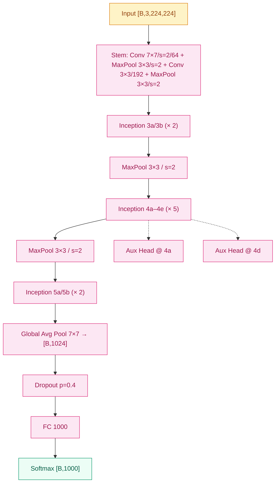
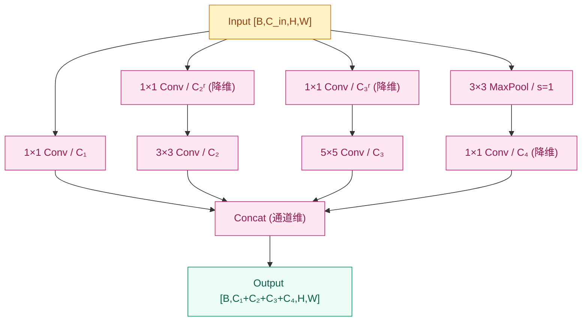

# GoogLeNet / Inception v1 (2014)

## 之前卡在哪

2014 年的视觉社区里，"更深更好"这件事已经被 [VGG](03-vgg.md) 证得很扎实——把所有卷积统一成 3×3、堆到 16/19 层，Top-5 错误率直接干到 7.3%，逼近人类水平。但 VGG 也把另一个尴尬事实摆到了台面上：**它的 138M 参数里，102M 全堆在最后一层 fc6 上**，整个网络名义上是"深 CNN"，实际上是"巨型 FC 套了个卷积前缀"。

更深的路看上去通了，但代价吓人：VGG-16 单模型推理约 15 GFLOPs、参数 138M，部署到移动端或大规模在线服务几乎没法谈。如果按 VGG 的思路再往下做 30 层、50 层，参数和算力都会指数级膨胀；而把模型做大本身在 ImageNet 上的边际收益也在递减——VGG-19 相比 VGG-16 几乎没赚到。

普遍的共识是："想再上一档精度，要么继续堆深度（但参数爆炸），要么找一种**让网络表达能力增长但参数不爆炸**的新结构"。Inception 给出的就是后一条路。

## 核心思想

GoogLeNet 没有继续往"更深更窄"那条路上走，而是回到一个更基本的问题：**视觉模式天然没有单一尺度**。一张图里既有覆盖整张脸的轮廓、也有几个像素的眼角细节；一个分类器要应对所有这些，理论上应该在每一层同时观察多个尺度。

VGG 的做法是"赌一个尺度（3×3）然后堆深"，让感受野慢慢扩大。Inception 的做法相反：**在同一层并行做多种尺度的卷积，再把结果拼起来**——1×1 看通道关系、3×3 看小邻域、5×5 看更大邻域、3×3 MaxPool 抓位置不变性。最后在通道维度 concat，让下一层自己学怎么权衡这些通道。


*图 1：GoogLeNet 整体结构——stem + 9 个 Inception block + GAP + 单层 FC。两个辅助分类器只在训练时挂在 4a/4d 后面。*

这条结构里，GoogLeNet 含 22 层有参层（不算池化），9 个 Inception block 占了绝大部分计算。整网参数约 **5M**——比 VGG-16 (138M) 少了约 28 倍，比 AlexNet (60M) 还少了 12 倍，但 ImageNet Top-5 错误率拿到 **6.67%**（VGG 7.3%），直接夺得 ImageNet 2014 冠军。

但 naive 的多分支并行有一个立刻致命的问题——**通道数会随分支爆炸**。假设输入 256 通道，每分支各输出 128 通道，concat 后变成 512 通道，下一层的 5×5 卷积就要在 512 通道上做，参数量是 $5 \times 5 \times 512 \times 128 = 1.6\text{M}$ 一层。堆几个 block 就回到 VGG 的参数量级。

Inception 的核心发明就是**在每个 3×3 / 5×5 之前先用 1×1 卷积做"瓶颈降维"**——把输入通道从 256 砍到 64 再去做 5×5，参数量瞬间砍到 $5 \times 5 \times 64 \times 128 = 0.2\text{M}$，**降到约 1/8**。1×1 卷积本身只看通道间的线性组合（不动空间），既便宜又能学到通道压缩，是整个 Inception 设计的真正核心。


*图 2：Inception block 内部——4 分支并行，3×3/5×5 之前先用 1×1 瓶颈降维，最后在通道维 concat。*

形式上，Inception block 的输出可以写成 4 路分支在通道维的拼接：

$$
y = \text{Concat}\Big(\, f_{1\times 1}(x),\; f_{3\times 3}(g^{(2)}_{1\times 1}(x)),\; f_{5\times 5}(g^{(3)}_{1\times 1}(x)),\; g^{(4)}_{1\times 1}(\text{MaxPool}(x)) \,\Big)
$$

每条分支的 $g_{1\times 1}$ 把输入通道压低后再走更贵的 3×3 / 5×5。这种"先压再算"的结构后来在 ResNet 的 bottleneck block、MobileNet 的 inverted residual 里被反复借用。

> 你要记住：Inception 真正的发明不是"多尺度并行"，而是**把 1×1 卷积当成降维瓶颈**——既要分支表达能力，又不能让通道数和参数量爆炸，这两件事的同时满足才是它存在的意义。

**用 GAP 取代大 FC** —— GoogLeNet 还干了另一件大胆的事：抛弃 VGG/AlexNet 那两层 4096 维的 FC。最后一个 Inception block 输出 $7 \times 7 \times 1024$，直接做 Global Average Pooling 把每个通道平均成 1 个数，得到 1024 维向量，然后只接一层 FC 到 1000 类。这步把参数从 VGG 的 102M 砍到约 1M，**这一招直接解释了 5M 整网参数预算从哪挤出来的**。GAP 这个技巧（连同 1×1 卷积）来自 Lin 等人 2013 年的 "Network in Network"，Inception 是它在大规模工程上的第一次胜利。

## 工程陷阱

**1×1 降维必须在 3×3/5×5 之前，顺序反了就失去意义**。1×1 的目的是把输入通道砍下来，让后面贵的 3×3/5×5 在低维上算。如果顺序写反（先 3×3 再 1×1），3×3 已经在高维输入上算完了，1×1 只能压缩输出通道、对 3×3 自身的计算量毫无帮助。同理 pool 分支的 1×1 放在 MaxPool **之后**——因为 MaxPool 不改变通道数，只在 pool 之后的拼接前压一下。

**辅助分类器是 BN 出现前的临时补丁**。GoogLeNet 在 inception-4a 和 inception-4d 后面各挂一个辅助 head（小 FC 接 softmax），训练时它们各自算一遍交叉熵 loss，按 0.3 的权重加进总 loss：

$$
\mathcal{L}_{\text{total}} = \mathcal{L}_{\text{main}} + 0.3 \, \mathcal{L}_{\text{aux1}} + 0.3 \, \mathcal{L}_{\text{aux2}}
$$

它的作用主要是**缓解梯度消失**——22 层网络的最底层在 BN 出现前梯度信号衰减很厉害，从中间层直接接 softmax 等于给底部"加了两条短回路"让梯度能流回去。**推理时这两个 head 直接丢掉，不参与最终预测**。这种"补丁式"做法在 BN（2015）和残差连接（2015）出现后就被彻底淘汰——[ResNet](05-resnet.md) 之后没人再用辅助分类器。

**分支选择数和通道分配是手工调的**。原论文里每个 Inception block 的 4 分支输出通道（$C_1, C_2, C_3, C_4$）和 2 个降维通道（$C_2^r, C_3^r$）都是查表给死的——3a 是 (64, 128, 32, 32) + (96, 16)，3b 是 (128, 192, 96, 64) + (128, 32)，每个 block 一组不同的数字。这种"手工调超参"的味道很重，复现实验时改任何一个数都可能影响结果。这个痛点要到 [EfficientNet](07-efficientnet.md) 用 NAS + compound scaling 自动搜索结构后才被规整化；Inception 自己在 v3 用 factorized convolution（7×7 → 1×7 + 7×1）也部分缓解了这个问题。

**concat 的通道顺序不可换**。4 分支在通道维拼接，下一层 Inception 的 1×1 降维会重新学权重，所以表面上"哪个分支放第 0 通道"无所谓——但在加载预训练权重时，分支顺序必须和原实现一致，否则全乱套。这是迁移学习时一个常见的踩坑点。

## 训练细节

| 维度 | 值 |
|---|---|
| 优化器 | SGD + Momentum |
| 学习率 | 0.045（论文报告值），每 8 epoch 衰减 4% |
| 动量 | 0.9 |
| 辅助 head 权重 | 0.3 ×（aux1）+ 0.3 ×（aux2），仅训练时启用 |
| Dropout | p=0.4，仅 GAP 之后的 FC 前 |
| 权重初始化 | 不再用"先训浅版当种子"的接力——网络相对短且参数少 |
| 推理时辅助 head | 丢弃 |

**数据增强**：

- **多尺度裁剪**：从 8% 到 100% 的图像面积随机采样，宽高比在 [3/4, 4/3] 之间随机
- **光度扰动**：参照 Andrew Howard 2013 的方案做亮度/对比度/颜色扰动
- **测试时多裁剪**：取 144 个 crop（4 尺度 × 3 区块 × 2 翻转 × 6 crop）平均 softmax

**训练资源**：原论文用一组分布式 CPU 集群训练 GoogLeNet 单模型（DistBelief 框架），具体训练时长论文没给死。这个细节也反映了当年的工程现实——Google 内部当时还没大规模铺 GPU 训练框架。

**ImageNet 错误率（Top-5）：**

| 年份 | 方法 | 参数量 | Top-5 错误率 |
|---|---|---|---|
| 2012 | AlexNet | 60M | 15.3% |
| 2013 | ZFNet | 60M | 14.8% |
| 2014 | VGG-16 | 138M | 7.3% |
| 2014 | **GoogLeNet single** | **5M** | **7.89%** |
| 2014 | **GoogLeNet 7-model ensemble** | — | **6.67%** |

6.67% 这个冠军成绩之所以让社区震动，不仅是因为它赢了 VGG，更因为它**用 VGG 1/28 的参数量赢的**——这是"参数效率"作为一个独立优化目标第一次站上 ImageNet 的顶峰。Inception 后续 v2（BN-Inception, 2015）、v3（factorized conv, 2015）、v4 / Inception-ResNet（2016）一路演化，"多分支 + 1×1 降维"的骨架被一代代继承。

## 关键代码

下面这段用 PyTorch 写一个标准 Inception block——4 分支、3×3/5×5 前用 1×1 降维、最后 concat：

```python
import torch
import torch.nn as nn

class InceptionBlock(nn.Module):
    """单个 Inception v1 block：4 分支并行 + 1×1 瓶颈降维 + 通道维 concat。"""

    def __init__(self, in_c: int,
                 c1: int, c2r: int, c2: int, c3r: int, c3: int, c4: int):
        super().__init__()
        # 分支 1：纯 1×1
        self.b1 = nn.Sequential(nn.Conv2d(in_c, c1, 1), nn.ReLU(inplace=True))
        # 分支 2：1×1 降维 → 3×3
        self.b2 = nn.Sequential(
            nn.Conv2d(in_c, c2r, 1), nn.ReLU(inplace=True),
            nn.Conv2d(c2r, c2, 3, padding=1), nn.ReLU(inplace=True),
        )
        # 分支 3：1×1 降维 → 5×5
        self.b3 = nn.Sequential(
            nn.Conv2d(in_c, c3r, 1), nn.ReLU(inplace=True),
            nn.Conv2d(c3r, c3, 5, padding=2), nn.ReLU(inplace=True),
        )
        # 分支 4：3×3 MaxPool → 1×1 降维
        self.b4 = nn.Sequential(
            nn.MaxPool2d(3, stride=1, padding=1),
            nn.Conv2d(in_c, c4, 1), nn.ReLU(inplace=True),
        )

    def forward(self, x: torch.Tensor) -> torch.Tensor:
        # 4 分支并行，输出在通道维拼接 → [B, c1+c2+c3+c4, H, W]
        return torch.cat([self.b1(x), self.b2(x), self.b3(x), self.b4(x)], dim=1)


# Inception-3a 的官方配置：in=192, (c1, c2r, c2, c3r, c3, c4) = (64, 96, 128, 16, 32, 32)
# 输出通道数 = 64 + 128 + 32 + 32 = 256
block_3a = InceptionBlock(192, 64, 96, 128, 16, 32, 32)
```

整个 GoogLeNet 就是把这种 block 按论文表里给的通道配置堆 9 次，再加 stem、GAP、单层 FC——5M 参数的来源一目了然。

## 影响 / 后续

GoogLeNet 的成绩——Top-5 错误率 **6.67%**、参数仅 **5M**——把"参数效率"作为一个独立的优化目标第一次推上 ImageNet 的顶峰。从这之后，每一篇视觉论文都默认要回答两个问题："我的精度是多少？我的参数和 FLOPs 是多少？"——这种**双轴评估**的习惯就是 Inception 留下的。

但 Inception 自身的遗产也很复杂。它的"多分支 + 手工调通道"骨架开了一个口子——表达能力可以靠并行结构而不是深度堆出来——这条路在 Inception v2/v3/v4 内部继续演化，也被 ResNeXt（多分支 + group conv）、Xception（深度可分离卷积是 1×1 + depthwise 的极端形式）继承。GAP + 1×1 卷积这两个技巧从此成为所有视觉模型的默认配置。辅助分类器这个补丁则在 [ResNet](05-resnet.md) 和 BatchNorm 出现后被快速抛弃——回头看，它是 2014 年那个"深网训不动"过渡期的产物。

→ [05-resnet.md](05-resnet.md) · 残差连接让深网络稳定训练，辅助分类器这种"补丁"从此变得多余
→ [07-efficientnet.md](07-efficientnet.md) · 把 Inception "分支选择 / 通道分配"的手工调超参换成 NAS + compound scaling 自动搜索
→ [../foundations/04-normalization/](../foundations/04-normalization/) · BN-Inception（v2, 2015）是 BatchNorm 第一次在大规模视觉模型上落地
→ [03-vgg.md](03-vgg.md) · 同年的 VGG 走的是"深度堆叠"路线，Inception 证明了"参数效率"是另一条可走的轴
