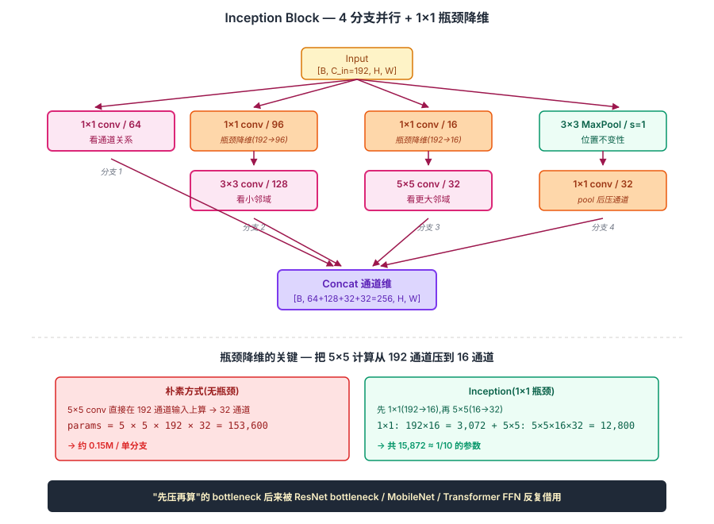
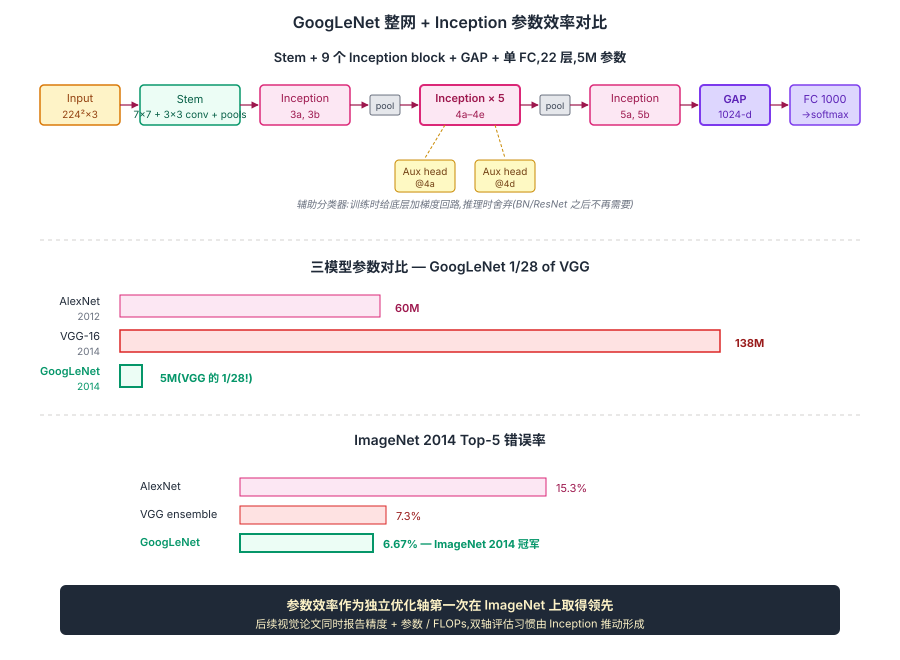

# GoogLeNet / Inception v1 (2014)

## 前作进展

2014 年时，"更深更好"已被 [VGG](03-vgg.md) 实证——所有卷积统一为 3×3、堆叠至 16/19 层，Top-5 错误率降至 7.3%，接近人类水平。但 VGG 也暴露出一个明显的参数分布问题：**138M 参数中 102M 集中在 fc6 一层**，网络名义上是"深 CNN"，但参数主要分布在 FC 层。

继续加深的方案面临较大开销：VGG-16 单模型推理约 15 GFLOPs、参数 138M，难以部署到移动端或大规模在线服务。若按 VGG 思路继续做到 30 层、50 层，参数和算力会显著增长；而模型规模增大在 ImageNet 上的边际收益也在下降——VGG-19 相比 VGG-16 的提升已很有限。

当时的主要思路是：要进一步提升精度，要么继续加深（参数代价大），要么寻找一种**在不显著增加参数的前提下提升网络表达能力**的新结构。Inception 走的是后一条路径。

## 核心思想

### 直觉：视觉模式没有单一尺度,与其堆深不如多分支并行

理解 Inception 真正需要先抓一件事:**[VGG](03-vgg.md) 走的是"统一 3×3 + 堆深"路线,但视觉模式天然没有单一尺度**——一张脸里既有覆盖整张脸的轮廓、也有几个像素的眼角细节。VGG 的解决方案是堆叠 3×3 慢慢扩大感受野。Szegedy 等人 2014 反问:**为什么不在同一层并行使用 1×1 / 3×3 / 5×5 / pool 多个尺度,让网络自己学如何加权这些通道?**

三件事必须同时成立才让 Inception 在 2014 年 work:

- **多分支并行能让网络在同一层看多尺度** — 不堆深就能扩大有效感受野的覆盖范围,但简单多分支会让通道数累积爆炸
- **1×1 卷积作为"瓶颈"压通道** — 在贵的 3×3 / 5×5 之前先用 1×1 把通道砍下来,参数 / 算力降一个数量级
- **GAP 替代大 FC 干掉参数尾巴** — VGG 的 fc6 一层就 102M 参数,GoogLeNet 用 global average pooling 把它压到 1M

三件事合起来:GoogLeNet 整网仅 **5M 参数**(比 VGG-16 的 138M 少 28 倍、比 AlexNet 的 60M 少 12 倍),ImageNet Top-5 错误率 **6.67%**(优于 VGG 的 7.3%),拿下 ImageNet 2014 冠军。这是"参数效率"作为独立优化目标第一次在 ImageNet 上取得领先 —— 后续视觉论文普遍同时报告精度和参数 / FLOPs,**双轴评估**习惯由 Inception 推动形成。


*图 1:Inception block 内部 — 输入并行走 4 条分支:**纯 1×1 conv**(看通道关系)、**1×1 → 3×3**(1×1 先把通道砍下再算 3×3)、**1×1 → 5×5**(同理)、**MaxPool → 1×1**(pool 不改通道,1×1 在 pool 后压通道)。最后在通道维 concat。底部 callout 给出参数对比:**5×5 直接算 1.6M vs 1×1 先压到 64 再算 0.2M,降 8×** — 这是 Inception 5M 整网参数的根本来源。*

### 机制一:多分支并行 — 同一层同时看多个尺度

Inception block 的输出是 4 路分支在通道维的拼接:

$$
y = \text{Concat}\Big( f_{1\times 1}(x),\; f_{3\times 3}(g^{(2)}_{1\times 1}(x)),\; f_{5\times 5}(g^{(3)}_{1\times 1}(x)),\; g^{(4)}_{1\times 1}(\text{MaxPool}(x)) \Big)
$$

每条分支负责一个不同的感受野尺度 —— 1×1 看像素本身的通道组合、3×3 看小邻域、5×5 看更大邻域、3×3 MaxPool 提供位置不变性。**下一层 Inception block 通过它自己的 1×1 自适应学习如何加权这些通道**,等于网络自己决定每层用哪种尺度。

与 VGG"单一 3×3 + 堆深"对比:VGG 用 3 层 3×3 才等价于 1 个 7×7 感受野,这意味着 VGG 浅层只能看局部、深层才能看全局。Inception 在每层都同时看多尺度,**信息流更扁更宽**。这种"多分支自适应"思想后来被 ResNeXt(多分支 + group conv)、Xception(depthwise + pointwise)、ViT 的 multi-head attention 各自借鉴。

### 机制二:1×1 卷积瓶颈 — "先压再算"防止通道爆炸

简单多分支并行有一个致命问题:**通道数会随分支累积**。假设输入 256 通道,每分支各输出 128 通道,concat 后是 512 通道,下一层 5×5 卷积参数量 $5 \times 5 \times 512 \times 128 = 1.6$M 一层,堆几个 block 就回到 VGG 量级。

Inception 的核心 trick 是**在每个 3×3 / 5×5 之前先用 1×1 卷积做"瓶颈降维"**——把输入通道从 256 降到 64 再做 5×5,参数量降至 $5 \times 5 \times 64 \times 128 = 0.2$M,**约为原来的 1/8**。1×1 卷积只对通道维做线性组合(不改变空间维),计算便宜但能学到通道压缩。

工程上有一个常见坑:**1×1 必须在 3×3 / 5×5 之前**(顺序反了就失去意义)。pool 分支的 1×1 放在 MaxPool **之后**——因为 MaxPool 不改通道,只在 concat 前压一下就够。

这一"先压再算"的 bottleneck 结构后来在 [ResNet bottleneck](05-resnet.md)、MobileNet inverted residual、Transformer FFN(`d → 4d → d`)里被反复借用。

### 机制三:GAP 替代大 FC — 干掉 VGG 的参数尾巴

GoogLeNet 的另一个关键设计是**去掉 VGG/AlexNet 那两层 4096 维的 FC**。最后一个 Inception block 输出 $7 \times 7 \times 1024$,直接做 Global Average Pooling 把每个通道平均成 1 个数 → 得到 1024 维向量 → 再接一层 FC 到 1000 类。

参数账:VGG 的 fc6 是 102M(74% of total),GoogLeNet 的 GAP+FC 只有 ~1M。**这一步贡献了 5M 整网参数预算的主要来源**。GAP 这个技巧(连同 1×1 卷积)来自 Lin 等人 2013 年的 *Network in Network*,Inception 是它在大规模视觉模型上的首次成功应用。

GAP 之后成为视觉模型的标准 head 设计 —— ResNet / DenseNet / EfficientNet 全部用 GAP,VGG 那种"flatten + 大 FC"模式被彻底抛弃。

### 三件套协同:多分支 + 1×1 瓶颈 + GAP 缺一不可

Inception 在 2014 年能用 5M 参数(VGG 1/28)拿下 ImageNet 冠军,**不是单一改进**,而是三件套同时调到协同点 —— 任何一个抽掉 Inception 都不成立,这一点和 [ResNet](05-resnet.md) 的 `shortcut + BN + He 初始化` 协同关系一致:

- **只有多分支,没有 1×1 瓶颈** — 通道数随分支累积爆炸,几个 block 后参数回到 VGG 138M 量级,"参数效率"卖点直接消失
- **只有 1×1 瓶颈,没有多分支** — 退化成普通 CNN,只有 bottleneck 没有多尺度并行,失去 Inception 在每层"自动选尺度"的核心创新
- **只有多分支 + 1×1,没有 GAP** — 整网参数 99% 仍卡在 fc6 那一层 102M 大头上,Conv 端的 1×1 瓶颈再省也救不回来 — 5M 整网参数根本拿不到

三件套合起来才让 Inception 在 2014 年开辟"参数效率"这条独立优化轴。这也是为什么 VGG 之后再没人用 fc6 那种"flatten + 大 FC"的 head,GAP 成了所有现代视觉模型的标准结尾。


*图 2:**上** GoogLeNet 整网 — stem + 9 个 Inception block + GAP + 单层 FC,2 个 aux head 训练时挂在 4a/4d。**下** 三模型参数对比柱状图 — AlexNet 60M / VGG-16 138M / GoogLeNet 5M,GoogLeNet 比 VGG 少 28×、比 AlexNet 少 12×。底部 ImageNet Top-5 错误率:AlexNet 15.3% → VGG 7.3% → GoogLeNet 6.67%,**参数效率作为独立优化轴第一次在 ImageNet 上取得领先**。*

## 工程陷阱

**1×1 降维必须在 3×3/5×5 之前，顺序反了就失去意义**。1×1 的目的是把输入通道砍下来，让后面贵的 3×3/5×5 在低维上算。如果顺序写反（先 3×3 再 1×1），3×3 已经在高维输入上算完了，1×1 只能压缩输出通道、对 3×3 自身的计算量毫无帮助。同理 pool 分支的 1×1 放在 MaxPool **之后**——因为 MaxPool 不改变通道数，只在 pool 之后的拼接前压一下。

**辅助分类器是 BN 出现前的临时补丁**。GoogLeNet 在 inception-4a 和 inception-4d 后面各挂一个辅助 head（小 FC 接 softmax），训练时它们各自算一遍交叉熵 loss，按 0.3 的权重加进总 loss：

$$
\mathcal{L}_{\text{total}} = \mathcal{L}_{\text{main}} + 0.3 \, \mathcal{L}_{\text{aux1}} + 0.3 \, \mathcal{L}_{\text{aux2}}
$$

其作用主要是**缓解梯度消失**——22 层网络的最底层在 BN 出现前梯度信号衰减较大，从中间层直接接 softmax 相当于给底部"增加两条短回路"让梯度能够回传。**推理时这两个 head 不参与最终预测，直接舍弃**。这种"辅助监督"方案在 BN（2015）和残差连接（2015）出现后逐渐不再使用——[ResNet](05-resnet.md) 之后辅助分类器在主流工作中较少出现。

**分支选择数和通道分配依赖手工调试**。原论文中每个 Inception block 的 4 分支输出通道（$C_1, C_2, C_3, C_4$）和 2 个降维通道（$C_2^r, C_3^r$）均为查表的固定值——3a 是 (64, 128, 32, 32) + (96, 16)，3b 是 (128, 192, 96, 64) + (128, 32)，每个 block 一组不同的数值。这种"手工调超参"的特点较明显，复现实验时改任一数值都可能影响结果。该问题直到 [EfficientNet](07-efficientnet.md) 用 NAS + compound scaling 自动搜索结构后得到改善；Inception 自身在 v3 用 factorized convolution（7×7 → 1×7 + 7×1）也部分缓解了这个问题。

**concat 的通道顺序不可换**。4 分支在通道维拼接，下一层 Inception 的 1×1 降维会重新学习权重，原则上"哪个分支放第 0 通道"无所谓——但加载预训练权重时，分支顺序必须与原实现一致，否则权重对应错位。这是迁移学习时的常见注意事项。

## 训练细节

| 维度 | 值 |
|---|---|
| 优化器 | SGD + Momentum |
| 学习率 | 0.045（论文报告值），每 8 epoch 衰减 4% |
| 动量 | 0.9 |
| 辅助 head 权重 | 0.3 ×（aux1）+ 0.3 ×（aux2），仅训练时启用 |
| Dropout | p=0.4，仅 GAP 之后的 FC 前 |
| 权重初始化 | 不再用"先训浅版当种子"的接力——网络相对短且参数少 |
| 推理时辅助 head | 丢弃 |

**数据增强**：

- **多尺度裁剪**：从 8% 到 100% 的图像面积随机采样，宽高比在 [3/4, 4/3] 之间随机
- **光度扰动**：参照 Andrew Howard 2013 的方案做亮度/对比度/颜色扰动
- **测试时多裁剪**：取 144 个 crop（4 尺度 × 3 区块 × 2 翻转 × 6 crop）平均 softmax

**训练资源**：原论文用一组分布式 CPU 集群训练 GoogLeNet 单模型（DistBelief 框架），具体训练时长论文没给死。这个细节也反映了当年的工程现实——Google 内部当时还没大规模铺 GPU 训练框架。

**ImageNet 错误率（Top-5）：**

| 年份 | 方法 | 参数量 | Top-5 错误率 |
|---|---|---|---|
| 2012 | AlexNet | 60M | 15.3% |
| 2013 | ZFNet | 60M | 14.8% |
| 2014 | VGG-16 | 138M | 7.3% |
| 2014 | **GoogLeNet single** | **5M** | **7.89%** |
| 2014 | **GoogLeNet 7-model ensemble** | — | **6.67%** |

6.67% 这个冠军成绩的意义不仅在于优于 VGG，更在于**仅用 VGG 1/28 的参数量**——这是"参数效率"作为独立优化目标首次在 ImageNet 上取得领先位置。Inception 后续 v2（BN-Inception, 2015）、v3（factorized conv, 2015）、v4 / Inception-ResNet（2016）持续演化，"多分支 + 1×1 降维"的骨架被后续工作沿用。

## 关键代码

下面这段用 PyTorch 写一个标准 Inception block——4 分支、3×3/5×5 前用 1×1 降维、最后 concat：

```python
import torch
import torch.nn as nn

class InceptionBlock(nn.Module):
    """单个 Inception v1 block：4 分支并行 + 1×1 瓶颈降维 + 通道维 concat。"""

    def __init__(self, in_c: int,
                 c1: int, c2r: int, c2: int, c3r: int, c3: int, c4: int):
        super().__init__()
        # 分支 1：纯 1×1
        self.b1 = nn.Sequential(nn.Conv2d(in_c, c1, 1), nn.ReLU(inplace=True))
        # 分支 2：1×1 降维 → 3×3
        self.b2 = nn.Sequential(
            nn.Conv2d(in_c, c2r, 1), nn.ReLU(inplace=True),
            nn.Conv2d(c2r, c2, 3, padding=1), nn.ReLU(inplace=True),
        )
        # 分支 3：1×1 降维 → 5×5
        self.b3 = nn.Sequential(
            nn.Conv2d(in_c, c3r, 1), nn.ReLU(inplace=True),
            nn.Conv2d(c3r, c3, 5, padding=2), nn.ReLU(inplace=True),
        )
        # 分支 4：3×3 MaxPool → 1×1 降维
        self.b4 = nn.Sequential(
            nn.MaxPool2d(3, stride=1, padding=1),
            nn.Conv2d(in_c, c4, 1), nn.ReLU(inplace=True),
        )

    def forward(self, x: torch.Tensor) -> torch.Tensor:
        # 4 分支并行，输出在通道维拼接 → [B, c1+c2+c3+c4, H, W]
        return torch.cat([self.b1(x), self.b2(x), self.b3(x), self.b4(x)], dim=1)

# Inception-3a 的官方配置：in=192, (c1, c2r, c2, c3r, c3, c4) = (64, 96, 128, 16, 32, 32)
# 输出通道数 = 64 + 128 + 32 + 32 = 256
block_3a = InceptionBlock(192, 64, 96, 128, 16, 32, 32)
```

整个 GoogLeNet 就是把这种 block 按论文表里给的通道配置堆 9 次，再加 stem、GAP、单层 FC——5M 参数的来源一目了然。

## 影响 / 后续

GoogLeNet 的结果——Top-5 错误率 **6.67%**、参数仅 **5M**——确立了"参数效率"作为独立优化目标的地位。此后视觉论文普遍同时报告精度和参数 / FLOPs，这种**双轴评估**的习惯由 Inception 推动形成。

Inception 的影响在多个方向延续。其"多分支 + 通道分配"骨架开拓了一条新路径——表达能力可通过并行结构而非单纯深度获得——这条路在 Inception v2/v3/v4 内部继续演化，也被 ResNeXt（多分支 + group conv）、Xception（深度可分离卷积，即 1×1 + depthwise 的极端形式）沿用。GAP + 1×1 卷积成为后续视觉模型的常见配置。辅助分类器在 [ResNet](05-resnet.md) 和 BatchNorm 出现后逐渐不再使用——可视为 2014 年深层网络训练不稳定时期的过渡方案。

→ [05-resnet.md](05-resnet.md) · 残差连接让深网络稳定训练，辅助分类器在后续工作中较少使用
→ [07-efficientnet.md](07-efficientnet.md) · 把 Inception "分支选择 / 通道分配"的手工调超参换成 NAS + compound scaling 自动搜索
→ [../foundations/04-normalization/](../foundations/04-normalization/) · BN-Inception（v2, 2015）是 BatchNorm 第一次在大规模视觉模型上落地
→ [03-vgg.md](03-vgg.md) · 同年的 VGG 走的是"深度堆叠"路线，Inception 证明了"参数效率"是另一条可走的轴
