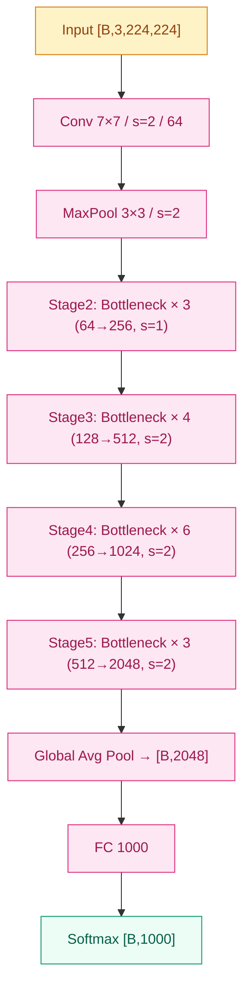
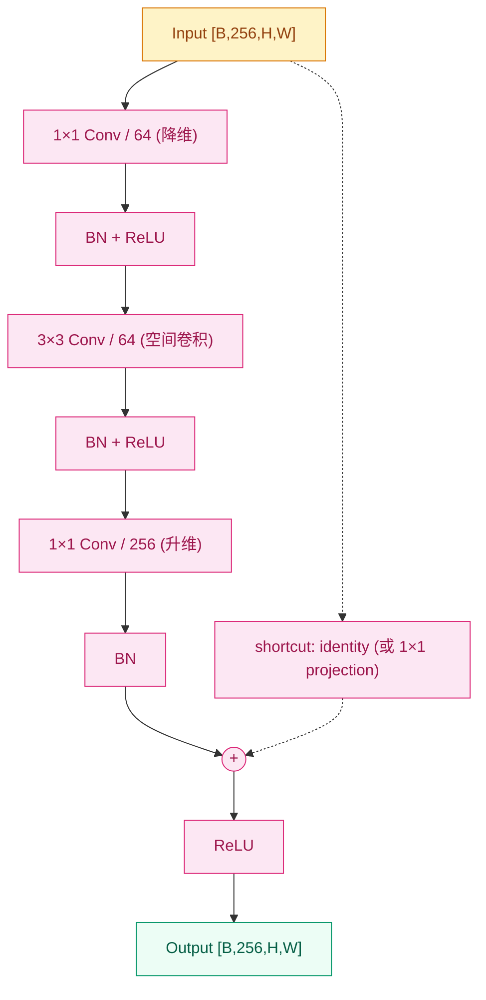

# ResNet (2015)

## 之前卡在哪

2014 年的视觉社区有一个全员相信的共识：**深度本身就是性能来源**。[VGG](03-vgg.md) 用 16/19 层把 ImageNet Top-5 干到 7.3%，[Inception](04-inception.md) 用 22 层 + 多分支拿到 6.67%，二者一前一后把"深"这条路按出了正反两面。下一步看上去顺理成章——把网络继续往下做，30 层、50 层、100 层，精度应该继续涨。

但 MSRA 的何恺明等人在 2015 年初做了一组让人难堪的对照实验。他们用 VGG 那套"3×3 + BN + ReLU"堆叠了一个 20 层的 plain 网络和一个 56 层的 plain 网络，在 CIFAR-10 上训练。预期是 56 层至少不该比 20 层差——多出来的 36 层最坏也就是学个恒等映射，把表现拉平。

结果是 56 层网络**训练误差**比 20 层还高，验证误差更高。这件事让整个社区当时都愣了——

- 这不是**过拟合**：过拟合时训练误差应该低、验证误差高。56 层是两边都更差
- 这不是**梯度消失**：BatchNorm 那年刚出，已经把这条路堵住了；监控显示梯度尺度也还在合理范围
- 那 56 层在干什么？训练 loss 卡住下不去——更深的网络反而**优化不动**

何恺明给这个现象起了个名字：**优化退化（degradation）**。它的诡异之处在于——理论上 56 层网络的解空间包含 20 层的解（多出来的 36 层只要学恒等映射就行），但 SGD 找不到这个解。**深度本身变成了优化的敌人**。

VGG 当年的"先训浅版当种子"接力训练，本质上就是在和这个现象搏斗。但这种笨办法到 100 层级别已经完全失灵。普遍的悲观共识是："CNN 在 30 层附近可能就是天花板，再深得换一种结构"。

## 核心思想

ResNet 的回应极其干净：**让网络不再学完整的映射 $H(x)$，而是学一个"修正量" $F(x) = H(x) - x$**。原本要从输入直接构造输出，现在改成"输入照搬过去，旁边算一个增量加上去"。形式上：

$$
y = F(x, \{W_i\}) + x
$$

那个 `+x` 就是 **shortcut connection / skip connection**——一条从输入直接跨过几层卷积、加到输出上的旁路。


*图 1：ResNet-50 整体结构——conv1 7×7 stem + 4 个 stage 的 Bottleneck 堆叠 (3, 4, 6, 3) + GAP + 单层 FC。*

这条结构里，ResNet-50 含 50 层有参层，4 个 stage 内分别堆 3 / 4 / 6 / 3 个 Bottleneck block；ResNet-101 把 stage3 改成 23，ResNet-152 把 stage3 改成 36；ResNet-18/34 用更轻的 BasicBlock。整网参数 ResNet-50 约 **25M**、ResNet-152 约 **60M**——后者比 VGG-16（138M）还少，深度却是 8 倍。

### 直觉

理解 ResNet 真正需要抓两件事，缺一不可。

**直觉一：恒等映射的优先级反转**。在 plain 网络里，"什么都不做"是一件**难**的事——56 层每层都要主动把信号尽量原样传下去，要 56 次配合默契才行。任何一层稍微学偏一点，错误就会被后续层放大。SGD 要在亿级参数空间里同时让所有层"都不要乱动"，这件事违反优化器的本能。

ResNet 把这件事颠倒过来。残差形式下，"什么都不做"对应 $F(x) = 0$——所有卷积权重学到 0 就行，shortcut 自动把 $x$ 送过去。**让权重学 0，比让权重学恒等矩阵，容易得多**：前者是一个明确的优化目标（L2 正则本来就把权重往 0 拽），后者要在高维空间精确找到一个稀疏的特殊点。残差结构把"恒等映射"从一个稀有解变成了**默认解**，新增层只在确实有用时才偏离 0。

> 你要记住：残差不是为了让网络更深，是为了让深网络可训练。"深"是结果，不是动机；真正的动机是把"恒等映射"从难学的目标变成默认行为。

**直觉二：梯度高速公路**。展开 $y = F(x) + x$ 对输入的导数：

$$
\frac{\partial y}{\partial x} = \frac{\partial F}{\partial x} + 1
$$

那个 `+1` 是关键。在 plain 网络里，第 $L$ 层到第 $\ell$ 层的梯度是一长串雅可比矩阵连乘，任何一项尺度偏离 1 都会让梯度指数级衰减或爆炸。残差网络里，这个连乘变成 $\prod (\partial F_i / \partial x + I)$ 形式——shortcut 让恒等项 $I$ 始终存在，**底层永远能拿到一份"未被衰减"的顶层梯度**。

这相当于在网络里架了一条**梯度高速公路**：无论中间多少层卷积，从 loss 到任何一个 block 的梯度都有一条直通路径，不经过任何非线性。152 层之所以能稳定训练，不是因为每层都健康，而是因为**就算每层都不健康，梯度也能借 shortcut 流回去**。

### 机制

ResNet 把这条思想落地成两种 block。

**BasicBlock**（用于 ResNet-18 / 34）——两个 3×3 卷积串联，shortcut 直接把输入加到第二个卷积的输出上：

```
x → Conv 3×3 → BN → ReLU → Conv 3×3 → BN → (+x) → ReLU → out
        └────────── shortcut ─────────────┘
```

**Bottleneck**（用于 ResNet-50 / 101 / 152）——3 层卷积，1×1 先降维、3×3 在低维上算、1×1 再升回去。这套"先压再算再升"借鉴自 [Inception](04-inception.md) 的 1×1 瓶颈，但目的稍有不同：Inception 用它防止分支爆炸，ResNet 用它把深网的单 block 算力压下来。


*图 2：Bottleneck block 内部——1×1 降维 → 3×3 空间卷积 → 1×1 升维，shortcut 与主分支在 `F(x) + x` 处相加，再过 ReLU。*

<!-- TODO(SVG): 残差块"弧形 shortcut + F(x)+x 标注"精品 SVG，将在后续 plan 中手写。当前用上面两张 Mermaid 作为最小覆盖。 -->

**Projection shortcut**——当 stride > 1 或输入输出通道数不一致时（如 stage 之间过渡），shortcut 上的 $x$ 没法和主分支直接相加。这时 shortcut 自己也走一个 1×1 卷积做投影：

$$
y = F(x, \{W_i\}) + W_s x
$$

$W_s$ 是 1×1 卷积权重，专门负责把通道数和空间分辨率对齐。除此之外的 block 内 shortcut 全部用 identity（不带任何参数），这是 ResNet 论文反复强调的一条——**让 shortcut 尽量保持纯净**，参数都给主分支。

**BN 是另一根支柱**。BatchNorm 和 ResNet 是同年（2015）的工作，论文里每个 Conv 后都跟 BN（Conv-BN-ReLU 顺序，pre-activation 版本要等到 He 2016 的 *Identity Mappings* 才出现）。没有 BN，152 层的内部协变量偏移会让训练立刻崩；有了 BN 而没有 shortcut，56 层就退化。**两者合在一起才让深度真正解锁**——这也是为什么 ResNet 之后所有视觉模型都默认 "Conv + BN + ReLU" 三件套。

## 训练细节

| 维度 | 值 |
|---|---|
| 优化器 | SGD + Momentum |
| 学习率 | 0.1，验证 error 停滞时除以 10（3 阶段衰减） |
| 动量 | 0.9 |
| 权重衰减 | 1×10⁻⁴ |
| Batch size | 256 |
| 训练步数 | ~60 万 iteration（约 120 epoch） |
| 权重初始化 | **He 初始化** $\mathcal{N}(0, 2/n)$ |
| Dropout | **不用**（BN 自带正则效果） |
| 数据增强 | 短边 [256, 480] 随机缩放 + 224 随机裁剪 + 水平翻转 + PCA 颜色扰动 |

**He 初始化** 必须单独拎出来讲——这是 Kaiming He 自己在 2015 年初另一篇论文（*Delving Deep into Rectifiers*）里提出的，专门为 ReLU 网络设计。Xavier 初始化假设激活函数是关于 0 对称的（tanh/sigmoid），但 ReLU 把负半轴砍掉，正向传播时每层方差会减半。He 把初始化方差从 $1/n$ 改成 $2/n$ 来补偿：

$$
W \sim \mathcal{N}\left(0,\ \frac{2}{n_{\text{in}}}\right)
$$

这件事看着小，但**没有它 ResNet-152 启动阶段就会梯度爆炸**——前几个 step 的 loss 直接变 NaN。He 初始化让"深 ReLU 网络的初始信号尺度可控"，是 ResNet 训练能从第一步就稳的关键前提。这是为什么 ResNet 论文不需要 VGG 那种"先训浅版当种子"接力——He 初始化 + BN + shortcut 三件套，让 152 层从随机初始化直接开训。

**训练资源**：4 块 NVIDIA M40 GPU 并行，单 ResNet-50 训练约 1 周，ResNet-152 约 2–3 周。

**测试时增强（TTA）**：10-crop（中心 + 四角 + 各自水平翻转）+ multi-scale 推理（短边 $\in \{224, 256, 384, 480, 640\}$ 各跑一遍取平均）。

**ImageNet 错误率（Top-5）：**

| 年份 | 方法 | 层数 | 参数量 | Top-5 错误率 |
|---|---|---|---|---|
| 2012 | AlexNet | 8 | 60M | 15.3% |
| 2014 | VGG-16 | 16 | 138M | 7.3% |
| 2014 | GoogLeNet | 22 | 5M | 6.67% |
| 2015 | **ResNet-50** | 50 | 25M | **5.25%** |
| 2015 | **ResNet-152** | 152 | 60M | **4.49%** |
| 2015 | **ResNet ensemble** | — | — | **3.57%** |
| 人类参考 | Russakovsky et al. | — | — | ~5.1% |

**3.57%——首次超过人类水平**。这个数字让 ResNet 拿下 ImageNet 2015 冠军，同时把视觉社区的争论从"CNN 能不能赢人类"切到了"下一个 benchmark 该是什么"。CVPR 2016 把 Best Paper 奖给了这篇论文，何恺明那年 28 岁。

He 等人在 2016 年又写了 *Identity Mappings in Deep Residual Networks*，证明把顺序从 "Conv-BN-ReLU + add + ReLU" 改成 "BN-ReLU-Conv（pre-activation）" 能让 1000 层以上的 ResNet 也稳定训练——这是 ResNet 的最终形态，今天工业代码（torchvision 的 `ResNet`）默认用的还是原版 post-activation，但 pre-activation 在超深网络里更稳。

## 关键代码

下面这段实现一个标准 Bottleneck block，含 projection shortcut。把"$+x$"那行显式写出来：

```python
import torch
import torch.nn as nn

class Bottleneck(nn.Module):
    """ResNet-50/101/152 的基本砖：1×1 降维 → 3×3 → 1×1 升维 + shortcut。"""
    expansion = 4  # 输出通道 = planes × expansion

    def __init__(self, in_c: int, planes: int, stride: int = 1):
        super().__init__()
        out_c = planes * self.expansion

        # 主分支 F(x)：1×1 → 3×3 → 1×1
        self.conv1 = nn.Conv2d(in_c, planes, 1, bias=False)          # [B, planes, H, W]
        self.bn1   = nn.BatchNorm2d(planes)
        self.conv2 = nn.Conv2d(planes, planes, 3,
                               stride=stride, padding=1, bias=False) # [B, planes, H', W']
        self.bn2   = nn.BatchNorm2d(planes)
        self.conv3 = nn.Conv2d(planes, out_c, 1, bias=False)         # [B, out_c, H', W']
        self.bn3   = nn.BatchNorm2d(out_c)
        self.relu  = nn.ReLU(inplace=True)

        # shortcut：identity 或 1×1 projection（当 stride 或通道变化时）
        if stride != 1 or in_c != out_c:
            self.shortcut = nn.Sequential(
                nn.Conv2d(in_c, out_c, 1, stride=stride, bias=False),
                nn.BatchNorm2d(out_c),
            )
        else:
            self.shortcut = nn.Identity()

    def forward(self, x: torch.Tensor) -> torch.Tensor:
        identity = self.shortcut(x)
        out = self.relu(self.bn1(self.conv1(x)))
        out = self.relu(self.bn2(self.conv2(out)))
        out = self.bn3(self.conv3(out))
        out = self.relu(out + identity)   # ← 这就是 y = F(x) + x，ResNet 的核心一行
        return out
```

整个 ResNet-50 就是 stem + 4 个 stage 的 Bottleneck 堆叠 (3, 4, 6, 3) + GAP + 单层 FC——`out + identity` 这一行重复 16 次，就是 25M 参数干到 5.25% Top-5 的秘密。

## 影响 / 后续

ResNet 的成绩——Top-5 错误率 **3.57%**、首次超过人类水平——是深度学习史上最干净的一次单点突破。从这一刻起，"网络该多深"这个问题不再是研究方向，而是一个**超参**：ResNet-18/34/50/101/152 摆在那里，按算力预算选一个就行。视觉社区随后两年的注意力快速从"如何让模型更深"切到"如何让模型更高效 / 更小 / 更准"。

ResNet 的真正遗产远不止 ImageNet 那一行数字。**残差连接（skip connection）作为一个原语**，被搬到几乎所有后续深网络架构里——[DenseNet](06-densenet.md) 把它推到极致让每层都连前面所有层、[EfficientNet](07-efficientnet.md) 在 ResNet 的 backbone 上做 compound scaling、[ViT](../08-vit/) 用 "Add & Norm" 把残差思想搬到 Transformer 的每个子层、U-Net / Segformer / SAM 里所有 encoder-decoder 之间的 skip 都是同一个想法。今天写一个超过 10 层的网络不加 shortcut，已经是工程上的反常。

ResNet-50 同时是**工业界最常用的视觉 backbone**——Faster R-CNN、Mask R-CNN、RetinaNet、DeepLab、CLIP 视觉塔的默认配置都是它，"加载 ImageNet 预训练 ResNet-50 权重"这一行代码在 2016–2022 年的视觉论文里几乎是标配。直到 ViT 在大规模数据上证明 Transformer 也能赢，ResNet-50 才慢慢从"唯一默认"退到"主流之一"。

→ [06-densenet.md](06-densenet.md) · 把"加法残差"推到极致，每层都接收前面所有层的输出
→ [07-efficientnet.md](07-efficientnet.md) · 在 ResNet 基础上把 depth / width / resolution 三轴系统化
→ [../08-vit/](../08-vit/) · ViT 用 "Add & Norm" 把残差思想搬到 Transformer 的每个子层
→ [../foundations/04-normalization/](../foundations/04-normalization/) · BatchNorm 是 ResNet 训练稳定的另一关键支柱
→ [../foundations/05-initialization/](../foundations/05-initialization/) · He 初始化让深 ReLU 网络的初始梯度尺度可控，ResNet 从第一步就能稳
