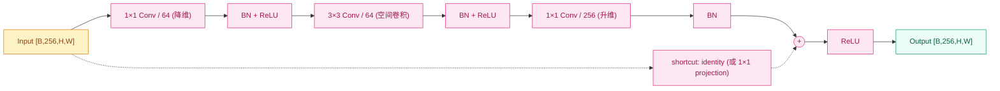
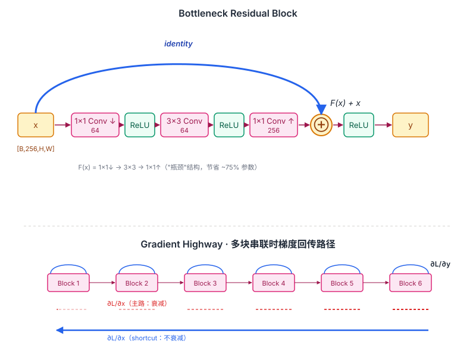

# ResNet (2015)

## 前作进展

2014 年视觉社区的主要共识之一是：**深度是性能的重要来源**。[VGG](03-vgg.md) 用 16/19 层把 ImageNet Top-5 错误率降至 7.3%，[Inception](04-inception.md) 用 22 层 + 多分支取得 6.67%，两者从不同方向验证了加深的价值。自然的延伸是——把网络继续做到 30 层、50 层、100 层，精度应当继续提升。

MSRA 的何恺明等人在 2015 年初做了一组对照实验。他们用 VGG 那套"3×3 + BN + ReLU"堆叠了一个 20 层的 plain 网络和一个 56 层的 plain 网络，在 CIFAR-10 上训练。预期是 56 层至少不应低于 20 层——多出的 36 层最坏情况下学一个恒等映射也能与 20 层持平。

实验结果是 56 层网络**训练误差**比 20 层更高，验证误差也更高。这一结果有几个特点：

- 不是**过拟合**：过拟合时训练误差应低、验证误差高。56 层在两者上都更差
- 不是**梯度消失**：BatchNorm 同年提出，已经缓解了这个问题；监控也显示梯度尺度在合理范围
- 训练 loss 卡住不再下降——更深的网络出现**优化困难**

何恺明把这个现象命名为**优化退化（degradation）**。反直觉之处在于——理论上 56 层网络的解空间包含 20 层的解（多出的 36 层只需学习恒等映射），但 SGD 难以找到该解。**深度本身在 plain 网络中成为优化障碍**。

VGG 当时的"先训浅版作为种子"的接力训练，本质上是在应对该现象，但这种工程方案到 100 层规模已不再有效。当时较普遍的看法是："CNN 在 30 层附近可能接近性能上限，继续加深需要新的结构。"

## 核心思想

ResNet 的方案非常简洁：**让网络不再学完整的映射 $H(x)$，而是学一个"修正量" $F(x) = H(x) - x$**。原本要从输入直接构造输出，现在改为"输入直接传递，旁边计算一个增量再相加"。形式上：

$$
y = F(x, \{W_i\}) + x
$$

那个 `+x` 就是 **shortcut connection / skip connection**——一条从输入直接跨过几层卷积、加到输出上的旁路。


```mermaid
graph LR
    x["Input [B,3,224,224]"]:::input
    s1["Conv 7×7 / s=2 / 64"]:::compute
    p1["MaxPool 3×3 / s=2"]:::compute
    s2["Stage2: Bottleneck × 3 (64→256, s=1)"]:::compute
    s3["Stage3: Bottleneck × 4 (128→512, s=2)"]:::compute
    s4["Stage4: Bottleneck × 6 (256→1024, s=2)"]:::compute
    s5["Stage5: Bottleneck × 3 (512→2048, s=2)"]:::compute
    gap["Global Avg Pool → [B,2048]"]:::compute
    fc["FC 1000"]:::compute
    y["Softmax [B,1000]"]:::output

    x --> s1 --> p1 --> s2 --> s3 --> s4 --> s5 --> gap --> fc --> y

    classDef input fill:#fef3c7,stroke:#d97706,color:#92400e;
    classDef compute fill:#fce7f3,stroke:#db2777,color:#9d174d;
    classDef output fill:#ecfdf5,stroke:#059669,color:#065f46;
```
*图 1：ResNet-50 整体结构——conv1 7×7 stem + 4 个 stage 的 Bottleneck 堆叠 (3, 4, 6, 3) + GAP + 单层 FC。*

这条结构里，ResNet-50 含 50 层有参层，4 个 stage 内分别堆 3 / 4 / 6 / 3 个 Bottleneck block；ResNet-101 把 stage3 改成 23，ResNet-152 把 stage3 改成 36；ResNet-18/34 用更轻的 BasicBlock。整网参数 ResNet-50 约 **25M**、ResNet-152 约 **60M**——后者比 VGG-16（138M）还少，深度却是 8 倍。

### 直觉

理解 ResNet 真正需要抓两件事，缺一不可。

**直觉一：恒等映射的优先级反转**。在 plain 网络里，"什么都不做"是一个**困难**的目标——56 层每层都要主动把信号尽量原样传递下去，需要 56 层协调一致。任何一层学习偏差都会被后续层放大。SGD 要在亿级参数空间里同时让所有层"保持不变"，这对优化器来说是反直觉的。

ResNet 把这一点反过来。残差形式下，"什么都不做"对应 $F(x) = 0$——所有卷积权重学到 0 即可，shortcut 自动把 $x$ 传过去。**让权重学 0，比让权重学恒等矩阵要容易得多**：前者是一个明确的优化目标（L2 正则本身就把权重拉向 0），后者需要在高维空间中精确找到一个稀疏的特殊点。残差结构把"恒等映射"从一个需要精确搜索的解变成了**默认解**，新增层仅在确实需要时才偏离 0。

**直觉二：梯度高速公路**。展开 $y = F(x) + x$ 对输入的导数：

$$
\frac{\partial y}{\partial x} = \frac{\partial F}{\partial x} + 1
$$

那个 `+1` 是关键。在 plain 网络里，第 $L$ 层到第 $\ell$ 层的梯度是一长串雅可比矩阵连乘，任何一项尺度偏离 1 都会让梯度指数级衰减或爆炸。残差网络里，这个连乘变成 $\prod (\partial F_i / \partial x + I)$ 形式——shortcut 让恒等项 $I$ 始终存在，**底层永远能拿到一份"未被衰减"的顶层梯度**。

这相当于在网络中建立了一条**梯度高速公路**：无论中间多少层卷积，从 loss 到任何一个 block 的梯度都有一条直通路径，不经过任何非线性。152 层之所以能稳定训练，不依赖每层都"健康"，而是因为**即使中间层的梯度衰减，梯度也能通过 shortcut 回传**。

### 机制

ResNet 把这条思想落地成两种 block。

**BasicBlock**（用于 ResNet-18 / 34）——两个 3×3 卷积串联，shortcut 直接把输入加到第二个卷积的输出上：

```
x → Conv 3×3 → BN → ReLU → Conv 3×3 → BN → (+x) → ReLU → out
        └────────── shortcut ─────────────┘
```

**Bottleneck**（用于 ResNet-50 / 101 / 152）——3 层卷积，1×1 先降维、3×3 在低维上算、1×1 再升回去。这套"先压再算再升"借鉴自 [Inception](04-inception.md) 的 1×1 瓶颈，但目的稍有不同：Inception 用它防止分支爆炸，ResNet 用它把深网的单 block 算力压下来。


```mermaid
graph LR
    in["Input [B,256,H,W]"]:::input
    c1["1×1 Conv / 64 (降维)"]:::compute
    bn1["BN + ReLU"]:::compute
    c2["3×3 Conv / 64 (空间卷积)"]:::compute
    bn2["BN + ReLU"]:::compute
    c3["1×1 Conv / 256 (升维)"]:::compute
    bn3["BN"]:::compute
    add(("+")):::compute
    relu["ReLU"]:::compute
    out["Output [B,256,H,W]"]:::output
    sc["shortcut: identity (或 1×1 projection)"]:::compute

    in --> c1 --> bn1 --> c2 --> bn2 --> c3 --> bn3 --> add
    in -.-> sc -.-> add
    add --> relu --> out

    classDef input fill:#fef3c7,stroke:#d97706,color:#92400e;
    classDef compute fill:#fce7f3,stroke:#db2777,color:#9d174d;
    classDef output fill:#ecfdf5,stroke:#059669,color:#065f46;
```
*图 2：Bottleneck block 内部——1×1 降维 → 3×3 空间卷积 → 1×1 升维，shortcut 与主分支在 `F(x) + x` 处相加，再过 ReLU。*


*图 3：残差块的弧形 shortcut（上）与多块串联的梯度高速公路（下）。*

**Projection shortcut**——当 stride > 1 或输入输出通道数不一致时（如 stage 之间过渡），shortcut 上的 $x$ 没法和主分支直接相加。这时 shortcut 自己也走一个 1×1 卷积做投影：

$$
y = F(x, \{W_i\}) + W_s x
$$

$W_s$ 是 1×1 卷积权重，用于把通道数和空间分辨率对齐。除此之外的 block 内 shortcut 全部使用 identity（无参数），这是 ResNet 论文反复强调的一点——**保持 shortcut 不带参数**，参数集中在主分支。

**BN 是另一关键技术**。BatchNorm 与 ResNet 是同年（2015）的工作，论文中每个 Conv 后接 BN（Conv-BN-ReLU 顺序；pre-activation 版本由 He 2016 *Identity Mappings* 引入）。没有 BN 时，152 层的内部协变量偏移会导致训练不稳定；有 BN 而没有 shortcut 时，56 层仍会出现退化。**两者结合才使大深度成为可行**——也是 ResNet 之后视觉模型默认 "Conv + BN + ReLU" 三件套的原因。

## 训练细节

| 维度 | 值 |
|---|---|
| 优化器 | SGD + Momentum |
| 学习率 | 0.1，验证 error 停滞时除以 10（3 阶段衰减） |
| 动量 | 0.9 |
| 权重衰减 | 1×10⁻⁴ |
| Batch size | 256 |
| 训练步数 | ~60 万 iteration（约 120 epoch） |
| 权重初始化 | **He 初始化** $\mathcal{N}(0, 2/n)$ |
| Dropout | **不用**（BN 自带正则效果） |
| 数据增强 | 短边 [256, 480] 随机缩放 + 224 随机裁剪 + 水平翻转 + PCA 颜色扰动 |

**He 初始化** 必须单独拎出来讲——这是 Kaiming He 自己在 2015 年初另一篇论文（*Delving Deep into Rectifiers*）里提出的，专门为 ReLU 网络设计。Xavier 初始化假设激活函数是关于 0 对称的（tanh/sigmoid），但 ReLU 把负半轴砍掉，正向传播时每层方差会减半。He 把初始化方差从 $1/n$ 改成 $2/n$ 来补偿：

$$
W \sim \mathcal{N}\left(0,\ \frac{2}{n_{\text{in}}}\right)
$$

这一调整看似次要，但**没有 He 初始化时 ResNet-152 在训练初期容易出现梯度爆炸**——前几个 step 的 loss 会变为 NaN。He 初始化保证了"深 ReLU 网络的初始信号尺度可控"，是 ResNet 能从第一步开始稳定训练的关键前提。也正因为有 He 初始化 + BN + shortcut 三者结合，ResNet 论文不再需要 VGG 那种"先训浅版作为种子"的接力——152 层可以从随机初始化直接训练。

**训练资源**：4 块 NVIDIA M40 GPU 并行，单 ResNet-50 训练约 1 周，ResNet-152 约 2–3 周。

**测试时增强（TTA）**：10-crop（中心 + 四角 + 各自水平翻转）+ multi-scale 推理（短边 $\in \{224, 256, 384, 480, 640\}$ 各跑一遍取平均）。

**ImageNet 错误率（Top-5）：**

| 年份 | 方法 | 层数 | 参数量 | Top-5 错误率 |
|---|---|---|---|---|
| 2012 | AlexNet | 8 | 60M | 15.3% |
| 2014 | VGG-16 | 16 | 138M | 7.3% |
| 2014 | GoogLeNet | 22 | 5M | 6.67% |
| 2015 | **ResNet-50** | 50 | 25M | **5.25%** |
| 2015 | **ResNet-152** | 152 | 60M | **4.49%** |
| 2015 | **ResNet ensemble** | — | — | **3.57%** |
| 人类参考 | Russakovsky et al. | — | — | ~5.1% |

**3.57%——首次低于人类参考水平**。该结果让 ResNet 获得 ImageNet 2015 冠军，视觉社区的关注点也从"CNN 能否超过人类"转向"下一个 benchmark 的设计"。CVPR 2016 将 Best Paper 授予该论文。

He 等人 2016 年又发表了 *Identity Mappings in Deep Residual Networks*，证明把顺序从 "Conv-BN-ReLU + add + ReLU" 改为 "BN-ReLU-Conv（pre-activation）" 后，1000 层以上的 ResNet 也能稳定训练——这是 ResNet 的稳定版本。目前工业代码（如 torchvision 的 `ResNet`）默认使用原版 post-activation，而 pre-activation 在超深网络中更稳定。

## 关键代码

下面这段实现一个标准 Bottleneck block，含 projection shortcut。把"$+x$"那行显式写出来：

```python
import torch
import torch.nn as nn

class Bottleneck(nn.Module):
    """ResNet-50/101/152 的基本砖：1×1 降维 → 3×3 → 1×1 升维 + shortcut。"""
    expansion = 4  # 输出通道 = planes × expansion

    def __init__(self, in_c: int, planes: int, stride: int = 1):
        super().__init__()
        out_c = planes * self.expansion

        # 主分支 F(x)：1×1 → 3×3 → 1×1
        self.conv1 = nn.Conv2d(in_c, planes, 1, bias=False)          # [B, planes, H, W]
        self.bn1   = nn.BatchNorm2d(planes)
        self.conv2 = nn.Conv2d(planes, planes, 3,
                               stride=stride, padding=1, bias=False) # [B, planes, H', W']
        self.bn2   = nn.BatchNorm2d(planes)
        self.conv3 = nn.Conv2d(planes, out_c, 1, bias=False)         # [B, out_c, H', W']
        self.bn3   = nn.BatchNorm2d(out_c)
        self.relu  = nn.ReLU(inplace=True)

        # shortcut：identity 或 1×1 projection（当 stride 或通道变化时）
        if stride != 1 or in_c != out_c:
            self.shortcut = nn.Sequential(
                nn.Conv2d(in_c, out_c, 1, stride=stride, bias=False),
                nn.BatchNorm2d(out_c),
            )
        else:
            self.shortcut = nn.Identity()

    def forward(self, x: torch.Tensor) -> torch.Tensor:
        identity = self.shortcut(x)
        out = self.relu(self.bn1(self.conv1(x)))
        out = self.relu(self.bn2(self.conv2(out)))
        out = self.bn3(self.conv3(out))
        out = self.relu(out + identity)   # ← 这就是 y = F(x) + x，ResNet 的核心一行
        return out
```

整个 ResNet-50 即 stem + 4 个 stage 的 Bottleneck 堆叠 (3, 4, 6, 3) + GAP + 单层 FC——`out + identity` 这一行重复 16 次，对应 25M 参数在 ImageNet 上达到 5.25% Top-5 错误率的结果。

## 影响 / 后续

ResNet 的结果——Top-5 错误率 **3.57%**、首次低于人类参考水平——是深度学习领域的重要突破之一。此后，"网络深度选择"在多数视觉任务中转变为一个**超参数**：ResNet-18/34/50/101/152 提供了一组标准选择，依据算力预算选择对应配置即可。视觉社区随后两年的关注点从"如何让模型更深"逐步转向"如何让模型更高效 / 更小 / 更准"。

ResNet 的影响不止于 ImageNet 上的数值结果。**残差连接（skip connection）作为一个基础组件**，被应用到几乎所有后续深层网络架构中——[DenseNet](06-densenet.md) 将其扩展为每层都连前面所有层、[EfficientNet](07-efficientnet.md) 在 ResNet 的 backbone 上做 compound scaling、[ViT](../08-vit/) 用 "Add & Norm" 把残差思想引入 Transformer 的每个子层、U-Net / Segformer / SAM 中 encoder-decoder 之间的 skip 也基于同一思路。今天 10 层以上的网络通常都包含 shortcut。

ResNet-50 还是**工业界广泛使用的视觉 backbone**——Faster R-CNN、Mask R-CNN、RetinaNet、DeepLab、CLIP 视觉塔的默认配置常为 ResNet-50，"加载 ImageNet 预训练 ResNet-50 权重"在 2016–2022 年的视觉论文中较为常见。ViT 在大规模数据上取得领先后，ResNet-50 从"默认首选"逐步成为"主流选项之一"。

→ [06-densenet.md](06-densenet.md) · 把"加法残差"推到极致，每层都接收前面所有层的输出
→ [07-efficientnet.md](07-efficientnet.md) · 在 ResNet 基础上把 depth / width / resolution 三轴系统化
→ [../08-vit/](../08-vit/) · ViT 用 "Add & Norm" 把残差思想搬到 Transformer 的每个子层
→ [../foundations/04-normalization/](../foundations/04-normalization/) · BatchNorm 是 ResNet 训练稳定的另一关键支柱
→ [../foundations/05-initialization/](../foundations/05-initialization/) · He 初始化让深 ReLU 网络的初始梯度尺度可控，ResNet 从第一步就能稳
