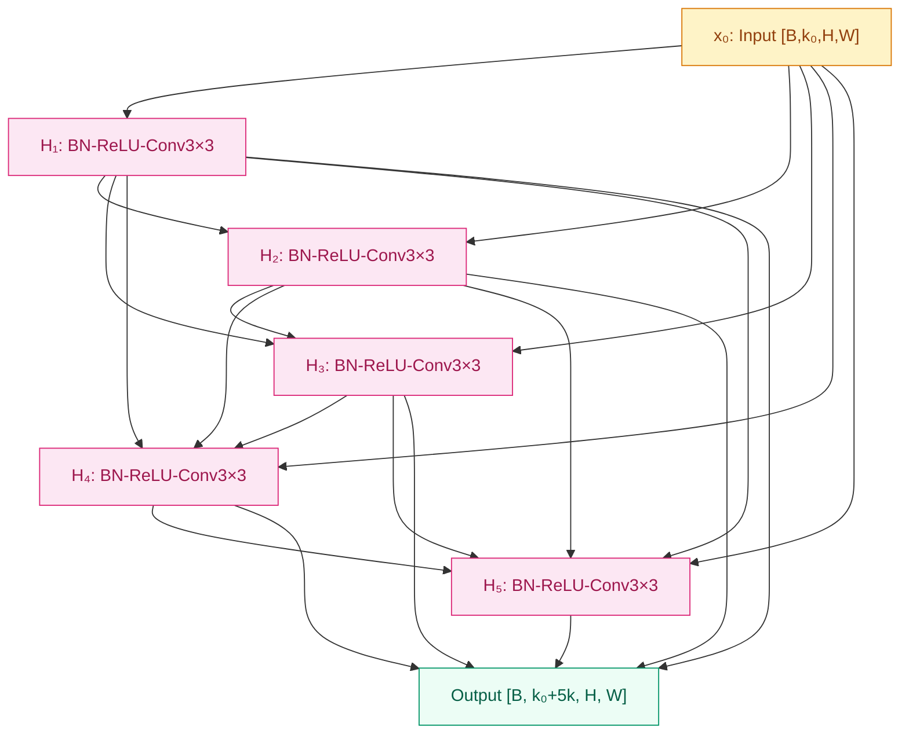
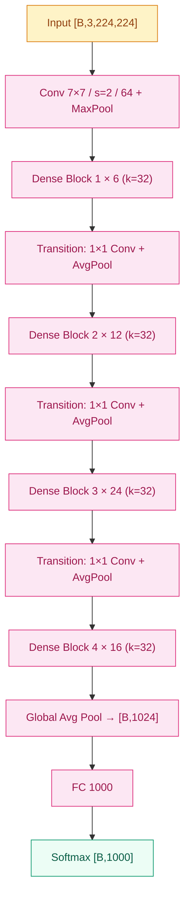

# DenseNet (2017)

## 之前卡在哪

[ResNet](05-resnet.md) 用 $y = F(x) + x$ 这条 shortcut 把 152 层的训练问题彻底解决，残差连接成了 2015–2016 年所有深网络的默认配置。但 ResNet 留下了一个不那么显眼、却让 Cornell 和 Tsinghua 的研究组反复琢磨的小问题——**加法（add）这件事，本身是有损的**。

`F(x) + x` 把不同层学到的特征**叠加在同一个张量上**。对优化来说这是好事，shortcut 给梯度一条干净的回流路径；但从信息保留的角度看，加法是一种**混叠**——浅层学到的边缘特征和深层学到的语义特征被加成一个张量，下游层再也分不清"这个数值是哪一层贡献的"。如果某一层学到的特征不需要被后面继续修改、只想被原样借用呢？加法做不到这件事。

另一个观察是，ResNet 论文里 He 等人做过随机丢弃残差块（stochastic depth）的实验，发现训练时随机扔掉 30%–50% 的 block 网络照样能训出来，甚至更好。这说明 ResNet 里**很多层其实是冗余的**——它们的输出只贡献了一点点修正量，扔了也无所谓。这意味着深网络的真正瓶颈不是"层不够深"，而是"特征没被充分复用"——每个 block 学到的东西只在紧接着的一两个 block 里被用一下就被加进总和里消散了。

普遍的共识在 2016 年下半年开始松动："如果连 ResNet 都浪费这么多容量，是不是该换种连接方式？"

## 核心思想

DenseNet 的回答简单到反直觉：**不要加，要拼**。在一个 Dense block 内，第 ℓ 层不再只接收前一层的输出，而是接收前面**所有 ℓ-1 层**的输出拼接（concat）成的特征图：

$$
x_\ell = H_\ell([x_0, x_1, \ldots, x_{\ell-1}])
$$

这里 $[\cdot]$ 表示沿通道维度的拼接，$H_\ell$ 是"BN + ReLU + 3×3 Conv"组合（pre-activation 风格，受 He 2016 *Identity Mappings* 启发）。每层的输出**永远不会被覆盖、不会被叠加、不会被混叠**——它就摆在那儿，谁想用谁拿。


*图 1：Dense block 内部稠密连接——第 ℓ 层 concat 前面所有层的输出作为输入，每层贡献 k 个新通道。*

> 你要记住：ResNet 的 shortcut 让"恒等映射"成为默认行为，DenseNet 的 concat 让"特征复用"成为默认行为。前者是优化技巧，后者是参数效率技巧。

**Growth rate $k$ 才是 DenseNet 真正的尺度变量**。每层 $H_\ell$ 只产生 $k$ 个新通道（典型 $k = 32$），所以即使一个 Dense block 含 12 层、每层都接收前面全部输出，整条链上的通道数也只是 $k_0 + (\ell-1) \cdot k$ 这种线性增长——不是想象中的指数爆炸。Growth rate 控制每层"往公共记忆里多写几页"，剩下的全靠复用。

整个 DenseNet 把网络切成**若干 Dense block**，block 内部稠密连接、block 之间用 **transition layer（1×1 Conv + 2×2 AvgPool）** 做下采样并压缩通道数（DenseNet-BC 版本里 transition 还会把通道数减半，进一步控制规模）。主流变体 DenseNet-121 / 169 / 201 / 264，数字指总有参层数；DenseNet-121 是最常用基线，4 个 Dense block 分别含 6 / 12 / 24 / 16 层，growth rate $k=32$。


*图 2：DenseNet-121 整体结构——stem + 4 个 Dense block (6, 12, 24, 16) 通过 transition layer 串联，最后 GAP + FC。*

**特征复用与隐式深度监督**——把所有前层 concat 进来这件事带来两个一起到场的好处。第一，浅层学到的低阶特征（边缘、纹理）可以被任何一个深层直接拿来用，不必经过中间层的层层加法稀释；浅层与深层之间有**直接通路**，深层不需要重新发明边缘检测器。第二，梯度从 loss 流回去时也走同一条 concat 路径——loss 对 $H_1$ 输出的导数等于所有后续层（$H_2, H_3, \ldots, H_L$）对 $H_1$ 输出依赖项的导数之和。这条结构让浅层永远能拿到"来自所有深层的多份监督信号"，相当于在每一层都隐式架了一个深度监督头。**ResNet 给梯度一条高速公路，DenseNet 给每层一束高速公路**——继承了 ResNet 那个 `+1` 的本质，只是把"加"换成"拼"。

DenseNet 在 ImageNet 上的成绩点明了这条路线的真正卖点：**DenseNet-121 用 7M 参数**就能逼近 ResNet-50（25.6M 参数）的精度（Top-5 ~6%），参数效率比 ResNet 高一个 multiplier。CVPR 2017 把 Best Paper 给了它——这是继 ResNet 之后视觉社区第二次连续把最高奖颁给一个"连接方式"的工作。

## 训练细节

| 维度 | 值 |
|---|---|
| 优化器 | SGD + Momentum |
| 学习率 | 0.1，在第 50% 和 75% 训练 epoch 各除以 10 |
| 动量 | 0.9 |
| 权重衰减 | 1×10⁻⁴ |
| Batch size | 256 |
| Epochs | 300（CIFAR）/ 90（ImageNet） |
| Dropout | 不用（BN 自带正则；CIFAR 无增强版本用 0.2） |
| 权重初始化 | He 初始化 $\mathcal{N}(0, 2/n)$ |
| 数据增强 | 短边随机缩放 + 224 随机裁剪 + 水平翻转 + 颜色扰动 |

**$H_\ell$ 内部顺序**——DenseNet 用 **BN → ReLU → 3×3 Conv** 这条 pre-activation 顺序（受 He 2016 *Identity Mappings in Deep Residual Networks* 启发），不是 ResNet 原版的 Conv-BN-ReLU。在 concat 拓扑下，先 BN 再过卷积比反过来更稳，因为前面每一层的输出通道都被拼了进来，量级可能不一致，BN 在卷积前先把每路统一到零均值单位方差。

**DenseNet-BC（Bottleneck + Compression）** 是论文里更高效的变体，所有 DenseNet-121/169/201 的官方实现都是 BC 版：

- **Bottleneck**：每个 $H_\ell$ 在 3×3 Conv 之前先加一个 **1×1 Conv 把输入压到 4k 通道**——concat 进来的输入通道数会随层数线性增长（block 末尾 $k_0 + (\ell-1) \cdot k$ 可能上千），1×1 先压一刀避免 3×3 在巨大输入通道上算
- **Compression**：transition layer 上的 1×1 Conv 把输出通道数减半（$\theta = 0.5$），进一步控制 block 之间的通道膨胀

这套组合把 DenseNet-121 的参数量压到 7.0M（DenseNet-169 14.1M、DenseNet-201 20.0M、DenseNet-264 33.3M）——同期 ResNet-50 是 25.6M、ResNet-152 是 60M。

**训练资源**：4 块 Tesla K40 GPU 并行；DenseNet-121 在 ImageNet 上训练约 1 周。

**显存代价**——这是 DenseNet 工程上最绕不开的痛点，必须单独拎出来。Concat 让 Dense block 内部第 ℓ 层的输入通道数线性增长到 $k_0 + (\ell-1) \cdot k$。看起来不算多（DenseNet-121 第三个 block 最后一层输入约 $256 + 23 \times 32 = 992$ 通道），但**问题不在计算量，在显存**：

- ResNet 一个 block 算完，前一个 block 的中间激活就可以释放
- DenseNet 一个 block 内**所有前层的中间激活都必须保留在显存里**——因为后面所有层都要 concat 它们做反向传播
- 朴素实现下 DenseNet-121 训练时显存占用比 ResNet-50 多 2–3 倍

2017 年原始实现因此跑同样 batch size 时显存压力很大。工业界后来用 **memory-efficient DenseNet**（NVIDIA 的实现，反向时重算中间激活）才把显存吃掉的大头还回来，代价是训练时间增加 ~15%。**这也是为什么尽管 DenseNet-121 参数效率明显更高，工业界的视觉 backbone 默认依然是 ResNet-50**——后者的"算完即释放"特性对部署、对多机训练、对 detection / segmentation 这种本身已经吃显存的下游任务更友好。

**ImageNet 错误率（Top-5）：**

| 模型 | 参数量 | Top-5 错误率 |
|---|---|---|
| ResNet-50 | 25.6M | 6.7% |
| ResNet-152 | 60.2M | 5.6% |
| DenseNet-121 | 7.0M | 6.1% |
| DenseNet-169 | 14.1M | 5.5% |
| DenseNet-201 | 20.0M | 5.2% |
| DenseNet-264 | 33.3M | 5.0% |

**DenseNet-201 用 20M 参数到了 ResNet-152（60M）同档精度**——这就是 CVPR 2017 Best Paper 的核心论据。

## 关键代码

下面这段实现 DenseNet 的核心砖：单层 `DenseLayer`（BN-ReLU-1×1-BN-ReLU-3×3 + concat）和一个 `DenseBlock`（堆 N 个 DenseLayer，每层都把自己的输出拼回输入）。注意 `torch.cat` 那一行——这就是 DenseNet 与 ResNet 在代码上的唯一差别：

```python
import torch
import torch.nn as nn

class DenseLayer(nn.Module):
    """BC 版 H_ℓ：1×1 压到 4k → 3×3 出 k 通道，输出与输入 concat 而非 add。"""
    def __init__(self, in_c: int, growth_rate: int = 32, bn_size: int = 4):
        super().__init__()
        inter_c = bn_size * growth_rate  # 1×1 压到 4k
        self.bn1   = nn.BatchNorm2d(in_c)
        self.conv1 = nn.Conv2d(in_c, inter_c, 1, bias=False)
        self.bn2   = nn.BatchNorm2d(inter_c)
        self.conv2 = nn.Conv2d(inter_c, growth_rate, 3, padding=1, bias=False)
        self.relu  = nn.ReLU(inplace=True)

    def forward(self, x: torch.Tensor) -> torch.Tensor:
        # x: [B, in_c, H, W]，in_c = k₀ + (ℓ-1)·k
        out = self.conv1(self.relu(self.bn1(x)))      # [B, 4k, H, W]
        out = self.conv2(self.relu(self.bn2(out)))    # [B, k, H, W]
        return torch.cat([x, out], dim=1)             # ← 核心一行：concat 而非 add
                                                       # 输出 [B, in_c + k, H, W]

class DenseBlock(nn.Module):
    """堆 num_layers 个 DenseLayer，输入通道随层数线性增长。"""
    def __init__(self, num_layers: int, in_c: int, growth_rate: int = 32):
        super().__init__()
        self.layers = nn.ModuleList([
            DenseLayer(in_c + i * growth_rate, growth_rate)
            for i in range(num_layers)
        ])

    def forward(self, x: torch.Tensor) -> torch.Tensor:
        for layer in self.layers:
            x = layer(x)   # 每过一层通道数 += growth_rate
        return x           # 输出 [B, in_c + num_layers·k, H, W]
```

`torch.cat([x, out], dim=1)` 与 ResNet 的 `out + identity` 看起来只差一个字符，但拓扑性质完全不同——前者无损保留每层输出，后者把所有层叠成一个张量。DenseNet 的全部精神就在这一行里。

## 影响 / 后续

DenseNet 留给后续视觉架构的遗产分成两半，一半被广泛采纳，另一半反而被有意丢弃。

**被采纳的一半是"特征复用"这个抽象**——后续几乎所有架构都把"如何让浅层特征被深层直接用到"当成了一类显式的设计变量。U-Net 的 encoder-decoder skip、Feature Pyramid Network（FPN）的多尺度融合、HRNet 在所有分辨率上并行保持表征，都是"DenseNet 思想"在不同尺度上的变种：让信息不要被中间层吃掉，让浅层与深层之间永远有直接通路。Transformer 时代的 [ViT](../08-vit/) 虽然不用 concat，但每个 block 里的 residual 加上 token 级别的全连接注意力，本质上也在做同样的事——让任何位置任何深度的特征都能被全网随时取用。

**被丢弃的一半是"concat 这种连接方式本身"**——工业界用 ResNet 不用 DenseNet 的主要原因不在精度，而在 **显存代价 + 推理友好性**。ResNet 的 add 让每个 block 算完后前面的中间激活立刻可以释放；DenseNet 的 concat 在训练时必须保留全部前层激活，在边缘部署时也要面对 channel 数线性增长带来的 memory bandwidth 问题。同样精度下，工业部署几乎一致选择 ResNet 系——这是为什么 Faster R-CNN / Mask R-CNN / DeepLab / CLIP 视觉塔的默认 backbone 都是 ResNet-50/101，而不是参数更少的 DenseNet-121。**架构的胜负不只看精度，还看显存账本**——DenseNet 是这条经验最经典的反例。

EfficientNet 在 2019 年把这件事推进一步：与其在"加法 vs 拼接"里二选一，不如把 depth / width / resolution 三轴系统化地缩放，让架构搜索本身决定每个尺度上哪种连接更划算。

→ [05-resnet.md](05-resnet.md) · 加法残差 vs 拼接残差，两种思路最直接对照
→ [07-efficientnet.md](07-efficientnet.md) · 把"复用 vs 加法 vs 拼接"放进三轴缩放体系
→ [../foundations/04-normalization/](../foundations/04-normalization/) · DenseNet 用 pre-activation BN-ReLU-Conv 顺序，BN 在 concat 后统一各路量级
→ [../foundations/05-initialization/](../foundations/05-initialization/) · He 初始化让 DenseNet 也能从随机初始化直接开训
