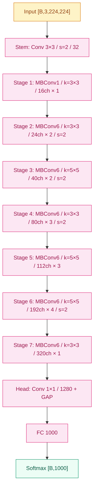

# EfficientNet (2019)

## 之前卡在哪

[ResNet](05-resnet.md) 之后，CNN 的"做大"这件事被拆成了三个旋钮：**加深**（更多层）、**加宽**（更多通道）、**加分辨率**（更大输入图）。每条路都各自被验证过——ResNet 把深度从 22 推到 152，WideResNet 把宽度乘到 10 倍，多尺度训练把输入从 224 拉到 600。三条线各自能换来精度，但三者之间的关系没人系统问过。

实际操作里，社区的做法是"一次只动一个旋钮，凭直觉"。要更高精度？把 ResNet-50 改成 ResNet-200。要参数更少？走 [Inception](04-inception.md) 路线手工配通道。要在限定 FLOPs 预算下挤精度？MobileNet 砸宽度、砸输入分辨率，每一组超参都靠手调。**没人系统地回答过一个基础问题**：固定 FLOPs 预算下，深度、宽度、分辨率三者该怎么联合分配才最优？

更尴尬的是，单独加任意一轴都很快遇到边际收益递减——只加深，到 200 层后精度饱和；只加宽，参数爆炸但精度跟不上；只加分辨率，FLOPs 平方级涨而精度只线性涨几个点。Tan 和 Le 在做 NAS 工作（MnasNet）时注意到一件事：**手工调的模型族里，越大的模型恰好倾向于同时加深、加宽、加分辨率，且三者的比例大致稳定**。这条经验性的观察直接催生了 EfficientNet——能不能把"三轴联合放大"写成一个数学公式？

## 核心思想

EfficientNet 把"放大网络"重新表述成一个带约束的优化问题。设有一个种子模型，它的深度、宽度、分辨率为基准 1。引入单一**复合缩放系数 φ**（compound coefficient），三轴按下式联合缩放：

$$
\text{depth} = \alpha^\phi, \quad \text{width} = \beta^\phi, \quad \text{resolution} = \gamma^\phi
$$

其中 $\alpha, \beta, \gamma \geq 1$ 是三个常数，满足约束：

$$
\alpha \cdot \beta^2 \cdot \gamma^2 \approx 2
$$

这条约束有非常具体的物理含义：卷积的 FLOPs 与 depth 成正比、与 width² 成正比（每层输入通道 × 输出通道）、与 resolution²（H×W）成正比。所以 $\alpha \cdot \beta^2 \cdot \gamma^2$ 恰好是 FLOPs 的总缩放系数。把它钉在 2，意味着 **φ 每加 1，整网 FLOPs 翻倍**。φ=0 是基准模型 B0，φ=1, 2, …, 7 依次得到 B1–B7。

> 你要记住：EfficientNet 真正的发明不是哪个新算子，而是**把"网络该放多大"这件事写成了一个单参数公式**——以前是三个旋钮各自手调，现在只有 φ 一个旋钮，三轴按固定比例联动。

α, β, γ 的具体值通过在 B0 上做一次小规模 grid search 得到：**α=1.2, β=1.1, γ=1.15**——这意味着 FLOPs 翻倍时，深度涨 20%、宽度涨 10%、分辨率涨 15%。比例并不对等：宽度比深度便宜（宽度对 FLOPs 是平方贡献，所以同样翻倍预算下分给宽度的 exponent 必须小），分辨率也是平方贡献。这组数字一旦定下来，B1–B7 全部按 φ 推出来，**不再有任何额外的手工调超参**。

种子模型 EfficientNet-B0 自身是用 NAS 在"FLOPs ≈ 400M、精度最优"的目标下搜出来的——和 MnasNet 同一套搜索空间。结构上 B0 由一个 stem（3×3 conv）+ 7 个 stage 的 **MBConv**（Mobile Inverted Bottleneck Conv，源自 MobileNet v2）堆叠 + head（1×1 conv + GAP + FC）构成。MBConv 内部用 **inverted bottleneck**（1×1 升维 → depthwise 3×3 → 1×1 降维）+ **Squeeze-Excitation**（源自 SE-Net）+ Swish 激活，这些都是横切组件——本节不展开，留给 [foundations/02-activations](../foundations/02-activations/) 和后续 MobileNet/SENet 专题。


*图 1：EfficientNet-B0 主干，7 个 stage 的 MBConv 堆叠。MBConv1/6 中数字为 expansion ratio，每 stage 标 kernel / 输出通道 / block 数 / stride。*

**三轴等比 vs 单轴砸**——论文里最有说服力的消融是把"同样的 FLOPs 预算"分别砸在三种缩放策略上做对照：只加深、只加宽、只加分辨率、三轴等比。**同 FLOPs 下三轴联合缩放比任何单轴策略高 0.5–2.5 个百分点的 Top-1**。这条曲线就是"复合缩放"作为论文标题的实验依据——φ 这个公式不是审美选择，是实测出来的帕累托线。

最终结果是一个完整的模型族 B0–B7。B0 用 5.3M 参数拿到 77.1% Top-1，B7 用 66M 参数拿到 **84.3% Top-1（2019 ImageNet SOTA）**。同精度下 EfficientNet-B7 比 GPipe 小 8.4×、比 ResNeXt-101 小数倍——"参数效率"这条 Inception 开启的赛道，到 EfficientNet 才被推到极致。

## 工程陷阱

**α, β, γ 是在 B0 上搜的，换基础架构未必最优**。这套常数 (1.2, 1.1, 1.15) 是在 EfficientNet-B0（MBConv + SE）这个特定种子模型上 grid search 出来的。把它直接搬到 ResNet、ConvNeXt 或别的 backbone 上做"compound scaling"，比例并不一定最优。Tan 和 Le 自己在 **EfficientNet-V2（2021）** 里就发现：**width 应该更激进、resolution 不应该涨得这么快**——大分辨率训练时显存爆炸 + 训练速度大幅下降，得不偿失。V2 把搜索范围重做了一遍，得到的最优比例与 V1 不同。教训是：**复合缩放是个框架，但具体 α, β, γ 是 backbone-dependent**，迁移时要重搜，不要照抄。

**Stochastic Depth 是大模型保精度的关键开关，早期实现常漏掉它**。EfficientNet-B0 训练时 stochastic depth 的丢弃率是 0，看起来无关紧要——但 B4 之后丢弃率线性涨到 0.2（B7），论文里 ablation 显示 **B7 关掉 stochastic depth 直接掉 0.7–1.0 个 Top-1**。2019 年很多第三方复现（包括 PyTorch torchvision 早期版本）默认忽略这个超参，结果 B5–B7 跑出来比论文低 1 个多百分点，社区花了几个月才定位到这个差异。教训：**模型放大时正则也要同步放大，stochastic depth 这种"按 block 概率丢弃"是 EfficientNet 大模型族的隐藏标配**，不是 optional。

**Depthwise conv 的 FLOPs 便宜不等于 wall-clock 速度快**。MBConv 大量用 depthwise 3×3/5×5，理论 FLOPs 远低于普通卷积——但在 2019 年的 GPU 上（V100、T4），depthwise conv 的 cuDNN 实现优化程度远不如标准卷积，实测 wall-clock 时间常常**只快 1.5–2×**，而非 FLOPs 比例所暗示的 8–9×。这导致一个反直觉现象：**EfficientNet-B0 的 FLOPs 是 ResNet-50 的 1/10，但实际推理速度只快 2–3 倍**。同精度下 EfficientNet-B3（FLOPs 与 ResNet-50 相当）的延迟反而比 ResNet-50 高。教训：**部署做选型时不能只看 FLOPs，必须实测目标硬件上的 latency**。这也是 EfficientNet-V2 把 stage 1–3 换回普通卷积（Fused-MBConv）的直接原因——小分辨率高通道阶段，depthwise 的硬件不友好性最严重，干脆换回普通 conv 整体更快。

## 训练细节

| 维度 | 值 |
|---|---|
| 优化器 | **RMSProp**（不是 SGD），decay=0.9，momentum=0.9 |
| 初始学习率 | **0.256**（batch size 4096 下），decay 0.97 每 2.4 epochs |
| 权重衰减 | 1×10⁻⁵ |
| Dropout（FC 前） | B0=0.2，B1=0.2，…，B7=0.5（随模型变大线性涨） |
| Stochastic Depth 丢弃率 | B0=0.0，B4=0.2，B7=0.2（按 block 深度线性 schedule） |
| Batch size | 4096（TPU pod 跨核心累积） |
| Epochs | 350 |
| 激活函数 | **Swish/SiLU**（$x \cdot \sigma(x)$），全网替换 ReLU |
| 归一化 | BatchNorm，momentum=0.99 |

**为什么 RMSProp、为什么 lr=0.256**——这两条都不是 ImageNet 训练的"主流"配置（主流是 SGD + 0.1）。原因是 EfficientNet 沿用了 MnasNet 的训练 recipe，MnasNet 当年是为了在 TPU 上做 NAS 搜索而调的，RMSProp 在 TPU pod 上对各种结构的稳健性比 SGD 好。0.256 = 0.016 × 16（batch 4096 vs 256 的 lr 线性 scaling）。复现时如果换到 GPU + 小 batch，**必须按比例 rescale 学习率**，否则不收敛。

**数据增强**：

- **AutoAugment**（ImageNet policy）—— 用强化学习搜出来的 25 条增强子策略，每张训练图随机走一条
- **RandomErasing**（部分模型用）
- **MixUp**（B5+ 才用，alpha=0.2）
- **测试时增强**：B7 用更高分辨率（600×600）训练 + 测试时单 crop，不做多 crop ensemble

**训练资源**：B0 在 TPUv3 pod 上 ~7 小时，B7 ~36 小时；论文实验全部在 Google 内部 TPU pod 上完成。第三方在 GPU 上复现 B7 通常需要 8×V100 训练约一周。

**ImageNet 错误率（Top-1）：**

| 模型 | 参数量 | FLOPs | Top-1 |
|---|---|---|---|
| ResNet-50 | 25.6M | 4.1B | 76.0% |
| ResNet-152 | 60.2M | 11.5B | 78.3% |
| ResNeXt-101 (64×4d) | 84M | 31.5B | 80.9% |
| GPipe | 557M | — | 84.3% |
| **EfficientNet-B0** | **5.3M** | **0.39B** | **77.1%** |
| EfficientNet-B3 | 12M | 1.8B | 81.6% |
| EfficientNet-B5 | 30M | 9.9B | 83.6% |
| **EfficientNet-B7** | **66M** | **37B** | **84.3%** |

B7 用 1/8.4 的参数追平了 GPipe 的 SOTA——这条记录就是 2019 年那条新的帕累托线，到 2022 年才被 ConvNeXt 真正越过。

## 关键代码

下面这段实现 MBConv 的核心结构：**1×1 升维（expand）→ depthwise 3×3 → SE → 1×1 降维（project）+ shortcut**。BN/Swish 按 EfficientNet 默认顺序：

```python
import torch
import torch.nn as nn

class MBConv(nn.Module):
    """Mobile Inverted Bottleneck + Squeeze-Excitation，EfficientNet 的核心砖。"""

    def __init__(self, in_c: int, out_c: int, expand: int = 6,
                 kernel: int = 3, stride: int = 1, se_ratio: float = 0.25):
        super().__init__()
        mid_c = in_c * expand                        # inverted bottleneck：先升维
        self.use_shortcut = (stride == 1 and in_c == out_c)

        # 1×1 升维（expand=1 时跳过，B0 第一个 stage 就是这种情况）
        self.expand = nn.Sequential(
            nn.Conv2d(in_c, mid_c, 1, bias=False),
            nn.BatchNorm2d(mid_c), nn.SiLU(inplace=True),
        ) if expand != 1 else nn.Identity()

        # Depthwise k×k（groups=mid_c 即深度可分离卷积）
        self.dwconv = nn.Sequential(
            nn.Conv2d(mid_c, mid_c, kernel, stride, kernel // 2,
                      groups=mid_c, bias=False),
            nn.BatchNorm2d(mid_c), nn.SiLU(inplace=True),
        )

        # SE：global pool → 压到 1/4 → 升回 → sigmoid 门控
        se_c = max(1, int(in_c * se_ratio))
        self.se = nn.Sequential(
            nn.AdaptiveAvgPool2d(1),
            nn.Conv2d(mid_c, se_c, 1), nn.SiLU(inplace=True),
            nn.Conv2d(se_c, mid_c, 1), nn.Sigmoid(),
        )

        # 1×1 降维到 out_c（注意：project 之后无激活——线性瓶颈）
        self.project = nn.Sequential(
            nn.Conv2d(mid_c, out_c, 1, bias=False),
            nn.BatchNorm2d(out_c),
        )

    def forward(self, x: torch.Tensor) -> torch.Tensor:
        out = self.expand(x)
        out = self.dwconv(out)
        out = out * self.se(out)                     # SE 门控
        out = self.project(out)
        return out + x if self.use_shortcut else out  # 仅同 shape 时加 shortcut
```

整个 EfficientNet-B0 就是把这种 MBConv 按 (16, 24, 40, 80, 112, 192, 320) 通道、(1, 2, 2, 3, 3, 4, 1) block 数、(3, 3, 5, 3, 5, 5, 3) kernel 配置堆 7 个 stage。B1–B7 把每个 stage 的 block 数按 α^φ 涨、把每层通道按 β^φ 涨、把输入分辨率按 γ^φ 涨，**结构骨架完全不变**——这就是 compound scaling 在代码层面的全部含义。

## 影响 / 后续

EfficientNet 在 2019–2021 年这两年里几乎统治了"参数效率"这一坐标轴的所有 leaderboard——detection、segmentation、医学影像、移动端部署，凡是要在精度和参数间找帕累托点的场景，EfficientNet 都是默认起跑线。它把"compound scaling"作为一个**架构正交的设计范式**留了下来：后来 RegNet、EfficientNet-V2、NFNet 都借用了"单参数控制模型族放大"的思路，只是把 α/β/γ 重搜或换成可学习的。

但 EfficientNet 自身的局限也很快显现。**Wall-clock 速度对不齐 FLOPs** 这件事被工业界反复抱怨；2020 年之后 ConvNeXt / ViT 兴起，CNN 这条线上的 SOTA 优势在 2022 年被 ConvNeXt 用"训练 recipe 现代化"的方式反超——同样的 ResNet 骨架，只要把 AdamW + Swish + LayerScale + 大模型训练技巧搬过来，就能在精度上越过 EfficientNet-B7 的帕累托线。这件事的教训是：**架构本身的设计空间已被挖到边际，未来几年的 CNN 进展更多来自训练侧而不是结构侧**。

→ [08-convnext.md](08-convnext.md) · 把 ViT 的训练方法反哺到 CNN，超越 EfficientNet 帕累托线
→ [../foundations/04-normalization/](../foundations/04-normalization/) · MBConv 里 BN 和 inverted bottleneck 的搭配
→ [../foundations/02-activations/](../foundations/02-activations/) · MBConv 用 Swish/SiLU 替代 ReLU，激活函数演化中的一站
